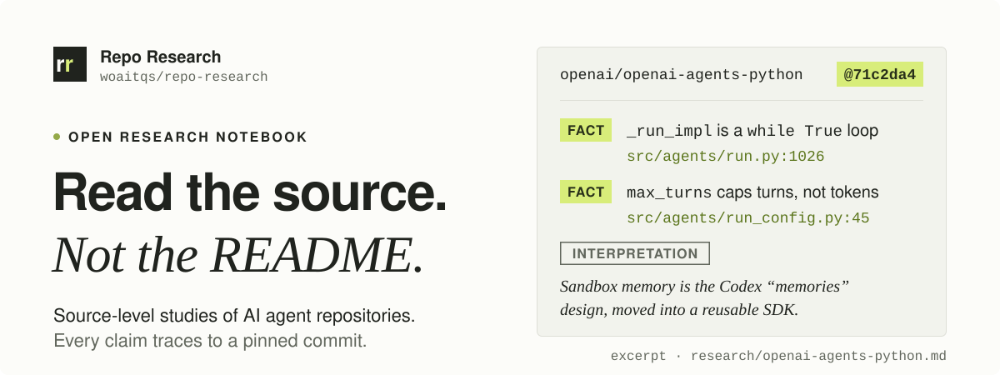
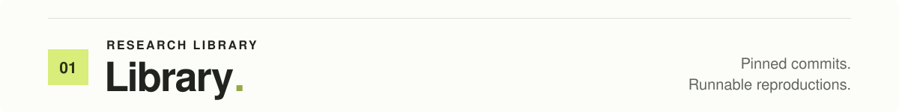
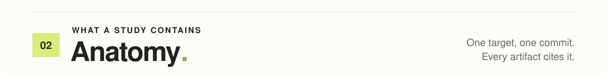
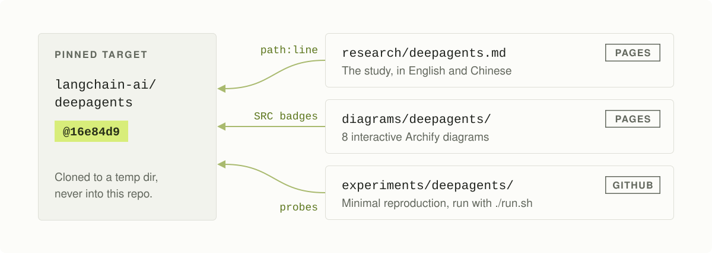
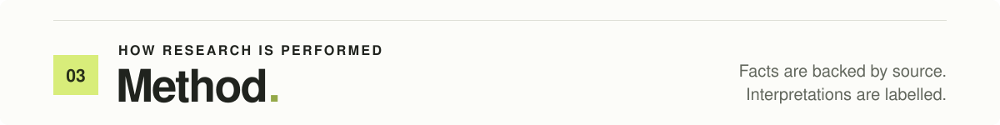
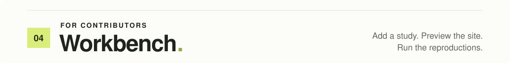

<p align="center">
  
</p>

<p align="center">
  <a href="https://woaitqs.github.io/repo-research/"><strong>Read on the web</strong></a>
  &nbsp;·&nbsp;
  <a href="#library">Studies</a>
  &nbsp;·&nbsp;
  <a href="#anatomy">Anatomy</a>
  &nbsp;·&nbsp;
  <a href="#method">Method</a>
  &nbsp;·&nbsp;
  <a href="#workbench">Add a study</a>
</p>

**Repo Research** is a source-code-level research lab for important AI infrastructure and agent repositories.

It is not a collection of README summaries. Each study pins the target to one commit, traces real implementation paths from their entry points, identifies reusable architectural ideas, and backs every claim with a `path:line` reference, a test, or observed runtime behavior. It then draws source-grounded diagrams and rebuilds the core design as a minimal working reproduction.

<a name="library"></a>
<a name="studies"></a>

<p align="center">
  
</p>

| # | Repository | Pinned commit | Research | Archify diagrams | Experiment |
|---|---|---|---|---|---|
| 01 | [langchain-ai/deepagents](https://github.com/langchain-ai/deepagents)<br><sub>Agent harness</sub> | `16e84d9`<br><sub>SDK 0.7.22</sub> | [English](research/deepagents.md)&nbsp;·&nbsp;[web](https://woaitqs.github.io/repo-research/research/deepagents.html)<br>[中文](research/deepagents.zh.md)&nbsp;·&nbsp;[web](https://woaitqs.github.io/repo-research/research/deepagents.zh.html) | [8 diagrams](diagrams/deepagents/) | [reproduction](experiments/deepagents/) |
| 02 | [OpenHands/OpenHands](https://github.com/OpenHands/OpenHands)<br>+ [software-agent-sdk](https://github.com/OpenHands/software-agent-sdk)<br><sub>Agent SDK & runtime</sub> | `7ea83ba` + `54daf05`<br><sub>Canvas 1.25.0 · SDK v1.53.0</sub> | [English](research/openhands.md)&nbsp;·&nbsp;[web](https://woaitqs.github.io/repo-research/research/openhands.html)<br>[中文](research/openhands.zh.md)&nbsp;·&nbsp;[web](https://woaitqs.github.io/repo-research/research/openhands.zh.html) | [10 diagrams](diagrams/openhands/) | [reproduction](experiments/openhands/) |
| 03 | [openai/openai-agents-python](https://github.com/openai/openai-agents-python)<br><sub>Agent SDK & runtime</sub> | `71c2da4`<br><sub>0.23.1 + 22</sub> | [English](research/openai-agents-python.md)&nbsp;·&nbsp;[web](https://woaitqs.github.io/repo-research/research/openai-agents-python.html)<br>[中文](research/openai-agents-python.zh.md)&nbsp;·&nbsp;[web](https://woaitqs.github.io/repo-research/research/openai-agents-python.zh.html) | [8 diagrams](diagrams/openai-agents-python/) | [reproduction](experiments/openai-agents-python/) |
| 04 | [letta-ai/letta-code](https://github.com/letta-ai/letta-code)<br><sub>Stateful agent harness</sub> | `4b028fa`<br><sub>v0.34.4</sub> | [English](research/letta-code.md)&nbsp;·&nbsp;[web](https://woaitqs.github.io/repo-research/research/letta-code.html)<br>[中文](research/letta-code.zh.md)&nbsp;·&nbsp;[web](https://woaitqs.github.io/repo-research/research/letta-code.zh.html) | [8 diagrams](diagrams/letta-code/) | [reproduction](experiments/letta-code/) |

### What each study found

- **deepagents** is an ordered stack of middleware on top of LangChain's `create_agent`. Its real product is context engineering: offloading large results to a virtual filesystem, non-destructive summarization, and context-isolated sub-agents.<br>
  <sub>Verified: 21 tests + demo pass · upstream probe 7/7 · real-model scenarios 4/4 × 3 runs</sub>
- **OpenHands**: `OpenHands/OpenHands` is now the Agent Canvas UI. The agent itself lives in `software-agent-sdk`: an event-sourced conversation, a stateless agent `step()`, an LLM context that is a projection of the event log, and compaction done by appending a `Condensation` event.<br>
  <sub>Verified: 19 tests + demo pass · 426 upstream SDK tests pass · real SDK probed offline and with a real model</sub>
- **openai-agents-python** owns its loop: a `while True` over four `NextStep` outcomes, where handoffs and sub-agents are just tool calls and a human approval is a serializable pause.<br>
  <sub>Verified: 12,174 upstream tests pass · probe 17/17 · 40 tests + demo 11/11 · mutations 11/11 · real models: 6 scenarios × 2 models × 3 runs</sub>
- **letta-code** splits the agent loop across a protocol. A stateful backend runs one model step per run and stops at every tool call; the client harness executes tools on the user's machine and resumes. Memory is a per-agent git repository compiled into a cache-stable system prompt.<br>
  <sub>Verified: 24 tests + demo 11/11 · mutation 9/9 · upstream unit tests 8,778 pass · probe 9 claims (1 disproved) · real-model 6 scenarios × 3 runs</sub>

<a name="anatomy"></a>

<p align="center">
  
</p>

<p align="center">
  
</p>

For every target repository, a study should:

1. Understand the complete architecture.
2. Trace the main execution flow from real entry points.
3. Identify the core abstractions and their responsibilities.
4. Explain context, memory, tools, agents, runtime, and orchestration where applicable.
5. Produce architecture / workflow / sequence diagrams with [Archify](https://github.com/tt-a1i/archify).
6. Extract at least five implementation decisions worth learning from.
7. Build a minimal reproduction under `experiments/<project-name>/`.
8. Run and verify the reproduction.
9. Write the final study under `research/<project-name>.md`.
10. Expose the study and interactive diagrams through the GitHub Pages site.

<a name="method"></a>

<p align="center">
  
</p>

1. **Pin the target.** Clone it into a temporary directory, never into this repo. Record `git rev-parse HEAD` and cite every source reference against that commit.
2. **Map, then trace.** Read the manifests, entry points (console scripts, servers) and the composition root. Then follow real call sites end to end. Read the dependency source too when the target delegates to a framework. For deepagents that meant reading LangChain's `create_agent`.
3. **Separate fact from interpretation.** Facts are backed by `path:line`, a test, or observed runtime behavior. Interpretations are labelled as such, and open questions stay explicit.
4. **Verify claims at runtime when it is cheap.** For example, drive the real library with a scripted fake model. The deepagents probe found two behaviors that were not obvious from reading alone. If the target ships its own scripted model (openai-agents-python has `agents.testing.ScriptedModel`), use it. When the target is a CLI, run its published build against a real model through a small logging proxy, so every request body is recorded. The letta-code study used this to check what actually entered the model's context, and to measure prompt-cache hits per call.
5. **Run the target's own tests** with its locked dependencies, so environment noise is not mistaken for findings. Check failures against the environment before reporting them: trace each failure to a cause and re-run it with that cause removed. In the openai-agents-python study, 62 redaction tests failed only because the checkout path contained the word `user`, which the tests treat as a leaked credential.
6. **Reproduce the architecture, not the product.** Build a small dependency-light version, test its architectural invariants, and mutation-test the tests.
7. **Check model-side assumptions with real models when the design depends on them** (for example: does the model follow a pointer, write a good brief, recover from an error?). Read API keys from the environment only; never write them into the repository.
8. **Diagram from evidence.** Every Archify node carries `sources` pinned to the commit.

<a name="workbench"></a>

<p align="center">
  
</p>

### Repository layout

```text
repo-research/
├── README.md
├── index.md                     # homepage (layout: home; body = reading convention)
├── _config.yml                  # GitHub Pages (Jekyll, own layouts, theme: null)
├── _data/
│   ├── studies.yml              # the study list: pins, pages, diagrams, experiment links
│   ├── i18n.yml                 # interface strings (en / zh)
│   └── home.yml                 # homepage blocks (study anatomy, method)
├── _layouts/
│   ├── default.html             # header, navigation drawer, scripts
│   ├── home.html                # homepage: hero, library, diagrams, method
│   ├── research.html            # article: study rail · article · outline
│   └── gallery.html             # diagram gallery: study rail · cards from _data/studies.yml
├── _includes/                   # header, study rail, icons, ...
├── assets/
│   ├── css/site.css             # all site styles (light + dark)
│   ├── js/site.js               # theme, outline, reading aids, Mermaid rendering
│   ├── readme/*.svg             # this README's title system (hand-written SVG, light + dark)
│   └── <project-name>/
│       └── archify/*.json       # Archify candidates (diagram sources) + provenance README
├── research/
│   └── <project-name>.md        # the study (front matter: layout: research, study: <id>)
├── diagrams/
│   └── <project-name>/
│       ├── index.md             # gallery page (layout: gallery)
│       ├── architecture.html    # Archify output (self-contained HTML, never edited by hand)
│       ├── execution-flow.html
│       └── ...
└── experiments/
    └── <project-name>/
        ├── README.md
        ├── run.sh               # install -> build -> test -> run
        ├── src/
        └── tests/
```

### Adding a new study

1. Create `research/<project-name>.md` with this front matter:
   ```yaml
   ---
   layout: research
   title: "<project> — source-level study"
   study: <project-name>
   permalink: /research/<project-name>.html
   ---
   ```
   Follow the section structure of `research/deepagents.md`. Keep the `# Title` heading: GitHub shows it,
   while the site drops everything up to and including the first H1 and renders its own title,
   language switch and navigation. A Chinese version uses `permalink: /research/<project-name>.zh.html`
   and `lang: zh-CN` with the same `study:` id.
2. Put Archify candidates in `assets/<project-name>/archify/` and finalize them into `diagrams/<project-name>/` (see [Archify](#archify)). At minimum create `architecture`, `execution-flow`, `core-abstractions` and `context-flow`.
   Add `diagrams/<project-name>/index.md` (`layout: gallery`, `study: <project-name>`); the cards appear where
   the page has an HTML comment `<!-- diagram-cards -->`.
3. Put the reproduction in `experiments/<project-name>/`, with `README.md`, `src/`, `tests/` and `run.sh`.
4. Add an entry to `_data/studies.yml` (pins, pages, diagrams, experiment link, one-line takeaway). The homepage,
   the study rail, the previous/next links and the gallery are all generated from it. Also add a row to the
   [Library](#library) table above, and a line under "What each study found" (the takeaway and the `status` from `_data/studies.yml`).
   The README SVGs do not list studies, so they need no change.
5. Avoid Liquid template delimiters (double curly braces, or a curly brace followed by a percent sign) anywhere in published Markdown, this README included. GitHub Pages evaluates them and the build fails. This includes Mermaid's hexagon node shape, which uses double curly braces; use another shape such as a parallelogram.

### Reading

GitHub Pages site: **https://woaitqs.github.io/repo-research/**

Each repository should get its own research page and its own diagram directory, for example:

- `/research/deepagents.html`
- `/diagrams/deepagents/architecture.html`
- `/diagrams/deepagents/execution-flow.html`

> GitHub Pages must be enabled once in **Settings → Pages → Deploy from a branch → main / (root)**.

Mermaid code fences in research articles render natively on GitHub. On Pages, `assets/js/site.js` converts them in the browser using Mermaid from jsDelivr (with the site's light/dark palette).

Local preview:

```bash
cat > /tmp/Gemfile <<'EOF'
source "https://rubygems.org"
gem "github-pages", group: :jekyll_plugins
gem "webrick"
EOF
BUNDLE_GEMFILE=/tmp/Gemfile bundle install
BUNDLE_GEMFILE=/tmp/Gemfile bundle exec jekyll serve   # http://127.0.0.1:4000/
```

### Archify

Install the Archify skill:

```bash
npx skills add tt-a1i/archify -g
```

Use Archify for source-grounded architecture, workflow, sequence, data-flow, and lifecycle diagrams. Prefer validated, revision-pinned diagrams when source evidence is available.

How it is used here:

- Pick the diagram type by question:
  - `architecture`: components and boundaries;
  - `sequence`: request lifecycle or delegation;
  - `dataflow`: what enters context, and memory;
  - `workflow` (v2): tool pipeline with an approval lane;
  - `lifecycle` (v2): the agent loop as states.
- Pin `meta.repository` to the studied commit, and give each node 1–3 `sources` (`path`, `line`, `end_line`). The rendered `SRC n` badges link to the exact GitHub lines.
- Finalize from the repository root. `finalize` runs schema validation, verified delivery, a strict provenance check and a headless-browser check:

  ```bash
  export ARCHIFY_CHROME=/path/to/chrome
  node ~/.agents/skills/archify/bin/archify.mjs finalize <type> \
    assets/<project>/archify/<name>.json diagrams/<project>/<name>.html \
    --repo-root /path/to/target/clone --quality showcase --json
  ```

- Optional perceptual review: `archify.mjs visual-check diagrams/<project>/<name>.html --summary --require-provenance` captures screenshots. Look at them before claiming visual quality.
- `*.delivery.json`, `*.finalize*.json` and `*.browser-check.json` sidecars contain absolute local paths and are git-ignored. Delete a diagram's old `*.browser-check.json` before re-finalizing it.
- Schema limits to remember: only nodes and participants take `sources` (at most 3 each); a showcase canvas must have a width/height ratio of at least 1.55 or fit a 900 px viewport; in dataflow diagrams, two edges on one side of a node offset the port by 7 px, which can trip the 8 px micro-segment rule (fix with `yOffset`). Details in `assets/openai-agents-python/archify/README.md`.

### Running experiments

Each experiment is self-contained:

```bash
cd experiments/<project-name>
./run.sh          # creates .venv, installs, builds, runs tests, runs the demo
```

Every study is bilingual: `research/<project-name>.md` (English) and `research/<project-name>.zh.md` (Chinese), with `experiments/<project-name>/README.zh.md` for the reproduction. The Archify diagrams are shared and English-only. Beyond `./run.sh`, each experiment has its own extra checks:

- **deepagents** is stdlib-only. `./run.sh demo` runs the narrated demo without installing anything. Its `upstream_probe/` directory re-checks the research claims against the real SDK.
- **OpenHands** is stdlib-only at runtime (pytest for tests). `./run.sh --live` additionally runs the demo against a real OpenAI-compatible model, and `probe/` drives the real `openhands-sdk` (scripted or with a real model) to re-check the article's runtime claims.
- **openai-agents-python** (`miniagents`) is stdlib-only, with the same `run.sh` contract. It adds `mutation_check.py` (injects 11 architectural regressions), `upstream_probe/` (17 probes of the real SDK, no network) and `real_model/` (scripts that drive both the real SDK and the reproduction against an OpenAI-compatible endpoint; keys come from environment variables).
- **letta-code** (`minilc`) is stdlib-only Python at runtime (pytest for tests) and needs `git` on `PATH`. The extra checks need the target's toolchain:
  - `./run.sh probe <letta-code clone>` runs a TypeScript probe against the real `LocalBackend` with Bun. It needs no network.
  - `real_model/run_letta_real.py` drives the built `letta.js` with Node against an OpenAI-compatible model. It reads the API key from `ARK_API_KEY`.
  - `python3 mutation_check.py` injects architectural regressions and checks that the tests catch each one.

Experiments that call real models read API keys from environment variables only. Never commit keys: `.env` files are git-ignored, and published logs and reports are sanitized.

### README visuals

The title system lives in `assets/readme/`: `hero.svg`, `anatomy.svg` and one `section-*.svg` per section. Each file is hand-written SVG in the site's palette (`assets/css/site.css`). Light colours are presentation attributes; dark colours sit in an embedded `prefers-color-scheme: dark` block that uses the site's dark tokens. Use system fonts only, and keep commands, links and anything that needs to be copied in Markdown.

---

> **Research principle.** Every important claim should be traceable to actual source code, documentation, tests, configuration, or verified runtime behavior. Do not infer architecture from README marketing language alone.
