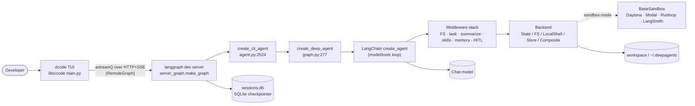
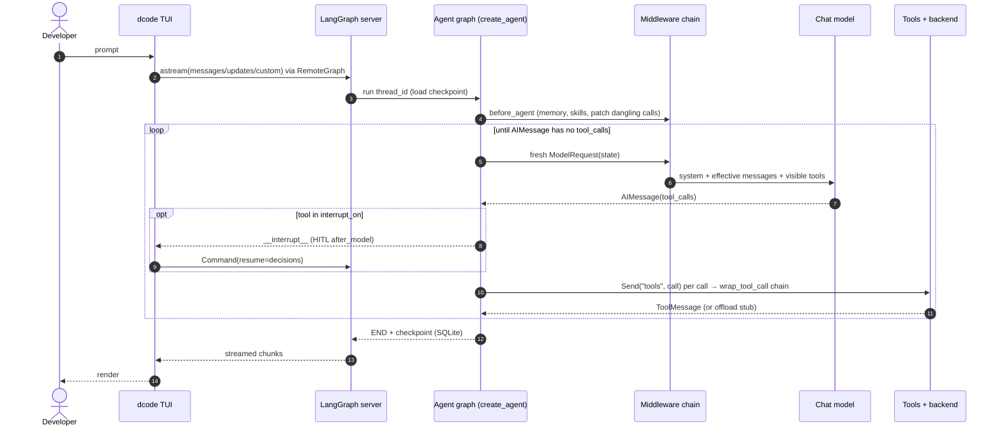
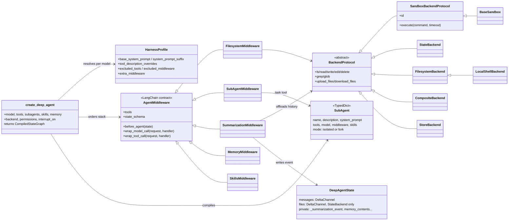
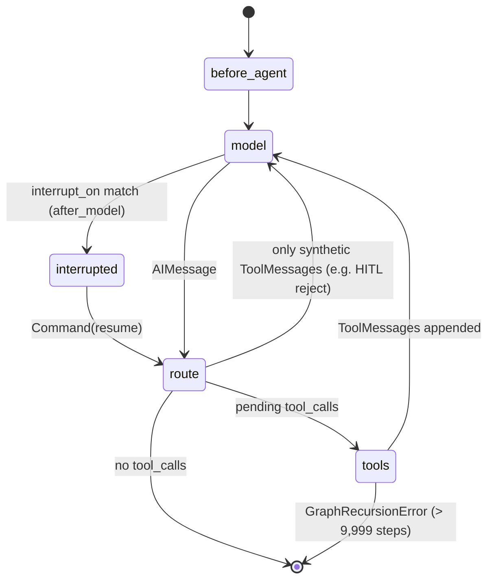
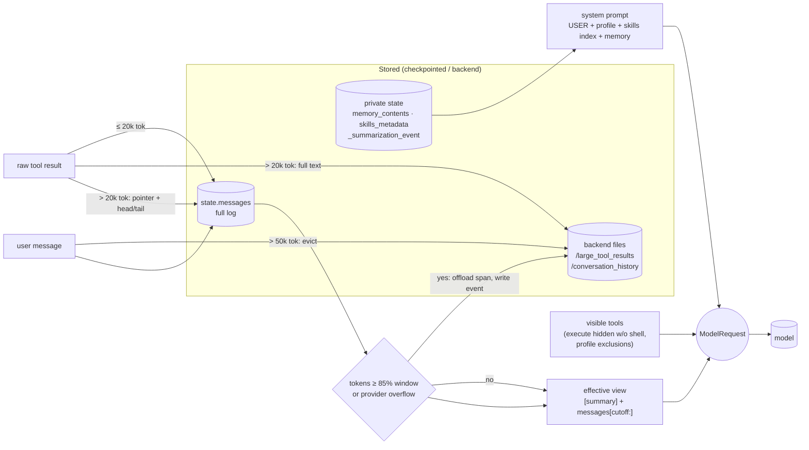
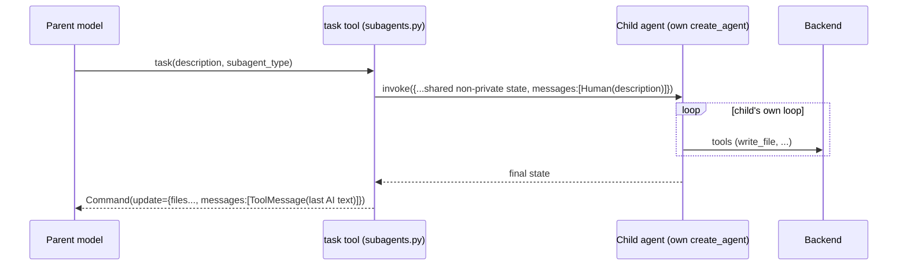

**English** · [中文](deepagents.zh.md)

# deepagents (`langchain-ai/deepagents`)

> Studied at commit [`16e84d9`](https://github.com/langchain-ai/deepagents/tree/16e84d927e7e13c41a10c071380c875af6a562f5)
> (2026-10-06): SDK `deepagents==0.7.22`, CLI `deepagents-code==0.1.81`.
> Source paths below are relative to the monorepo root, and line numbers refer to that commit.
> **Fact** means read in source, tested, or observed at runtime. **Interpretation** means my reading of intent.

**Interactive diagrams (Archify, every node links to source):**
[architecture](../diagrams/deepagents/architecture.html) ·
[execution flow](../diagrams/deepagents/execution-flow.html) ·
[core abstractions](../diagrams/deepagents/core-abstractions.html) ·
[context flow](../diagrams/deepagents/context-flow.html) ·
[memory flow](../diagrams/deepagents/memory-flow.html) ·
[tool runtime](../diagrams/deepagents/tool-runtime.html) ·
[agent loop](../diagrams/deepagents/agent-loop.html) ·
[sub-agent flow](../diagrams/deepagents/sub-agent-flow.html)

**Minimal reproduction:** [`experiments/deepagents/`](https://github.com/woaitqs/repo-research/tree/main/experiments/deepagents)

---

## TL;DR

- **deepagents is a harness, not a runtime.** `create_deep_agent()` builds an ordered list of
  middleware plus a backend, then hands both to LangChain's `create_agent()` (`libs/deepagents/deepagents/graph.py:989-1011`).
  The model→tools loop, state, checkpoints, streaming and interrupts all belong to LangChain and LangGraph.
- **Every capability is middleware.** The three hooks are `before_agent`, `wrap_model_call` and `wrap_tool_call`.
  Filesystem tools, sub-agents, summarization, skills, memory and HITL all plug in this way. The `write_todos` planner is opt-in since commit `9340518`.
  `wrap_model_call` rewrites a *per-call* request (prompt, messages, tools) without touching stored state.
- **Context engineering is the core product.** Four pieces keep the prompt bounded:
  - tool results larger than ~20k tokens are written to `/large_tool_results/<id>`, leaving a head/tail preview;
  - user inputs larger than ~50k tokens are evicted the same way;
  - summarization is **non-destructive**: it records a `_summarization_event` and rebuilds the view on each call, while the full history stays in state and in `/conversation_history/*.md`;
  - sub-agents quarantine context.
- **A backend abstraction decides where files live and whether a shell exists.** The options are graph state,
  local disk, a LangGraph Store, a remote sandbox, or a router across them.
  The `execute` tool is hidden from the model when the backend has no shell.
- **Memory is explicit:** `AGENTS.md` files are injected into the system prompt and edited by the agent through `edit_file`.
  Verified at runtime: memory is loaded **once per thread**, so edits made mid-thread are not re-injected until a new thread starts.
- **Checked with a real model** (`deepseek-v4.1-flash`, 3 runs): the model followed the offload pointer with `grep` and `read_file`, wrote self-contained sub-agent briefs, saved a user preference to `AGENTS.md` unprompted, and recalled a fact that had been summarized away. See [Verification](#verification).
- The `dcode` CLI does **not** run the agent in-process. It starts `langgraph dev` as a subprocess
  and streams to it over HTTP/SSE through LangGraph's `RemoteGraph`.

## Why This Repository Matters

- It packages many patterns from long-running coding agents (offloading, compaction, sub-agent isolation,
  skills, AGENTS.md memory, HITL) as composable, separately tested units on a mainstream agent framework.
- The commit history shows **eval-driven simplification**. Two examples:
  - Commit `a8d1b32` (#4859) removed the authored base prompt and the tool-usage prose:
    *"The System Prompt Experiments found no arm statistically distinguishable, so parsimony argues for the leanest agent."*
  - Commit `9340518` (#4929) made the `write_todos` planning tool opt-in.
- It is a useful counterexample to "build your own agent loop". The repo owns almost no control flow and puts its effort into request shaping and storage.

## Repository Snapshot

| Item | Value (fact) |
|---|---|
| Layout | uv monorepo: `libs/deepagents` (SDK), `libs/code` (`dcode` terminal agent), `libs/acp` (Agent Client Protocol), `libs/talon` (experimental local runtime host), `libs/evals`, `libs/partners/{daytona,modal,runloop,vercel,quickjs}` |
| SDK size | ~29.6k lines of Python in `libs/deepagents/deepagents/`. The largest files are `middleware/filesystem.py` (3.7k), `middleware/summarization.py` (2.3k) and `backends/sandbox.py` (2.1k) |
| SDK dependencies | `langchain>=1.4.3`, `langchain-core>=1.6.6`, `langchain-anthropic`, `langchain-google-genai`, `langsmith`, `wcmatch` (`libs/deepagents/pyproject.toml`) |
| Versions | `.release-please-manifest.json`: deepagents 0.7.22, code 0.1.81, acp 0.0.12, talon 0.0.9 |
| History | 4,146 commits; first commit 2025-07-27 |
| Tests | 3,251 SDK unit tests pass with the locked environment (see [Verification](#verification)) |

## Architecture

Three layers. The source states it, and the call graph confirms it:

```text
Deep Agents   graph.py + middleware/ + backends/ + profiles/   (assembly + request shaping + storage)
LangChain     langchain.agents.create_agent                     (model -> tools loop, middleware hook protocol)
LangGraph     Pregel graph, channels, checkpointer, Send, interrupt (runtime)
```



Richer, source-linked version: [architecture.html](../diagrams/deepagents/architecture.html).

**Module boundaries (fact):**

| Module | Owns | Depends on |
|---|---|---|
| `deepagents/graph.py` | assembly order, sub-agent stack construction, profile application, prompt assembly | middleware, backends, profiles, `langchain.agents.create_agent` |
| `deepagents/middleware/` | all request- and tool-time behavior | `langchain.agents.middleware.types`, backends |
| `deepagents/backends/` | file storage and command execution behind `BackendProtocol` | LangGraph config internals (`StateBackend`), LangGraph Store (`StoreBackend`), subprocess (`LocalShellBackend`) |
| `deepagents/profiles/` | per-provider and per-model harness tuning (prompt suffix, tool descriptions, excluded tools and middleware, extra middleware) | `_models.py` model identity helpers |
| `libs/code` | CLI UX, process topology, sandbox providers, HITL policy, compaction UX, local context, CLI-only tools | SDK pinned `deepagents==0.7.22`, `langgraph-cli`, `langgraph-checkpoint-sqlite` |
| `libs/partners/*` | `BaseSandbox` subclasses (e.g. `class DaytonaSandbox(BaseSandbox)`, `libs/partners/daytona/langchain_daytona/sandbox.py:23`) | SDK `backends.sandbox` |

## Main Execution Flow

Entry point traced: an interactive `dcode` turn. The SDK-only path (`create_deep_agent(...).invoke(...)`)
is the same from step 6 onward, but runs in-process.



Step by step (each step is a fact read in source unless marked otherwise):

1. **Console entry.** `dcode` and `deepagents-code` map to `deepagents_code:cli_main`
   (`libs/code/pyproject.toml:154-156`). `cli_main` is defined at `libs/code/deepagents_code/main.py:5294`.
   Argument parsing chooses one of three modes: interactive TUI, headless `-n`, or `--acp`.
2. **Server spawn.** The TUI calls `start_server_and_get_agent`. It writes a scaffold whose `langgraph.json` points at
   `deepagents_code.server_graph:make_graph` (`client/launch/server.py:56`), then launches
   `python -m langgraph_cli dev --host 127.0.0.1 ...` (`server.py:386-392`). The client is `RemoteAgent`,
   *"Client that talks to a LangGraph server over HTTP+SSE"* (`client/remote_client.py:338-340`).
   The checkpointer is an `AsyncSqliteSaver` subclass with thread-ownership fencing
   (`client/launch/server_manager.py:121-164`, `thread_ownership.py:238-250`).
   `--acp` instead builds the agent in-process (`main.py:3626-3655`).
3. **Graph factory.** `make_graph` (`server_graph.py:1104`) resolves the model, builds CLI tools
   (`fetch_url`, optional Tavily `web_search`, MCP tools), and optionally opens a sandbox (`server_graph.py:497-503`).
   It then calls `create_cli_agent` (`server_graph.py:558-600` → `agent.py:2524`).
4. **CLI assembly.** `create_cli_agent` makes several choices:
   - **Backend:** `LocalShellBackend(root_dir=cwd, virtual_mode=False)`, a plain `FilesystemBackend` if the shell is disabled,
     or the sandbox (`agent.py:3112-3143`). It wraps the result in a `CompositeBackend` with a durable
     `conversation_history` route (`agent.py:3229-3297`).
   - **Memory:** `MemoryMiddleware` over user and project `AGENTS.md` (`agent.py:3056-3093`).
   - **Skills:** a `SkillsMiddleware` subclass.
   - **HITL:** policy for `execute`, `write_file`, `edit_file`, `delete`, `web_search`, `fetch_url`, `task` and the async-task tools (`agent.py:2278-2372`).
   - **Call:** `create_deep_agent(...)` (`agent.py:3649-3661`).
5. **SDK assembly.** `create_deep_agent` (`libs/deepagents/deepagents/graph.py:277`) proceeds in this order:
   - resolves the model and harness profile (`:610-637`);
   - defaults to `StateBackend()` (`:653`);
   - assembles the authored prompt as USER → profile BASE → profile SUFFIX (`:655-664`);
   - compiles each declarative sub-agent's own stack (`:685-815`);
   - auto-adds `general-purpose` (`:817-886`);
   - builds the main stack (`:888-969`);
   - calls `create_agent(...).with_config({"recursion_limit": 9_999, ...})` (`:989-1011`).
6. **Turn start.** The TUI calls `agent.astream(stream_input, stream_mode=["messages","updates","custom"], subgraphs=True, durability="exit")`
   (`tui/textual_adapter.py:2171-2178`).
7. **`before_agent` nodes (once per invocation).** Three middleware run here:
   - `PatchToolCallsMiddleware` gives every unanswered tool call an error `ToolMessage` (`middleware/patch_tool_calls.py:16-52`);
   - `MemoryMiddleware` loads `AGENTS.md` into private `memory_contents` unless it is already present (`middleware/memory.py:279-311`);
   - `SkillsMiddleware` loads skill frontmatter into `skills_metadata` (`middleware/skills.py:1074-1120`).
8. **Model node.** LangChain's `model_node` (external: `langchain/agents/factory.py`, langchain 1.4.3) builds a **fresh**
   `ModelRequest(model, tools, system_message, messages=state["messages"], state, runtime)` and runs the composed
   `wrap_model_call` chain. The first middleware is outermost. Main-stack order:
   - `FilesystemMiddleware` drops `execute` when the backend has no shell and evicts large `HumanMessage`s (`filesystem.py:3194-3302`);
   - `SubAgentMiddleware`;
   - `SummarizationMiddleware` builds the effective view and compacts when needed (`summarization.py:1487-1623`);
   - `PatchToolCalls`;
   - caller middleware;
   - harness-profile `extra_middleware`;
   - Skills (prompt section and gated-tool disclosure);
   - prompt caching (Anthropic, plus Bedrock and Fireworks when installed);
   - Memory, which appends `<agent_memory>`;
   - HITL;
   - `UnsupportedContentMiddleware`;
   - `_ToolExclusionMiddleware`.

   The innermost handler binds tools and calls `model.invoke([system, *messages])`.
9. **HITL gate.** `HumanInTheLoopMiddleware.after_model` calls `interrupt(...)` for matching tool calls
   (external: `langchain/agents/middleware/human_in_the_loop.py:427`). The TUI shows `ApprovalMenu`, then resumes with
   `Command(resume=resume_payload)` (`textual_adapter.py:4096`).
10. **Routing.** LangChain's `_make_model_to_tools_edge` (external, `factory.py:1991-2042`) handles four cases:
    - no tool calls → END;
    - pending calls → `[Send("tools", [call]) for call in pending]`, so tool calls run in parallel;
    - only synthetic results, such as HITL rejections → back to the model;
    - a `jump_to` value set in state takes priority over the cases above.
11. **Tool node.** The composed `wrap_tool_call` chain runs. `FilesystemMiddleware.wrap_tool_call`
    (`filesystem.py:3682-3710`) does three things:
    - rejects a second same-path mutation in one AIMessage;
    - runs the tool;
    - offloads oversized results, except for tools in `TOOLS_EXCLUDED_FROM_EVICTION`.

    The `task` tool invokes a sub-agent graph (`subagents.py:810-838`).
12. **Observation.** `ToolMessage`s are reduced into `messages`. The `DeltaChannel` reducer de-duplicates by id
    (`_messages_reducer.py`). Control goes back to step 8.
13. **Finish.** When the last AIMessage has no tool calls, the graph ends. The checkpoint is persisted (SQLite in the CLI), and the TUI renders the streamed chunks.

Interactive versions: [execution-flow.html](../diagrams/deepagents/execution-flow.html) and [agent-loop.html](../diagrams/deepagents/agent-loop.html).

## Core Abstractions



Interactive version: [core-abstractions.html](../diagrams/deepagents/core-abstractions.html).

### `create_deep_agent` (assembler)
- **Responsibility:** turn a declarative configuration into an ordered middleware stack and a compiled LangChain agent.
- **Inputs:** model (string or `BaseChatModel`), tools, `system_prompt`, `middleware`, `subagents`, `skills`, `memory`, `permissions`, `backend`, `interrupt_on`, `response_format`, `checkpointer`, `store` (`graph.py:277-297`).
- **Outputs:** `CompiledStateGraph`, configured with `recursion_limit=9_999` and tracing metadata (`graph.py:1002-1011`).
- **Lifecycle:** runs once at construction. It never runs during execution.
- **Dependencies:** `resolve_model`, `_harness_profile_for_model`, all middleware classes, `create_agent`.
- **Key source:** `graph.py:210-244` (`_apply_custom_middleware`: replace by `.name` in place; new entries land after the core and before the tail); `graph.py:247-262` (`_REQUIRED_MIDDLEWARE`: profiles cannot exclude Filesystem or SubAgent).
- **Why it exists:** ordering is the product. Several behaviors only work at a specific position. Skills must run after compaction and after model routing (`graph.py:404-411`). Memory is appended last, after prompt caching. Profile middleware sits *"between core middleware and memory so that memory updates (which change the system prompt) don't invalidate the Anthropic prompt cache prefix"* (`graph.py:925-945`).

### `AgentMiddleware` (LangChain contract, implemented by every deepagents feature)
- **Responsibility:** intercept the loop at defined points.
- **Inputs and outputs:** `before_agent(state) -> state update`; `wrap_model_call(ModelRequest, handler) -> ModelResponse | ExtendedModelResponse(command=Command(update=...))`; `wrap_tool_call(ToolCallRequest, handler) -> ToolMessage | Command`; class attributes `tools` and `state_schema`.
- **Lifecycle:** hooks run on every model call or tool call. `before_agent` runs once per invocation.
- **Key source:** `libs/deepagents/deepagents/middleware/__init__.py:1-50` documents why features are middleware and not plain tools: a plain tool *"is only invoked by the LLM, not before the LLM call."*
- **Why it exists:** the hook lets a feature change the tool list, inject prompt sections, rewrite the message view, and keep private state. A tool function cannot do any of that.

### `BackendProtocol` / `SandboxBackendProtocol`
- **Responsibility:** separate *where files live* from *which tools the model sees*.
- **Inputs and outputs:** absolute virtual paths, returning `ReadResult`, `WriteResult`, `GrepResult` and so on (`backends/protocol.py:404-805`). `execute(command, timeout) -> ExecuteResponse` exists only on the sandbox protocol (`:886-944`). `delete` is optional and detected by override (`:985-1000`).
- **Implementations (fact):**
  - `StateBackend`: files live in graph state and are written through LangGraph `CONFIG_KEY_SEND` (`backends/state.py:38-119`);
  - `FilesystemBackend`: local disk with optional `virtual_mode` root;
  - `LocalShellBackend`: `FilesystemBackend` plus `subprocess`, with *"NO sandboxing or isolation"* (`backends/local_shell.py:1-5`);
  - `StoreBackend`: LangGraph `BaseStore`, cross-thread, namespaced (`backends/store.py:90-97`);
  - `CompositeBackend`: longest-prefix routing; `execute` always goes to the default backend (`backends/composite.py:195-283, 814-850`);
  - `BaseSandbox`: all file operations implemented as shell or Python scripts over `execute()` (`backends/sandbox.py:1-13, 1536-1569`);
  - `ContextHubBackend`: a LangSmith Hub repo;
  - `LangSmithSandbox`.
- **Lifecycle:** constructed once and shared by the main agent, every sub-agent, summarization, memory and skills (`graph.py:653, 718-726`).
- **Why it exists:** one piece of tool code (filesystem tools, offload, memory loading, history offload) can then run against ephemeral state, disk, a database, or a remote VM.

### `HarnessProfile` / `ProviderProfile` (model abstraction)
- **Responsibility:**
  - `ProviderProfile` adjusts *model construction*: OpenAI defaults to the Responses API; NVIDIA and OpenRouter get attribution headers (`_models.py:36-58`, `profiles/provider/`).
  - `HarnessProfile` adjusts the *harness* per model: prompt suffix, tool-description overrides, excluded tools and middleware, extra middleware, general-purpose sub-agent settings (`profiles/harness/harness_profiles.py:483`).
- **Lookup:** exact `provider:model` key, then provider defaults, then an empty profile (`harness_profiles.py:1319-1387`). Built-ins are registered by explicit import, and third parties register through entry points (`profiles/_builtin_profiles.py:1-60`).
- **Example (fact):** the Codex profile re-adds `TodoListMiddleware`, because its prompt references `write_todos` (`profiles/harness/_openai_codex.py:60-88`). The Sonnet 4.6 profile only appends Anthropic's published prompting snippets (`_anthropic_sonnet_4_6.py`).
- **Why it exists:** model differences are handled as configuration data. There is no model-specific branching in the code.

### `SubAgent` / `CompiledSubAgent` / `AsyncSubAgent`
- **Responsibility:** units of delegated work.
  - `SubAgent` is declarative and compiled with its own `create_agent` (`subagents.py:72, 549-604`).
  - `CompiledSubAgent` is any runnable that returns `messages` (`:226`).
  - `AsyncSubAgent` is a remote Agent Protocol graph run in the background (`async_subagents.py:34`).
- **Lifecycle:** compiled at construction (`_build_task_tool` → `_compile_spec`, `subagents.py:684-715, 870-874`) and invoked per `task` call.
- **Why it exists:** context isolation and specialization; see [Sub-Agents](#sub-agents--workflow).

### `DeepAgentState`
- **Responsibility:** the checkpointed state schema.
- **Fields:**
  - `messages` uses a `DeltaChannel` reducer with snapshots every 50 steps, *"to reduce checkpoint growth from O(N²) to O(N)"* (`graph.py:74-77`);
  - middleware contribute `files` (also a `DeltaChannel`, `filesystem.py:1171-1176`), `_summarization_event` and `_summarization_session_id` (`summarization.py:198-211`), `memory_contents`, `skills_metadata` and `async_tasks`.
- **Private fields:** fields annotated `PrivateStateAttr` are collected (`middleware/_state.py`, `graph.py:970-976`) and stripped from sub-agent input and output.
- **Why it exists:** keeping history non-destructive only works if checkpoints of a growing log stay cheap.

## Agent Loop

**Fact:** deepagents has no loop code of its own. The loop is LangChain's compiled graph:

```text
START → [before_agent nodes] → model ⇄ tools → [after_agent nodes] → END
```

- `model` and `tools` are LangGraph nodes. `before_model`/`after_model` hooks are extra nodes, and `wrap_*` hooks run *inside* the nodes.
- **Exit condition:** the last `AIMessage` has no tool calls (`factory.py:2016-2019`).
- **Parallelism:** each pending call gets its own `Send` (`factory.py:2031-2032`).
- **Bounding:** `recursion_limit=9_999` (`graph.py:1004`) instead of a turn counter. Context size is bounded by summarization, not by limiting steps.
- **Self-repair:** `PatchToolCallsMiddleware` (`patch_tool_calls.py`) fixes histories that carry an unanswered tool call after an interrupt or crash. Without it the next provider call would be rejected.
- **Optional quality loop:** `RubricMiddleware` (`middleware/rubric.py:1-10`) intercepts "done": a grader sub-agent can inject feedback and resume, up to `max_iterations`.



## Context Engineering

Context engineering is the main architectural concern of this repository. Each answer below is backed by source and, where marked, by runtime probes against the real SDK.



Interactive version: [context-flow.html](../diagrams/deepagents/context-flow.html).

1. **How context is constructed.** It is rebuilt per call from state by the `wrap_model_call` chain. Nothing is cached between calls except provider prompt caches (`graph.py:888-969` for order; LangChain `model_node` builds the request).
2. **What enters the model context:**
   - the authored system prompt (USER → profile BASE → SUFFIX, `graph.py:655-664`);
   - Skills, Memory and filesystem host-path-routing sections appended by middleware;
   - the effective message view;
   - visible tool schemas.

   Built-in tool-usage prose is deliberately **not** included because it duplicated the schemas (commit `a8d1b32`; comment at `graph.py:666-673`).
3. **What is excluded:**
   - skill bodies, until the model reads them;
   - tool results larger than 20k tokens and `HumanMessage`s larger than 50k tokens (`filesystem.py:1771-1772`);
   - summarized spans;
   - the `execute` tool when the backend has no shell (`filesystem.py:3194-3240`);
   - tools listed in `excluded_tools` (`_tool_exclusion.py`);
   - content blocks the model cannot accept (`unsupported_content.py`);
   - sub-agent transcripts.
4. **How tool results are handled.** A result goes straight into a `ToolMessage` unless it is larger than `4 × 20,000` chars and its tool is not excluded.
   The excluded tools are `ls/glob/grep` (they truncate themselves, and truncation means "refine the query"), `read_file` (re-reading an offloaded read would not help), and `write/edit/delete` (small outputs) (`filesystem.py:1601-1630`).
   Tool errors are returned as `ToolMessage(status="error")` observations; they are not raised (`filesystem.py:193-195`; `execute` validation at `:3001-3060`).
5. **Truncation and offload.** Yes, both, and both are reversible (sketched below):
   - **Large results** (`_message_eviction.py:260-284`): written to `/large_tool_results/<tool_call_id>` and replaced with a line-numbered **head 5 / tail 5** preview, a `... [N lines truncated] ...` marker and paging instructions.
     Probe P3: a 169,889-char result reached the model as a 1,812-char stub.
   - **Large user inputs:** written to `/conversation_history/<uuid>.md`, and the message is tagged `lc_evicted_to`. State keeps the full text, and only the request copy is truncated (`filesystem.py:3435-3538`).
   - **Sandbox `execute`:** capture-at-source can keep big output inside the sandbox and return only a preview (`sandbox.py:1340-1410, 1589-1625`). It is opt-in per sandbox class (`enable_capture_offload = False` by default, `sandbox.py:1558`).
   - **Older tool-call arguments** (e.g. `write_file` content) are clipped before full summarization fires (`TruncateArgsSettings`, `summarization.py:168-196`).
6. **Summarization and compaction.** Yes, and it is non-destructive (`summarization.py:1487-1623`):
   - it triggers at 85% of `max_input_tokens` and keeps 10%, or uses 170k tokens / 6 messages when the model profile is unknown (`:262-299`);
   - it picks a cutoff that never splits an AIMessage from its ToolMessages (LangChain `_find_safe_cutoff_point`);
   - it appends the evicted span to `/conversation_history/<session>.md`;
   - it asks the model for a summary and stores `{cutoff_index, summary_message, file_path}` as `_summarization_event`;
   - every later call sees `[summary] + messages[cutoff:]` (`:821-858`).

   Chained compactions translate indices on the raw state list (`:860-886`). On a provider `ContextOverflowError` it summarizes, clips the trailing ToolMessage batch, and retries **at most once** with a strictly smaller request; irreducible input raises (`:1395-1454`; tests `test_compaction_recovery.py`).
   Probe P5: state kept 44 messages and the model saw 6.
7. **Repository context.** It is not indexed. There is no embedding or retrieval layer in the SDK. The agent explores with `ls/glob/grep/read_file`. `read_file` defaults to 100 lines (`filesystem.py:951-952`), and `grep` is literal and capped at 1,000 matches (`:1774`).
   The CLI adds one-time local context through `LocalContextMiddleware` (`libs/code/deepagents_code/local_context.py:718`): git state, languages, test command, a `tree -L 3`. After a summarization event it sends a refresh message only if that context changed (`:826-834`).
8. **How sub-agents receive context.**
   - Isolated mode: `messages=[HumanMessage(description)]` plus the parent's non-message, non-private state (`subagents.py:776-808`).
   - `mode="fork"` (beta): the parent's **effective** (already summarized) messages plus a preamble that forbids further delegation (`subagents.py:363-390`).
   - Probe P4: the child's first request was exactly `[SystemMessage, HumanMessage("Write a short report to /report.md")]`.
9. **How context isolation works.**
   - The parent receives only the child's last non-empty AI text as a `ToolMessage` (`subagents.py:721-759`).
   - `_EXCLUDED_STATE_KEYS` (`messages`, `todos`, `structured_response`, `skills_metadata`, ...) and all `PrivateStateAttr` keys are never passed in or out (`:398-422`).
   - Children get no `task` tool, so delegation does not recurse. Probe P4 confirms the child tool list has no `task`.
10. **Context size over long-running tasks.** Four mechanisms cooperate:
    - proactive offload on each tool call;
    - argument truncation at a lower threshold;
    - summarization at 85%;
    - reactive overflow recovery.

    Checkpoint growth is kept linear by `DeltaChannel`. **Interpretation:** the design treats the prompt as a cache over durable state, and every eviction leaves a pointer the model can follow back.

The offload path from point 5, simplified from `filesystem.py` and `_message_eviction.py`:

```python
# filesystem.py:3682-3710 (simplified)
def wrap_tool_call(self, request, handler):
    if error := _parallel_file_mutation_error(request):   # same path twice in one turn
        return error
    result = handler(request)
    if request.tool_call["name"] in TOOLS_EXCLUDED_FROM_EVICTION:
        return result
    return self._intercept_large_tool_result(result)      # > 4 * 20_000 chars -> backend file + preview stub
```

## Memory

| Concept | What it is here | Where it lives | Scope | Written by | Read by |
|---|---|---|---|---|---|
| **Conversation history** | `state["messages"]`, the full log (never rewritten by summarization) | LangGraph checkpoints; the CLI uses `~/.deepagents/.state/sessions.db` (SQLite) | thread | graph nodes | model node (as the effective view) |
| **Context** | one `ModelRequest`: system prompt + effective messages + tool schemas | memory only, rebuilt every call | one model call | `wrap_model_call` chain | the model |
| **Persistent memory** | `AGENTS.md` files | backend files: in the CLI, `~/.deepagents/<agent>/AGENTS.md` plus project `AGENTS.md` / `.deepagents/AGENTS.md` (`libs/code/deepagents_code/agent.py:3056-3063`, `_paths.py:295-297`, `project_utils.py:151-175`) | user / agent profile / project | **the agent itself via `edit_file`**, or the user | `MemoryMiddleware.before_agent` |
| **External storage** | offloaded results, history archives, workspace files, Store namespaces | backend: disk, state, `StoreBackend` (cross-thread), `ContextHubBackend` (LangSmith Hub repo), sandboxes | configurable per route | tools and middleware | the agent, on demand via `read_file` |

Interactive version: [memory-flow.html](../diagrams/deepagents/memory-flow.html).

- **Memory is explicit, not implicit.** There is no automatic extraction or vector store. The memory prompt tells the model when to persist learnings with `edit_file` and what never to store, such as credentials (`middleware/memory.py:105-171`).
- **Entry into context:** `memory_contents` is formatted into `<agent_memory>…</agent_memory>` and appended to the system prompt on every call (`memory.py:347-383`). For Anthropic models a `cache_control` breakpoint is added. HTML comments are stripped first.
- **Retrieval:** `before_agent` downloads every source once. Missing files are skipped and other errors raise (`memory.py:279-311`).
- **Update and staleness (fact, verified at runtime):** loading is skipped when `memory_contents` is already in state (`memory.py:294`), and the field is checkpointed with the thread. **An edit made mid-thread is not re-injected until a new thread starts.**
  Probe P6: after `edit_file` changed the file to "likes rust", the next turn's system prompt still said "likes python". I found no invalidation path in the SDK.
  The only mitigation is in the prompt: memory *"may be outdated… prefer the user and the verified evidence"* (`memory.py:113-116`).
- **Trust:** memory is framed as data, not instructions (`memory.py:113-116`). The CLI refuses project `AGENTS.md` symlinks that escape the project root (`project_utils.py:151-175`) and guards a machine-managed block (`ManagedMemoryGuardMiddleware`, `agent.py:3085-3093`).
- **Skills are procedural memory with progressive disclosure:**
  - only `name`, `description` and path from the `SKILL.md` frontmatter enter the prompt (`skills.py:797-838`);
  - the body is read with `read_file`;
  - tools a skill lists in `metadata.include_tools` are disclosed only after its `SKILL.md` has been read (`_skill_tools.py:1-60`, commit `92cd8e7`);
  - later skill sources override earlier ones (last wins).

## Tools

- **Interface:** LangChain `BaseTool` / callables. The model sees name, description and JSON schema. There are two registration paths (`middleware/__init__.py:1-50`):
  - middleware `.tools` (filesystem, `task`, async-task tools, `compact_conversation`, skill-disclosed tools);
  - caller `tools=` (in the CLI: `fetch_url`, `web_search`, MCP tools).
- **Built-in tools:** `ls`, `read_file`, `write_file`, `edit_file`, `delete`, `glob`, `grep`, and `execute` if the backend supports it (`filesystem.py:1893-1906`); plus `task`. `write_todos` is **opt-in** since `9340518` and is re-added by the Codex profile.
- **Discovery:** static per agent, filtered per call:
  - `FilesystemMiddleware` drops capability-gated tools (`filesystem.py:3194-3213`);
  - `_ToolExclusionMiddleware` applies profile exclusions at both the request and execution boundary (`_tool_exclusion.py`);
  - `SkillsMiddleware` adds gated tools after the matching `SKILL.md` has been read.
- **Invocation:** LangGraph `ToolNode` runs each call via `Send`, wrapped by the composed `wrap_tool_call` chain. `ToolRuntime` injects `state`, `tool_call_id` and config into tools that ask for it (e.g. `task`).
- **Result handling:** see [Context Engineering](#context-engineering) §4–5.
- **Error handling:** tools return `status="error"` `ToolMessage`s for user-correctable faults: bad timeout, missing file, permission denied, unknown sub-agent type. Examples:
  - `TaskToolSchema` rejects unknown argument keys, because models put real instructions under an invented `prompt` key (`subagents.py:441-464`);
  - exceptions from tool code itself propagate *"unhandled by design"* (`filesystem.py:3696-3699`).
- **Retries:** none at tool level in the SDK. The CLI adds `CodeModelRetryMiddleware` for model-node retries (reported by the CLI trace, not verified line-by-line).
- **Permissions:** `FilesystemPermission(operations, paths, mode=allow|deny|interrupt)`, first match wins, enforced inside the built-in filesystem tools (`filesystem.py:366-412`).
  - `interrupt` rules are compiled into `HumanInTheLoopMiddleware` configs with a `when` predicate (`_fs_interrupt.py:156-183`).
  - Permissions together with an execute-capable backend raise `NotImplementedError` unless every rule is scoped to routes (`filesystem.py:1849-1856`), because shell access would bypass path rules.
- **MCP:** CLI-level only (MCP tools are passed as ordinary tools). The SDK has no MCP-specific code.

## Runtime / Sandbox

**Where the reasoning/execution boundary sits (fact).**
The model only emits `tool_calls` and reads `ToolMessage`s. Execution happens in tool functions owned by middleware, which delegate I/O to the backend.
So the boundary is the `BackendProtocol` interface. The policy gates (HITL, permissions, mutation guard) sit between the model and that interface.
Interactive version: [tool-runtime.html](../diagrams/deepagents/tool-runtime.html).

| Runtime | Isolation | Source |
|---|---|---|
| `StateBackend` (default) | no shell; files in checkpointed state | `backends/state.py` |
| `FilesystemBackend(virtual_mode=True)` | path traversal blocked under `root_dir`; not a process sandbox | `backends/filesystem.py:132-136, 182-260` |
| `LocalShellBackend` | **none**: arbitrary commands with the user's permissions. The docstring says `virtual_mode` gives *"NO security with shell access enabled"* | `backends/local_shell.py` |
| `BaseSandbox` subclasses (Daytona, Modal, Runloop, Vercel, LangSmith, AgentCore via CLI) | the remote VM or container is the isolation boundary | `backends/sandbox.py:1536`, `libs/partners/*`, `libs/code/.../sandbox_registry.py:334-348` |

- **`BaseSandbox` design:** subclasses implement only `execute`, `upload_files`, `download_files` and `id`. `ls/read/grep/glob/edit` are built on `execute()` as embedded `python3 -c` and POSIX shell scripts (`sandbox.py:1-13`). One small primitive makes any shell-bearing VM a full backend.
- **Shell timeouts:** per-call `timeout` is validated against `max_execute_timeout` (default 3600 s, `filesystem.py:1773`). `LocalShellBackend` defaults to 120 s and caps output at 100 kB (`local_shell.py`).
- **CLI policy:** in local mode, `execute`, `write_file`, `edit_file` and the other tools listed in step 4 are HITL-gated unless the user picks auto-approve or YOLO, or a shell allow-list replaces HITL (`agent.py:2278-2391`). In `--sandbox` mode, auto mode is forced to manual (per the CLI trace).
- **Network and browser:** the SDK has no browser runtime. Network access is whatever the backend's shell allows, plus CLI tools (`fetch_url`, Tavily search).

## Sub-Agents / Workflow



Interactive version: [sub-agent-flow.html](../diagrams/deepagents/sub-agent-flow.html).

- **Registration:** `general-purpose` is auto-added with the parent's tools, model and skills unless overridden or disabled by a profile (`graph.py:817-886`; `subagents.py:495-501`). Custom sub-agents get Filesystem → Summarization → PatchToolCalls → their own middleware → profile middleware → Skills → caching (`graph.py:714-778`). They do **not** get `SubAgentMiddleware`.
- **Parallelism:** the `task` description tells the model to *"Launch multiple agents concurrently … using a single message with multiple tool calls"* (`subagents.py:467-478`). LangGraph's `Send` fan-out runs them in parallel. Tests cover private-state isolation between siblings (`tests/unit_tests/test_subagents.py:332`).
- **State merge-back (fact plus an edge case found by probe P7):**
  - the child's non-excluded state keys are returned in the `Command` update (`subagents.py:731`);
  - with `StateBackend`, files the child wrote appear in the parent (probe P4);
  - **a file the child deleted reappears in the parent**: the child's tool returned `Deleted /old.md`, but `/old.md` stayed in the parent's `files`. The child returns its full `files` dict, so the deleted key is simply absent rather than a `None` tombstone, and the parent's merge reducer keeps the old entry.

  **Interpretation:** this is a minor correctness gap that only matters for `StateBackend`. With disk or sandbox backends the deletion happens on the real filesystem.
- **Async sub-agents:** `start/check/update/cancel/list_async_task` tools drive remote Agent Protocol graphs through the LangGraph SDK (`threads.create` + `runs.create`, `async_subagents.py:245-340`). Task records live in `async_tasks` state. Sub-agents do not inherit top-level `interrupt_on`.
- **Workflow and orchestration:** there is no DAG or workflow engine. Orchestration is model-driven through `task` calls. The optional exceptions are `RubricMiddleware`'s grade-and-revise loop and the async task tools.

## Important Source Files

| File | Why read it |
|---|---|
| `libs/deepagents/deepagents/graph.py` | the whole assembly order; sub-agent stacks; prompt assembly; required middleware |
| `libs/deepagents/deepagents/middleware/__init__.py` | short rationale for "middleware vs. tools" |
| `libs/deepagents/deepagents/middleware/filesystem.py` | tools, capability gating, permissions, large-result and large-input eviction, mutation guard |
| `libs/deepagents/deepagents/middleware/_message_eviction.py`, `_overflow_clip.py` | preview stubs; overflow tail clipping |
| `libs/deepagents/deepagents/middleware/summarization.py` | non-destructive compaction, history offload, overflow recovery, `compact_conversation` tool |
| `libs/deepagents/deepagents/middleware/subagents.py` | `task` tool, isolation rules, fork mode |
| `libs/deepagents/deepagents/middleware/memory.py`, `skills.py`, `_skill_tools.py` | memory injection; progressive disclosure of skills and skill tools |
| `libs/deepagents/deepagents/backends/{protocol,state,composite,sandbox,local_shell}.py` | storage/execution abstraction and the isolation story |
| `libs/deepagents/deepagents/profiles/harness/harness_profiles.py` | per-model harness configuration |
| `libs/deepagents/deepagents/_messages_reducer.py` | O(N) checkpointing for a never-truncated log |
| `libs/code/deepagents_code/agent.py` (`create_cli_agent`) | how a real product configures the SDK |
| `libs/code/deepagents_code/client/launch/server.py`, `client/remote_client.py` | client/server process split |
| `langchain/agents/factory.py` (external, langchain 1.4.3) | the actual loop: `model_node`, `_make_model_to_tools_edge` |

## 5+ Implementation Decisions Worth Learning From

### 1. Build the harness as ordered middleware on someone else's loop
- **What they did:** `create_deep_agent` builds `[Filesystem, SubAgent, Summarization, PatchToolCalls, *caller, *profile, Skills, caching, Memory, HITL, UnsupportedContent, ToolExclusion]` and calls `create_agent` (`graph.py:888-1011`).
  Caller middleware replaces built-ins by `.name` in place (`graph.py:210-244`). Core scaffolding cannot be excluded (`graph.py:247-262`).
  The CLI uses this to swap its own compaction middleware into the summarization slot: `CLICompactionMiddleware.name` returns `"SummarizationMiddleware"` (`libs/code/deepagents_code/offload_middleware.py:1017, 1057-1060`).
- **Problem solved:** many orthogonal concerns (tools, prompt sections, compaction, approvals) all need to touch every model call without forking the loop.
- **Why it is interesting:** almost no control flow is owned, so durability, streaming and interrupts come free from LangGraph. Name-based replacement makes the defaults overridable without a plugin system.
- **Trade-offs:**
  - Order carries meaning, and the docstring spends about 40 lines on it (`graph.py:372-427`).
  - Debugging needs to know which of four stacks (main, declarative child, compiled child, async) ran.
  - Hidden coupling: a feature can depend on running after compaction.
- **Where in source:** `graph.py`, `middleware/__init__.py`.
- **Reuse:** define a three-hook contract (`before_run`, `wrap_model_call`, `wrap_tool_call`) and assemble features as an ordered, name-replaceable list. Mark the few that are load-bearing as non-removable.

### 2. Non-destructive compaction: record an event, rebuild the view
- **What they did:** `SummarizationMiddleware` never rewrites `state["messages"]`. It stores `_summarization_event = {cutoff_index, summary_message, file_path}` and on each call computes `[summary] + messages[cutoff:]` (`summarization.py:821-858, 1487-1623`).
  The evicted span is appended to `/conversation_history/<session>.md`, and the summary message points at it (`:772-803`).
  The factory docstring contrasts this with LangChain's version, which *"rewrites it with RemoveMessage(id=REMOVE_ALL_MESSAGES)"* (`:1802-1807`).
- **Problem solved:** compaction usually loses information irreversibly and breaks replay, evals and shared state.
- **Why it is interesting:** the prompt becomes a view over an append-only log, and every summary carries a recovery pointer.
- **Trade-offs:**
  - State grows without bound. This is paid for with `DeltaChannel` checkpoints (`graph.py:74-77`).
  - Chained events need index arithmetic (`:860-886`).
  - Tokens are counted on every call.
  - The keep window must sit well below the trigger. My reproduction shows that `keep ≥ trigger` re-summarizes on every call.
- **Where in source:** `middleware/summarization.py`; tests `tests/unit_tests/middleware/test_summarization_middleware.py`, `test_compaction_recovery.py`.
- **Reuse:** keep the raw transcript append-only. Store compaction as metadata, render the model view on demand, and always write the evicted span somewhere the agent can read.

### 3. The filesystem as the context overflow valve
- **What they did:** tool results over 20k tokens and user messages over 50k tokens are written to the backend and replaced by a head/tail preview with paging instructions (`filesystem.py:3359-3433, 3509-3538`; `_message_eviction.py:115-284`).
  Excluded tools are chosen deliberately: grep and glob outputs that truncate themselves should prompt a narrower query, not an offload (`filesystem.py:1601-1630`).
  Sandboxes can capture output at the source so it never crosses the network (`sandbox.py:1340-1410`).
- **Problem solved:** a single `cat` or test run can blow the context window.
- **Why it is interesting:** it reuses tools the agent already has (`read_file`, `grep`) as the retrieval mechanism, so no new "memory API" is needed.
- **Trade-offs:** the model must decide to page; previews can hide the relevant middle; offloaded files accumulate in storage.
- **Where in source:** `middleware/filesystem.py`, `middleware/_message_eviction.py`, `backends/sandbox.py`.
- **Reuse:** cap every observation, store the full payload under a deterministic path keyed by `tool_call_id`, and show head and tail plus exact paging instructions.

### 4. One storage abstraction, capability-gated tools
- **What they did:** all file I/O goes through `BackendProtocol`. `execute` exists only on `SandboxBackendProtocol`.
  `FilesystemMiddleware` removes `execute` (and `delete`) from the request when the backend cannot serve them (`filesystem.py:3194-3240`). Probe P2 confirms `execute` is absent with `StateBackend`.
  `CompositeBackend` routes by longest prefix, but sends `execute` to the default (`composite.py:195-283, 814-850`).
  `StateBackend` writes into graph state through LangGraph's `CONFIG_KEY_SEND`, with read-your-writes inside a step (`state.py:81-119`).
- **Problem solved:** the same agent needs to run against ephemeral state (tests, SaaS), local disk (CLI), and remote VMs (production) without code changes.
- **Why it is interesting:** the model never sees a tool that will always fail. Storage choice becomes deployment configuration.
- **Trade-offs:**
  - `StateBackend` imports `langgraph._internal._constants`, a private API.
  - Permissions are enforced in tools, not in the backend: *"Direct backend usage does not currently incorporate permissions"* (`graph.py:501-504`).
  - Path routing cannot constrain a shell.
- **Where in source:** `backends/`, `middleware/filesystem.py`.
- **Reuse:** model the environment as a capability-typed interface, and derive the visible tool list from capabilities on every request.

### 5. Sub-agents as a tool with context quarantine
- **What they did:** a single `task(description, subagent_type)` tool.
  - The child starts from `[HumanMessage(description)]` plus shared non-private state.
  - It returns only its last non-empty AI text, or a structured response serialized to JSON (`subagents.py:721-838`).
  - Unknown argument keys are rejected so instructions cannot hide in invented fields (`:441-464`).
  - Children cannot delegate further.
  - The beta `mode="fork"` hands the parent's summarized history to the child (`:363-390`).
- **Problem solved:** exploratory work (searching, reading many files) pollutes the parent's context, and long tasks benefit from parallel independent workers.
- **Why it is interesting:** isolation is enforced structurally (state filtering, private keys, no recursion), not by prompt.
- **Trade-offs:** the parent must write a complete brief; child work is invisible to the parent (only to tracing); probe P7 found a delete-propagation gap; each child repeats the system-prompt and tool-schema overhead.
- **Where in source:** `middleware/subagents.py`; tests `tests/unit_tests/test_subagents.py` (e.g. `:130`, `:332`, `:415`).
- **Reuse:** expose delegation as a tool whose input is a self-contained brief and whose output is a single report. Strip history and private state on the way in and out.

### 6. Memory as editable files, injected into the prompt
- **What they did:** `AGENTS.md` sources are loaded once into private state and appended to the system prompt each call (`memory.py:279-383`). The agent updates memory with ordinary `edit_file`. The memory prompt frames the content as possibly stale data and lists what never to store (`memory.py:105-171`).
- **Problem solved:** cross-session learning with no extra infrastructure. Memory stays inspectable and diff-able by humans.
- **Why it is interesting:** it reuses the filesystem tools, and the trust framing addresses memory-based prompt injection.
- **Trade-offs:** staleness within a thread (probe P6); no retrieval or selection, since whole files are injected; quality depends on the model choosing to write; prompt size grows with memory.
- **Where in source:** `middleware/memory.py`; the CLI wiring is in `agent.py:3056-3093`.
- **Reuse:** start with plain files the agent edits, plus prompt framing. If you cache memory per session, invalidate the cache on writes to the memory paths. That is the gap this design leaves open.

### 7. Eval-driven prompt minimalism and opt-in planning
- **What they did:** removed the authored base prompt and the built-in tool-usage prose (commit `a8d1b32`, *"no arm statistically distinguishable, so parsimony argues for the leanest agent"*), and made `TodoListMiddleware` opt-in (commit `9340518`). Model-specific guidance moved into harness profiles (`profiles/harness/_*.py`).
- **Problem solved:** prompt bloat that duplicates tool schemas, costs tokens, and drifts from tool behavior.
- **Why it is interesting:** these decisions were made by measurement, and the old prompt is still available behind a deprecation shim (`graph.py:125-141`).
- **Trade-offs:** weaker models may need more hand-holding, which is pushed into profiles; behavior depends more on the quality of tool descriptions.
- **Where in source:** `graph.py:666-673`; `profiles/`; commit history.
- **Reuse:** treat each prompt section as a hypothesis that needs an eval, and keep per-model tuning in data.

### 8. Defensive history repair and cache-aware ordering
- **What they did:**
  - `PatchToolCallsMiddleware` answers dangling or invalid tool calls before each run (`patch_tool_calls.py:16-52`).
  - The same-path mutation guard rejects racing edits within one turn (`filesystem.py:198-224`).
  - Overflow recovery sends at most one strictly smaller retry (`summarization.py:1415-1454`).
  - Memory, the prompt section most likely to change, is appended last, and profile middleware goes *"between core middleware and memory so that memory updates (which change the system prompt) don't invalidate the Anthropic prompt cache prefix"* (`graph.py:925-927`).
  - The CLI re-sends local context only when it changed (`local_context.py:826-834`).
- **Problem solved:** interrupted runs, parallel tool calls and provider limits produce invalid transcripts, retry storms and cache misses.
- **Reuse:** before every run, validate that each tool call has a result; reject conflicting parallel writes; bound recovery retries; order prompt sections from most to least stable.

## Minimal Reproduction

[`experiments/deepagents/`](https://github.com/woaitqs/repo-research/tree/main/experiments/deepagents) is a stdlib-only Python package, `minideep`, of about 1,200 lines. It reproduces the **architecture**: a plain loop plus ordered middleware plus a pluggable backend.
`ScriptedModel` replaces the LLM so every property can be asserted exactly.

| minideep | reproduces |
|---|---|
| `loop.py::Agent` | LangChain `create_agent` control flow: fresh request per step; onion-composed `wrap_model_call` / `wrap_tool_call`; exit when there are no tool calls; errors as observations |
| `graph.py::create_deep_agent` | stack order; auto `general-purpose` child; children without `task` |
| `backends.py` | `StateBackend` writing through a run context (like `CONFIG_KEY_SEND`), `DirBackend`, `ShellBackend` (unisolated), `CompositeBackend` routing, `supports_execution` |
| `filesystem.py` | `execute` gating, 20k-token offload with head/tail preview, `read_file` paging, mutation guard, the upstream exclusion list |
| `summarization.py` | event-based non-destructive compaction, history `.md` offload, safe cutoff, chained events, `ContextOverflowError` fallback, `trim_tokens_to_summarize` |
| `subagents.py` | `task` tool with isolation, final-text return, shared `files` merge-back, private-key stripping |
| `memory.py` | AGENTS.md memory, loaded once per thread (staleness reproduced); skills with metadata-only disclosure |

The demo (`./run.sh demo`) triages a fake failing test suite. Along the way it:
- offloads a 170 KB `execute` output;
- greps the offloaded file;
- reads a skill on demand;
- delegates to an isolated child;
- pages a log until summarization fires twice;
- writes a preference to a `/memories/` route backed by state.

It then asserts 10 invariants.

## Verification

All commands were run in this session's container (Python 3.13.16, uv 0.11.32).

**1. Upstream test suite (pinned commit, locked dependencies):**

```bash
cd libs/deepagents && uv sync --group test --frozen
uv run --frozen --group test pytest -q -n auto --disable-socket --allow-unix-socket tests/unit_tests
# → 3251 passed, 118 skipped, 3 xfailed in 25.68s
```

A first attempt with unpinned `pip` installs gave 51 failures, mostly in skill-tool payload and video tests. They disappeared with `uv.lock`, so they were caused by the environment, not the code.

**2. Runtime probe of the real SDK** (`experiments/deepagents/upstream_probe/probe_deepagents.py`). It drives `create_deep_agent` with a scripted `BaseChatModel` and needs no network.
It was run under both the locked environment (langgraph 1.2.12, langchain-core 1.6.6) and the latest releases (langgraph 1.2.14, langchain-core 1.6.7). Outputs were identical except for a random session id.

| Probe | Expected (from source) | Observed |
|---|---|---|
| P1 default stack | Filesystem, SubAgent, Summarization, PatchToolCalls, caching, UnsupportedContent | same |
| P2 `execute` with `StateBackend` | hidden | hidden |
| P3 170k-char tool result | offloaded with stub | `/large_tool_results/call_big_1`; stub 1,812 chars |
| P4 sub-agent I/O | `[System, Human(description)]` in, final text out, files shared, no `task` | all confirmed |
| P5 summarization | state intact, small view | 44 messages in state, 6 in the last view, `cutoff_index=39` |
| P6 memory edit mid-thread | (inferred) stale | **stale**: the turn-2 prompt still shows the old content |
| P7 delete inside child | (inferred) not propagated | **not propagated**: `/old.md` still in the parent |

**3. Reproduction:**

```bash
cd experiments/deepagents && ./run.sh
# [1/4] venv + pip install -e .[test]   [2/4] wheel built: minideep-0.1.0-py3-none-any.whl
# [3/4] 21 passed in 0.07s              [4/4] demo: 10/10 checks PASS, exit 0
```

**4. Mutation check (do the tests test the architecture?).** Four architectural regressions were injected one at a time:

| Mutation | Result |
|---|---|
| sub-agent receives parent history | 1 test failed |
| summarization forgets its event | 3 tests failed |
| offload disabled | 2 tests failed |
| memory reloaded every run | 1 test failed |

After restoring the code, all 21 tests passed again.

**5. Real-model runs** (`experiments/deepagents/real_model/run_ark.py`). These drive the real SDK at the pinned commit with `deepseek-v4.1-flash` (served as `deepseek-v4-1-flash-260910`) through Volcano Engine Ark's OpenAI-compatible endpoint, using `ChatOpenAI(use_responses_api=False)`. The four scenarios were run 3 times; each full run took 46–63 s.

| Scenario | What it tests | Result (3/3 runs) |
|---|---|---|
| S1 large result | does a real model follow the offload pointer? | ✅ It ran `grep` on `/large_tool_results/<tool_call_id>` with several patterns (`FAILED`, `ERROR`, `failed`, …) to confirm there was a single failure. It then called `read_file` with an offset to inspect context (offset 1730 in two runs; 2995, the end of the log, in one) and named `tests/test_1734.py::test_case` correctly |
| S2 delegation | how does it brief an isolated sub-agent? | ✅ The `task` descriptions were 706 / 772 / 941 chars and self-contained (file contents inlined, exact output format, "you are stateless and cannot see my conversation"). The child wrote `/summary.md` |
| S3 memory | does it persist a stated preference itself? | ✅ It called `edit_file` on `/AGENTS.md`, adding a "User preferences" bullet ("always provide them in Rust") |
| S4 summarization | is a fact from a summarized span still usable? | ✅ `max_input_tokens=12000` forced compaction. The fact-bearing chunk was state message #2, before `cutoff_index=11`, so it was summarized away. The fact survived *inside the summary text*, and the model answered correctly **without** reading `/conversation_history/*.md` |

What this does and does not show: the model-side assumptions behind the context design held for one current model on small, unambiguous tasks. These are paging offloaded data back, writing complete briefs, and writing memory without being asked. S4 did not exercise the fallback path, where the summary loses a detail and the model has to open the history file, so that path is still untested with a real model. With n=3 and one model, this is evidence, not a benchmark.

**6. Diagrams.** All 8 Archify diagrams passed `finalize --quality showcase --repo-root <clone>`, which runs schema validation, verified delivery, strict provenance check, and a headless-Chromium browser check. The 1440×900 captures were inspected by eye. See [`assets/deepagents/archify/README.md`](https://github.com/woaitqs/repo-research/blob/main/assets/deepagents/archify/README.md).

**Known limitations of the verification:**
- Real-model evidence covers one model (`deepseek-v4.1-flash`), four simple scenarios and 3 runs each. Behavior on long, ambiguous tasks, and on the path where the model must read the history file back after a lossy summary, is untested.
- The CLI's TUI (`dcode`) was not run. The CLI path was verified by reading source only. Running `dcode` against an OpenAI-compatible endpoint would need extra configuration, because string `openai:` specs default to the Responses API (`profiles/provider/_openai.py`).
- `minideep` runs tool calls sequentially and has no checkpointer.

## What I Would Reuse

1. **The three-hook middleware contract with an ordered, name-replaceable stack** as the core extension point of an agent system.
2. **An append-only transcript plus a compaction event plus a rendered view.** Never let summarization destroy the log, and always leave a recovery path.
3. **Observation caps with offload-and-pointer**, keyed by `tool_call_id`, using a preview format the model can act on.
4. **A capability-typed environment interface** that determines tool visibility on every request.
5. **Delegation as a tool**, with structural isolation and a single-report return contract.
6. **History repair on every run** (dangling tool calls) and **cache-aware prompt ordering**.
7. Things I would change:
   - invalidate cached memory when a memory path is written;
   - emit explicit tombstones when merging sub-agent `files` back;
   - enforce permissions at the backend layer.

## Limitations / Open Questions

- **Memory staleness** (probe P6): is caching per thread intentional, e.g. for prompt-cache stability, or an oversight? The memory prompt tells the model to save learnings "promptly", but those learnings are invisible in the prompt until the next thread. *Uncertain about intent.*
- **Sub-agent delete propagation** (probe P7): this affects only `StateBackend`. I did not find an upstream issue. *Not filed; worth confirming with maintainers.*
- **Coupling to LangGraph internals:** `StateBackend` uses `langgraph._internal._constants.CONFIG_KEY_READ/SEND`. This is a stability risk across LangGraph upgrades.
- **Permissions vs. shell:** path permissions cannot be combined with an execute-capable backend unless every rule is scoped to routes. Real isolation therefore depends on choosing a sandbox backend.
- **No retrieval layer:** repository understanding relies on the agent's own `grep/glob/read_file` navigation and on summaries. Very large repositories depend on model skill and on sub-agent fan-out.
- **Not verified in depth:** the experimental `talon` runtime host, `acp`, the evals harness, the QuickJS `js_eval` interpreter, the video/multimodal paths, and the CLI's retry and cost middleware.

## Further Reading

- Source: [langchain-ai/deepagents @ 16e84d9](https://github.com/langchain-ai/deepagents/tree/16e84d927e7e13c41a10c071380c875af6a562f5), especially `libs/ARCHITECTURE.md` (overview; claims checked against code above) and `libs/code/ARCHITECTURE.md`.
- Commits: `a8d1b32` (lean prompt), `9340518` (opt-in todo list), `92cd8e7` (skill tools disclosed on read), `6b4427f` (sub-agent forking).
- LangChain `create_agent` and the middleware docs: <https://docs.langchain.com/oss/python/langchain/middleware/overview>
- Deep Agents docs: <https://docs.langchain.com/oss/python/deepagents/overview>
- Agent Skills / AGENTS.md conventions referenced by the code: <https://agents.md/>
