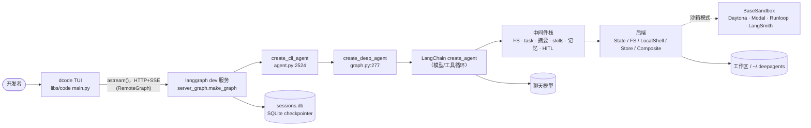
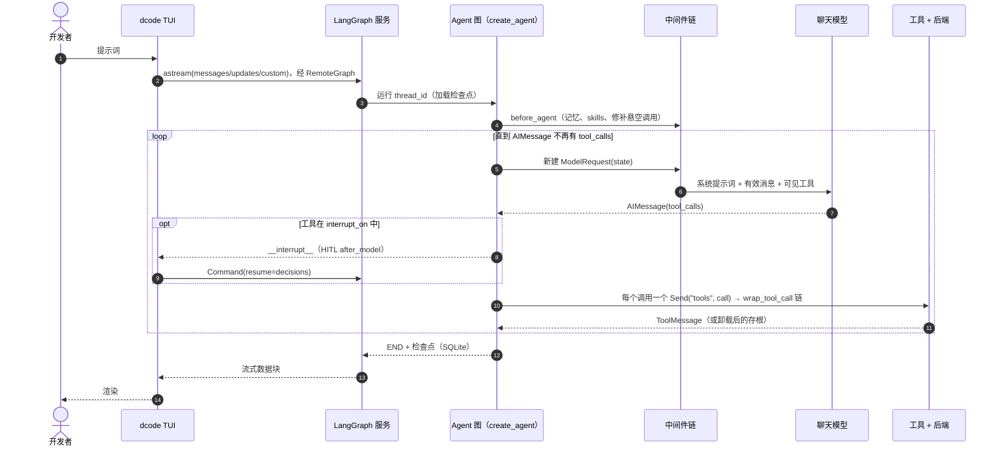
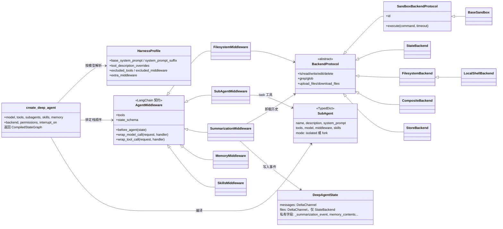
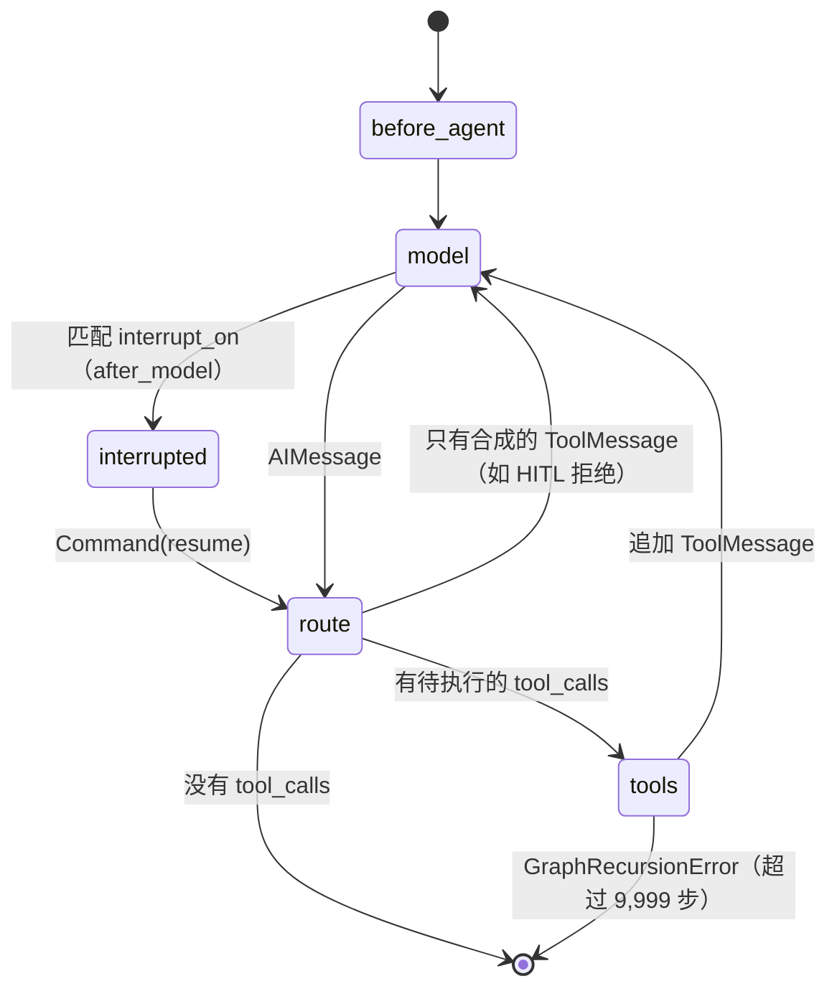
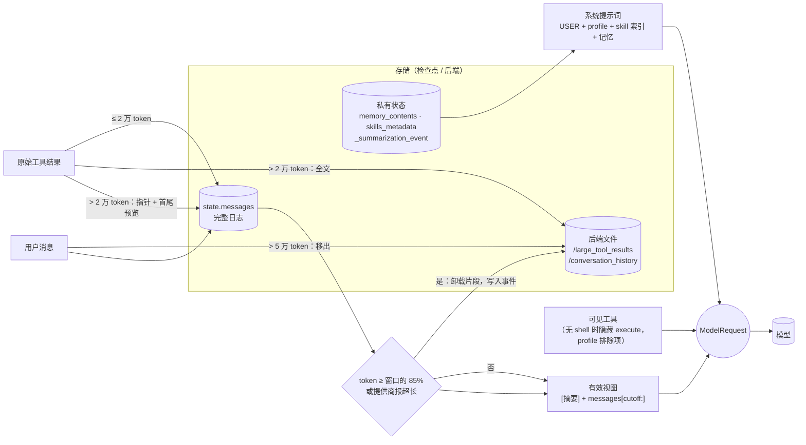
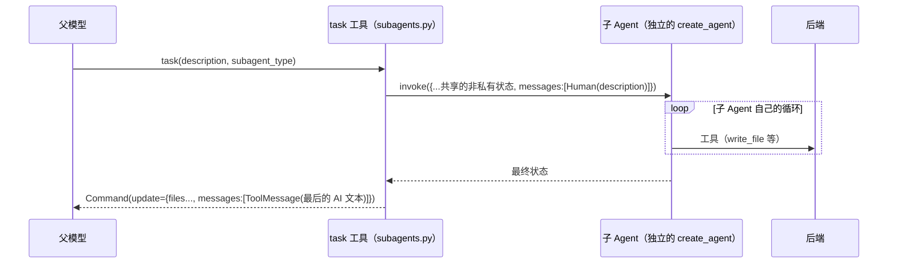

[English](deepagents.md) · **中文**

# deepagents（`langchain-ai/deepagents`）

> 研究基于提交 [`16e84d9`](https://github.com/langchain-ai/deepagents/tree/16e84d927e7e13c41a10c071380c875af6a562f5)
> （2026-10-06）：SDK `deepagents==0.7.22`，CLI `deepagents-code==0.1.81`。
> 下文的源码路径都相对于 monorepo 根目录，行号对应这个提交。
> **事实**指在源码中读到、经测试证实或在运行时观察到的内容；**解读**是我对作者意图的理解。

**交互式图表（Archify，每个节点都链接到源码）：**
[架构](../diagrams/deepagents/architecture.html) ·
[执行流程](../diagrams/deepagents/execution-flow.html) ·
[核心抽象](../diagrams/deepagents/core-abstractions.html) ·
[上下文流](../diagrams/deepagents/context-flow.html) ·
[记忆流](../diagrams/deepagents/memory-flow.html) ·
[工具运行时](../diagrams/deepagents/tool-runtime.html) ·
[Agent 循环](../diagrams/deepagents/agent-loop.html) ·
[子 Agent 流程](../diagrams/deepagents/sub-agent-flow.html)
（图表为英文，中英文版共用）

**最小复现：**[`experiments/deepagents/`](https://github.com/woaitqs/repo-research/tree/main/experiments/deepagents)（[中文说明](https://github.com/woaitqs/repo-research/blob/main/experiments/deepagents/README.zh.md)）

---

## 摘要（TL;DR）

- **deepagents 是一层 harness（外壳），不是运行时。** `create_deep_agent()` 构建一个有序的中间件列表和一个后端，
  然后把两者交给 LangChain 的 `create_agent()`（`libs/deepagents/deepagents/graph.py:989-1011`）。
  模型→工具的循环、状态、检查点、流式输出和中断，全部属于 LangChain 和 LangGraph。
- **每项能力都是中间件。** 三个钩子分别是 `before_agent`、`wrap_model_call` 和 `wrap_tool_call`。
  文件系统工具、子 Agent、摘要压缩、skills、记忆和人工审批（HITL）都以这种方式接入。从提交 `9340518` 起，`write_todos` 规划工具改为按需启用。
  `wrap_model_call` 改写的是*单次调用*的请求（提示词、消息、工具），不会碰存储的状态。
- **上下文工程是它的核心产品。** 有四个机制让提示词保持在上限之内：
  - 超过约 2 万 token 的工具结果写入 `/large_tool_results/<id>`，只在上下文中留下首尾预览；
  - 超过约 5 万 token 的用户输入也用同样的方式移出；
  - 摘要压缩是**非破坏性的**：它记录一个 `_summarization_event`，每次调用时重建视图，完整历史仍然留在状态和 `/conversation_history/*.md` 里；
  - 子 Agent 把上下文隔离开。
- **后端抽象决定文件放在哪里、有没有 shell。** 可选的有图状态、本地磁盘、LangGraph Store、远程沙箱，或在它们之间路由的组合后端。
  后端没有 shell 时，`execute` 工具对模型不可见。
- **记忆是显式的：** `AGENTS.md` 文件被注入系统提示词，由 Agent 通过 `edit_file` 自己修改。
  运行时已验证：记忆在**每个线程只加载一次**，线程中途做的修改要到新线程才会重新注入。
- **用真实模型检查过**（`deepseek-v4.1-flash`，3 轮）：模型会用 `grep` 和 `read_file` 顺着卸载指针取回数据，给子 Agent 写出自包含的任务说明，主动把用户偏好写进 `AGENTS.md`，并能回忆起已被摘要掉的事实。见[验证](#验证verification)。
- `dcode` CLI **不在**本进程内运行 Agent。它把 `langgraph dev` 作为子进程启动，
  通过 LangGraph 的 `RemoteGraph` 用 HTTP/SSE 与之流式通信。

## 为什么值得研究（Why This Repository Matters）

- 它把长时间运行的编码 Agent 中常见的许多模式（结果卸载、压缩、子 Agent 隔离、skills、AGENTS.md 记忆、HITL）
  做成了可组合、各自单独测试的单元，并建立在主流 Agent 框架之上。
- 提交历史体现了**由评测驱动的精简**。两个例子：
  - 提交 `a8d1b32`（#4859）删掉了作者手写的基础提示词和工具使用说明：
    *"The System Prompt Experiments found no arm statistically distinguishable, so parsimony argues for the leanest agent."*（系统提示词实验中没有哪个方案在统计上有显著差异，因此按简约原则选最精简的 Agent。）
  - 提交 `9340518`（#4929）把 `write_todos` 规划工具改为按需启用。
- 它是"自己造 Agent 循环"思路的一个有用反例：这个仓库几乎不掌握任何控制流，精力都花在请求塑形和存储上。

## 仓库概况（Repository Snapshot）

| 项目 | 值（事实） |
|---|---|
| 布局 | uv monorepo：`libs/deepagents`（SDK）、`libs/code`（`dcode` 终端 Agent）、`libs/acp`（Agent Client Protocol）、`libs/talon`（实验性的本地运行时宿主）、`libs/evals`、`libs/partners/{daytona,modal,runloop,vercel,quickjs}` |
| SDK 规模 | `libs/deepagents/deepagents/` 下约 2.96 万行 Python。最大的文件是 `middleware/filesystem.py`（3.7k 行）、`middleware/summarization.py`（2.3k 行）和 `backends/sandbox.py`（2.1k 行） |
| SDK 依赖 | `langchain>=1.4.3`、`langchain-core>=1.6.6`、`langchain-anthropic`、`langchain-google-genai`、`langsmith`、`wcmatch`（`libs/deepagents/pyproject.toml`） |
| 版本 | `.release-please-manifest.json`：deepagents 0.7.22、code 0.1.81、acp 0.0.12、talon 0.0.9 |
| 历史 | 4,146 个提交；首个提交在 2025-07-27 |
| 测试 | 在锁定的依赖环境下，3,251 个 SDK 单元测试全部通过（见[验证](#验证verification)） |

## 架构（Architecture）

分三层。源码文档这样写，调用关系也印证了这一点：

```text
Deep Agents   graph.py + middleware/ + backends/ + profiles/   （组装 + 请求塑形 + 存储）
LangChain     langchain.agents.create_agent                     （模型 -> 工具循环，中间件钩子协议）
LangGraph     Pregel 图、channel、checkpointer、Send、interrupt （运行时）
```



带源码链接的完整版：[architecture.html](../diagrams/deepagents/architecture.html)。

**模块边界（事实）：**

| 模块 | 负责 | 依赖 |
|---|---|---|
| `deepagents/graph.py` | 组装顺序、子 Agent 栈的构建、profile 的应用、提示词拼装 | middleware、backends、profiles、`langchain.agents.create_agent` |
| `deepagents/middleware/` | 所有请求时和工具执行时的行为 | `langchain.agents.middleware.types`、backends |
| `deepagents/backends/` | `BackendProtocol` 背后的文件存储与命令执行 | LangGraph 配置内部接口（`StateBackend`）、LangGraph Store（`StoreBackend`）、subprocess（`LocalShellBackend`） |
| `deepagents/profiles/` | 按提供商和模型调整 harness（提示词后缀、工具描述、排除的工具和中间件、额外中间件） | `_models.py` 里的模型识别辅助函数 |
| `libs/code` | CLI 交互、进程拓扑、沙箱提供方、HITL 策略、压缩交互、本地上下文、CLI 专属工具 | 锁定的 SDK `deepagents==0.7.22`、`langgraph-cli`、`langgraph-checkpoint-sqlite` |
| `libs/partners/*` | `BaseSandbox` 子类（例如 `class DaytonaSandbox(BaseSandbox)`，`libs/partners/daytona/langchain_daytona/sandbox.py:23`） | SDK 的 `backends.sandbox` |

## 主要执行流程（Main Execution Flow）

追踪的入口：一次交互式 `dcode` 对话轮次。只用 SDK 的路径（`create_deep_agent(...).invoke(...)`）从第 6 步起完全相同，只是在本进程内运行。



逐步说明（除非另有标注，每一步都是在源码中读到的事实）：

1. **控制台入口。** `dcode` 和 `deepagents-code` 都映射到 `deepagents_code:cli_main`
   （`libs/code/pyproject.toml:154-156`）。`cli_main` 定义在 `libs/code/deepagents_code/main.py:5294`。
   参数解析会在三种模式中选一种：交互式 TUI、无界面的 `-n`，或 `--acp`。
2. **启动服务进程。** TUI 调用 `start_server_and_get_agent`。它写出一个脚手架目录，其中 `langgraph.json` 指向
   `deepagents_code.server_graph:make_graph`（`client/launch/server.py:56`），然后启动
   `python -m langgraph_cli dev --host 127.0.0.1 ...`（`server.py:386-392`）。客户端是 `RemoteAgent`，
   注释原文为 *"Client that talks to a LangGraph server over HTTP+SSE"*（`client/remote_client.py:338-340`）。
   checkpointer 是 `AsyncSqliteSaver` 的子类，带线程归属锁（`client/launch/server_manager.py:121-164`，`thread_ownership.py:238-250`）。
   `--acp` 模式则在本进程内构建 Agent（`main.py:3626-3655`）。
3. **图工厂。** `make_graph`（`server_graph.py:1104`）解析模型，构建 CLI 工具
   （`fetch_url`、可选的 Tavily `web_search`、MCP 工具），并按需打开沙箱（`server_graph.py:497-503`）。
   然后调用 `create_cli_agent`（`server_graph.py:558-600` → `agent.py:2524`）。
4. **CLI 组装。** `create_cli_agent` 做了几项选择：
   - **后端：** `LocalShellBackend(root_dir=cwd, virtual_mode=False)`；禁用 shell 时用普通的 `FilesystemBackend`；或者使用沙箱
     （`agent.py:3112-3143`）。结果再包进一个 `CompositeBackend`，其中带一条持久化的 `conversation_history` 路由（`agent.py:3229-3297`）。
   - **记忆：** 基于用户级和项目级 `AGENTS.md` 的 `MemoryMiddleware`（`agent.py:3056-3093`）。
   - **Skills：** 一个 `SkillsMiddleware` 子类。
   - **HITL：** 针对 `execute`、`write_file`、`edit_file`、`delete`、`web_search`、`fetch_url`、`task` 以及异步任务工具的审批策略（`agent.py:2278-2372`）。
   - **调用：** `create_deep_agent(...)`（`agent.py:3649-3661`）。
5. **SDK 组装。** `create_deep_agent`（`libs/deepagents/deepagents/graph.py:277`）按以下顺序执行：
   - 解析模型和 harness profile（`:610-637`）；
   - 默认使用 `StateBackend()`（`:653`）；
   - 按 USER → profile BASE → profile SUFFIX 的顺序拼装作者编写的提示词（`:655-664`）；
   - 为每个声明式子 Agent 编译它自己的中间件栈（`:685-815`）；
   - 自动加入 `general-purpose` 子 Agent（`:817-886`）；
   - 构建主中间件栈（`:888-969`）；
   - 调用 `create_agent(...).with_config({"recursion_limit": 9_999, ...})`（`:989-1011`）。
6. **轮次开始。** TUI 调用 `agent.astream(stream_input, stream_mode=["messages","updates","custom"], subgraphs=True, durability="exit")`
   （`tui/textual_adapter.py:2171-2178`）。
7. **`before_agent` 节点（每次调用只执行一次）。** 这里运行三个中间件：
   - `PatchToolCallsMiddleware` 为每个没有结果的工具调用补一个报错的 `ToolMessage`（`middleware/patch_tool_calls.py:16-52`）；
   - `MemoryMiddleware` 把 `AGENTS.md` 加载到私有字段 `memory_contents`，已存在则跳过（`middleware/memory.py:279-311`）；
   - `SkillsMiddleware` 把 skill 的 frontmatter 加载到 `skills_metadata`（`middleware/skills.py:1074-1120`）。
8. **模型节点。** LangChain 的 `model_node`（外部依赖：`langchain/agents/factory.py`，langchain 1.4.3）每次都**新建**
   `ModelRequest(model, tools, system_message, messages=state["messages"], state, runtime)`，然后执行组合好的
   `wrap_model_call` 链。列表里的第一个中间件在最外层。主栈顺序：
   - `FilesystemMiddleware`：后端没有 shell 时去掉 `execute`，并移出过大的 `HumanMessage`（`filesystem.py:3194-3302`）；
   - `SubAgentMiddleware`；
   - `SummarizationMiddleware`：构建有效视图，必要时执行压缩（`summarization.py:1487-1623`）；
   - `PatchToolCalls`；
   - 调用方传入的中间件；
   - harness profile 的 `extra_middleware`；
   - Skills（提示词片段和受控工具的披露）；
   - 提示词缓存（Anthropic；安装了相应包时还有 Bedrock 和 Fireworks）；
   - Memory，追加 `<agent_memory>`；
   - HITL；
   - `UnsupportedContentMiddleware`；
   - `_ToolExclusionMiddleware`。

   最内层的处理函数绑定工具并调用 `model.invoke([system, *messages])`。
9. **HITL 关卡。** `HumanInTheLoopMiddleware.after_model` 对匹配的工具调用执行 `interrupt(...)`
   （外部依赖：`langchain/agents/middleware/human_in_the_loop.py:427`）。TUI 弹出 `ApprovalMenu`，然后用
   `Command(resume=resume_payload)` 恢复执行（`textual_adapter.py:4096`）。
10. **路由。** LangChain 的 `_make_model_to_tools_edge`（外部依赖，`factory.py:1991-2042`）处理四种情况：
    - 没有工具调用 → END；
    - 有待执行的调用 → `[Send("tools", [call]) for call in pending]`，因此多个工具调用并行执行；
    - 只有合成的结果（例如 HITL 拒绝）→ 回到模型；
    - 状态里设置了 `jump_to` 时，它优先于以上各种情况。
11. **工具节点。** 执行组合好的 `wrap_tool_call` 链。`FilesystemMiddleware.wrap_tool_call`
    （`filesystem.py:3682-3710`）做三件事：
    - 拒绝同一个 AIMessage 中对同一路径的第二次修改；
    - 执行工具；
    - 卸载过大的结果（`TOOLS_EXCLUDED_FROM_EVICTION` 中的工具除外）。

    `task` 工具会调用一个子 Agent 图（`subagents.py:810-838`）。
12. **观察结果。** `ToolMessage` 被归并进 `messages`。`DeltaChannel` 的 reducer 按 id 去重
    （`_messages_reducer.py`）。控制流回到第 8 步。
13. **结束。** 当最后一条 AIMessage 不含工具调用时，图执行结束。检查点被持久化（CLI 中是 SQLite），TUI 渲染流式数据。

交互式版本：[execution-flow.html](../diagrams/deepagents/execution-flow.html) 和 [agent-loop.html](../diagrams/deepagents/agent-loop.html)。

## 核心抽象（Core Abstractions）



交互式版本：[core-abstractions.html](../diagrams/deepagents/core-abstractions.html)。

### `create_deep_agent`（组装器）
- **职责：** 把声明式配置转换成一个有序的中间件栈和一个编译好的 LangChain Agent。
- **输入：** 模型（字符串或 `BaseChatModel`）、tools、`system_prompt`、`middleware`、`subagents`、`skills`、`memory`、`permissions`、`backend`、`interrupt_on`、`response_format`、`checkpointer`、`store`（`graph.py:277-297`）。
- **输出：** `CompiledStateGraph`，配置了 `recursion_limit=9_999` 和追踪元数据（`graph.py:1002-1011`）。
- **生命周期：** 只在构建时运行一次，执行期间从不运行。
- **依赖：** `resolve_model`、`_harness_profile_for_model`、所有中间件类、`create_agent`。
- **关键源码：** `graph.py:210-244`（`_apply_custom_middleware`：按 `.name` 原位替换；新条目插在核心栈之后、尾部之前）；`graph.py:247-262`（`_REQUIRED_MIDDLEWARE`：profile 不能排除 Filesystem 和 SubAgent）。
- **为什么存在：** 顺序本身就是产品，有几项行为只在特定位置才成立。Skills 必须在压缩之后、模型路由之后运行（`graph.py:404-411`）。Memory 追加在最后，位于提示词缓存之后。源码注释说 profile 中间件放在*"核心中间件和记忆之间，这样记忆更新（会改变系统提示词）不会让 Anthropic 的提示词缓存前缀失效"*（`graph.py:925-945`）。

### `AgentMiddleware`（LangChain 契约，deepagents 的每项功能都实现它）
- **职责：** 在循环的固定位置进行拦截。
- **输入与输出：** `before_agent(state) -> 状态更新`；`wrap_model_call(ModelRequest, handler) -> ModelResponse | ExtendedModelResponse(command=Command(update=...))`；`wrap_tool_call(ToolCallRequest, handler) -> ToolMessage | Command`；类属性 `tools` 和 `state_schema`。
- **生命周期：** 每次模型调用或工具调用都会触发钩子。`before_agent` 每次调用只执行一次。
- **关键源码：** `libs/deepagents/deepagents/middleware/__init__.py:1-50` 说明了为什么功能做成中间件而不是普通工具：普通工具*"只会被 LLM 调用，不能在调用 LLM 之前运行"*。
- **为什么存在：** 钩子让一项功能可以修改工具列表、注入提示词片段、改写消息视图、保存私有状态，这些都是工具函数做不到的。

### `BackendProtocol` / `SandboxBackendProtocol`
- **职责：** 把"文件放在哪里"与"模型看到哪些工具"分开。
- **输入与输出：** 绝对虚拟路径，返回 `ReadResult`、`WriteResult`、`GrepResult` 等（`backends/protocol.py:404-805`）。`execute(command, timeout) -> ExecuteResponse` 只存在于沙箱协议上（`:886-944`）。`delete` 是可选的，通过检测子类是否覆写来判断（`:985-1000`）。
- **实现（事实）：**
  - `StateBackend`：文件放在图状态里，通过 LangGraph 的 `CONFIG_KEY_SEND` 写入（`backends/state.py:38-119`）；
  - `FilesystemBackend`：本地磁盘，可选 `virtual_mode` 虚拟根目录；
  - `LocalShellBackend`：`FilesystemBackend` 加 `subprocess`，文档写明*"没有任何沙箱或隔离"*（`backends/local_shell.py:1-5`）；
  - `StoreBackend`：LangGraph 的 `BaseStore`，跨线程、带命名空间（`backends/store.py:90-97`）；
  - `CompositeBackend`：按最长前缀路由；`execute` 总是交给默认后端（`backends/composite.py:195-283, 814-850`）；
  - `BaseSandbox`：所有文件操作都用基于 `execute()` 的 shell 或 Python 脚本实现（`backends/sandbox.py:1-13, 1536-1569`）；
  - `ContextHubBackend`：一个 LangSmith Hub 仓库；
  - `LangSmithSandbox`。
- **生命周期：** 构建一次，由主 Agent、所有子 Agent、摘要压缩、记忆和 skills 共用（`graph.py:653, 718-726`）。
- **为什么存在：** 同一套工具代码（文件系统工具、结果卸载、记忆加载、历史卸载）因此可以运行在临时状态、磁盘、数据库或远程虚拟机上。

### `HarnessProfile` / `ProviderProfile`（模型抽象）
- **职责：**
  - `ProviderProfile` 调整*模型的构建*：OpenAI 默认用 Responses API；NVIDIA 和 OpenRouter 会带上来源标识请求头（`_models.py:36-58`，`profiles/provider/`）。
  - `HarnessProfile` 按模型调整 *harness*：提示词后缀、工具描述覆盖、排除的工具和中间件、额外中间件、general-purpose 子 Agent 的设置（`profiles/harness/harness_profiles.py:483`）。
- **查找顺序：** 先找精确的 `provider:model` 键，再找提供商的默认配置，最后用空 profile（`harness_profiles.py:1319-1387`）。内置 profile 通过显式 import 注册，第三方通过 entry point 注册（`profiles/_builtin_profiles.py:1-60`）。
- **例子（事实）：** Codex profile 重新加回 `TodoListMiddleware`，因为它的提示词引用了 `write_todos`（`profiles/harness/_openai_codex.py:60-88`）。Sonnet 4.6 的 profile 只追加了 Anthropic 公开发布的提示词片段（`_anthropic_sonnet_4_6.py`）。
- **为什么存在：** 模型之间的差异用配置数据来处理，代码里没有按模型分支的逻辑。

### `SubAgent` / `CompiledSubAgent` / `AsyncSubAgent`
- **职责：** 被委派的工作单元。
  - `SubAgent` 是声明式的，用它自己的 `create_agent` 编译（`subagents.py:72, 549-604`）。
  - `CompiledSubAgent` 是任何返回 `messages` 的 runnable（`:226`）。
  - `AsyncSubAgent` 是在后台运行的远程 Agent Protocol 图（`async_subagents.py:34`）。
- **生命周期：** 在构建时编译（`_build_task_tool` → `_compile_spec`，`subagents.py:684-715, 870-874`），每次 `task` 调用时执行。
- **为什么存在：** 隔离上下文、专门化分工；见[子 Agent / 工作流](#子-agent--工作流sub-agents--workflow)。

### `DeepAgentState`
- **职责：** 会被写入检查点的状态结构。
- **字段：**
  - `messages` 使用 `DeltaChannel` reducer，每 50 步做一次快照，*"把检查点的增长从 O(N²) 降到 O(N)"*（`graph.py:74-77`）；
  - 各中间件贡献的字段有 `files`（也是 `DeltaChannel`，`filesystem.py:1171-1176`）、`_summarization_event` 和 `_summarization_session_id`（`summarization.py:198-211`）、`memory_contents`、`skills_metadata` 和 `async_tasks`。
- **私有字段：** 标注了 `PrivateStateAttr` 的字段会被收集起来（`middleware/_state.py`，`graph.py:970-976`），在进出子 Agent 时剔除。
- **为什么存在：** 只有当不断增长的日志的检查点仍然便宜时，保留完整历史的非破坏式设计才可行。

## Agent 循环（Agent Loop）

**事实：** deepagents 自己没有循环代码，循环就是 LangChain 编译出的图：

```text
START → [before_agent 节点] → model ⇄ tools → [after_agent 节点] → END
```

- `model` 和 `tools` 是 LangGraph 节点。`before_model`/`after_model` 钩子是额外的节点，`wrap_*` 钩子则在节点*内部*运行。
- **退出条件：** 最后一条 `AIMessage` 没有工具调用（`factory.py:2016-2019`）。
- **并行：** 每个待执行的调用对应一个 `Send`（`factory.py:2031-2032`）。
- **约束：** 用 `recursion_limit=9_999`（`graph.py:1004`）而不是轮次计数器。上下文大小靠摘要压缩来控制，而不是靠限制步数。
- **自我修复：** `PatchToolCallsMiddleware`（`patch_tool_calls.py`）修补因中断或崩溃而留下未应答工具调用的历史。没有它，下一次请求模型提供商会被拒绝。
- **可选的质量循环：** `RubricMiddleware`（`middleware/rubric.py:1-10`）拦截"完成"：一个打分子 Agent 可以注入反馈并让循环继续，最多 `max_iterations` 次。



## 上下文工程（Context Engineering）

上下文工程是这个仓库最主要的架构关注点。下面每个回答都有源码依据；标注"探针"的，还用真实 SDK 在运行时验证过。



交互式版本：[context-flow.html](../diagrams/deepagents/context-flow.html)。

1. **上下文如何构建。** 每次调用时由 `wrap_model_call` 链从状态重新构建。除了模型提供商的提示词缓存，调用之间不缓存任何东西（顺序见 `graph.py:888-969`；请求由 LangChain 的 `model_node` 构建）。
2. **哪些内容进入模型上下文：**
   - 作者编写的系统提示词（USER → profile BASE → SUFFIX，`graph.py:655-664`）；
   - 中间件追加的 Skills、Memory 片段，以及文件系统的宿主路径映射片段；
   - 有效消息视图；
   - 可见工具的 schema。

   内置的工具使用说明被有意**排除**了，因为它和工具 schema 重复（提交 `a8d1b32`；注释见 `graph.py:666-673`）。
3. **哪些内容被排除：**
   - skill 的正文，直到模型主动读取；
   - 超过 2 万 token 的工具结果和超过 5 万 token 的 `HumanMessage`（`filesystem.py:1771-1772`）；
   - 已被摘要掉的片段；
   - 后端没有 shell 时的 `execute` 工具（`filesystem.py:3194-3240`）；
   - `excluded_tools` 中列出的工具（`_tool_exclusion.py`）；
   - 模型不支持的内容块（`unsupported_content.py`）；
   - 子 Agent 的对话记录。
4. **工具结果如何处理。** 结果直接放进 `ToolMessage`，除非它超过 `4 × 20,000` 个字符，且所属工具不在排除名单里。
   被排除的工具有：`ls/glob/grep`（它们会自行截断，而截断意味着"该缩小查询范围"）、`read_file`（重读一个被卸载的读取结果没有帮助），以及 `write/edit/delete`（输出很小）（`filesystem.py:1601-1630`）。
   工具错误以 `ToolMessage(status="error")` 的形式作为观察结果返回，而不是抛出异常（`filesystem.py:193-195`；`execute` 的参数校验见 `:3001-3060`）。
5. **截断与卸载。** 两者都有，而且都可以找回原文（代码见本节末尾）：
   - **大结果**（`_message_eviction.py:260-284`）：写入 `/large_tool_results/<tool_call_id>`，替换为带行号的**前 5 行 / 后 5 行**预览、一个 `... [N lines truncated] ...` 标记和分页读取说明。
     探针 P3：一个 169,889 字符的结果到模型那里只剩一个 1,812 字符的存根。
   - **大的用户输入：** 写入 `/conversation_history/<uuid>.md`，并给消息打上 `lc_evicted_to` 标签。状态里保留全文，只有发给模型的请求副本被截断（`filesystem.py:3435-3538`）。
   - **沙箱里的 `execute`：** "源头捕获"可以把大输出留在沙箱内，只返回预览（`sandbox.py:1340-1410, 1589-1625`）。它按沙箱类逐个启用（默认 `enable_capture_offload = False`，`sandbox.py:1558`）。
   - **较早的工具调用参数**（例如 `write_file` 的内容）会在完整摘要压缩触发之前先被裁剪（`TruncateArgsSettings`，`summarization.py:168-196`）。
6. **摘要压缩。** 有，而且是非破坏性的（`summarization.py:1487-1623`）：
   - 在达到 `max_input_tokens` 的 85% 时触发，保留 10%；模型 profile 未知时，改用 17 万 token / 6 条消息（`:262-299`）；
   - 选择一个不会把 AIMessage 和它的 ToolMessage 拆开的切分点（LangChain 的 `_find_safe_cutoff_point`）；
   - 把被移出的片段追加到 `/conversation_history/<session>.md`；
   - 请模型生成摘要，并把 `{cutoff_index, summary_message, file_path}` 存为 `_summarization_event`；
   - 之后每次调用看到的都是 `[摘要] + messages[cutoff:]`（`:821-858`）。

   多次连续压缩时，会把索引换算到原始状态列表上（`:860-886`）。遇到提供商的 `ContextOverflowError` 时，它先摘要，再裁剪末尾那批 ToolMessage，然后用严格更小的请求**最多重试一次**；如果输入无法再缩小就直接抛错（`:1395-1454`；测试见 `test_compaction_recovery.py`）。
   探针 P5：状态保留了 44 条消息，模型只看到 6 条。
7. **仓库上下文。** 不建索引，SDK 里没有 embedding 或检索层。Agent 用 `ls/glob/grep/read_file` 自行探索。`read_file` 默认读 100 行（`filesystem.py:951-952`），`grep` 按字面匹配，最多返回 1,000 条（`:1774`）。
   CLI 通过 `LocalContextMiddleware`（`libs/code/deepagents_code/local_context.py:718`）一次性注入本地上下文：git 状态、语言、测试命令、`tree -L 3` 的输出。发生摘要压缩后，只有当这些上下文变化时才发送刷新消息（`:826-834`）。
8. **子 Agent 如何获得上下文。**
   - 隔离模式：`messages=[HumanMessage(description)]`，外加父 Agent 中非消息、非私有的状态（`subagents.py:776-808`）。
   - `mode="fork"`（测试阶段）：父 Agent 的**有效**消息（已经过摘要），再加一段禁止继续委派的前言（`subagents.py:363-390`）。
   - 探针 P4：子 Agent 的第一次请求恰好是 `[SystemMessage, HumanMessage("Write a short report to /report.md")]`。
9. **上下文隔离如何实现。**
   - 父 Agent 只收到子 Agent 最后一条非空 AI 文本，作为一条 `ToolMessage`（`subagents.py:721-759`）。
   - `_EXCLUDED_STATE_KEYS`（`messages`、`todos`、`structured_response`、`skills_metadata` 等）和所有 `PrivateStateAttr` 字段在进出时都不会传递（`:398-422`）。
   - 子 Agent 没有 `task` 工具，所以委派不会递归。探针 P4 确认子 Agent 的工具列表里没有 `task`。
10. **长时间任务中如何控制上下文大小。** 四个机制配合：
    - 每次工具调用时主动卸载；
    - 在更低阈值上裁剪工具参数；
    - 达到 85% 时摘要压缩；
    - 被动的超长恢复。

    `DeltaChannel` 让检查点的增长保持线性。**解读：** 这个设计把提示词当作持久状态之上的缓存，每次移出内容都会留下一个模型能顺着找回去的指针。

第 5 点中的卸载路径，简化自 `filesystem.py` 和 `_message_eviction.py`：

```python
# filesystem.py:3682-3710（简化）
def wrap_tool_call(self, request, handler):
    if error := _parallel_file_mutation_error(request):   # 同一轮中两次修改同一路径
        return error
    result = handler(request)
    if request.tool_call["name"] in TOOLS_EXCLUDED_FROM_EVICTION:
        return result
    return self._intercept_large_tool_result(result)      # > 4 * 20_000 字符 -> 写入后端文件 + 预览存根
```

## 记忆（Memory）

| 概念 | 在这里指什么 | 存放位置 | 作用域 | 写入方 | 读取方 |
|---|---|---|---|---|---|
| **对话历史** | `state["messages"]`，完整日志（摘要压缩从不改写它） | LangGraph 检查点；CLI 用 `~/.deepagents/.state/sessions.db`（SQLite） | 线程 | 图节点 | 模型节点（以有效视图的形式） |
| **上下文** | 一个 `ModelRequest`：系统提示词 + 有效消息 + 工具 schema | 只在内存中，每次调用重建 | 一次模型调用 | `wrap_model_call` 链 | 模型 |
| **持久记忆** | `AGENTS.md` 文件 | 后端文件：CLI 中是 `~/.deepagents/<agent>/AGENTS.md`，加上项目的 `AGENTS.md` / `.deepagents/AGENTS.md`（`libs/code/deepagents_code/agent.py:3056-3063`，`_paths.py:295-297`，`project_utils.py:151-175`） | 用户 / Agent 配置 / 项目 | **Agent 自己通过 `edit_file` 写入**，或者由用户写入 | `MemoryMiddleware.before_agent` |
| **外部存储** | 卸载的结果、历史归档、工作区文件、Store 命名空间 | 后端：磁盘、状态、`StoreBackend`（跨线程）、`ContextHubBackend`（LangSmith Hub 仓库）、沙箱 | 可按路由配置 | 工具和中间件 | Agent 需要时通过 `read_file` 读取 |

交互式版本：[memory-flow.html](../diagrams/deepagents/memory-flow.html)。

- **记忆是显式的，不是隐式的。** 没有自动抽取，也没有向量库。记忆提示词告诉模型什么时候用 `edit_file` 保存学到的东西，以及哪些内容绝不能保存，例如凭据（`middleware/memory.py:105-171`）。
- **进入上下文：** `memory_contents` 被格式化成 `<agent_memory>…</agent_memory>`，每次调用都追加到系统提示词（`memory.py:347-383`）。对 Anthropic 模型会加一个 `cache_control` 断点。HTML 注释会先被去掉。
- **读取：** `before_agent` 把每个来源下载一次。缺失的文件会被跳过，其他错误直接抛出（`memory.py:279-311`）。
- **更新与过期（事实，已在运行时验证）：** 当状态里已有 `memory_contents` 时跳过加载（`memory.py:294`），而这个字段随线程一起被写入检查点。**线程中途做的修改要到新线程才会重新注入。**
  探针 P6：`edit_file` 把文件改成 "likes rust" 之后，下一轮的系统提示词仍然写着 "likes python"。我在 SDK 里没找到任何让缓存失效的路径。
  唯一的缓解措施在提示词里：记忆*"可能已过时……以用户和经过验证的证据为准"*（`memory.py:113-116`）。
- **信任：** 记忆被定位为数据而不是指令（`memory.py:113-116`）。CLI 拒绝指向项目根目录之外的项目级 `AGENTS.md` 符号链接（`project_utils.py:151-175`），并保护一个由程序管理的区块（`ManagedMemoryGuardMiddleware`，`agent.py:3085-3093`）。
- **Skills 是渐进披露的程序性记忆：**
  - 只有 `SKILL.md` frontmatter 里的 `name`、`description` 和路径进入提示词（`skills.py:797-838`）；
  - 正文用 `read_file` 读取；
  - skill 在 `metadata.include_tools` 中列出的工具，只有在它的 `SKILL.md` 被读取之后才会披露给模型（`_skill_tools.py:1-60`，提交 `92cd8e7`）；
  - 后面的 skill 来源会覆盖前面的（后者优先）。

## 工具（Tools）

- **接口：** LangChain 的 `BaseTool` / 可调用对象。模型看到的是名称、描述和 JSON schema。有两条注册路径（`middleware/__init__.py:1-50`）：
  - 中间件的 `.tools`（文件系统工具、`task`、异步任务工具、`compact_conversation`、skill 披露的工具）；
  - 调用方传入的 `tools=`（CLI 中是 `fetch_url`、`web_search`、MCP 工具）。
- **内置工具：** `ls`、`read_file`、`write_file`、`edit_file`、`delete`、`glob`、`grep`，后端支持时还有 `execute`（`filesystem.py:1893-1906`）；另有 `task`。从 `9340518` 起，`write_todos` 改为**按需启用**，Codex profile 会把它加回来。
- **发现：** 每个 Agent 的工具是静态的，但每次调用都会过滤：
  - `FilesystemMiddleware` 去掉后端不支持的能力对应的工具（`filesystem.py:3194-3213`）；
  - `_ToolExclusionMiddleware` 在请求和执行两个边界上应用 profile 的排除项（`_tool_exclusion.py`）；
  - `SkillsMiddleware` 在对应的 `SKILL.md` 被读取后加入受控工具。
- **调用：** LangGraph 的 `ToolNode` 通过 `Send` 执行每个调用，外面包着组合好的 `wrap_tool_call` 链。`ToolRuntime` 会向需要的工具（例如 `task`）注入 `state`、`tool_call_id` 和配置。
- **结果处理：** 见[上下文工程](#上下文工程context-engineering)第 4–5 点。
- **错误处理：** 对于用户可纠正的错误（超时参数不对、文件不存在、权限被拒、子 Agent 类型未知），工具返回 `status="error"` 的 `ToolMessage`。例如：
  - `TaskToolSchema` 拒绝未知的参数键，因为模型会把真正的指令放进一个自己编的 `prompt` 键里（`subagents.py:441-464`）；
  - 工具代码本身抛出的异常*"按设计不做处理"*，直接向上传播（`filesystem.py:3696-3699`）。
- **重试：** SDK 在工具层没有重试。CLI 为模型节点加了 `CodeModelRetryMiddleware`（来自 CLI 追踪的结论，没有逐行核实）。
- **权限：** `FilesystemPermission(operations, paths, mode=allow|deny|interrupt)`，按顺序第一条匹配的规则生效，在内置文件系统工具内部执行（`filesystem.py:366-412`）。
  - `interrupt` 规则会被编译成带 `when` 判断条件的 `HumanInTheLoopMiddleware` 配置（`_fs_interrupt.py:156-183`）。
  - 权限规则和能执行命令的后端同时使用时，除非每条规则都限定在路由范围内，否则会抛出 `NotImplementedError`（`filesystem.py:1849-1856`），因为 shell 可以绕过路径规则。
- **MCP：** 只在 CLI 层（MCP 工具作为普通工具传入）。SDK 里没有 MCP 专用代码。

## 运行时 / 沙箱（Runtime / Sandbox）

**推理与执行的边界在哪里（事实）。**
模型只发出 `tool_calls`、读取 `ToolMessage`。执行发生在中间件拥有的工具函数里，它们把 I/O 委托给后端。
因此边界就是 `BackendProtocol` 接口。策略关卡（HITL、权限、修改冲突检查）位于模型和这个接口之间。
交互式版本：[tool-runtime.html](../diagrams/deepagents/tool-runtime.html)。

| 运行时 | 隔离程度 | 源码 |
|---|---|---|
| `StateBackend`（默认） | 没有 shell；文件放在会写入检查点的状态里 | `backends/state.py` |
| `FilesystemBackend(virtual_mode=True)` | 阻止越出 `root_dir` 的路径；但不是进程级沙箱 | `backends/filesystem.py:132-136, 182-260` |
| `LocalShellBackend` | **没有**隔离：以用户权限执行任意命令。文档写明开启 shell 后 `virtual_mode`*"不提供任何安全性"* | `backends/local_shell.py` |
| `BaseSandbox` 的子类（Daytona、Modal、Runloop、Vercel、LangSmith，以及 CLI 中的 AgentCore） | 远程虚拟机或容器就是隔离边界 | `backends/sandbox.py:1536`，`libs/partners/*`，`libs/code/.../sandbox_registry.py:334-348` |

- **`BaseSandbox` 的设计：** 子类只需实现 `execute`、`upload_files`、`download_files` 和 `id`。`ls/read/grep/glob/edit` 都建立在 `execute()` 之上，用内嵌的 `python3 -c` 和 POSIX shell 脚本实现（`sandbox.py:1-13`）。一个很小的原语就能让任何带 shell 的虚拟机成为完整的后端。
- **shell 超时：** 每次调用的 `timeout` 会对照 `max_execute_timeout` 校验（默认 3600 秒，`filesystem.py:1773`）。`LocalShellBackend` 默认 120 秒，输出上限 100 kB（`local_shell.py`）。
- **CLI 策略：** 本地模式下，`execute`、`write_file`、`edit_file` 以及第 4 步列出的其他工具都需要 HITL 审批，除非用户选择自动批准或 YOLO 模式，或者用 shell 白名单代替 HITL（`agent.py:2278-2391`）。在 `--sandbox` 模式下，auto 模式会被强制改为 manual（来自 CLI 追踪的结论）。
- **网络与浏览器：** SDK 没有浏览器运行时。网络访问取决于后端 shell 允许什么，外加 CLI 工具（`fetch_url`、Tavily 搜索）。

## 子 Agent / 工作流（Sub-Agents / Workflow）



交互式版本：[sub-agent-flow.html](../diagrams/deepagents/sub-agent-flow.html)。

- **注册：** `general-purpose` 会被自动加入，使用父 Agent 的工具、模型和 skills，除非被覆盖或被 profile 禁用（`graph.py:817-886`；`subagents.py:495-501`）。自定义子 Agent 的中间件依次是 Filesystem → Summarization → PatchToolCalls → 它自己的中间件 → profile 中间件 → Skills → 缓存（`graph.py:714-778`）。它们**没有** `SubAgentMiddleware`。
- **并行：** `task` 的工具描述告诉模型*"任务彼此独立时，在一条消息里发出多个工具调用，同时启动多个 Agent"*（`subagents.py:467-478`）。LangGraph 的 `Send` 扇出让它们并行运行。测试覆盖了兄弟子 Agent 之间的私有状态隔离（`tests/unit_tests/test_subagents.py:332`）。
- **状态回写（事实，外加探针 P7 发现的一个边界情况）：**
  - 子 Agent 中未被排除的状态字段会通过 `Command` 更新返回（`subagents.py:731`）；
  - 使用 `StateBackend` 时，子 Agent 写的文件会出现在父 Agent 里（探针 P4）；
  - **子 Agent 删除的文件会在父 Agent 里重新出现**：子 Agent 的工具返回了 `Deleted /old.md`，但 `/old.md` 仍留在父 Agent 的 `files` 里。原因是子 Agent 返回的是完整的 `files` 字典，被删的键只是不存在，而不是一个 `None` 删除标记，父 Agent 的合并 reducer 于是保留了旧条目。

  **解读：** 这是一个只影响 `StateBackend` 的小正确性缺口。使用磁盘或沙箱后端时，删除发生在真实的文件系统上。
- **异步子 Agent：** `start/check/update/cancel/list_async_task` 工具通过 LangGraph SDK 驱动远程 Agent Protocol 图（`threads.create` + `runs.create`，`async_subagents.py:245-340`）。任务记录放在 `async_tasks` 状态里。这类子 Agent 不继承顶层的 `interrupt_on`。
- **工作流与编排：** 没有 DAG 或工作流引擎，编排由模型通过 `task` 调用驱动。可选的例外是 `RubricMiddleware` 的"打分—修改"循环和异步任务工具。

## 重要源码文件（Important Source Files）

| 文件 | 为什么要读 |
|---|---|
| `libs/deepagents/deepagents/graph.py` | 完整的组装顺序；子 Agent 栈；提示词拼装；必需的中间件 |
| `libs/deepagents/deepagents/middleware/__init__.py` | "中间件还是工具"的简短论证 |
| `libs/deepagents/deepagents/middleware/filesystem.py` | 工具、按能力过滤、权限、大结果与大输入的移出、修改冲突检查 |
| `libs/deepagents/deepagents/middleware/_message_eviction.py`、`_overflow_clip.py` | 预览存根；超长时的尾部裁剪 |
| `libs/deepagents/deepagents/middleware/summarization.py` | 非破坏性压缩、历史卸载、超长恢复、`compact_conversation` 工具 |
| `libs/deepagents/deepagents/middleware/subagents.py` | `task` 工具、隔离规则、fork 模式 |
| `libs/deepagents/deepagents/middleware/memory.py`、`skills.py`、`_skill_tools.py` | 记忆注入；skills 及其工具的渐进披露 |
| `libs/deepagents/deepagents/backends/{protocol,state,composite,sandbox,local_shell}.py` | 存储/执行抽象，以及隔离方面的设计 |
| `libs/deepagents/deepagents/profiles/harness/harness_profiles.py` | 按模型的 harness 配置 |
| `libs/deepagents/deepagents/_messages_reducer.py` | 让永不截断的日志也能以 O(N) 写入检查点 |
| `libs/code/deepagents_code/agent.py`（`create_cli_agent`） | 一个真实产品如何配置这个 SDK |
| `libs/code/deepagents_code/client/launch/server.py`、`client/remote_client.py` | 客户端/服务端的进程拆分 |
| `langchain/agents/factory.py`（外部依赖，langchain 1.4.3） | 真正的循环：`model_node`、`_make_model_to_tools_edge` |

## 值得借鉴的 5+ 个实现决策（5+ Implementation Decisions Worth Learning From）

### 1. 把 harness 做成别人循环上的有序中间件
- **做法：** `create_deep_agent` 构建 `[Filesystem, SubAgent, Summarization, PatchToolCalls, *caller, *profile, Skills, caching, Memory, HITL, UnsupportedContent, ToolExclusion]`，然后调用 `create_agent`（`graph.py:888-1011`）。
  调用方的中间件按 `.name` 原位替换内置中间件（`graph.py:210-244`）。核心脚手架不能被排除（`graph.py:247-262`）。
  CLI 就用这个机制把自己的压缩中间件换进摘要压缩的位置：`CLICompactionMiddleware.name` 返回 `"SummarizationMiddleware"`（`libs/code/deepagents_code/offload_middleware.py:1017, 1057-1060`）。
- **解决的问题：** 许多相互正交的关注点（工具、提示词片段、压缩、审批）都要作用于每次模型调用，而又不想分叉出自己的循环。
- **有意思的地方：** 几乎不掌握控制流，持久化、流式输出和中断都由 LangGraph 免费提供。按名称替换让默认实现可以被覆盖，不需要插件系统。
- **权衡：**
  - 顺序带有语义，文档字符串为此写了约 40 行（`graph.py:372-427`）。
  - 调试时需要知道运行的是四种栈中的哪一种（主 Agent、声明式子 Agent、编译好的子 Agent、异步子 Agent）。
  - 存在隐式耦合：一项功能可能依赖于在压缩之后运行。
- **源码位置：** `graph.py`、`middleware/__init__.py`。
- **可复用之处：** 定义一个三钩子契约（`before_run`、`wrap_model_call`、`wrap_tool_call`），把功能组装成一个有序、可按名称替换的列表，并把少数承重的中间件标为不可移除。

### 2. 非破坏性压缩：记录事件，重建视图
- **做法：** `SummarizationMiddleware` 从不改写 `state["messages"]`。它保存 `_summarization_event = {cutoff_index, summary_message, file_path}`，每次调用时计算 `[摘要] + messages[cutoff:]`（`summarization.py:821-858, 1487-1623`）。
  被移出的片段追加到 `/conversation_history/<session>.md`，摘要消息里带着指向它的路径（`:772-803`）。
  工厂函数的文档字符串把这一点和 LangChain 的版本做了对比，后者会*"用 RemoveMessage(id=REMOVE_ALL_MESSAGES) 改写消息"*（`:1802-1807`）。
- **解决的问题：** 压缩通常会不可逆地丢失信息，破坏重放、评测和共享状态。
- **有意思的地方：** 提示词变成了只追加日志之上的一个视图，每个摘要都带着找回原文的指针。
- **权衡：**
  - 状态会无限增长，靠 `DeltaChannel` 检查点来负担这部分开销（`graph.py:74-77`）。
  - 连续多次压缩需要做索引换算（`:860-886`）。
  - 每次调用都要计算 token。
  - 保留窗口必须明显小于触发阈值。我的复现显示，`保留量 ≥ 触发阈值`时每次调用都会重新摘要。
- **源码位置：** `middleware/summarization.py`；测试 `tests/unit_tests/middleware/test_summarization_middleware.py`、`test_compaction_recovery.py`。
- **可复用之处：** 原始对话记录只追加；把压缩存为元数据，按需渲染模型视图；永远把被移出的片段写到 Agent 读得到的地方。

### 3. 把文件系统当作上下文的溢出阀
- **做法：** 超过 2 万 token 的工具结果和超过 5 万 token 的用户消息被写入后端，替换为带分页读取说明的首尾预览（`filesystem.py:3359-3433, 3509-3538`；`_message_eviction.py:115-284`）。
  排除名单是刻意挑选的：会自行截断的 grep 和 glob 输出，应该促使模型缩小查询范围，而不是被卸载（`filesystem.py:1601-1630`）。
  沙箱可以在源头捕获输出，让大输出根本不经过网络（`sandbox.py:1340-1410`）。
- **解决的问题：** 一次 `cat` 或一次测试运行就可能撑爆上下文窗口。
- **有意思的地方：** 它复用 Agent 已有的工具（`read_file`、`grep`）作为检索机制，不需要新的"记忆 API"。
- **权衡：** 要靠模型自己决定去分页读取；预览可能藏住了中间的关键部分；卸载的文件会在存储中不断累积。
- **源码位置：** `middleware/filesystem.py`、`middleware/_message_eviction.py`、`backends/sandbox.py`。
- **可复用之处：** 给每个观察结果设上限，把完整内容存到以 `tool_call_id` 为键的确定路径下，并展示首尾内容和准确的分页读取说明。

### 4. 统一的存储抽象，按能力过滤工具
- **做法：** 所有文件 I/O 都经过 `BackendProtocol`。`execute` 只存在于 `SandboxBackendProtocol` 上。
  后端不支持时，`FilesystemMiddleware` 从请求中去掉 `execute`（以及 `delete`）（`filesystem.py:3194-3240`）。探针 P2 确认使用 `StateBackend` 时没有 `execute`。
  `CompositeBackend` 按最长前缀路由，但 `execute` 交给默认后端（`composite.py:195-283, 814-850`）。
  `StateBackend` 通过 LangGraph 的 `CONFIG_KEY_SEND` 写入图状态，同一步内可以读到自己刚写的内容（`state.py:81-119`）。
- **解决的问题：** 同一个 Agent 需要不改代码就能运行在临时状态（测试、SaaS）、本地磁盘（CLI）和远程虚拟机（生产环境）上。
- **有意思的地方：** 模型永远看不到一个注定失败的工具，存储选择变成了部署配置。
- **权衡：**
  - `StateBackend` 导入了私有 API `langgraph._internal._constants`。
  - 权限在工具里执行，而不在后端：*"直接使用后端时目前不会应用 permissions"*（`graph.py:501-504`）。
  - 路径路由约束不了 shell。
- **源码位置：** `backends/`、`middleware/filesystem.py`。
- **可复用之处：** 把运行环境建模成按能力分类的接口，每次请求时根据能力推导出可见的工具列表。

### 5. 子 Agent 作为一个工具，并隔离上下文
- **做法：** 只有一个 `task(description, subagent_type)` 工具。
  - 子 Agent 从 `[HumanMessage(description)]` 加上共享的非私有状态开始。
  - 它只返回最后一条非空 AI 文本，或者序列化成 JSON 的结构化结果（`subagents.py:721-838`）。
  - 未知的参数键会被拒绝，指令无法藏在自编的字段里（`:441-464`）。
  - 子 Agent 不能继续委派。
  - 测试阶段的 `mode="fork"` 把父 Agent 摘要后的历史交给子 Agent（`:363-390`）。
- **解决的问题：** 探索性工作（搜索、读大量文件）会污染父 Agent 的上下文；长任务也能从并行的独立工作者中受益。
- **有意思的地方：** 隔离是在结构上强制实现的（状态过滤、私有字段、禁止递归），而不是靠提示词。
- **权衡：** 父 Agent 必须写出完整的任务说明；子 Agent 的工作过程对父 Agent 不可见（只在追踪中可见）；探针 P7 发现了删除不回传的缺口；每个子 Agent 都要重复承担系统提示词和工具 schema 的开销。
- **源码位置：** `middleware/subagents.py`；测试 `tests/unit_tests/test_subagents.py`（例如 `:130`、`:332`、`:415`）。
- **可复用之处：** 把委派做成一个工具，输入是自包含的任务说明，输出是一份报告；进出时剔除历史和私有状态。

### 6. 记忆即可编辑的文件，并注入提示词
- **做法：** `AGENTS.md` 来源被一次性加载到私有状态，每次调用都追加到系统提示词（`memory.py:279-383`）。Agent 用普通的 `edit_file` 更新记忆。记忆提示词把这些内容定位为可能过时的数据，并列出绝不能保存的内容（`memory.py:105-171`）。
- **解决的问题：** 不需要额外基础设施就能跨会话学习，而且记忆对人来说可查看、可 diff。
- **有意思的地方：** 它复用文件系统工具，而"记忆是数据不是指令"的定位，应对的是借记忆注入恶意提示词的风险。
- **权衡：** 同一线程内会过期（探针 P6）；没有检索或筛选，整份文件都被注入；质量取决于模型是否主动写入；提示词会随记忆增长。
- **源码位置：** `middleware/memory.py`；CLI 的接线在 `agent.py:3056-3093`。
- **可复用之处：** 先用 Agent 可编辑的普通文件加上提示词定位。如果按会话缓存记忆，就要在记忆路径被写入时让缓存失效，这正是这个设计留下的缺口。

### 7. 由评测驱动的提示词精简，规划改为按需启用
- **做法：** 删掉了作者手写的基础提示词和内置的工具使用说明（提交 `a8d1b32`：*"没有哪个方案在统计上有显著差异，因此按简约原则选最精简的 Agent"*），并把 `TodoListMiddleware` 改为按需启用（提交 `9340518`）。针对特定模型的指导移到了 harness profile 里（`profiles/harness/_*.py`）。
- **解决的问题：** 提示词膨胀：和工具 schema 重复、消耗 token，还会和工具的实际行为渐渐脱节。
- **有意思的地方：** 这些决定是靠测量做出的，旧提示词仍然可以通过一个弃用兼容层取到（`graph.py:125-141`）。
- **权衡：** 较弱的模型可能需要更多引导，这部分被推给了 profile；行为更依赖工具描述的质量。
- **源码位置：** `graph.py:666-673`；`profiles/`；提交历史。
- **可复用之处：** 把每段提示词都当作需要评测验证的假设，把针对模型的调优放进数据。

### 8. 防御性的历史修复，以及考虑缓存的排序
- **做法：**
  - `PatchToolCallsMiddleware` 在每次运行前为悬空或无效的工具调用补上结果（`patch_tool_calls.py:16-52`）。
  - 同路径修改冲突检查拒绝同一轮中相互竞争的编辑（`filesystem.py:198-224`）。
  - 超长恢复最多只发一次严格更小的重试（`summarization.py:1415-1454`）。
  - 最可能变化的提示词片段 Memory 被追加在最后，profile 中间件放在*"核心中间件和记忆之间，这样记忆更新（会改变系统提示词）不会让 Anthropic 的提示词缓存前缀失效"*（`graph.py:925-927`）。
  - CLI 只在本地上下文变化时才重新发送它（`local_context.py:826-834`）。
- **解决的问题：** 被中断的运行、并行工具调用和提供商的限制，会造成无效的对话记录、重试风暴和缓存未命中。
- **可复用之处：** 每次运行前检查每个工具调用是否都有结果；拒绝相互冲突的并行写入；限制恢复重试的次数；按从最稳定到最易变的顺序排列提示词片段。

## 最小复现（Minimal Reproduction）

[`experiments/deepagents/`](https://github.com/woaitqs/repo-research/tree/main/experiments/deepagents) 是一个只依赖标准库的 Python 包 `minideep`，约 1,200 行。它复现的是**架构**：一个普通循环 + 有序中间件 + 可插拔后端。
用 `ScriptedModel` 代替 LLM，因此每个属性都能被精确断言。

| minideep | 复现的内容 |
|---|---|
| `loop.py::Agent` | LangChain `create_agent` 的控制流：每步新建请求；洋葱式组合的 `wrap_model_call` / `wrap_tool_call`；没有工具调用时退出；错误作为观察结果 |
| `graph.py::create_deep_agent` | 栈顺序；自动加入 `general-purpose` 子 Agent；子 Agent 没有 `task` |
| `backends.py` | 通过运行上下文写入的 `StateBackend`（类似 `CONFIG_KEY_SEND`）、`DirBackend`、`ShellBackend`（无隔离）、`CompositeBackend` 路由、`supports_execution` |
| `filesystem.py` | `execute` 的能力过滤、2 万 token 卸载与首尾预览、`read_file` 分页、修改冲突检查、与上游一致的排除名单 |
| `summarization.py` | 基于事件的非破坏性压缩、历史 `.md` 卸载、安全切分点、连续事件、`ContextOverflowError` 回退、`trim_tokens_to_summarize` |
| `subagents.py` | 带隔离的 `task` 工具、只返回最终文本、共享 `files` 回写、剔除私有字段 |
| `memory.py` | AGENTS.md 记忆，每个线程只加载一次（复现了过期问题）；只披露元数据的 skills |

演示（`./run.sh demo`）模拟排查一套失败的测试。过程中它会：
- 卸载一个 170 KB 的 `execute` 输出；
- 用 grep 搜索被卸载的文件；
- 按需读取一个 skill；
- 委派给一个隔离的子 Agent；
- 分页读取一份日志，直到摘要压缩触发两次；
- 把一条偏好写进由状态承载的 `/memories/` 路由。

最后检查 10 条不变式。

## 验证（Verification）

所有命令都在本次会话的容器中运行（Python 3.13.16，uv 0.11.32）。

**1. 上游测试套件（固定提交，锁定依赖）：**

```bash
cd libs/deepagents && uv sync --group test --frozen
uv run --frozen --group test pytest -q -n auto --disable-socket --allow-unix-socket tests/unit_tests
# → 3251 passed, 118 skipped, 3 xfailed in 25.68s
```

第一次用未锁定版本的 `pip` 安装时有 51 个失败，主要集中在 skill 工具载荷和视频相关测试。换成 `uv.lock` 后这些失败全部消失，说明它们是环境造成的，不是代码问题。

**2. 用真实 SDK 做的运行时探针**（`experiments/deepagents/upstream_probe/probe_deepagents.py`）。它用一个脚本化的 `BaseChatModel` 驱动 `create_deep_agent`，不需要网络。
分别在锁定环境（langgraph 1.2.12、langchain-core 1.6.6）和最新发布版本（langgraph 1.2.14、langchain-core 1.6.7）下运行，除一个随机的会话 id 外输出完全相同。

| 探针 | 预期（来自源码） | 观察结果 |
|---|---|---|
| P1 默认中间件栈 | Filesystem、SubAgent、Summarization、PatchToolCalls、缓存、UnsupportedContent | 一致 |
| P2 `StateBackend` 下的 `execute` | 隐藏 | 隐藏 |
| P3 17 万字符的工具结果 | 被卸载，留下存根 | `/large_tool_results/call_big_1`；存根 1,812 字符 |
| P4 子 Agent 的输入/输出 | 输入 `[System, Human(description)]`，输出最终文本，文件共享，没有 `task` | 全部确认 |
| P5 摘要压缩 | 状态完整，视图很小 | 状态 44 条消息，最后一次视图 6 条，`cutoff_index=39` |
| P6 线程中途修改记忆 | （推断）过期 | **过期**：第二轮的提示词仍是旧内容 |
| P7 子 Agent 内删除文件 | （推断）不回传 | **不回传**：父 Agent 里仍有 `/old.md` |

**3. 复现：**

```bash
cd experiments/deepagents && ./run.sh
# [1/4] venv + pip install -e .[test]   [2/4] 构建 wheel：minideep-0.1.0-py3-none-any.whl
# [3/4] 21 passed in 0.07s              [4/4] 演示：10/10 项检查通过，exit 0
```

**4. 变异检查（测试真的测到架构了吗？）** 逐个注入四个架构层面的回归：

| 变异 | 结果 |
|---|---|
| 子 Agent 收到父 Agent 的历史 | 1 个测试失败 |
| 摘要压缩丢掉了事件 | 3 个测试失败 |
| 关闭卸载 | 2 个测试失败 |
| 每次运行都重新加载记忆 | 1 个测试失败 |

恢复代码后，21 个测试再次全部通过。

**5. 真实模型运行**（`experiments/deepagents/real_model/run_ark.py`）。用 `deepseek-v4.1-flash`（服务端显示为 `deepseek-v4-1-flash-260910`）经火山引擎方舟的 OpenAI 兼容接口驱动固定提交的真实 SDK，模型对象为 `ChatOpenAI(use_responses_api=False)`。四个场景各跑 3 轮，每轮完整运行耗时 46–63 秒。

| 场景 | 检验什么 | 结果（3/3 轮） |
|---|---|---|
| S1 大结果 | 真实模型会不会顺着卸载指针取回数据？ | ✅ 它用多个关键词（`FAILED`、`ERROR`、`failed` 等）对 `/large_tool_results/<tool_call_id>` 执行 `grep`，确认只有一个失败；然后带偏移量调用 `read_file` 查看上下文（两轮的偏移是 1730，一轮是日志末尾的 2995），并正确给出 `tests/test_1734.py::test_case` |
| S2 委派 | 它怎样给隔离的子 Agent 写任务说明？ | ✅ `task` 的说明分别为 706 / 772 / 941 字符，内容自包含（内联了文件内容、指定了输出格式，还写了"你是无状态的，看不到我的对话"）。子 Agent 写出了 `/summary.md` |
| S3 记忆 | 它会不会主动保存用户声明的偏好？ | ✅ 它对 `/AGENTS.md` 调用 `edit_file`，新增一条"用户偏好"："always provide them in Rust" |
| S4 摘要压缩 | 已被摘要掉的片段里的事实还能用吗？ | ✅ `max_input_tokens=12000` 强制触发压缩。包含事实的片段是状态中的第 2 条消息，位于 `cutoff_index=11` 之前，因此被摘要掉了。这个事实保留在*摘要文本里*，模型**没有**读取 `/conversation_history/*.md` 就答对了 |

这能说明什么、不能说明什么：上下文设计对模型的几个假设——取回卸载的数据、写出完整的任务说明、主动写记忆——在一个当前模型、几个简单明确的任务上成立了。S4 没有走到回退路径（摘要丢了某个细节、模型必须打开历史文件），所以这条路径还没有经过真实模型的检验。n=3、只有一个模型，这是佐证，不是基准测试。

**6. 图表。** 8 张 Archify 图都通过了 `finalize --quality showcase --repo-root <clone>`，其中包含 schema 校验、带校验的交付、严格的来源检查，以及无头 Chromium 浏览器检查。1440×900 的截图都人工看过。见 [`assets/deepagents/archify/README.md`](https://github.com/woaitqs/repo-research/blob/main/assets/deepagents/archify/README.md)。

**验证的已知局限：**
- 真实模型的证据只覆盖一个模型（`deepseek-v4.1-flash`）、四个简单场景、各 3 轮。长而模糊的任务，以及摘要有损后模型必须读回历史文件的路径，都还没有测试。
- 没有运行 CLI 的终端界面（`dcode`），CLI 路径只通过读源码验证。让 `dcode` 对接 OpenAI 兼容接口需要额外配置，因为字符串形式的 `openai:` 模型规格默认使用 Responses API（`profiles/provider/_openai.py`）。
- `minideep` 顺序执行工具调用，也没有 checkpointer。

## 我会复用什么（What I Would Reuse）

1. **三钩子中间件契约，加上有序、可按名称替换的中间件栈**，作为 Agent 系统的核心扩展点。
2. **只追加的对话记录 + 压缩事件 + 渲染出的视图。** 永远不要让摘要压缩破坏日志，并且总要留一条找回原文的路。
3. **给观察结果设上限，超出就卸载并留下指针**，以 `tool_call_id` 为键，使用模型能据此行动的预览格式。
4. **按能力分类的运行环境接口**，每次请求时由它决定工具的可见性。
5. **把委派做成一个工具**，在结构上隔离，约定只返回一份报告。
6. **每次运行都修复历史**（悬空的工具调用），以及**考虑缓存的提示词排序**。
7. 我会改的地方：
   - 记忆路径被写入时，让缓存的记忆失效；
   - 把子 Agent 的 `files` 合并回父 Agent 时，发出显式的删除标记；
   - 在后端层执行权限检查。

## 局限与开放问题（Limitations / Open Questions）

- **记忆过期**（探针 P6）：按线程缓存是有意为之（比如为了提示词缓存的稳定），还是疏漏？记忆提示词要求模型"及时"保存学到的东西，但这些内容在下一个线程之前都不会出现在提示词里。*作者意图不确定。*
- **子 Agent 删除不回传**（探针 P7）：只影响 `StateBackend`。我没有找到对应的上游 issue。*尚未提交，值得和维护者确认。*
- **与 LangGraph 内部实现耦合：** `StateBackend` 使用 `langgraph._internal._constants.CONFIG_KEY_READ/SEND`。LangGraph 升级时这是一个稳定性风险。
- **权限与 shell：** 除非每条规则都限定在路由范围内，否则路径权限无法和能执行命令的后端一起使用。因此真正的隔离取决于选择沙箱后端。
- **没有检索层：** 对仓库的理解依赖 Agent 自己用 `grep/glob/read_file` 导航，以及摘要。超大仓库的效果取决于模型能力和子 Agent 扇出。
- **没有深入验证的部分：** 实验性的 `talon` 运行时宿主、`acp`、评测框架、QuickJS 的 `js_eval` 解释器、视频/多模态路径，以及 CLI 的重试和成本中间件。

## 延伸阅读（Further Reading）

- 源码：[langchain-ai/deepagents @ 16e84d9](https://github.com/langchain-ai/deepagents/tree/16e84d927e7e13c41a10c071380c875af6a562f5)，尤其是 `libs/ARCHITECTURE.md`（概览；其中的说法已对照上文的代码核实）和 `libs/code/ARCHITECTURE.md`。
- 提交：`a8d1b32`（精简提示词）、`9340518`（todo 列表改为按需启用）、`92cd8e7`（skill 工具在读取后才披露）、`6b4427f`（子 Agent fork）。
- LangChain `create_agent` 与中间件文档：<https://docs.langchain.com/oss/python/langchain/middleware/overview>
- Deep Agents 文档：<https://docs.langchain.com/oss/python/deepagents/overview>
- 代码中引用的 Agent Skills / AGENTS.md 约定：<https://agents.md/>
