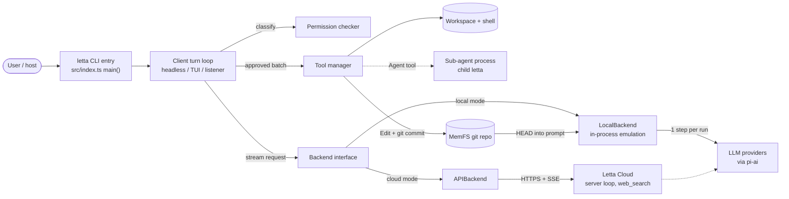
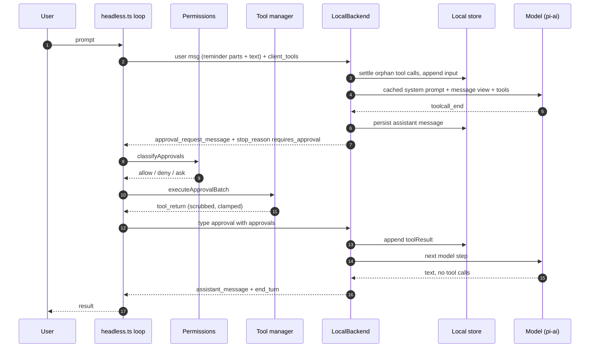
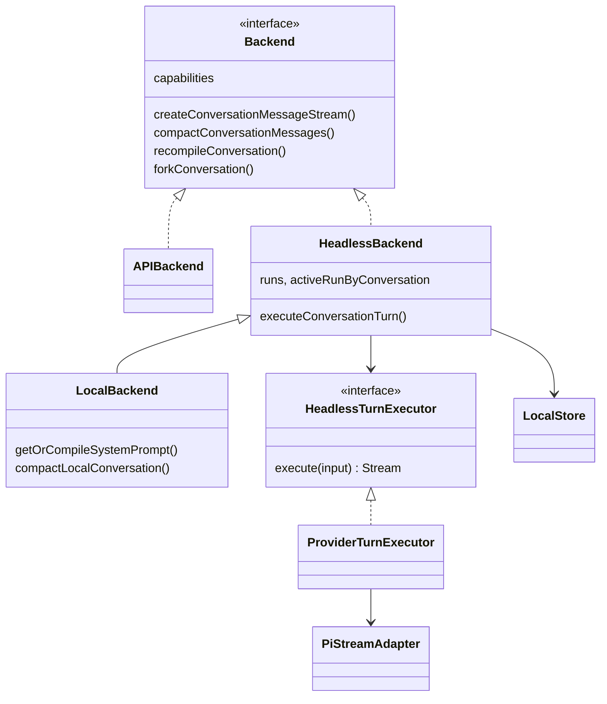
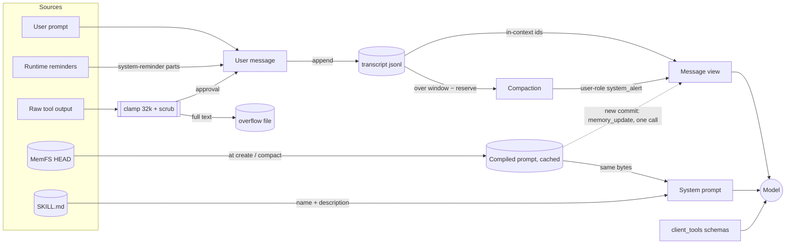
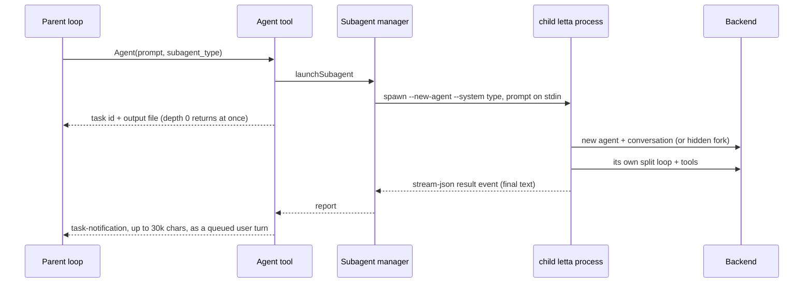

# letta-code (`letta-ai/letta-code`)

> Studied at commit [`4b028fa`](https://github.com/letta-ai/letta-code/tree/4b028fab07c69edaac2ddb4f7b9a43573ff20d81)
> (2026-10-05, `@letta-ai/letta-code` v0.34.4). Source paths below are relative to that repository and line numbers refer to that commit.
> **Fact** means read in source, tested, or observed at runtime. **Interpretation** means my reading of intent.

**Interactive diagrams (Archify, every node links to source):**
[architecture](../diagrams/letta-code/architecture.html) ·
[execution flow](../diagrams/letta-code/execution-flow.html) ·
[core abstractions](../diagrams/letta-code/core-abstractions.html) ·
[context flow](../diagrams/letta-code/context-flow.html) ·
[memory flow](../diagrams/letta-code/memory-flow.html) ·
[tool runtime](../diagrams/letta-code/tool-runtime.html) ·
[agent loop](../diagrams/letta-code/agent-loop.html) ·
[sub-agent flow](../diagrams/letta-code/sub-agent-flow.html)

**Minimal reproduction:** [`experiments/letta-code/`](https://github.com/woaitqs/repo-research/tree/main/experiments/letta-code)

---

## TL;DR

- **The agent loop is split across a contract.**
  - **Backend side:** the stateful backend runs **one model step per run**. When the model wants a tool, every call goes out as an `approval_request_message` and the run stops with `stop_reason: "requires_approval"` (`src/backend/dev/provider-turn-executor.ts:496-529`).
  - **Client side:** the harness classifies permissions, runs the tools on the user's machine, then sends `{type: "approval", approvals: [...]}` as the next request (`src/headless.ts:2578-2667`). The backend never executes a client tool.
- **One `Backend` interface, typed against the Letta REST client, has two implementations** (`src/backend/backend.ts:190-369`).
  - `APIBackend` talks to Letta Cloud.
  - `LocalBackend` emulates the same run/stream contract in-process, with [pi-ai](https://github.com/earendil-works/pi) as the provider layer.
  - The local backend grew out of a test fake. History: facade `7b335668` → local backend `f15c80f7` → pi-ai `861c37f3`.
- **Memory (MemFS) is a per-agent git repository compiled into the system prompt from `HEAD`.** Uncommitted edits never reach the model.
  - The compiled prompt is cached per conversation and kept byte-stable. A new commit only adds a one-shot `<memory_update>` to the *next* provider call (`src/backend/local/local-backend.ts:896-947`).
  - **Verified at runtime:** later calls in the same conversation no longer carry the update. Compaction, a new conversation, or an explicit recompile picks it up.
- **Context engineering is about prefix stability.**
  - Volatile facts (time, git status, agent ids, permission mode) ride on the *user* message as `<system-reminder>` parts (`src/reminders/engine.ts:548-606`).
  - With a real model the system prompt (29,116 chars) and tool schemas (19 tools, 74,924 chars) were byte-identical across every step of a turn.
- **Long-running conversations use an append-only transcript plus compaction.**
  - Compaction appends a row and replaces only the in-context id list. The summary re-enters as a user-role `system_alert`.
  - The sliding-window goal ignores the fixed prompt floor (`src/backend/local/compaction.ts:602-630`). Verified with a real model: on a small (40–45k) window, a "compacted" request can still fill the window and the turn ends with `max_tokens_exceeded`.
- **The execution runtime is client-side and defaults to autonomy.**
  - The default permission mode is `unrestricted` (`src/permissions/mode.ts:10`).
  - The kernel sandbox (bwrap/Seatbelt) is opt-in for agent shells and never isolates the network.
  - Defense in depth: deny rules and a cross-agent memory guard apply in every mode, plus PreToolUse hooks, secret redaction on every output, and a 32k-char clamp with an overflow file.
- **Sub-agents are separate `letta` processes**, each a headless child speaking the same stream-json protocol.
  - A fresh child is a new memory-less agent that sees only its brief; a fork gets a copy of the parent conversation. Only the final report returns, as a `<task-notification>`.
  - **Verified:** in one-shot `letta -p` the parent exits before the report arrives. A long-lived host (bidirectional stream-json, TUI, listener) receives it.

## Why This Repository Matters

- It is a production coding agent built by the MemGPT/Letta team around a **stateful-agent** thesis.
  - Memory, identity and history live with the agent, not the session.
  - The harness runs wherever the user is: laptop, CI, remote "computers", chat channels.
- It shows a concrete answer to a real deployment problem: **state in the cloud, tools on the user's machine**. The answer is a protocol, not an in-process loop. The same client code then also drives a fully local runtime.
- It treats **memory as code**. Memory is versioned Markdown edited with ordinary file tools and validated by pre-commit hooks. Background "reflection" agents curate it in git worktrees.
- The repository is engineered for AI contributors. `AGENTS.md` (symlinked as `CLAUDE.md`) explains every CI rule with its *why*, and the checks are enforced:
  - no `../` imports;
  - named exports and `export function`;
  - a 1,000-line file ratchet;
  - zero import cycles;
  - layer boundaries;
  - mock isolation.

## Repository Snapshot

| Item | Value (fact) |
|---|---|
| Package | `@letta-ai/letta-code` 0.34.4, bin `letta` → `letta.js`, a 22 MB Node bundle built with Bun from `src/standalone-entry.ts` (`build.js:76-85`) |
| Language / runtimes | TypeScript; dev on Bun (`packageManager: bun@1.3.14`), published for Node ≥ 22.19 |
| Size | ~305k lines of non-test TS/TSX in `src/`; 931 test files under `src/` (12 of them API-gated integration tests) |
| Largest areas (non-test lines) | `cli/` 89k (Ink TUI), `channels/` 45k, `websocket/` 37k (listener/app-server), `tools/` 25k, `agent/` 24k, `backend/` 22k |
| Key dependencies | `@letta-ai/letta-client` (REST types), `@earendil-works/pi-ai` (local provider runtime), `@modelcontextprotocol/sdk`, `ink`/`react`, `node-pty` |
| History | 3,707 commits; first commit 2025-10-24 |
| Tests | 8,778 unit tests passed, 44 skipped, 7 failed. All 7 failures trace to this container's environment (see [Verification](#verification)) |

## Architecture

The architecture separates **where state and reasoning live** from **where execution happens**. The source states this layering in `AGENTS.md` and enforces it in `scripts/check-layer-boundaries.js`. The call graph below confirms it.



Layers (fact; `AGENTS.md` layer map, enforced by `scripts/check-layer-boundaries.js`):

```text
cli/        Ink TUI, slash commands            ┐
websocket/  listener + app-server (Desktop)    ├─ hosts: each owns a turn loop
headless.ts one-shot and bidirectional -p      ┘
agent/      domain: send, stream, approvals, memory, skills, sub-agents
tools/      tool definitions + execution manager
backend/    Backend contract; APIBackend (Cloud) and LocalBackend (in-process)
providers/  provider connection helpers   permissions/  pure rules   utils/  leaf
```

Three facts define the shape:

1. **The `Backend` is the seam.** Every host calls `getBackend()` (`src/backend/backend.ts:741-744`). The mode comes from `resolveBackendMode()` (`src/backend/backend-mode.ts:24-28`). `BackendCapabilities` (`backend.ts:169-183`) lets the client feature-gate behaviour such as server-side tool management, remote vs local MemFS, and environment routing.
2. **`LocalBackend` runs inside the same Node process** as the client loop. It extends `HeadlessBackend` (`src/backend/local/local-backend.ts:178`), which implements runs, replayable chunks, cancellation and orphan settlement (`src/backend/dev/fake-headless-backend.ts:196-776`). Only the model call leaves the process.
3. **Client tools are never registered on the server agent.** On Letta Cloud, agents are created with only the server tools `web_search` and `fetch_webpage` (`src/agent/create-agent-request.ts:35`; `src/agent/create.ts:294-297`). Client tool schemas travel as `client_tools` on every request (`src/agent/message.ts:310-337`). Commit `34367de5` (#456, 2026-01-02) introduced this, deleting the older "stub tool registration" path (+178 / −1,154 lines).

## Main Execution Flow

Entry point to answer, for `letta -p "…"` with `--backend local`. Every step below was also observed at runtime through the logging shim (S1 in [Verification](#verification)).



| # | Step | Where (fact) |
|---|---|---|
| 1 | `bin` → `letta.js` → `standalone-entry.ts` → `index.ts main()` | `package.json:8-10`; `src/standalone-entry.ts:1-11`; `src/index.ts:571` |
| 2 | Headless vs TUI: `-p`, `--run`, or a non-TTY stdin selects headless | `src/index.ts:809`; `src/cli/startup-mode.ts:1-18`; dispatch `src/index.ts:1291-1292` |
| 3 | Build the turn content: shared `<system-reminder>` parts (session context, agent info, MCP servers, permission mode, memory-git sync, disk space), then preloaded skills, then the prompt | `src/headless.ts:1894-1949`; `src/reminders/catalog.ts:8-120`; `src/reminders/engine.ts:548-606` |
| 4 | Turn loop: `while (true)` → `sendMessageStream(conv, input, …, {maxRetries: 0})` | `src/headless.ts:2176-2244`; `src/agent/message.ts:347-355` |
| 5 | Request body: `messages`, `client_tools`, `client_skills`, `streaming`, `background`, `include_compaction_messages`; secrets scrubbed from outgoing text | `src/agent/message.ts:310-337, 382-440` |
| 6 | Backend run: reject if a run is already active; settle dangling tool calls (unless this is an approval turn); append input; `startRun` | `src/backend/dev/fake-headless-backend.ts:473-504` |
| 7 | Resolve the system prompt: the cached compiled prompt, plus a `<memory_update>` if the committed memory revision moved | `src/backend/local/local-backend.ts:462-500, 896-947` |
| 8 | Provider call: preflight compaction check, `toPiMessages(view)`, the transient memory delta as a trailing `system` message, `streamSimple` | `src/backend/dev/pi-stream-adapter.ts:535-606` |
| 9 | Map the stream: text/thinking deltas → `assistant_message`/`reasoning_message`; `toolcall_end` → `approval_request_message`; `done` → `stop_reason` (`requires_approval` / `max_tokens_exceeded` / `end_turn`) | `src/backend/dev/provider-turn-executor.ts:427-550` |
| 10 | Persist each chunk to the store and attach the run id; a stream that ends without a stop reason becomes `requires_approval` or `error` | `fake-headless-backend.ts:691-776` |
| 11 | Client drain: `StreamProcessor` accumulates approvals by `tool_call_id`; `end_turn` with pending approvals is coerced to `requires_approval` | `src/cli/helpers/stream-processor.ts:162-220`; `src/cli/helpers/stream.ts:446-470` |
| 12 | `requires_approval` → `classifyApprovals` → one-shot headless denies `ask` ("Tool requires approval (headless mode)") → `executeApprovalBatch` | `src/headless.ts:2578-2667`; `src/cli/helpers/approval-classification.ts:124-230` |
| 13 | The next input is the approval message; the backend turns it into `toolResult` messages | `src/headless-response-state.ts:12-21`; `src/backend/local/local-store.ts:1507-1548` |
| 14 | `end_turn` → done (a mod `turn_end` may ask to continue); other stop reasons go through a retry ladder or exit | `src/headless.ts:2524-2575, 2814-2824` |

**Fact:** the TUI (`src/cli/app/use-conversation-loop.ts:744`), headless bidirectional mode (`src/headless.ts:4272-4600`) and the WebSocket listener (`src/websocket/listener/turn.ts:314-856`) each have their **own** stop-reason loop. They share `sendMessageStream`, `drainStream*`, `classifyApprovals`, `executeApprovalBatch` and the recovery classifiers in `src/agent/turn-recovery-policy.ts`. The list of non-retriable stop reasons is duplicated three times: `headless.ts:2814-2823`, `cli/app/retry.ts:12-21` and `websocket/listener/recovery.ts:113-122`.

## Core Abstractions



### `Backend` (the contract)
- **Responsibility:** the agent/conversation/run API, plus `capabilities`.
- **Inputs:** Letta REST request bodies (`messages`, `client_tools`, `client_skills`, …).
- **Outputs:** Letta streaming chunks (`assistant_message`, `approval_request_message`, `stop_reason`, `usage_statistics`, `event_message`, `summary_message`).
- **Lifecycle:** a process-wide singleton from `getBackend()`; `configureBackendMode()` swaps it (`backend.ts:741-758`).
- **Dependencies:** `@letta-ai/letta-client` types only.
- **Source:** `src/backend/backend.ts:169-369`.
- **Why it exists:** the client loop, TUI and listener can stay identical whether state lives in Letta Cloud or on disk. It also gives tests a fake.

### `HeadlessBackend` / `LocalBackend` (server emulation)
- **Responsibility:**
  - `HeadlessBackend` provides the *server semantics*: runs with ids, one active run per conversation, chunk recording for replay, cancellation, and synthetic results for dangling tool calls.
  - `LocalBackend` adds the *agent semantics*: the system prompt compiled from MemFS, the memory delta, compaction policy, the model catalog, and mod hooks for compaction and LLM events.
- **Lifecycle:** one per process; conversations are loaded from disk lazily.
- **Source:**
  - `src/backend/dev/fake-headless-backend.ts:196-776`
  - `src/backend/local/local-backend.ts:178-976`
- **Why it exists:** a fully local runtime without forking the client, plus deterministic executors for tests (`src/backend/dev/headless-turn-executor.ts:94-176`). `LETTA_LOCAL_BACKEND_EXECUTOR=deterministic` swaps the model out (`backend.ts:712-722`).

### `HeadlessTurnExecutor` / `ProviderTurnExecutor` / `PiStreamAdapter` (one model step)
- **Responsibility:** turn the resolved input into exactly one provider call and map it back to Letta chunks, with bounded recovery inside that single call.
  - overflow → compaction, at most 3 (`pi-stream-adapter.ts:64, 826-846`)
  - oversized payload → image elision or compaction (`:848-928`)
  - transient errors → at most 3 retries, with `event_message` chunks (`:61, 930-960`)
- **Source:**
  - `src/backend/dev/headless-turn-executor.ts:13-32`
  - `src/backend/dev/provider-turn-executor.ts:552-565`
  - `src/backend/dev/pi-stream-adapter.ts:486-963`
- **Why it exists:** isolates provider specifics. pi-ai owns payload conversion, capabilities and the model catalog. `AGENTS.md` marks re-implementing that inside Letta Code as "suspicious by default".

### `LocalStore` (transcript + in-context view)
- **Responsibility:** append-only `messages.jsonl` (pi session-entry format with `id`/`parentId`, schema v2), the `in_context_message_ids` list, the compiled prompt (`system-prompt.json`), conversation metadata, tool-result repair and clipping on load.
- **Source:**
  - `src/backend/local/local-store.ts:927-1209`
  - `src/backend/local/local-transcript.ts:24-160`
- **Why it exists:** keeps the full history (what Letta calls "recall memory") separate from the bounded model view.

### Client turn loop (`headless.ts`, `use-conversation-loop.ts`, listener `turn.ts`)
- **Responsibility:** reminders, send, drain, classify, execute, resume, recover, queue.
- **Inputs:** user input or queued items (`src/queue/queue-runtime.ts`).
- **Outputs:** approval messages and rendered results.
- **Why it exists:** it is the agent's *execution runtime* and UX host. Each host differs in how `ask` is resolved: a dialog in the TUI, `can_use_tool` over stdio for the SDK, WebSocket for the listener, auto-deny for one-shot headless.

### Tool (`defineTool` → registry → per-turn snapshot)
- **Interface:** `ToolAssets {schema, description, modelForm, impl: (args) => Promise<unknown>}` (`src/tools/define-tool.ts:8-38`).
- **Normalization:** the manager normalizes results to `{toolReturn, status, stdout?, stderr?}` (`src/tools/manager.ts:294-319`).
- **Toolsets:** chosen per provider: `default` (Claude-style), `codex` (`exec_command`/`ApplyPatch`) or `letta` (`src/tools/toolset-catalog.ts:18-105`; auto rule `src/tools/toolset.ts:61-84`).
- **Snapshots:** a per-turn snapshot (`ctx-*`, at most 4,096 retained) pins the registry used to execute that turn's calls (`manager.ts:360-405, 735-813`).

### `PermissionChecker`
- **Decisions:** `allow | deny | ask | alwaysAsk`.
- **Modes:** `standard | acceptEdits | unrestricted | strict`; the default is `unrestricted` (`src/permissions/mode.ts:3-35`).
- **Ordered evaluation** (`src/permissions/checker.ts:238-599`):
  1. workspace sandbox guard
  2. cross-agent memory guard
  3. deny rules
  4. `--disallowedTools`
  5. alwaysAsk
  6. **mode override**
  7. allow lists
  8. read-only shell, own-memory writes, reads in the working directory (auto-allowed)
  9. allow and ask rules
  10. default: ask

### Sub-agent (`SubagentConfig` + manager)
- **Definition:** Markdown files with frontmatter (`name`, `description`, `tools`, `model`, `skills`, `fork`, `launchProfile`) (`src/agent/subagents/index.ts:90-109`).
- **Built-ins:** `general-purpose`, `fork`, `recall`, `memory`, `reflection`, `init` (`src/agent/subagents/builtin/*.md`).
- **Launch:** a separate process (`src/agent/subagents/manager.ts:180-268, 415-460`).

### MemFS
- **What it is:** the agent's git repository at `~/.letta/agents/<id>/memory` in Cloud mode (`src/agent/memory-filesystem.ts:46-57`), or `$LETTA_LOCAL_BACKEND_DIR/memfs/<id>/memory` for the local backend (`src/backend/local/paths.ts:48-53`).
- **Layouts:** v1 = `system/` files are core; v2 = root `*.md` are core, with a `MEMORY.md` index and deferred child directories (`src/agent/memory-format.ts:6-41`).

## Agent Loop

```text
input ─▶ run started ─▶ model step ─▶ stop_reason?
             ▲                         ├─ requires_approval ─▶ client tools ─┐
             └──────────── {type: approval} (new run) ◀───────────────────────┘
                                       ├─ end_turn ─▶ done
                                       └─ error / max_tokens_exceeded ─▶ exit (not retried)
```

- **Fact: the loop driver is the client.** Each pass through "run started" is a new backend run. The backend has no `while` loop over tool calls; `HeadlessBackend.executeConversationTurn` performs exactly one executor call (`fake-headless-backend.ts:469-565`).
- **Fact: termination.**
  - `end_turn` ends the loop.
  - `max_turns` counts only non-approval inputs (`headless.ts:2177-2191`).
  - `cancelled` exits with code 130.
  - Non-retriable stops exit with an error.
- **Fact: recovery happens on both sides.**
  - Inside a provider call (backend): at most 3 overflow compactions and at most 3 transient retries.
  - Before the stream starts (client): approval-pending conflicts → fresh denials; conversation busy → back off 10s·2ⁿ, up to 3 times; transient errors → 1s·2ⁿ with `Retry-After`, up to 3 times (`src/agent/turn-recovery-policy.ts:391-419`).
  - Mid-stream (client): resume through `streamRunMessages(runId, {starting_after: seq})`, at most 20 attempts in headless and 60 in the listener (`src/cli/helpers/stream.ts:552-981`).
- **Fact: parallel tool calls run concurrently but safely** (`src/agent/approval-execution.ts:45-118, 427-437`).
  - `Read`, `Grep`, `Glob`, `ViewImage`, `Agent`, `web_search` run in parallel.
  - `Edit`/`Write` serialize per file path.
  - `Bash`, `exec_command`, `ApplyPatch` and unknown tools share one global lock.
  - Results keep call order.
- **Interpretation:** splitting the loop costs one round trip per tool step in Cloud mode. In exchange, the backend never needs access to the user's machine, and a run can be resumed or replayed by any host (TUI, Desktop, a phone through chat.letta.com) because the state is in the backend.

The [agent-loop diagram](../diagrams/letta-code/agent-loop.html) shows the waiting states (compaction/retry, awaiting approval) and exits.

## Context Engineering

Context engineering is central here. The design optimizes for a **stable prefix** and a **bounded, recoverable view**.



**1. How context is constructed (local backend, fact).** `PiStreamAdapter.streamOnce` builds a pi-ai `Context` (`src/backend/dev/pi-stream-adapter.ts:594-606`):

```text
systemPrompt = cached compiled prompt                  (base preset + rendered core memory)
             + <available_skills> from client_skills   (system-prompt-compilation.ts:391-430)
messages     = toPiMessages(in-context view)           (orphan tool results removed, trailing assistant stripped)
             + [ <memory_update> as a system message ]  (only on the first call after a new commit)
tools        = client_tools                            (every request)
```

**2. What enters (observed, S1).** The first request of a fresh agent contained:
- a 29,116-char system prompt with these sections:
  - Context Architecture
  - Identity
  - Existence & Continuity
  - Harness Architecture
  - Self-evolution
  - the `<human>` and `<persona>` core-memory blocks
  - the `<memory>` index
  - `<available_skills>` listing 19 bundled skills (name + description only)
- one user message of 5 parts: 4 `<system-reminder>` parts (device/git, agent info and paths, MCP servers, permission mode) followed by the prompt;
- 19 tool schemas totalling 74,924 chars. `Bash` (12,098) and `Agent` (10,705) have the longest descriptions.

**Fact:** the tool schemas outweigh the system prompt about 2.5×, and the usage-reported prompt was about 24k tokens before any conversation. A full sample is in [`real_model/sample_request_S1.json`](https://github.com/woaitqs/repo-research/blob/main/experiments/letta-code/real_model/sample_request_S1.json).

**3. What is excluded (fact).**
- uncommitted memory (`system-prompt-compilation.ts:81-143` reads `git show HEAD:`);
- bodies of files in v2 child directories, which are only listed as `<directory path=… index=…/>` (`:154-199`);
- skill bodies, which load on demand through the `Skill` tool and are injected as a user message wrapped in `<skill_content>` (`src/tools/impl/skill.ts:337-379`);
- tool output beyond the clamp, which goes to an overflow file;
- messages evicted by compaction, which stay in the transcript (recall) and are reachable through the `recall` sub-agent;
- sub-agent transcripts.

**4. Tool results (fact).** Every built-in result is scrubbed of secrets (the runtime API key and the agent's whole secret vault) and clamped (`src/tools/manager.ts:2307-2324`).
- Per-tool limits: Bash 30k chars (10k head+tail on failure), Read 2,000 lines / 30k chars, Grep 10k, Glob 2,000 files; backstop `TOOL_RETURN_MAX_CHARS = 32_000` (`src/tools/impl/truncation.ts:11-38`).
- The full output goes to `~/.letta/projects/<cwd>/agent-tools/<tool>-<uuid>.txt`, and the clamped text says `[Full output written to: <path>]` (`src/tools/impl/overflow.ts:32-101`).
- A second clip at 40,000 chars repairs oversized results when a transcript is loaded (`src/backend/local/local-message-projection.ts:14, 469-519`).

**5. Compaction (fact).**
- **Preflight:** compact when the estimated context exceeds `window − min(16384, 20% of window)` (`provider-turn-executor.ts:224-272`). The comment explains why: pi-ai shrinks the output allowance to `window − context − 4096`, so a near-full request otherwise "finishes with `length`" instead of raising an overflow.
- **Post-turn:** check again using provider-reported usage (`pi-stream-adapter.ts:751-779`).
- **Default mode `sliding_window`** (`compaction.ts:43-44, 584-650`): evict from 30% upward in 10% steps until the kept tail is under `(1 − 30%) × window`. It cuts only at an assistant message and never separates a pending tool call.
- **Fallback mode `all`:** summarize everything except a trailing pending tool call (`:652-667`).
- **The summary prompt** asks for goals, what happened, identifiers kept verbatim, errors, current state, and "lookup hints" for searching history later (`:61-102`).
- **The summarizer itself** retries on overflow with a shrinking transcript, from 120k down to 2k chars (`:30-42, 503-549`).
- **Storage:** the result is stored as **one appended `compaction` row**, and `in_context_message_ids` becomes `[summary, …kept]` (`local-store.ts:1157-1209`). The summary is a **user-role** message whose text is a JSON `system_alert` ("Note: N messages … have been hidden …") (`compaction.ts:682-708`).
- **Afterwards** the system prompt is recompiled, which folds in any committed memory (`local-backend.ts:760-786`).

**6. Repository context (fact).** There is no index or retrieval layer over the user's code. The agent navigates with `Grep`/`Glob`/`Read`/`Bash`. The first user message carries the git branch, recent commits and `git status` as a reminder. Project knowledge persists only if the agent writes it to MemFS or a skill.

**7. Sub-agent context (fact, verified S3).**
- A fresh child is a new agent with its own system prompt and toolset, *no memory blocks* (`manager.ts:194-196`), and *no shared reminders* (the reminder catalog has no `subagent` mode). Its first request was `[system, user(sender reminder + brief)]`, about 12.5k prompt tokens with 11 tools.
- A fork gets a hidden copy of the parent conversation plus a "you are NOT the primary agent" reminder (`src/agent/subagents/fork-conversation.ts:50-106`; `manager.ts:769-803`).

**8. Isolation (fact).** The parent sees only the child's final text, via the Agent tool's output file and a `<task-notification>` capped at 30k chars (`src/tools/impl/task.ts:432-479`). In S3b the child's system prompt never appeared in any parent request.

**9. Long-running control (fact + finding).**
- Bounded compaction and retries, the summary's "lookup hints", and the recall sub-agent keep long conversations workable.
- **Finding (verified):** the sliding-window goal and its "fits now" check count *message* tokens only (`compaction.ts:602-630`; `local-backend.ts:755-758`). The system prompt and tool schemas, about 24k tokens here, are left out.
  - On a 40–45k window this produced compacted requests of 35.1k–37.6k prompt tokens. pi-ai then clamped `max_completion_tokens` down to 1, the model returned `finish_reason: length`, and the turn ended with `max_tokens_exceeded`. This happened in S4b (3/3 runs) and in one S4a run.
  - On 128k+ windows this is unlikely. On small local models (an Ollama 32k window is enough) the floor is a large share of the window.

**10. Prefix stability (fact + observation).**
- `AGENTS.md` forbids `role: "system"` notifications in history. Automated context uses user-role `<system-reminder>` parts instead.
- In S1 the system prompt and tool schemas were byte-identical across all three calls. The provider reported 23,680–24,192 of about 24.2k prompt tokens as cached on every S1 call, in all three runs ([`provider_usage.json`](https://github.com/woaitqs/repo-research/blob/main/experiments/letta-code/real_model/provider_usage.json)).
- The cost of breaking the prefix is visible in the same file. The single S2 call that carried `<memory_update>` had only 5,888–6,016 of about 26–27k prompt tokens cached; the next call, back on the original prompt, had about 25–27k cached again.
- The cache-reuse header `X-Letta-Response-State` is sent only for approval-only continuations without new reminders (`src/agent/message.ts:51-55, 477-489`).

## Memory

| Question | Answer (fact unless marked) |
|---|---|
| What is memory? | Committed Markdown in the agent's MemFS git repo. Root files (v2) or `system/` files (v1) are *core memory*, rendered into the prompt. Indexed child directories and other files are *external memory*, read on demand. Skills live under `skills/`. Cloud agents without MemFS still have server-side `persona`/`human` blocks (`src/agent/memory.ts:16-93`). |
| Where is it stored? | Cloud mode: `~/.letta/agents/<id>/memory`, synced to `${memfsBase}/v1/git/<id>/state.git` (`memory-git.ts:228-233`). Local backend: `$LETTA_LOCAL_BACKEND_DIR/memfs/<id>/memory`. |
| Who writes it? | 1. The primary agent, with ordinary `Edit`/`Write`/`Bash` and its own `git commit`. These are auto-allowed by `isOwnMemoryWrite` (`src/permissions/memory-write-allowance.ts:37-62`) and coached by the prompt (`src/agent/prompts/letta_root_memfs.md:60-77`). 2. The background `memory` worker and `reflection` sub-agents, each in a private git worktree merged by the harness under a lock (`src/agent/memory-worktree.ts:363-666`; `src/agent/memory-operation.ts:5-59`). 3. A repair worker for conflicts or invalid commits, tried once per distinct state. |
| What validates it? | A pre-commit hook enforces exact `name`/`description` frontmatter, a `MEMORY.md` index per projected directory, skill folders, and tree limits (defaults: depth 2, 20k chars per file, 65,536 chars of core memory). Changing those limits needs `LETTA_MEMORY_CONSTRAINTS_UPDATE=1` (`src/agent/memory-git-hooks.ts:38-211`; `src/memory-frontmatter.ts:18-122`; `src/memory-constraints.ts:302-308`). |
| Who retrieves it? | Prompt compilation (core memory). The agent itself reads external files with tools. Reflection reads a 40k-char parent-memory snapshot. |
| How does it enter context? | Compiled into the system prompt at conversation creation, explicit recompile, compaction, or a worker/reflection merge (`src/agent/subagents/memory-worker.ts:170`). A new commit mid-conversation adds a `<memory_update>` to the next call only (`local-backend.ts:917-939`). |
| Scope | Per **agent**, across all of its conversations and machines. Skills can be per project (`.agents/skills`), per user (`~/.letta/skills`) or per agent (in MemFS). Shared-memory repos can be attached to several agents (Cloud). |
| Updates and staleness | The prompt itself says "Editing memory does NOT change your behavior in the current turn" (`letta_root_memfs.md:53-56`). **Verified gap:** after the one-shot delta, later calls in the same conversation see neither the new memory nor the delta (probe P3b; real model S2: turn-2 calls reverted to the original prompt hash). The agent still knows about its own edits from the tool calls in its transcript; external edits stay invisible until a recompile. |
| Explicit or implicit? | Explicit: the agent decides what to write. Reflection adds a periodic, out-of-band consolidation pass. The code default trigger is `compaction-event` with a 25-step fallback (`src/cli/helpers/memory-reminder.ts:15, 51-56`); our headless runs reported `step-count`/25 as the effective setting. *Uncertain:* which settings path produced that. |

**Four things that are easy to confuse:**

```text
Conversation history  backend transcript (Cloud conversation / local messages.jsonl). Immutable, complete, searchable ("recall").
Context               what one provider call carries: compiled system prompt + in-context view + tool schemas (+ one-shot delta).
Persistent memory     MemFS: committed Markdown in a per-agent git repo; core files are rendered into the system prompt.
External storage      overflow files, reflection transcripts (~/.letta/transcripts), memory-worker handoff snapshots, the workspace itself.
```

**Observed with a real model (S2, 3/3 runs).** Asked to remember a fact, the agent:
1. inspected `$MEMORY_DIR` with `git status`;
2. read `human.md`, `MEMORY.md` and `persona.md`;
3. edited `human.md` and committed it with its own message (for example `memory: record user's favorite color (teal)`).

The `<memory_update>` reached the next provider call. For this OpenAI-compatible model, pi-ai folded it into the system message, because the model's compat flags say it does not support mid-conversation system messages (`node_modules/@earendil-works/pi-ai/dist/utils/transcript.js:96-104`).

In a new conversation the fact was in the compiled prompt, and the model answered "Teal" without tools.

## Tools

- **Interface and registration** (fact): tools are a static table built from `defineTool(...)` (`src/tools/tool-definitions.ts:122-284`). Three other sources add tools: SDK-registered external tools (`register_external_tools`, `src/headless.ts:3919-3935`), listener external tools, and mod tools. Serialization order is built-ins → external → mod, with later sources shadowing earlier ones (`src/tools/client-tool-serialization.ts:48-78`).
- **Discovery:** there is no runtime discovery for built-ins. Tool exposure is a per-model *toolset* choice. Sub-agent types and skills reach the model through tool descriptions (sub-agent descriptions are injected into the `Agent` description, `src/tools/manager.ts:1185-1187, 1324-1350`) and through `client_skills`.
- **Invocation:** `executeTool(name, args, {signal, toolCallId, toolContextId, …})` (`src/tools/manager.ts:2447-2511`) runs a pipeline: resolve the turn snapshot → wait for memory checkouts → mod `tool_start` → execution-phase mod permission overlay → **PreToolUse hooks** (block, or `updatedInput`) → inject secret env → `tool.fn` → flatten → **scrub + clamp** → PostToolUse feedback → mod `tool_end` override (`:1966-2433`).
- **Errors:** never thrown back to the model. Errors become `status: "error"` text such as `Error executing tool: …`, `Tool not found: X. Available tools: …`, `Error: Tool execution blocked by hook. …` or `Interrupted by user`.
- **Retries:** no tool-level retries. Retries apply to provider calls and the stream, not to tools.
- **Permissions:** see the Permission checker under [Core Abstractions](#core-abstractions). Classification happens **before** execution. At execution time only mod overlays are re-checked (`manager.ts:2156-2168`), so the safety of execution depends on every caller classifying first.
- **MCP:** MCP tools are **not** `client_tools`. The agent calls `letta mcp search|schema|call` from the shell (bundled skill `using-mcp-tools`).
  - Locally configured servers run on the client.
  - Servers attached in Letta Cloud run on the server (`POST …/tools/{id}/run`, `src/backend/api/unified-mcp.ts:286-303`).
  - *Interpretation:* this keeps the model-facing schema surface constant regardless of how many MCP servers are attached.
- **Server tools:** `web_search`/`fetch_webpage` run inside Letta Cloud. Their results arrive as `tool_return_message` and the client drops the matching approval (`stream-processor.ts:162-169`).

## Runtime / Sandbox

**Where reasoning ends and execution begins** (fact):

| Step | Owner | Code |
|---|---|---|
| choose toolset, serialize schemas | client | `src/tools/toolset.ts:290-439`; `manager.ts:735-813` |
| inference, emit tool calls | backend (Cloud server or in-process `LocalBackend`) | `provider-turn-executor.ts:496-529` |
| server tools (web search, cloud MCP) | server | `create-agent-request.ts:35`; `unified-mcp.ts:286-303` |
| classify, ask, execute, scrub, clamp | client | `approval-classification.ts`; `approval-execution.ts:147-441`; `manager.ts:1966-2511` |
| return results | client → backend, as an `approval` message | `approval-execution.ts:246-254, 296-301` |

**Shell runtime.**
- Commands run with `bash -c`, or `zsh` on macOS to work around a bash-3.2 heredoc bug (`src/tools/impl/bash.ts:122-129`).
- Processes are detached, and kills target the whole process group: SIGTERM, then SIGKILL after 2,000 ms (`src/tools/impl/shell-runner.ts`).
- A foreground `Bash` call auto-backgrounds after 10 s when a queue bridge exists. One-shot headless has no bridge, so the call blocks.
- At most 32 background processes and tasks (`process_manager.ts:137-143`).

**Sandbox (fact).**
- OS-level filesystem isolation: bwrap on Linux (tmpfs-masks denied roots, `--die-with-parent`, **no `--unshare-net`**, `src/sandbox/bwrap.ts:15-22`), Seatbelt on macOS, and a restricted-token helper on Windows.
- **Where it applies:**
  - (a) Agent shells, only with `LETTA_FS_SANDBOX=1`. Without an available backend it warns and runs unsandboxed (`src/sandbox/availability.ts:88-115`).
  - (b) The workspace sandbox requested by a runtime-start (Desktop); this one fails closed (`src/tools/impl/shell-sandbox.ts:62-91`).
  - (c) Memory sub-agents, **on by default**: the whole child process is wrapped, with writes limited to `~/.letta` and the agent's own memory (`src/agent/subagents/sandbox.ts:20-40`; `src/permissions/sandbox-policy.ts:255-285`).
- **Never isolated:** the network, `rg` subprocesses, hook commands, and the parent's in-process `Read`/`Edit`/`Write`. Those rely on the permission checker's workspace guard and the cross-agent guard.

**Interpretation.** The defaults favour an autonomous, always-on agent: `unrestricted` mode (commit `b5b757c8`, #2197, "make unrestricted the default") with opt-in confinement. The invariants that hold in every mode are about *other agents' memory* (the cross-agent guard) and *secrets* (redaction everywhere). They are not about the user's workspace. That fits the product's model of "your agent on your machine", but it shifts the safety burden to deny rules and hooks.

## Sub-Agents / Workflow



- **Process model** (fact): each sub-agent is a headless `letta` child process.
  - Arguments: `--new-agent --system <type> --output-format stream-json --permission-mode unrestricted`, the parent's allow/deny lists, the child's `--tools`, and `--max-turns`.
  - The prompt goes in on stdin. The child gets its own process group.
  - Environment: `LETTA_CODE_AGENT_ROLE=subagent`, `LETTA_SUBAGENT_DEPTH` = parent + 1, and the parent's ids (`src/agent/subagents/manager.ts:180-268, 330-345, 415-460`; `src/agent/subagents/subagent-launcher.ts:215-289`).
  - The depth limit is 2. `Agent` is only given to full-capability children below the limit (`src/agent/subagents/subagent-depth.ts:11-43`).
- **Types:**
  - `general-purpose`: Bash, Read, Edit, Write, todo tools.
  - `fork`: all tools, the parent's conversation.
  - `recall`: a fork with search instructions.
  - `memory`, `reflection`, `init`: memory launch profile, OS-sandboxed.
  - Custom types from `~/.letta/agents/*.md` and `.letta/agents/*.md` (`src/agent/subagents/index.ts:141-153, 500-590`).
- **Return contract:**
  - **Depth 0:** returns a task id immediately; the report arrives later as a queued `<task-notification>` (`src/tools/impl/task.ts:937-960, 432-479`).
  - **Depth > 0:** runs in the foreground and returns the report directly (`task-foreground.ts:22-64`).
  - Reflection, memory and integration children complete silently.
- **Observed (S3a/S3b, 3/3 each):**
  - In one-shot `letta -p`, the parent ended its turn with "Launched the subagent… I'll report as soon as it finishes". The child's second provider call never completed. One-shot mode registers no message-queue consumer (the adder is set only in bidirectional mode, `src/headless.ts:3596`).
  - In bidirectional stream-json the notification arrived as a second turn and the parent answered "2 lines". In one run the parent had already read the task's output file with `Bash` before the notification arrived.
- **Agent-to-agent messaging:** `SendAgentMessage` enqueues into another conversation (Cloud routing; by default the parent's conversation) and returns without waiting.
- **Workflow:** there is also a `Workflow` tool with its own skill (`workflow-authoring`), which runs scripted multi-agent workflows (`src/tools/impl/workflow.ts`). I did not trace it in depth.

## Important Source Files

| File | Why it matters |
|---|---|
| `src/backend/backend.ts` | the `Backend` contract, capabilities, `APIBackend`, mode factory |
| `src/backend/dev/fake-headless-backend.ts` | run semantics: one active run, settle orphans, persist chunks, missing-stop handling |
| `src/backend/local/local-backend.ts` | compiled-prompt cache, memory delta, compaction orchestration |
| `src/backend/dev/provider-turn-executor.ts` | one model step → Letta chunks; tool call → `requires_approval`; compaction threshold |
| `src/backend/dev/pi-stream-adapter.ts` | pi-ai `Context`; bounded overflow/transient/image recovery |
| `src/backend/local/compaction.ts`, `local-store.ts`, `local-transcript.ts` | sliding window, summary packaging, append-only transcript |
| `src/backend/local/system-prompt-compilation.ts` | MemFS → core memory (from `HEAD`), skills block |
| `src/headless.ts` | one-shot and bidirectional turn loops, approval handling |
| `src/agent/message.ts` | request body (`client_tools`, `client_skills`), scrubbing, response-state header |
| `src/cli/helpers/stream.ts`, `stream-processor.ts` | draining, approval accumulation, resume |
| `src/agent/approval-execution.ts`, `src/cli/helpers/approval-classification.ts` | permission classification and parallel-safe execution |
| `src/tools/manager.ts`, `src/tools/impl/truncation.ts`, `overflow.ts` | execution pipeline, hooks, scrub, clamp, overflow |
| `src/permissions/checker.ts`, `mode.ts` | rule order, modes, guards |
| `src/reminders/engine.ts`, `catalog.ts` | `<system-reminder>` construction |
| `src/agent/subagents/manager.ts`, `src/tools/impl/task.ts` | sub-agent processes and the report contract |
| `src/agent/memory-git.ts`, `memory-worktree.ts`, `memory-git-hooks.ts` | MemFS sync, worktrees, validation |
| `src/agent/prompts/letta_root_memfs.md` | the system prompt that teaches the agent its own architecture |
| `AGENTS.md` | rules with rationale; checked against code above |

## 5+ Implementation Decisions Worth Learning From

### 1. Split the agent loop at the tool boundary
- **What they did:** the backend performs one model step per run. Every client tool call ends the run with `requires_approval`. The client executes and resumes with an `approval` message.
  - Approvals and denials share one message shape: `{type: "tool", tool_return, status}` or `{type: "approval", approve: false, reason}` (`src/agent/approval-execution.ts:246-301`).
  - The local backend enforces "one active run per conversation" (`fake-headless-backend.ts:473-479`).
  - It repairs interrupted turns by answering dangling tool calls with `Turn did not complete` (`:480-497`; `local-store.ts:1550-1580`).
- **Problem solved:** agent state lives in a server, but tools must touch the user's files and shell, and several hosts (TUI, Desktop, phone, CI) drive the same agent.
- **Why it is interesting:** it reduces "remote agent, local tools" to a resumable protocol, so any host can continue a run. The same protocol later let them write a fully local backend without touching the client.
- **Trade-offs:**
  - one round trip per tool step in Cloud mode;
  - the client must own the retry/resume logic;
  - four hosts re-implement the stop-reason loop (duplicated constants are pinned by source-reading tests);
  - tool schemas are re-sent on every request (75k chars here; mitigated by prefix caching).
- **Where in source:** `provider-turn-executor.ts:496-529`; `headless.ts:2578-2667`; `agent/message.ts:310-337`.
- **Reuse:** if your tools must run somewhere other than your model loop, make "tool call" a *stop reason* and "tool result" an *input message*. Then interruption, approval UIs and remote execution are all the same mechanism.

### 2. One contract, two backends, and the local one grew out of a test fake
- **What they did:**
  - extracted a `Backend` facade typed against the vendor's REST client (`7b335668`, 2026-04-29);
  - implemented it in-process by turning the test fake `FakeHeadlessBackend` into a real runtime (`f15c80f7`);
  - swapped Vercel AI SDK for pi-ai two weeks later (`861c37f3`).
  - `BackendCapabilities` flags let the client disable what the local backend can't do (`backend.ts:169-183, 376-390`; `fake-headless-backend.ts:185-194`).
  - Deterministic executors remain for tests (`headless-turn-executor.ts:94-176`).
- **Problem solved:** a local-first mode with BYO providers, offline use and no cloud account, without forking a 300k-line client.
- **Why it is interesting:** the most expensive part, client hosts with resume/approval/queue logic, stayed untouched. The emulation is only as wide as the contract.
- **Trade-offs:**
  - the local backend must faithfully emulate server semantics: runs, replay, cancellation, ids, compaction events;
  - casts (`as never`, `as unknown as Stream`) mark places where local shapes are coerced into the cloud types;
  - features that exist only server-side (`web_search`, environment routing, server secrets) are capability-gated off.
- **Reuse:** introduce the protocol seam first, then a fake behind it, then promote the fake. Test against the fake throughout.

### 3. Memory as git, compiled from HEAD into a cache-stable prompt
- **What they did:**
  - Memory is Markdown in a per-agent git repo. Only committed content is rendered (`system-prompt-compilation.ts:81-143`).
  - The compiled prompt is cached per conversation, keyed by the raw-prompt hash and the memfs revision.
  - A new revision does **not** rewrite the prompt. It adds a one-shot `<memory_update>` (`local-backend.ts:896-947`; introduced for Opus 4.8 in `5bca801a`, generalized in `da372cb3`).
  - Pre-commit hooks validate structure and size (`memory-git-hooks.ts`).
  - Background writers use worktrees merged under a lock.
- **Problem solved:**
  - self-editing memory needs history, diffing, multi-machine sync and conflict handling;
  - changing the system prompt on every edit would destroy prompt caching;
  - unvalidated self-edits rot.
- **Why it is interesting:** "commit = publish to context" is a crisp contract the agent can be taught (`letta_root_memfs.md:53-56`), and git gives provenance, rollback and sync for free.
- **Trade-offs:** freshness vs cache stability.
  - Verified gap (probe P3b, S2): after the one-shot delta, *later calls in the same conversation* see neither the delta nor the new memory.
  - The primary agent's own edits remain visible through its transcript, but an external edit (worker, another machine) stays invisible until compaction or a new conversation.
  - Background merges *do* recompile, breaking the cache for that conversation.
- **Reuse:**
  - treat committed memory as the single source of truth and render it into a stable prefix;
  - if you deliver deltas, persist them into the transcript (or re-send until the next recompile) so they don't evaporate after one call.

### 4. Keep the prefix stable: volatile context rides on user messages
- **What they did:**
  - Time, git state, agent ids, permission mode, MCP servers and disk warnings become `<system-reminder>` text parts prepended to the user content (`reminders/engine.ts:548-606`).
  - `AGENTS.md` forbids role-`system` notifications in history.
  - The system prompt teaches the model to treat these tags as instructions.
  - Skill-catalog changes arrive as a metadata-only reminder (`client-skills.ts:227-280`).
  - An approval-boundary cache header is sent only when nothing new was added (`message.ts:51-55, 477-489`).
- **Problem solved:** Anthropic and other APIs reject or penalize mid-conversation system messages, and every byte changed in the prefix costs a cache miss.
- **Evidence:** the S1 system prompt and tool schemas were byte-identical across the turn, and at least 98% of each S1 call's prompt tokens were served from the provider cache. The one S2 call whose system message changed (the `<memory_update>`, folded in by pi-ai) dropped to about 22% cached.
- **Trade-offs:**
  - reminders accumulate in history and are paid for again after each compaction;
  - user-role text carries authority only because the prompt says so;
  - the transcript echo must strip them before display.
- **Reuse:** classify context by volatility. Stable things go in the system prompt. Per-turn things go in tagged parts of the turn input. Never edit the prefix to announce state.

### 5. Append-only transcript, summary as a message, bounded recovery
- **What they did:**
  - The transcript is append-only. Compaction appends one row and replaces `in_context_message_ids`.
  - The summary re-enters as a user-role `system_alert` with "lookup hints". The sliding window cuts only at assistant messages and protects pending tool calls.
  - Compaction runs preflight with a 16k reserve and again post-turn from real usage; overflow compaction is capped at 3 per call.
  - The summarizer avoids Fable 5's refusal path by falling back to Opus 4.8 (`compaction.ts:430-455`).
- **Problem solved:** long-lived agents accumulate unbounded history, but the history must stay searchable (recall) and the model must keep going.
- **Why it is interesting:** like deepagents (studied earlier in this series), it never destroys history. Unlike deepagents, the view is a stored id list rather than an event replayed on each call, and the summary lives in the conversation instead of in a file.
- **Trade-offs:**
  - **Verified finding:** the window goal ignores the fixed prompt floor (`compaction.ts:602-630`). On small windows a compacted request can still fill the window and end with `max_tokens_exceeded` (S4b 3/3; S4a 1/3).
  - Summaries are lossy (S4a: 2/3 recalled both facts).
- **Reuse:**
  - keep the log append-only and the view as data;
  - size the compaction goal against the *whole* request (system + tools + messages);
  - re-check after compacting.

### 6. Client-side runtime with layered, non-bypassable invariants
- **What they did:**
  - Classification happens before execution, with a fixed rule order. Some invariants come *before* the mode override: the workspace guard, the cross-agent memory guard and deny rules (`checker.ts:278-332`).
  - PreToolUse hooks can block or rewrite arguments.
  - Secrets are redacted on the main output channels: built-in tool returns, streamed shell output, overflow files, hook output and outgoing user messages (`src/tools/secret-substitution.ts:202-517`). Secrets are injected as env vars and never spliced into commands (`:28-56`).
  - Gap (my reading): results of SDK-registered external tools are clamped but not scrubbed (`src/tools/manager.ts:678-684`).
  - A resource-keyed scheduler runs reads in parallel and serializes writes.
  - A 32k clamp writes an overflow file.
- **Problem solved:** an autonomous agent in `unrestricted` mode still must not read another agent's memory, leak the user's API key, or flood its own context.
- **Trade-offs:**
  - No re-check at execution: correctness depends on every caller classifying first.
  - Bash prefix rules match only the primary command, so `Bash(curl:*)` also matches `export K=… && curl …` (`permissions-matcher.test.ts:293-307`).
  - The kernel sandbox is opt-in and leaves the network open.
- **Reuse:** decide which invariants survive "yolo mode" and put them in the classifier *ahead* of the mode switch. Redact at every sink, not just the tool return.

### 7. Sub-agents as processes speaking the same protocol
- **What they did:** a sub-agent is the same CLI started headless.
  - A fresh child is a stateless agent with only its brief (verified S3).
  - A fork gets a hidden copy of the conversation.
  - Only the final report returns, as a queued notification. The depth limit is 2.
  - Memory-profile children are OS-sandboxed by default.
- **Problem solved:** isolation of context, crashes, permissions and filesystem access, plus reuse of every host feature (resume, permissions, logging) for free.
- **Trade-offs:**
  - process spawn cost, and each child re-pays its own system prompt and tools (about 12.5k tokens here);
  - **verified:** one-shot `letta -p` has no queue consumer, so a top-level background report is lost when the parent exits.
- **Reuse:**
  - if the agent binary can run headless with a structured stream, use it as its own sub-agent runtime;
  - make the "report" the only return channel;
  - make sure every host that can launch background children can also receive their results.

### 8. Learning off the critical path, landed through git
- **What they did:**
  - **Reflection:** the reflection sub-agent (slash commands `/dream`, `/reflect`; `src/agent/reflection-runs.ts:41`) reads a normalized transcript slice in a private worktree. It runs on a step-count or compaction trigger and only when the parent memory repo is clean (`reflection-launcher.ts:770-1000`).
  - **Landing:** the harness merges the result under a lock. The transcript is marked consumed only on `merged` or `no_changes` (`memory-worktree.ts:235-245, 363-666`).
  - **Repairs:** conflicts and invalid commits get one automatic repair per distinct state (`memory-conflict-repair.ts`).
- **Problem solved:** continual learning without blocking the user's turn and without corrupting memory.
- **Trade-offs:**
  - real complexity, about 10 statuses and retry back-off;
  - **docs drift:** `AGENTS.md:762-771` describes states (`landed`, `noop`, `pending_integration`) that no longer exist in code;
  - the primary agent's own commits don't take the lock (`memory-operation.ts:25-34`).
- **Reuse:** run memory consolidation as a separate agent on a copy (a branch or worktree). Only advance the "processed up to" pointer after the result lands.

### 9. A codebase engineered for agent contributors
- **What they did:** `AGENTS.md` lists each CI-enforced rule with its *why*:
  - `@/` imports instead of `../` ("grep-discoverable");
  - named exports and `export function`;
  - a 1,000-line file ceiling with a shrink-only baseline;
  - zero cycles;
  - layer boundaries;
  - mock-isolation checks for Bun's global `mock.module`.
- **Why it is interesting:** these are search-ergonomics rules for LLM readers, not style preferences. The file-size ratchet exists because "agents commonly inspect large files in slices and miss distant state".
- **Reuse:** if agents edit your repo, make conventions mechanical and explain them where the agent will read them.

## Minimal Reproduction

[`experiments/letta-code/`](https://github.com/woaitqs/repo-research/tree/main/experiments/letta-code) is `minilc`, a stdlib-only Python package of about 1,100 lines plus a demo. It reproduces the **architecture**: a split loop over a backend contract, with memory compiled from git. `ScriptedModel` replaces the LLM so every property can be asserted exactly.

| minilc | reproduces |
|---|---|
| `backend.py` | `Backend` contract; `LocalBackend` run semantics (one active run, one model step per run, tool calls → `requires_approval`, orphan settlement, bounded overflow/transient recovery); cached prompt + one-shot `<memory_update>` |
| `transcript.py`, `compaction.py` | append-only JSONL + in-context ids; threshold `window − min(16k, 20%)`; sliding window at assistant boundaries; summary as user-role `system_alert` |
| `memfs.py` | v2 layout rendered from `git show HEAD:` only; deferred child directories |
| `harness.py`, `reminders.py` | client loop; reminders on the user message; headless denial of `ask` |
| `permissions.py`, `tools.py` | rule order with non-bypassable guard/deny; hooks, scrub, clamp + overflow file; resource-keyed parallelism |
| `subagents.py` | `Agent` tool; fresh vs fork context; report-only return; depth limit |

The demo (`./run.sh demo`) walks through six scenes and checks 11 invariants:
1. split loop;
2. headless permission denial;
3. memory commit → one-shot delta → stale next turn → fresh conversation;
4. clamp + overflow;
5. sub-agent isolation;
6. append-only compaction.

## Verification

All commands ran in this session's container (Linux, Node 22.22, Bun 1.4.2 plus the pinned 1.3.14, Python 3.13, git 2.43).

**1. Upstream unit tests (pinned commit, `bun install --frozen-lockfile`).**

```bash
for s in 1 2 3 4; do node scripts/run-unit-tests.cjs --shard $s/4; done   # CI's command
# → 8,778 pass · 44 skip · 7 fail
```

Each failure was traced to this container. The failing files were then re-run with the cause removed:

| Failing test(s) | Cause | Evidence |
|---|---|---|
| `auth/desktop-credentials` (1) | container sets `BUN_OPTIONS=--smol`, which `fork()` forwards to Node ("bad option: --smol") | passes with `BUN_OPTIONS` unset |
| `headless-subagent-stdout-loss` (2) | ambient `AWS_*` credentials make pi-ai resolve Bedrock ("security token … invalid") | passes with `AWS_*` unset |
| `utils/startup-log-boundary` (1) | Bun 1.4.2 vs pinned 1.3.14 | passes with Bun 1.3.14 on `PATH` |
| `tools/bash-background` tree kill (1) | PID 1 (`process_api`) does not reap orphans, so the killed grandchild stays a zombie (`state Z`) and `kill(pid, 0)` succeeds | reproduced with a 10-line Node script |
| `mods/package-installer` (2) | tests make a file read-only (0444) to force a write failure; root ignores file modes | `uid=0` wrote to a 0444 file |

**2. Build.** `bun run build` produced `letta.js` (22 MB) in 14 s. All real-model runs use this published Node bundle, not the Bun source path.

**3. Runtime probe of the real `LocalBackend`** ([`upstream_probe/probe_letta_code.ts`](https://github.com/woaitqs/repo-research/blob/main/experiments/letta-code/upstream_probe/probe_letta_code.ts), no network, capturing executor):

| Probe | Claim | Result |
|---|---|---|
| P1 | tool call → `requires_approval`; approval → `toolResult` in the next view | held (`["user","assistant","toolResult"]`) |
| P2 | uncommitted memory invisible | held |
| P3a | first call after a commit carries `<memory_update>`; system prompt unchanged | held |
| P3b | later calls still see the committed memory | **did not hold**: both later calls see it nowhere |
| P4a | compaction appends one row, earlier rows byte-identical, view shrinks | held (13 → 14 rows; view 12 → 1) |
| P4b | summary as user-role `system_alert`; recompiled prompt includes the new memory | held |
| P5 | dangling tool call settled with "Turn did not complete" | held |
| P6 | second turn during an active run rejected | held |
| P7 | thresholds: 200k → 183,616; 32,768 → 26,215 | held |

**4. Real model through the real CLI** ([`real_model/run_letta_real.py`](https://github.com/woaitqs/repo-research/blob/main/experiments/letta-code/real_model/run_letta_real.py)).

Setup:
- `letta.js --backend local` drove `deepseek-v4-1-flash` on Volcano Engine Ark.
- It ran in headless mode in a throwaway `HOME`, with `--yolo`.
- A logging OpenAI-compatible shim sat in front of Ark. Ark's `/models` is empty, so discovery needed the shim; the shim also records every request body.

There were 3 full runs, making 40, 38 and 45 provider calls. Per-scenario checks are in `results_run{1,2,3}.json`. Per-call request shape and provider-reported usage (prompt, cached and max-completion tokens, finish reason) are in [`provider_usage.json`](https://github.com/woaitqs/repo-research/blob/main/experiments/letta-code/real_model/provider_usage.json), extracted from the shim logs by `extract_usage.py`.

| Scenario | Result (3 runs) |
|---|---|
| S1 Read → Write → answer | all 5 checks 3/3. Runs ended `requires_approval`, `requires_approval`, `end_turn`; `answer.txt` = 4217; system prompt and tool schemas identical across calls; reminders on the user message |
| S2 remember → recall (same conversation) → recall (new conversation) | 5/5 checks, 3/3. The agent committed to MemFS itself; `<memory_update>` reached the next call; **turn-2 calls reverted to the original prompt with no memory**; a new conversation answered "Teal" with no tools |
| S3a sub-agent in one-shot `-p` | 6/6 checks, 3/3. The child ran as a separate, memory-less agent (12.5k-token prompt, 11 tools) seeing only its brief; the parent ended before the report |
| S3b sub-agent in bidirectional stream-json | 4/4 checks, 3/3. The report arrived as a `<task-notification>` turn; the child's context never appeared in parent requests |
| S4a compaction across turns (45k window) | compaction, append-only transcript and `system_alert` summary 3/3; recalling both facts in turn C 2/3. In the failed run turn B ended `max_tokens_exceeded` after a compacted request of 37.6k tokens |
| S4b both reads in one step (40k window) | compaction fired 3/3; answer lost 3/3. In run 1, `max_completion_tokens` went 11,259 → 11,010 → 1 on the compacted 37,071-token request, and the stream ended with `finish_reason: length` |

**What this shows and doesn't:** the protocol, prefix stability, memory compile and delta behaviour, sub-agent isolation and compaction mechanics all hold with a real model in the published build. S4 deliberately stresses small windows by editing the conversation's stored `context_window_limit`. `letta model set --model-settings` alone does not take effect, because the top-level field wins (`fake-headless-backend.ts:146-149`). These results come from one model and three runs; they are evidence, not a benchmark.

**5. Reproduction.**

```bash
cd experiments/letta-code && ./run.sh
# [1/4] venv + pip install -e .[test]   [2/4] wheel minilc-0.1.0   [3/4] 24 passed   [4/4] demo 11/11 PASS
python3 mutation_check.py        # 9/9 architectural regressions killed
```

The mutation check injects one regression at a time into a copy of `src/`:
- the memory change rewrites the prompt;
- memory compiled from the working tree instead of `HEAD`;
- destructive compaction;
- a cut between a tool call and its result;
- no orphan settlement;
- reminders written into the system prompt;
- a fresh child that inherits the parent conversation;
- a parallel shell;
- a headless `ask` that silently executes.

Each one fails at least one test. The first version of the suite missed "compiled from the working tree", so a stronger test was added.

**6. Diagrams.** All 8 Archify diagrams passed `finalize --quality showcase --repo-root <clone>`: schema validation, verified delivery, strict provenance check and a headless-Chromium browser check. All 1440×900 captures were inspected by eye. See [`assets/letta-code/archify/README.md`](https://github.com/woaitqs/repo-research/blob/main/assets/letta-code/archify/README.md).

**Known limitations of the verification:**
- Letta Cloud was not exercised (no account). Cloud-mode claims rest on client source only; the server-side loop is out of scope.
- The TUI and the WebSocket listener were read in source, not run. Real-model runs used headless one-shot and bidirectional modes.
- The OS sandbox was not exercised: `bwrap` is not installed here, and the tests' sandbox cases are mocked.

## What I Would Reuse

1. **A tool call is a stop reason; a tool result is an input message.** This one protocol covers remote execution, approval UIs, interrupts and resumption.
2. **A backend contract with a fake that can grow into the local runtime.**
3. **Memory as committed files rendered into a stable prefix**, with validation hooks and git history.
4. **Volatility-sorted context:** stable prefix, tagged per-turn reminders, no prefix edits to announce state.
5. **Append-only log + id-list view + summary message + bounded recovery**, with the compaction goal sized against the whole request.
6. **Invariants ahead of the permission-mode switch**, and redaction at every sink.
7. **Sub-agents = the same binary, headless, report-only.**
8. Things I would change:
   - persist the `<memory_update>` delta, or keep re-sending it until the next recompile;
   - include the system prompt and tools in the compaction goal and re-check after compacting;
   - give one-shot headless a "wait for background children" option;
   - re-check permissions at execution time.

## Limitations / Open Questions

- **Memory freshness (P3b, S2):** is the one-call delta intentional, as cache-first policy, or an oversight? The test covering it (`src/backend/local-backend.test.ts:675-730`, added in `da372cb3`) asserts only the first call. *Uncertain about intent; not filed.*
- **Compaction vs prompt floor (S4):** `assertPromptFloorFitsContextWindow` (`pi-stream-adapter.ts:361-386`) only rejects floors *larger than* the window, and nothing accounts for the floor in the compaction goal. Worth confirming with maintainers on small local models.
- **One-shot sub-agents:** background reports are dropped in `-p` mode; the child is orphaned when the parent exits. *Possibly expected for one-shot use, but the tool description still promises a notification.*
- **Cloud mode:** the server-side loop (`letta_agent_v1` running on `letta_agent_v3.py`, per `AGENTS.md`), server compaction and how Cloud renders MemFS into the prompt are not in this repository.
- **Docs drift:** the reflection worktree states in `AGENTS.md` differ from the code. The tools README still says tools run serially.
- **Not traced in depth:** channels (Slack/Telegram/Discord), mods/extensions, the app-server protocol v2, `Workflow`, the reflection arena, crons/schedules, LSP, Windows sandbox.

## Further Reading

- Source: [letta-ai/letta-code @ 4b028fa](https://github.com/letta-ai/letta-code/tree/4b028fab07c69edaac2ddb4f7b9a43573ff20d81), especially `AGENTS.md`, `src/tools/README.md`, `src/websocket/listener/AGENTS.md`, `src/agent/prompts/letta_root_memfs.md`.
- Commits:
  - `34367de5` client_tools spec
  - `7b335668` API backend facade
  - `f15c80f7` local backend
  - `861c37f3` pi-ai migration
  - `b5b757c8` unrestricted default
  - `5bca801a` mid-conversation memory update
- Docs: <https://docs.letta.com/letta-code/> (memory, MemFS, subagents, permissions).
- Background: [MemGPT](https://arxiv.org/abs/2310.08560) and [Sleep-time compute](https://arxiv.org/abs/2504.13171). *Interpretation:* background reflection is this paper's idea applied to a coding agent.
- pi-ai, the provider runtime the local backend delegates to: <https://github.com/earendil-works/pi>
- Companion study in this series: [deepagents](deepagents.md), which uses middleware on a framework loop. letta-code instead uses a protocol split across processes.
