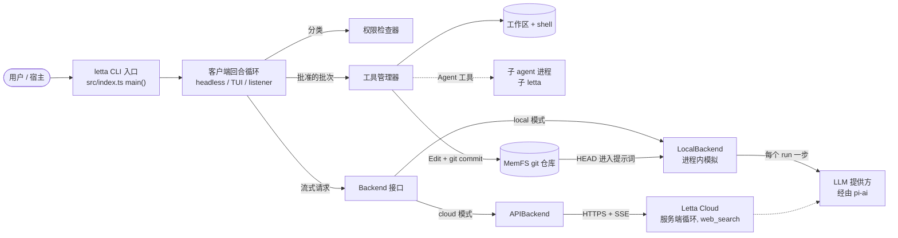
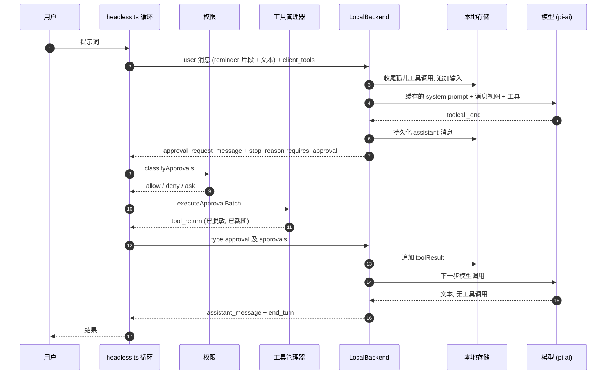
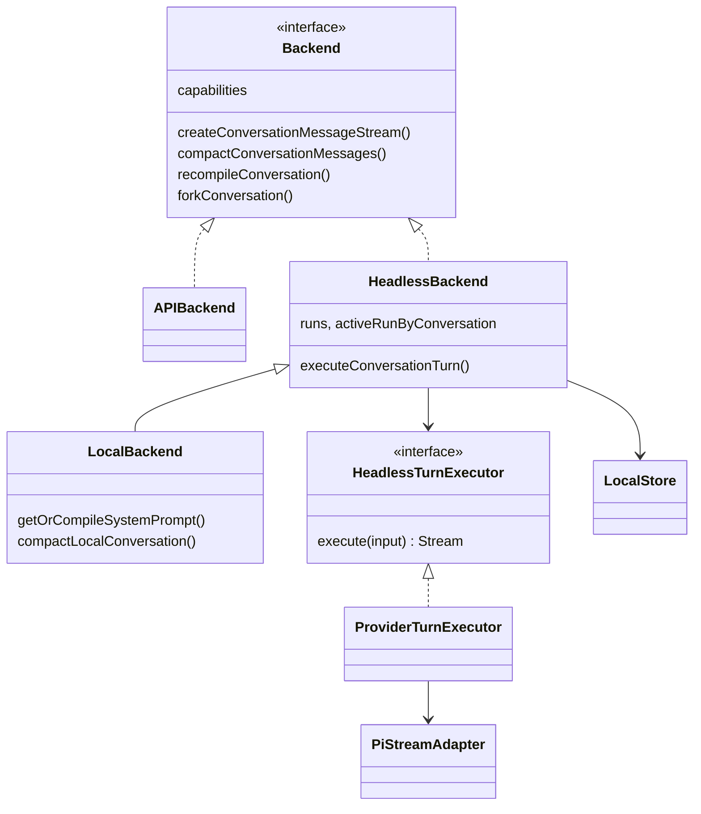
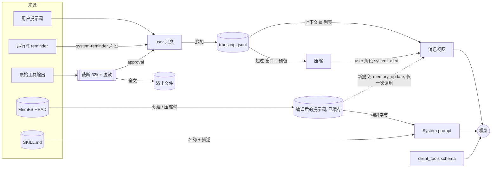
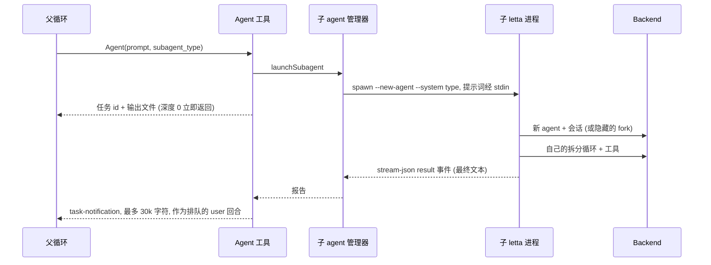

[English](letta-code.md) · **中文**

# letta-code（`letta-ai/letta-code`）

> 研究基于提交 [`4b028fa`](https://github.com/letta-ai/letta-code/tree/4b028fab07c69edaac2ddb4f7b9a43573ff20d81)
> （2026-10-05，`@letta-ai/letta-code` v0.34.4）。下文的源码路径都相对于该仓库根目录，行号对应这个提交。
> **事实**指在源码中读到、经测试证实或在运行时观察到的内容；**解读**是我对作者意图的理解。

**交互式图表（Archify，每个节点都链接到源码）：**
[架构](../diagrams/letta-code/architecture.html) ·
[执行流程](../diagrams/letta-code/execution-flow.html) ·
[核心抽象](../diagrams/letta-code/core-abstractions.html) ·
[上下文流](../diagrams/letta-code/context-flow.html) ·
[记忆流](../diagrams/letta-code/memory-flow.html) ·
[工具运行时](../diagrams/letta-code/tool-runtime.html) ·
[Agent 循环](../diagrams/letta-code/agent-loop.html) ·
[子 Agent 流程](../diagrams/letta-code/sub-agent-flow.html)

（图表与英文版共用，图中文字为英文。）

**最小复现：** [`experiments/letta-code/`](https://github.com/woaitqs/repo-research/tree/main/experiments/letta-code)

---

## 摘要（TL;DR）

- **Agent 循环被拆在一个契约的两侧。**
  - **后端一侧：** 有状态的后端**每个 run 只执行一步模型调用**。模型想调用工具时，每个调用都以 `approval_request_message` 发出，run 以 `stop_reason: "requires_approval"` 结束（`src/backend/dev/provider-turn-executor.ts:496-529`）。
  - **客户端一侧：** harness 对权限分类，在用户机器上执行工具，然后把 `{type: "approval", approvals: [...]}` 作为下一个请求发出（`src/headless.ts:2578-2667`）。后端从不执行客户端工具。
- **一个按 Letta REST 客户端类型定义的 `Backend` 接口，有两个实现**（`src/backend/backend.ts:190-369`）。
  - `APIBackend` 对接 Letta Cloud。
  - `LocalBackend` 在进程内模拟同一套 run/stream 契约，用 [pi-ai](https://github.com/earendil-works/pi) 作为模型提供方层。
  - 本地后端是从一个测试用的假实现演化来的。历史：门面 `7b335668` → 本地后端 `f15c80f7` → 迁移到 pi-ai `861c37f3`。
- **记忆（MemFS）是每个 agent 一个 git 仓库，从 `HEAD` 编译进 system prompt。** 未提交的修改永远不会到达模型。
  - 编译后的提示词按会话缓存，并保持字节不变。新提交只会给*下一次*模型调用加一个一次性的 `<memory_update>`（`src/backend/local/local-backend.ts:896-947`）。
  - **运行时已验证：** 同一会话之后的调用不再携带这个更新。要等压缩、新会话或显式重新编译才会生效。
- **上下文工程的核心是前缀稳定。**
  - 易变的事实（时间、git 状态、agent id、权限模式）作为 `<system-reminder>` 片段附在 *user* 消息上（`src/reminders/engine.ts:548-606`）。
  - 用真实模型实测：一个回合内的每一步，system prompt（29,116 字符）和工具 schema（19 个工具，74,924 字符）都字节相同。
- **长会话靠只追加的 transcript 加压缩维持。**
  - 压缩只追加一行记录，并替换"在上下文中"的 id 列表。摘要以 user 角色的 `system_alert` 回到上下文。
  - 滑动窗口的目标没有算进固定的提示词底座（`src/backend/local/compaction.ts:602-630`）。用真实模型验证：在小窗口（40–45k）上，"压缩后"的请求仍可能撑满窗口，回合以 `max_tokens_exceeded` 结束。
- **执行运行时在客户端，默认偏向自主。**
  - 默认权限模式是 `unrestricted`（`src/permissions/mode.ts:10`）。
  - 内核沙箱（bwrap/Seatbelt）对 agent 的 shell 需要显式开启，且从不隔离网络。
  - 纵深防御：在所有模式下都生效的 deny 规则和跨 agent 记忆守卫，再加上 PreToolUse hook、对各类输出的密钥脱敏，以及 32k 字符截断加溢出文件。
- **子 agent 是独立的 `letta` 进程**，每个都是讲同一套 stream-json 协议的 headless 子进程。
  - 全新子 agent 是一个没有记忆的新 agent，只看到自己的任务说明；fork 子 agent 拿到父会话的一份拷贝。只有最终报告会以 `<task-notification>` 返回。
  - **已验证：** 在一次性的 `letta -p` 中，父进程在报告到达前就退出了。长期运行的宿主（双向 stream-json、TUI、listener）能收到报告。

## 为什么值得研究（Why This Repository Matters）

- 它是 MemGPT/Letta 团队围绕**有状态 agent** 这一主张做的生产级编码 agent。
  - 记忆、身份和历史属于 agent，而不是某次会话。
  - harness 在用户所在的任何地方运行：笔记本、CI、远程"computer"、聊天渠道。
- 它给一个真实的部署问题提供了具体答案：**状态在云端，工具在用户机器上**。答案是一套协议，而不是进程内循环。之后同一套客户端代码还驱动了完全本地的运行时。
- 它把**记忆当作代码**。记忆是有版本的 Markdown，用普通文件工具编辑，由 pre-commit hook 校验。后台的"反思（reflection）"agent 在 git worktree 中整理它。
- 这个仓库是为 AI 贡献者设计的。`AGENTS.md`（以 `CLAUDE.md` 符号链接）为每条 CI 规则解释了*原因*，并且这些检查都被强制执行：
  - 不用 `../` 导入；
  - 具名导出和 `export function`；
  - 单文件 1,000 行的只降不升上限；
  - 零导入环；
  - 分层边界；
  - mock 隔离。

## 仓库概况（Repository Snapshot）

| 项目 | 值（事实） |
|---|---|
| 包 | `@letta-ai/letta-code` 0.34.4，bin `letta` → `letta.js`：用 Bun 从 `src/standalone-entry.ts` 构建出的 22 MB Node 包（`build.js:76-85`） |
| 语言 / 运行时 | TypeScript；开发用 Bun（`packageManager: bun@1.3.14`），发布后在 Node ≥ 22.19 上运行 |
| 规模 | `src/` 中约 30.5 万行非测试 TS/TSX；`src/` 下 931 个测试文件（其中 12 个是依赖 API 的集成测试） |
| 最大的目录（非测试行数） | `cli/` 8.9 万（Ink TUI）、`channels/` 4.5 万、`websocket/` 3.7 万（listener/app-server）、`tools/` 2.5 万、`agent/` 2.4 万、`backend/` 2.2 万 |
| 关键依赖 | `@letta-ai/letta-client`（REST 类型）、`@earendil-works/pi-ai`（本地模型提供方运行时）、`@modelcontextprotocol/sdk`、`ink`/`react`、`node-pty` |
| 历史 | 3,707 个提交；首个提交 2025-10-24 |
| 测试 | 8,778 个单元测试通过，44 个跳过，7 个失败。7 个失败都能追到本容器的环境原因（见[验证](#验证verification)） |

## 架构（Architecture）

架构把**状态与推理在哪里**和**执行在哪里**分开。源码在 `AGENTS.md` 中写明了这种分层，并由 `scripts/check-layer-boundaries.js` 强制执行；下面的调用关系也印证了这一点。



分层（事实；见 `AGENTS.md` 的分层图，由 `scripts/check-layer-boundaries.js` 强制）：

```text
cli/        Ink TUI、斜杠命令                    ┐
websocket/  listener + app-server（Desktop）     ├─ 宿主：各自拥有一个回合循环
headless.ts 一次性与双向 -p                       ┘
agent/      领域层：发送、流、审批、记忆、skills、子 agent
tools/      工具定义 + 执行管理器
backend/    Backend 契约；APIBackend（Cloud）与 LocalBackend（进程内）
providers/  模型提供方连接辅助   permissions/  纯规则   utils/  叶子层
```

三条事实决定了整体形态：

1. **`Backend` 是接缝。** 每个宿主都调用 `getBackend()`（`src/backend/backend.ts:741-744`）。模式来自 `resolveBackendMode()`（`src/backend/backend-mode.ts:24-28`）。`BackendCapabilities`（`backend.ts:169-183`）让客户端按能力开关行为，例如服务端工具管理、远程还是本地 MemFS、环境路由。
2. **`LocalBackend` 与客户端循环运行在同一个 Node 进程里。** 它继承 `HeadlessBackend`（`src/backend/local/local-backend.ts:178`），后者实现了 run、可重放的 chunk、取消和孤儿工具调用的收尾（`src/backend/dev/fake-headless-backend.ts:196-776`）。只有模型调用会离开进程。
3. **客户端工具从不注册到服务端 agent 上。** 在 Letta Cloud 上创建 agent 时只带服务端工具 `web_search` 和 `fetch_webpage`（`src/agent/create-agent-request.ts:35`；`src/agent/create.ts:294-297`）。客户端工具的 schema 以 `client_tools` 随每个请求发送（`src/agent/message.ts:310-337`）。这是提交 `34367de5`（#456，2026-01-02）引入的，同时删除了旧的"占位工具注册"路径（+178 / −1,154 行）。

## 主要执行流程（Main Execution Flow）

从入口到回答，以 `letta -p "…"` 加 `--backend local` 为例。下面每一步也都通过记录请求的代理在运行时观察到了（见[验证](#验证verification)中的 S1）。



| # | 步骤 | 位置（事实） |
|---|---|---|
| 1 | `bin` → `letta.js` → `standalone-entry.ts` → `index.ts main()` | `package.json:8-10`；`src/standalone-entry.ts:1-11`；`src/index.ts:571` |
| 2 | headless 还是 TUI：`-p`、`--run` 或非 TTY 的 stdin 会选择 headless | `src/index.ts:809`；`src/cli/startup-mode.ts:1-18`；分发 `src/index.ts:1291-1292` |
| 3 | 构造回合内容：共享的 `<system-reminder>` 片段（会话上下文、agent 信息、MCP 服务器、权限模式、记忆 git 同步、磁盘空间），然后是预加载的 skill，最后是提示词 | `src/headless.ts:1894-1949`；`src/reminders/catalog.ts:8-120`；`src/reminders/engine.ts:548-606` |
| 4 | 回合循环：`while (true)` → `sendMessageStream(conv, input, …, {maxRetries: 0})` | `src/headless.ts:2176-2244`；`src/agent/message.ts:347-355` |
| 5 | 请求体：`messages`、`client_tools`、`client_skills`、`streaming`、`background`、`include_compaction_messages`；发出的文本会去掉密钥 | `src/agent/message.ts:310-337, 382-440` |
| 6 | 后端 run：已有活动 run 则拒绝；收尾悬空的工具调用（审批回合除外）；追加输入；`startRun` | `src/backend/dev/fake-headless-backend.ts:473-504` |
| 7 | 确定 system prompt：缓存的编译结果；如果已提交的记忆版本变了，再加一个 `<memory_update>` | `src/backend/local/local-backend.ts:462-500, 896-947` |
| 8 | 模型调用：调用前的压缩检查、`toPiMessages(view)`、把临时的记忆增量作为末尾的 `system` 消息、`streamSimple` | `src/backend/dev/pi-stream-adapter.ts:535-606` |
| 9 | 映射流：文本/思考增量 → `assistant_message`/`reasoning_message`；`toolcall_end` → `approval_request_message`；`done` → `stop_reason`（`requires_approval` / `max_tokens_exceeded` / `end_turn`） | `src/backend/dev/provider-turn-executor.ts:427-550` |
| 10 | 把每个 chunk 持久化到存储并附上 run id；没有停止原因就结束的流会变成 `requires_approval` 或 `error` | `fake-headless-backend.ts:691-776` |
| 11 | 客户端消费流：`StreamProcessor` 按 `tool_call_id` 累积审批；带着待审批项的 `end_turn` 会被改判为 `requires_approval` | `src/cli/helpers/stream-processor.ts:162-220`；`src/cli/helpers/stream.ts:446-470` |
| 12 | `requires_approval` → `classifyApprovals` → 一次性 headless 模式拒绝 `ask`（"Tool requires approval (headless mode)"）→ `executeApprovalBatch` | `src/headless.ts:2578-2667`；`src/cli/helpers/approval-classification.ts:124-230` |
| 13 | 下一个输入就是审批消息；后端把它变成 `toolResult` 消息 | `src/headless-response-state.ts:12-21`；`src/backend/local/local-store.ts:1507-1548` |
| 14 | `end_turn` → 结束（mod 的 `turn_end` 可以要求继续）；其他停止原因走重试阶梯或退出 | `src/headless.ts:2524-2575, 2814-2824` |

**事实：** TUI（`src/cli/app/use-conversation-loop.ts:744`）、headless 双向模式（`src/headless.ts:4272-4600`）和 WebSocket listener（`src/websocket/listener/turn.ts:314-856`）各自有**自己的**停止原因循环。它们共用 `sendMessageStream`、`drainStream*`、`classifyApprovals`、`executeApprovalBatch`，以及 `src/agent/turn-recovery-policy.ts` 中的恢复分类器。不可重试停止原因的列表重复了三次：`headless.ts:2814-2823`、`cli/app/retry.ts:12-21` 和 `websocket/listener/recovery.ts:113-122`。

## 核心抽象（Core Abstractions）



### `Backend`（契约）
- **职责：** agent / 会话 / run 的 API，以及 `capabilities`。
- **输入：** Letta REST 请求体（`messages`、`client_tools`、`client_skills` 等）。
- **输出：** Letta 流式 chunk（`assistant_message`、`approval_request_message`、`stop_reason`、`usage_statistics`、`event_message`、`summary_message`）。
- **生命周期：** 由 `getBackend()` 提供的进程级单例；`configureBackendMode()` 可替换它（`backend.ts:741-758`）。
- **依赖：** 只依赖 `@letta-ai/letta-client` 的类型。
- **源码：** `src/backend/backend.ts:169-369`。
- **为什么存在：** 无论状态在 Letta Cloud 还是在本地磁盘，客户端循环、TUI 和 listener 都能保持不变。它也让测试有了可替换的假实现。

### `HeadlessBackend` / `LocalBackend`（服务端模拟）
- **职责：**
  - `HeadlessBackend` 提供*服务端语义*：带 id 的 run、每个会话只有一个活动 run、为重放记录 chunk、取消，以及为悬空工具调用生成合成结果。
  - `LocalBackend` 增加 *agent 语义*：从 MemFS 编译的 system prompt、记忆增量、压缩策略、模型目录，以及压缩和 LLM 事件的 mod hook。
- **生命周期：** 每个进程一个；会话按需从磁盘加载。
- **源码：**
  - `src/backend/dev/fake-headless-backend.ts:196-776`
  - `src/backend/local/local-backend.ts:178-976`
- **为什么存在：** 不分叉客户端就能有一个完全本地的运行时，同时为测试保留确定性的执行器（`src/backend/dev/headless-turn-executor.ts:94-176`）。`LETTA_LOCAL_BACKEND_EXECUTOR=deterministic` 会把模型换掉（`backend.ts:712-722`）。

### `HeadlessTurnExecutor` / `ProviderTurnExecutor` / `PiStreamAdapter`（一步模型调用）
- **职责：** 把确定好的输入变成恰好一次模型调用，再映射回 Letta chunk；在这一次调用内部做有上限的恢复。
  - 上下文溢出 → 压缩，最多 3 次（`pi-stream-adapter.ts:64, 826-846`）
  - 请求体过大 → 省略图片或压缩（`:848-928`）
  - 暂时性错误 → 最多重试 3 次，并发出 `event_message` chunk（`:61, 930-960`）
- **源码：**
  - `src/backend/dev/headless-turn-executor.ts:13-32`
  - `src/backend/dev/provider-turn-executor.ts:552-565`
  - `src/backend/dev/pi-stream-adapter.ts:486-963`
- **为什么存在：** 隔离模型提供方的差异。pi-ai 负责请求体转换、能力判断和模型目录。`AGENTS.md` 把在 Letta Code 里重新实现这些视为"默认可疑"。

### `LocalStore`（transcript + 上下文视图）
- **职责：** 只追加的 `messages.jsonl`（pi 的 session-entry 格式，带 `id`/`parentId`，schema v2）、`in_context_message_ids` 列表、编译后的提示词（`system-prompt.json`）、会话元数据、加载时的工具结果修复与裁剪。
- **源码：**
  - `src/backend/local/local-store.ts:927-1209`
  - `src/backend/local/local-transcript.ts:24-160`
- **为什么存在：** 把完整历史（Letta 称为"回忆记忆 recall memory"）与有上限的模型视图分开。

### 客户端回合循环（`headless.ts`、`use-conversation-loop.ts`、listener 的 `turn.ts`）
- **职责：** reminder、发送、消费流、分类、执行、续跑、恢复、排队。
- **输入：** 用户输入或排队的条目（`src/queue/queue-runtime.ts`）。
- **输出：** 审批消息和渲染结果。
- **为什么存在：** 它是 agent 的*执行运行时*和交互宿主。各宿主处理 `ask` 的方式不同：TUI 弹对话框，SDK 通过 stdio 发 `can_use_tool`，listener 走 WebSocket，一次性 headless 自动拒绝。

### 工具（`defineTool` → 注册表 → 每回合快照）
- **接口：** `ToolAssets {schema, description, modelForm, impl: (args) => Promise<unknown>}`（`src/tools/define-tool.ts:8-38`）。
- **归一化：** 管理器把结果统一为 `{toolReturn, status, stdout?, stderr?}`（`src/tools/manager.ts:294-319`）。
- **工具集：** 按模型提供方选择：`default`（Claude 风格）、`codex`（`exec_command`/`ApplyPatch`）或 `letta`（`src/tools/toolset-catalog.ts:18-105`；自动选择规则 `src/tools/toolset.ts:61-84`）。
- **快照：** 每回合一个快照（`ctx-*`，最多保留 4,096 个），固定执行该回合工具调用时所用的注册表（`manager.ts:360-405, 735-813`）。

### `PermissionChecker`
- **决策：** `allow | deny | ask | alwaysAsk`。
- **模式：** `standard | acceptEdits | unrestricted | strict`；默认是 `unrestricted`（`src/permissions/mode.ts:3-35`）。
- **按顺序判定**（`src/permissions/checker.ts:238-599`）：
  1. 工作区沙箱守卫
  2. 跨 agent 记忆守卫
  3. deny 规则
  4. `--disallowedTools`
  5. alwaysAsk
  6. **模式覆盖**
  7. allow 列表
  8. 只读 shell、写自己的记忆、读工作目录内的文件（自动允许）
  9. allow 和 ask 规则
  10. 默认：ask

### 子 agent（`SubagentConfig` + 管理器）
- **定义：** 带 frontmatter 的 Markdown 文件（`name`、`description`、`tools`、`model`、`skills`、`fork`、`launchProfile`）（`src/agent/subagents/index.ts:90-109`）。
- **内置类型：** `general-purpose`、`fork`、`recall`、`memory`、`reflection`、`init`（`src/agent/subagents/builtin/*.md`）。
- **启动：** 独立进程（`src/agent/subagents/manager.ts:180-268, 415-460`）。

### MemFS
- **是什么：** agent 的 git 仓库。Cloud 模式下在 `~/.letta/agents/<id>/memory`（`src/agent/memory-filesystem.ts:46-57`），本地后端在 `$LETTA_LOCAL_BACKEND_DIR/memfs/<id>/memory`（`src/backend/local/paths.ts:48-53`）。
- **布局：** v1 = `system/` 下的文件是核心记忆；v2 = 根目录的 `*.md` 是核心记忆，另有 `MEMORY.md` 索引和延迟加载的子目录（`src/agent/memory-format.ts:6-41`）。

## Agent 循环（Agent Loop）

```text
输入 ─▶ run 开始 ─▶ 模型一步 ─▶ stop_reason？
           ▲                    ├─ requires_approval ─▶ 客户端执行工具 ─┐
           └────── {type: approval}（新的 run）◀──────────────────────┘
                                ├─ end_turn ─▶ 结束
                                └─ error / max_tokens_exceeded ─▶ 退出（不重试）
```

- **事实：循环的驱动者是客户端。** 每经过一次"run 开始"就是一个新的后端 run。后端没有遍历工具调用的 `while` 循环；`HeadlessBackend.executeConversationTurn` 恰好调用一次执行器（`fake-headless-backend.ts:469-565`）。
- **事实：终止条件。**
  - `end_turn` 结束循环。
  - `max_turns` 只计算非审批输入（`headless.ts:2177-2191`）。
  - `cancelled` 以退出码 130 退出。
  - 不可重试的停止原因以错误退出。
- **事实：两侧都有恢复。**
  - 在一次模型调用内部（后端）：最多 3 次溢出压缩、最多 3 次暂时性重试。
  - 流开始之前（客户端）：审批冲突 → 生成新的拒绝；会话忙 → 按 10s·2ⁿ 退避，最多 3 次；暂时性错误 → 按 1s·2ⁿ 退避并遵守 `Retry-After`，最多 3 次（`src/agent/turn-recovery-policy.ts:391-419`）。
  - 流进行中（客户端）：通过 `streamRunMessages(runId, {starting_after: seq})` 续接，headless 最多 20 次，listener 最多 60 次（`src/cli/helpers/stream.ts:552-981`）。
- **事实：并行的工具调用会并发执行，但有保护**（`src/agent/approval-execution.ts:45-118, 427-437`）。
  - `Read`、`Grep`、`Glob`、`ViewImage`、`Agent`、`web_search` 并行执行。
  - `Edit`/`Write` 按文件路径串行。
  - `Bash`、`exec_command`、`ApplyPatch` 和未知工具共用一把全局锁。
  - 结果保持调用顺序。
- **解读：** 拆分循环在 Cloud 模式下让每个工具步骤多一次往返。换来的是：后端永远不需要访问用户机器；而且状态在后端，任何宿主（TUI、Desktop、通过 chat.letta.com 的手机）都能续跑或重放一个 run。

[Agent 循环图](../diagrams/letta-code/agent-loop.html)展示了等待状态（压缩/重试、等待审批）和各个出口。

## 上下文工程（Context Engineering）

上下文工程是这个项目的核心。设计目标是**稳定的前缀**和**有上限、可恢复的视图**。



**1. 上下文如何构造（本地后端，事实）。** `PiStreamAdapter.streamOnce` 构造一个 pi-ai `Context`（`src/backend/dev/pi-stream-adapter.ts:594-606`）：

```text
systemPrompt = 缓存的编译后提示词                       （基础预设 + 渲染后的核心记忆）
             + 来自 client_skills 的 <available_skills>  （system-prompt-compilation.ts:391-430）
messages     = toPiMessages(上下文视图)                  （去掉孤儿工具结果，去掉末尾的 assistant）
             + [ 作为 system 消息的 <memory_update> ]     （只在新提交后的第一次调用）
tools        = client_tools                              （每个请求都带）
```

**2. 什么进入了上下文（观察，S1）。** 一个全新 agent 的第一个请求包含：
- 29,116 字符的 system prompt，包含这些部分：
  - Context Architecture
  - Identity
  - Existence & Continuity
  - Harness Architecture
  - Self-evolution
  - `<human>` 和 `<persona>` 两个核心记忆块
  - `<memory>` 索引
  - 列出 19 个内置 skill 的 `<available_skills>`（只有名称和描述）
- 一条由 5 个片段组成的 user 消息：4 个 `<system-reminder>` 片段（设备/git、agent 信息与路径、MCP 服务器、权限模式），后面是提示词；
- 19 个工具 schema，共 74,924 字符。`Bash`（12,098）和 `Agent`（10,705）的描述最长。

**事实：** 工具 schema 大约是 system prompt 的 2.5 倍；在没有任何对话之前，用量报告中的提示词就已约 24k token。完整样本见 [`real_model/sample_request_S1.json`](https://github.com/woaitqs/repo-research/blob/main/experiments/letta-code/real_model/sample_request_S1.json)。

**3. 什么被排除在外（事实）。**
- 未提交的记忆（`system-prompt-compilation.ts:81-143` 读取的是 `git show HEAD:`）；
- v2 子目录中文件的正文，只以 `<directory path=… index=…/>` 列出（`:154-199`）；
- skill 正文，通过 `Skill` 工具按需加载，并以 `<skill_content>` 包裹的 user 消息注入（`src/tools/impl/skill.ts:337-379`）；
- 超出截断上限的工具输出，写入溢出文件；
- 被压缩移出的消息，仍留在 transcript 中（recall），可通过 `recall` 子 agent 检索；
- 子 agent 的 transcript。

**4. 工具结果（事实）。** 每个内置工具的结果都会去掉密钥（运行时 API key 和 agent 的整个密钥库）并截断（`src/tools/manager.ts:2307-2324`）。
- 各工具上限：Bash 30k 字符（失败时首尾各取，共 10k）、Read 2,000 行 / 30k 字符、Grep 10k、Glob 2,000 个文件；兜底 `TOOL_RETURN_MAX_CHARS = 32_000`（`src/tools/impl/truncation.ts:11-38`）。
- 完整输出写到 `~/.letta/projects/<cwd>/agent-tools/<tool>-<uuid>.txt`，截断后的文本写明 `[Full output written to: <path>]`（`src/tools/impl/overflow.ts:32-101`）。
- 加载 transcript 时还有一道 40,000 字符的裁剪，用于修复过大的结果（`src/backend/local/local-message-projection.ts:14, 469-519`）。

**5. 压缩（事实）。**
- **调用前检查：** 估算的上下文超过 `窗口 − min(16384, 窗口的 20%)` 时压缩（`provider-turn-executor.ts:224-272`）。注释解释了原因：pi-ai 会把输出额度缩到 `窗口 − 上下文 − 4096`，所以接近满的请求不会报溢出，而是"以 `length` 结束"。
- **回合后检查：** 用模型提供方报告的用量再检查一次（`pi-stream-adapter.ts:751-779`）。
- **默认模式 `sliding_window`**（`compaction.ts:43-44, 584-650`）：从 30% 开始，每次多移出 10%，直到保留的尾部小于 `(1 − 30%) × 窗口`。只在 assistant 消息处切分，从不拆开待处理的工具调用。
- **后备模式 `all`：** 除末尾待处理的工具调用外全部摘要（`:652-667`）。
- **摘要提示词** 要求写出目标、发生了什么、原样保留的标识符、错误、当前状态，以及以后检索历史用的"查找线索"（`:61-102`）。
- **摘要器本身** 在溢出时会用逐步缩短的 transcript 重试，从 120k 字符一直降到 2k（`:30-42, 503-549`）。
- **存储：** 结果存为**一条追加的 `compaction` 记录**，`in_context_message_ids` 变成 `[摘要, …保留的消息]`（`local-store.ts:1157-1209`）。摘要是一条 **user 角色**消息，内容是 JSON 格式的 `system_alert`（"Note: N messages … have been hidden …"）（`compaction.ts:682-708`）。
- **之后** 重新编译 system prompt，把已提交的记忆一并纳入（`local-backend.ts:760-786`）。

**6. 代码仓库上下文（事实）。** 没有针对用户代码的索引或检索层。agent 靠 `Grep`/`Glob`/`Read`/`Bash` 浏览。第一条 user 消息以 reminder 形式带上 git 分支、最近的提交和 `git status`。项目知识只有在 agent 写入 MemFS 或 skill 后才会保留。

**7. 子 agent 的上下文（事实，S3 已验证）。**
- 全新子 agent 是一个新 agent，有自己的 system prompt 和工具集，*没有记忆块*（`manager.ts:194-196`），也*没有共享 reminder*（reminder 目录里没有 `subagent` 模式）。它的第一个请求是 `[system, user(发送者 reminder + 任务说明)]`，约 12.5k 提示词 token，11 个工具。
- fork 子 agent 拿到父会话的一份隐藏拷贝，外加一条"你**不是**主 agent"的 reminder（`src/agent/subagents/fork-conversation.ts:50-106`；`manager.ts:769-803`）。

**8. 隔离（事实）。** 父 agent 只能看到子 agent 的最终文本：经由 Agent 工具的输出文件，以及上限 30k 字符的 `<task-notification>`（`src/tools/impl/task.ts:432-479`）。在 S3b 中，子 agent 的 system prompt 从未出现在父 agent 的任何请求里。

**9. 长时运行的控制（事实 + 发现）。**
- 有上限的压缩与重试、摘要中的"查找线索"、以及 recall 子 agent，让长会话可以持续下去。
- **发现（已验证）：** 滑动窗口的目标和"现在放得下了"的检查只计算*消息* token（`compaction.ts:602-630`；`local-backend.ts:755-758`）。system prompt 和工具 schema（这里约 24k token）没有算进去。
  - 在 40–45k 窗口上，压缩后的请求仍有 35.1k–37.6k 提示词 token。pi-ai 于是把 `max_completion_tokens` 压到 1，模型返回 `finish_reason: length`，回合以 `max_tokens_exceeded` 结束。S4b 3 次运行都如此，S4a 有 1 次如此。
  - 在 128k 以上的窗口上不太会发生。在小的本地模型上（Ollama 的 32k 窗口就够了），这个底座占了窗口的很大一部分。

**10. 前缀稳定（事实 + 观察）。**
- `AGENTS.md` 禁止在历史中插入 `role: "system"` 的通知。自动生成的上下文改用 user 角色的 `<system-reminder>` 片段。
- S1 中，三次调用的 system prompt 和工具 schema 都字节相同。三次运行里，每次 S1 调用约 24.2k 提示词 token 中都有 23,680–24,192 个命中模型提供方的缓存（[`provider_usage.json`](https://github.com/woaitqs/repo-research/blob/main/experiments/letta-code/real_model/provider_usage.json)）。
- 同一文件也显示了破坏前缀的代价：S2 中唯一携带 `<memory_update>` 的那次调用，约 26–27k 提示词 token 中只有 5,888–6,016 个命中缓存；下一次调用回到原来的提示词，又有约 25–27k 命中。
- 缓存复用头 `X-Letta-Response-State` 只在"只有审批、没有新 reminder"的续接请求中发送（`src/agent/message.ts:51-55, 477-489`）。

## 记忆（Memory）

| 问题 | 回答（除非注明，均为事实） |
|---|---|
| 记忆是什么？ | agent 的 MemFS git 仓库里已提交的 Markdown。根目录文件（v2）或 `system/` 下的文件（v1）是*核心记忆*，会渲染进提示词。带索引的子目录和其他文件是*外部记忆*，按需读取。skill 放在 `skills/` 下。没有 MemFS 的 Cloud agent 仍有服务端的 `persona`/`human` 记忆块（`src/agent/memory.ts:16-93`）。 |
| 存在哪里？ | Cloud 模式：`~/.letta/agents/<id>/memory`，同步到 `${memfsBase}/v1/git/<id>/state.git`（`memory-git.ts:228-233`）。本地后端：`$LETTA_LOCAL_BACKEND_DIR/memfs/<id>/memory`。 |
| 谁来写？ | 1. 主 agent，用普通的 `Edit`/`Write`/`Bash` 加自己的 `git commit`。这些操作由 `isOwnMemoryWrite` 自动放行（`src/permissions/memory-write-allowance.ts:37-62`），并由提示词指导（`src/agent/prompts/letta_root_memfs.md:60-77`）。2. 后台的 `memory` worker 和 `reflection` 子 agent，各自在私有 git worktree 中工作，由 harness 在锁保护下合并（`src/agent/memory-worktree.ts:363-666`；`src/agent/memory-operation.ts:5-59`）。3. 处理冲突或无效提交的修复 worker，对每个不同的状态只尝试一次。 |
| 谁来校验？ | pre-commit hook 强制要求精确的 `name`/`description` frontmatter、每个投影目录有 `MEMORY.md` 索引、skill 目录结构，以及树的上限（默认：深度 2、每个文件 20k 字符、核心记忆共 65,536 字符）。修改这些上限需要 `LETTA_MEMORY_CONSTRAINTS_UPDATE=1`（`src/agent/memory-git-hooks.ts:38-211`；`src/memory-frontmatter.ts:18-122`；`src/memory-constraints.ts:302-308`）。 |
| 谁来读取？ | 提示词编译（核心记忆）。agent 自己用工具读外部文件。reflection 读取一份 40k 字符的父 agent 记忆快照。 |
| 如何进入上下文？ | 在会话创建、显式重新编译、压缩，或 worker/reflection 合并时编译进 system prompt（`src/agent/subagents/memory-worker.ts:170`）。会话中途的新提交只给下一次调用加一个 `<memory_update>`（`local-backend.ts:917-939`）。 |
| 作用范围 | 按 **agent**，跨它的所有会话和机器。skill 可以按项目（`.agents/skills`）、按用户（`~/.letta/skills`）或按 agent（在 MemFS 中）。共享记忆仓库可以挂到多个 agent 上（Cloud）。 |
| 更新与过时 | 提示词自己就写着"Editing memory does NOT change your behavior in the current turn"（`letta_root_memfs.md:53-56`）。**已验证的缺口：** 一次性增量之后，同一会话的后续调用既看不到新记忆，也看不到增量（探针 P3b；真实模型 S2：第 2 回合的调用回到了原来的提示词哈希）。agent 仍能从 transcript 中自己的工具调用知道自己改过什么；外部的修改则要等重新编译才可见。 |
| 显式还是隐式？ | 显式：由 agent 决定写什么。reflection 额外提供周期性的、主流程之外的整理。实际默认是每 25 步一次：`DEFAULT_SETTINGS` 设置了 `reflectionTrigger: "step-count"`、`reflectionStepCount: 25`（`src/settings-manager.ts:182-184`），我们运行时 headless 的 init 事件也报告 `step-count`/25。`src/cli/helpers/memory-reminder.ts:51-56` 中的 `compaction-event` 默认值只在没有这些设置时才会用到，实际上用不到。没有测试固定全新安装时的默认值。 |

**四个容易混淆的概念：**

```text
会话历史     后端 transcript（Cloud 会话 / 本地 messages.jsonl）。不可变、完整、可检索（"recall"）。
上下文       一次模型调用携带的内容：编译后的 system prompt + 上下文视图 + 工具 schema（+ 一次性增量）。
持久记忆     MemFS：每个 agent 一个 git 仓库里已提交的 Markdown；核心文件渲染进 system prompt。
外部存储     溢出文件、reflection 的 transcript（~/.letta/transcripts）、memory worker 的交接快照、工作区本身。
```

**真实模型观察（S2，3 次运行均如此）。** 被要求记住一个事实时，agent：
1. 用 `git status` 查看 `$MEMORY_DIR`；
2. 读取 `human.md`、`MEMORY.md` 和 `persona.md`；
3. 编辑 `human.md`，并用自己写的提交信息提交（例如 `memory: record user's favorite color (teal)`）。

`<memory_update>` 到达了下一次模型调用。对这个 OpenAI 兼容的模型，pi-ai 把它并进了 system 消息，因为该模型的兼容性标志表明它不支持对话中途的 system 消息（`node_modules/@earendil-works/pi-ai/dist/utils/transcript.js:96-104`）。

在新会话中，这个事实已经在编译后的提示词里，模型不调用工具就回答了"Teal"。

## 工具（Tools）

- **接口与注册**（事实）：工具是由 `defineTool(...)` 构建的静态表（`src/tools/tool-definitions.ts:122-284`）。另外三个来源会添加工具：SDK 注册的外部工具（`register_external_tools`，`src/headless.ts:3919-3935`）、listener 的外部工具、mod 工具。序列化顺序是内置 → 外部 → mod，后来者覆盖先来者（`src/tools/client-tool-serialization.ts:48-78`）。
- **发现：** 内置工具没有运行时发现。暴露哪些工具由每个模型的*工具集*选择决定。子 agent 类型和 skill 通过工具描述（子 agent 的描述被注入 `Agent` 工具的描述，`src/tools/manager.ts:1185-1187, 1324-1350`）和 `client_skills` 让模型知道。
- **调用：** `executeTool(name, args, {signal, toolCallId, toolContextId, …})`（`src/tools/manager.ts:2447-2511`）执行一条流水线：取回合快照 → 等待记忆 checkout → mod `tool_start` → 执行阶段的 mod 权限覆盖 → **PreToolUse hook**（阻止或 `updatedInput`）→ 注入密钥环境变量 → `tool.fn` → 展平 → **脱敏 + 截断** → PostToolUse 反馈 → mod `tool_end` 覆盖（`:1966-2433`）。
- **错误：** 从不抛回给模型，而是变成 `status: "error"` 的文本，例如 `Error executing tool: …`、`Tool not found: X. Available tools: …`、`Error: Tool execution blocked by hook. …` 或 `Interrupted by user`。
- **重试：** 没有工具级重试。重试只针对模型调用和流，不针对工具。
- **权限：** 见[核心抽象](#核心抽象core-abstractions)中的权限检查器。分类发生在执行**之前**。执行时只会重新检查 mod 覆盖（`manager.ts:2156-2168`），所以执行的安全性依赖每个调用方都先做分类。
- **MCP：** MCP 工具**不是** `client_tools`。agent 在 shell 中调用 `letta mcp search|schema|call`（内置 skill `using-mcp-tools`）。
  - 本地配置的服务器在客户端运行。
  - 挂在 Letta Cloud 上的服务器在服务端运行（`POST …/tools/{id}/run`，`src/backend/api/unified-mcp.ts:286-303`）。
  - *解读：* 这样无论挂了多少个 MCP 服务器，模型看到的 schema 都保持不变。
- **服务端工具：** `web_search`/`fetch_webpage` 在 Letta Cloud 内部运行。它们的结果以 `tool_return_message` 到达，客户端随即丢弃对应的审批项（`stream-processor.ts:162-169`）。

## 运行时 / 沙箱（Runtime / Sandbox）

**推理在哪里结束、执行从哪里开始**（事实）：

| 步骤 | 归属 | 代码 |
|---|---|---|
| 选择工具集，序列化 schema | 客户端 | `src/tools/toolset.ts:290-439`；`manager.ts:735-813` |
| 推理，发出工具调用 | 后端（Cloud 服务端或进程内的 `LocalBackend`） | `provider-turn-executor.ts:496-529` |
| 服务端工具（网页搜索、Cloud 上的 MCP） | 服务端 | `create-agent-request.ts:35`；`unified-mcp.ts:286-303` |
| 分类、询问、执行、脱敏、截断 | 客户端 | `approval-classification.ts`；`approval-execution.ts:147-441`；`manager.ts:1966-2511` |
| 返回结果 | 客户端 → 后端，作为 `approval` 消息 | `approval-execution.ts:246-254, 296-301` |

**Shell 运行时。**
- 命令用 `bash -c` 运行；macOS 上改用 `zsh`，以绕开 bash 3.2 的 heredoc bug（`src/tools/impl/bash.ts:122-129`）。
- 进程是脱离的（detached），终止时针对整个进程组：先 SIGTERM，2,000 ms 后 SIGKILL（`src/tools/impl/shell-runner.ts`）。
- 存在队列桥接时，前台 `Bash` 调用 10 秒后自动转入后台。一次性 headless 没有桥接，所以调用会一直阻塞。
- 后台进程和任务各最多 32 个（`process_manager.ts:137-143`）。

**沙箱（事实）。**
- 操作系统级的文件系统隔离：Linux 上是 bwrap（用 tmpfs 遮蔽被拒绝的根目录、`--die-with-parent`、**没有 `--unshare-net`**，`src/sandbox/bwrap.ts:15-22`），macOS 上是 Seatbelt。`AGENTS.md:689-691` 描述了一个 Windows 受限令牌辅助程序，但在这个提交的代码中没有 Windows 后端（`src/sandbox/policy.ts:48` 只允许 `seatbelt | bwrap`）。
- **适用范围：**
  - (a) agent 的 shell，仅在 `LETTA_FS_SANDBOX=1` 时启用。没有可用后端时会警告并以无沙箱方式运行（`src/sandbox/availability.ts:88-115`）。
  - (b) 运行时启动（Desktop）请求的工作区沙箱；这一种在失败时拒绝执行（`src/tools/impl/shell-sandbox.ts:62-91`）。
  - (c) 记忆类子 agent，**默认开启**：整个子进程被包裹，写入只限于 `~/.letta` 和 agent 自己的记忆目录（`src/agent/subagents/sandbox.ts:20-40`；`src/permissions/sandbox-policy.ts:255-285`）。
- **从不隔离的：** 网络、`rg` 子进程、hook 命令，以及父进程内的 `Read`/`Edit`/`Write`。这些依赖权限检查器的工作区守卫和跨 agent 守卫。

**解读。** 默认值偏向一个自主、常驻的 agent：`unrestricted` 模式（提交 `b5b757c8`，#2197，"make unrestricted the default"），隔离需要显式开启。在所有模式下都成立的不变量针对的是*其他 agent 的记忆*（跨 agent 守卫）和*密钥*（各处脱敏），而不是用户的工作区。这符合产品"你的 agent 在你的机器上"的定位，但把安全责任转移到了 deny 规则和 hook 上。

## 子 Agent / 工作流（Sub-Agents / Workflow）



- **进程模型**（事实）：每个子 agent 都是一个 headless 的 `letta` 子进程。
  - 参数：`--new-agent --system <type> --output-format stream-json --permission-mode unrestricted`、父 agent 的 allow/deny 列表、子 agent 的 `--tools`，以及 `--max-turns`。
  - 提示词经 stdin 传入。子进程有自己的进程组。
  - 环境变量：`LETTA_CODE_AGENT_ROLE=subagent`、`LETTA_SUBAGENT_DEPTH` = 父深度 + 1，以及父 agent 的各种 id（`src/agent/subagents/manager.ts:180-268, 330-345, 415-460`；`src/agent/subagents/subagent-launcher.ts:215-289`）。
  - 深度上限是 2。只有深度低于上限、具备完整能力的子 agent 才会拿到 `Agent` 工具（`src/agent/subagents/subagent-depth.ts:11-43`）。
- **类型：**
  - `general-purpose`：Bash、Read、Edit、Write、待办工具。
  - `fork`：全部工具，使用父会话。
  - `recall`：带检索说明的 fork。
  - `memory`、`reflection`、`init`：记忆启动配置，受操作系统沙箱保护。
  - 自定义类型来自 `~/.letta/agents/*.md` 和 `.letta/agents/*.md`（`src/agent/subagents/index.ts:141-153, 500-590`）。
- **返回约定：**
  - **深度 0：** 立即返回任务 id；报告稍后作为排队的 `<task-notification>` 到达（`src/tools/impl/task.ts:937-960, 432-479`）。
  - **深度 > 0：** 在前台运行，直接返回报告（`task-foreground.ts:22-64`）。
  - reflection、memory 和 integration 子 agent 静默完成。
- **观察（S3a/S3b，各 3 次均如此）：**
  - 在一次性 `letta -p` 中，父 agent 以"Launched the subagent… I'll report as soon as it finishes"结束了回合。子 agent 的第二次模型调用始终没有完成。一次性模式没有注册消息队列的消费者（队列添加器只在双向模式中设置，`src/headless.ts:3596`）。
  - 在双向 stream-json 中，通知作为第二个回合到达，父 agent 回答"2 lines"。有一次运行中，父 agent 在通知到达前就已经用 `Bash` 读了任务的输出文件。
- **agent 间消息：** `SendAgentMessage` 把消息排入另一个会话（Cloud 路由；默认是父会话），不等待回复就返回。
- **工作流：** 还有一个 `Workflow` 工具及配套 skill（`workflow-authoring`），用于运行脚本化的多 agent 工作流（`src/tools/impl/workflow.ts`）。我没有深入追踪它。

## 重要源码文件（Important Source Files）

| 文件 | 为什么重要 |
|---|---|
| `src/backend/backend.ts` | `Backend` 契约、能力标志、`APIBackend`、模式工厂 |
| `src/backend/dev/fake-headless-backend.ts` | run 语义：单一活动 run、收尾孤儿调用、持久化 chunk、处理缺失的停止原因 |
| `src/backend/local/local-backend.ts` | 编译后提示词的缓存、记忆增量、压缩编排 |
| `src/backend/dev/provider-turn-executor.ts` | 一步模型调用 → Letta chunk；工具调用 → `requires_approval`；压缩阈值 |
| `src/backend/dev/pi-stream-adapter.ts` | pi-ai `Context`；有上限的溢出/暂时性错误/图片恢复 |
| `src/backend/local/compaction.ts`、`local-store.ts`、`local-transcript.ts` | 滑动窗口、摘要打包、只追加的 transcript |
| `src/backend/local/system-prompt-compilation.ts` | MemFS → 核心记忆（来自 `HEAD`）、skill 块 |
| `src/headless.ts` | 一次性与双向回合循环、审批处理 |
| `src/agent/message.ts` | 请求体（`client_tools`、`client_skills`）、脱敏、响应状态头 |
| `src/cli/helpers/stream.ts`、`stream-processor.ts` | 消费流、累积审批、续接 |
| `src/agent/approval-execution.ts`、`src/cli/helpers/approval-classification.ts` | 权限分类与并行安全的执行 |
| `src/tools/manager.ts`、`src/tools/impl/truncation.ts`、`overflow.ts` | 执行流水线、hook、脱敏、截断、溢出 |
| `src/permissions/checker.ts`、`mode.ts` | 规则顺序、模式、守卫 |
| `src/reminders/engine.ts`、`catalog.ts` | `<system-reminder>` 的构造 |
| `src/agent/subagents/manager.ts`、`src/tools/impl/task.ts` | 子 agent 进程与报告约定 |
| `src/agent/memory-git.ts`、`memory-worktree.ts`、`memory-git-hooks.ts` | MemFS 同步、worktree、校验 |
| `src/agent/prompts/letta_root_memfs.md` | 向 agent 讲解它自身架构的 system prompt |
| `AGENTS.md` | 附带理由的规则；上文已对照代码核对 |

## 值得借鉴的 5+ 个实现决策（5+ Implementation Decisions Worth Learning From）

### 1. 在工具边界拆分 agent 循环
- **做法：** 后端每个 run 只执行一步模型调用。每个客户端工具调用都以 `requires_approval` 结束 run。客户端执行后用一条 `approval` 消息续跑。
  - 批准和拒绝共用一种消息形状：`{type: "tool", tool_return, status}` 或 `{type: "approval", approve: false, reason}`（`src/agent/approval-execution.ts:246-301`）。
  - 本地后端强制"每个会话只有一个活动 run"（`fake-headless-backend.ts:473-479`）。
  - 被中断的回合通过给悬空工具调用回填 `Turn did not complete` 来修复（`:480-497`；`local-store.ts:1550-1580`）。
- **解决的问题：** agent 状态在服务器上，但工具必须操作用户的文件和 shell，而且有多个宿主（TUI、Desktop、手机、CI）驱动同一个 agent。
- **为什么有意思：** 它把"远程 agent、本地工具"化简成一个可续跑的协议，任何宿主都能接着跑一个 run。后来同一套协议让他们在不改客户端的情况下写出了完全本地的后端。
- **权衡：**
  - Cloud 模式下每个工具步骤多一次往返；
  - 客户端必须自己负责重试/续接逻辑；
  - 四个宿主各自重新实现了停止原因循环（三份相同的不可重试停止原因列表没有一致性测试）；
  - 每个请求都重新发送工具 schema（这里是 75k 字符；靠前缀缓存缓解）。
- **源码位置：** `provider-turn-executor.ts:496-529`；`headless.ts:2578-2667`；`agent/message.ts:310-337`。
- **可复用：** 如果你的工具必须在模型循环之外的地方运行，就把"工具调用"做成一种*停止原因*，把"工具结果"做成一种*输入消息*。这样中断、审批界面和远程执行都是同一种机制。

### 2. 一个契约、两个后端，本地后端由测试假实现演化而来
- **做法：**
  - 抽出一个按厂商 REST 客户端类型定义的 `Backend` 门面（`7b335668`，2026-04-29）；
  - 把测试用的假实现 `FakeHeadlessBackend` 变成真正的运行时，在进程内实现它（`f15c80f7`）；
  - 两周后把 Vercel AI SDK 换成 pi-ai（`861c37f3`）。
  - `BackendCapabilities` 标志让客户端关掉本地后端做不到的功能（`backend.ts:169-183, 376-390`；`fake-headless-backend.ts:185-194`）。
  - 测试仍保留确定性的执行器（`headless-turn-executor.ts:94-176`）。
- **解决的问题：** 不分叉一个 30 万行的客户端，就提供本地优先模式：自带模型提供方、可离线、不需要云账号。
- **为什么有意思：** 最昂贵的部分，也就是带续接/审批/排队逻辑的客户端宿主，完全没动。模拟的范围只和契约一样宽。
- **权衡：**
  - 本地后端必须忠实模拟服务端语义：run、重放、取消、id、压缩事件；
  - 类型转换（`as never`、`as unknown as Stream`）标出了把本地数据结构硬塞进云端类型的地方；
  - 只在服务端存在的功能（`web_search`、环境路由、服务端密钥）通过能力标志关闭。
- **可复用：** 先引入协议接缝，再在后面放一个假实现，然后把假实现升级。全程都对着假实现测试。

### 3. 记忆即 git，从 HEAD 编译进缓存稳定的提示词
- **做法：**
  - 记忆是每个 agent 一个 git 仓库里的 Markdown。只渲染已提交的内容（`system-prompt-compilation.ts:81-143`）。
  - 编译后的提示词按会话缓存，键是原始提示词的哈希加 memfs 版本。
  - 新版本**不会**改写提示词，而是加一个一次性的 `<memory_update>`（`local-backend.ts:896-947`；在 `5bca801a` 中为 Opus 4.8 引入，在 `da372cb3` 中推广到所有模型）。
  - pre-commit hook 校验结构和大小（`memory-git-hooks.ts`）。
  - 后台写入者使用 worktree，并在锁保护下合并。
- **解决的问题：**
  - 自我编辑的记忆需要历史、diff、多机同步和冲突处理；
  - 每次编辑都改 system prompt 会毁掉提示词缓存；
  - 没有校验的自我编辑会逐渐腐化。
- **为什么有意思：** "提交 = 发布到上下文"是一个可以教给 agent 的清晰约定（`letta_root_memfs.md:53-56`），而 git 免费提供了来源追溯、回滚和同步。
- **权衡：** 时效性与缓存稳定之间的取舍。
  - 已验证的缺口（探针 P3b、S2）：一次性增量之后，*同一会话的后续调用*既看不到增量，也看不到新记忆。
  - 主 agent 自己的修改仍能通过 transcript 看到，但外部修改（worker、另一台机器）在压缩或新会话之前都不可见。
  - 后台合并*会*重新编译，从而打破该会话的缓存。
- **可复用：**
  - 把已提交的记忆当作唯一事实来源，渲染进稳定的前缀；
  - 如果下发增量，就把它持久化到 transcript 中（或在下次重新编译前一直重发），免得用一次就消失。

### 4. 保持前缀稳定：易变上下文搭在 user 消息上
- **做法：**
  - 时间、git 状态、agent id、权限模式、MCP 服务器和磁盘警告变成 `<system-reminder>` 文本片段，放在 user 内容前面（`reminders/engine.ts:548-606`）。
  - `AGENTS.md` 禁止在历史中插入 system 角色的通知。
  - system prompt 教模型把这些标签当作指令。
  - skill 目录的变化以只含元数据的 reminder 到达（`client-skills.ts:227-280`）。
  - 审批边界的缓存头只在没有新增内容时发送（`message.ts:51-55, 477-489`）。
- **解决的问题：** Anthropic 等 API 拒绝或不利于对话中途的 system 消息，而前缀中每改一个字节都会导致缓存未命中。
- **证据：** S1 中整个回合的 system prompt 和工具 schema 字节相同，每次 S1 调用至少 98% 的提示词 token 来自模型提供方的缓存。S2 中唯一一次 system 消息发生变化的调用（pi-ai 把 `<memory_update>` 并入了 system 消息），缓存命中降到约 22%。
- **权衡：**
  - reminder 属于历史的一部分：session-context 和 agent-info 在第一个回合发送，每次压缩或工作目录变化后重新发送（`src/reminders/engine.ts:63-77, 291-312`；`src/reminders/state.ts:88-89`）；
  - user 角色的文本之所以有权威，只是因为提示词这么说；
  - 每个展示历史的地方都必须把它们去掉（`src/cli/helpers/backfill.ts:52-67`；`src/cli/app/system-reminders.ts:8`）。
- **可复用：** 按易变程度给上下文分类。稳定的内容放 system prompt，每回合变化的内容放在回合输入的带标签片段里。永远不要为了通知状态而改动前缀。

### 5. 只追加的 transcript、作为消息的摘要、有上限的恢复
- **做法：**
  - transcript 只追加。压缩追加一行，并替换 `in_context_message_ids`。
  - 摘要以带"查找线索"的 user 角色 `system_alert` 回到上下文。滑动窗口只在 assistant 消息处切分，并保护待处理的工具调用。
  - 调用前以 16k 预留做压缩检查，回合后再用真实用量检查一次；每次调用的溢出压缩最多 3 次。
  - 摘要器为避开 Fable 5 的拒绝路径，回退到 Opus 4.8（`compaction.ts:430-455`）。
- **解决的问题：** 长期存在的 agent 会积累无限增长的历史，但历史必须保持可检索（recall），模型也必须能继续工作。
- **为什么有意思：** 和本系列之前研究的 deepagents 一样，它从不销毁历史。不同的是，这里的视图是一份存下来的 id 列表，而不是每次调用时重放的事件；摘要存在会话里，而不是文件里。
- **权衡：**
  - **已验证的发现：** 窗口目标没有算进固定的提示词底座（`compaction.ts:602-630`）。在小窗口上，压缩后的请求仍可能撑满窗口并以 `max_tokens_exceeded` 结束（S4b 3/3；S4a 1/3）。
  - 摘要有损（S4a：3 次中有 2 次能同时回忆起两个事实）。
- **可复用：**
  - 日志只追加，视图作为数据；
  - 按*整个*请求（system + 工具 + 消息）确定压缩目标；
  - 压缩后再检查一次。

### 6. 客户端运行时，分层且不可绕过的不变量
- **做法：**
  - 分类在执行之前，规则顺序固定。有些不变量排在模式覆盖*之前*：工作区守卫、跨 agent 记忆守卫和 deny 规则（`checker.ts:278-332`）。
  - PreToolUse hook 可以阻止调用或改写参数。
  - 主要输出通道上都会做密钥脱敏：内置工具返回、shell 流式输出、溢出文件、hook 输出和发出的 user 消息（`src/tools/secret-substitution.ts:202-517`）。密钥以环境变量注入，从不拼进命令（`:28-56`）。
  - 缺口（我的阅读）：SDK 注册的外部工具结果只截断、不脱敏（`src/tools/manager.ts:678-684`）。
  - 按资源加锁的调度器让读操作并行、写操作串行。
  - 32k 截断时写溢出文件。
- **解决的问题：** 即使在 `unrestricted` 模式下，自主 agent 也不能读别的 agent 的记忆、泄露用户的 API key，或把自己的上下文淹没。
- **权衡：**
  - 执行时不再检查：正确性依赖每个调用方先分类。
  - Bash 前缀规则只匹配主命令，所以 `Bash(curl:*)` 也会匹配 `export K=… && curl …`（`permissions-matcher.test.ts:293-307`）。
  - 内核沙箱需要显式开启，且网络是开放的。
- **可复用：** 想清楚哪些不变量在"yolo 模式"下也必须成立，把它们放在分类器中模式开关的*前面*。在每个输出口都做脱敏，而不只是工具返回值。

### 7. 子 agent 是讲同一协议的进程
- **做法：** 子 agent 就是以 headless 方式启动的同一个 CLI。
  - 全新子 agent 是一个无状态 agent，只有自己的任务说明（S3 已验证）。
  - fork 子 agent 拿到会话的一份隐藏拷贝。
  - 只有最终报告会以排队通知的形式返回。深度上限是 2。
  - 记忆类子 agent 默认受操作系统沙箱保护。
- **解决的问题：** 隔离上下文、崩溃、权限和文件系统访问，同时免费复用宿主的所有功能（续接、权限、日志）。
- **权衡：**
  - 进程启动开销，且每个子 agent 都要重新付出自己的 system prompt 和工具成本（这里约 12.5k token）；
  - **已验证：** 一次性 `letta -p` 没有队列消费者，所以父进程退出时，顶层后台子 agent 的报告就丢了。
- **可复用：**
  - 如果 agent 程序能以 headless 方式运行并输出结构化流，就用它自己作为子 agent 运行时；
  - 让"报告"成为唯一的返回通道；
  - 确保每个能启动后台子 agent 的宿主也能接收它们的结果。

### 8. 学习放在关键路径之外，通过 git 落地
- **做法：**
  - **反思：** reflection 子 agent（斜杠命令 `/dream`、`/reflect`；`src/agent/reflection-runs.ts:41`）在私有 worktree 中读取一段归一化的 transcript。默认每 25 步运行一次（也可以按压缩触发），并且只在父 agent 的记忆仓库干净时运行（`reflection-launcher.ts:770-1000`）。
  - **落地：** harness 在锁保护下合并结果。只有在 `merged` 或 `no_changes` 时，transcript 才被标记为已消费（`memory-worktree.ts:235-245, 363-666`）。
  - **修复：** 冲突和无效提交对每个不同的状态自动修复一次（`memory-conflict-repair.ts`）。
- **解决的问题：** 持续学习，同时不阻塞用户的回合，也不破坏记忆。
- **权衡：**
  - 复杂度不低，大约 10 种状态外加重试退避；
  - **文档漂移：** `AGENTS.md:762-771` 描述的状态（`landed`、`noop`、`pending_integration`）在代码中已不存在；
  - 主 agent 自己的提交不拿这把锁（`memory-operation.ts:25-34`）。
- **可复用：** 把记忆整理作为一个独立 agent 在副本（分支或 worktree）上运行。只在结果落地后才推进"已处理到哪里"的指针。

### 9. 为 agent 贡献者设计的代码库
- **做法：** `AGENTS.md` 列出每条由 CI 强制的规则及其*原因*：
  - 用 `@/` 导入，不用 `../`（"便于 grep"）；
  - 具名导出和 `export function`；
  - 单文件 1,000 行上限，基线只降不升；
  - 零导入环；
  - 分层边界；
  - 针对 Bun 全局 `mock.module` 的 mock 隔离检查。
- **为什么有意思：** 这些是面向 LLM 读者的检索友好规则，而不是风格偏好。文件大小上限之所以存在，是因为"agent 通常分段查看大文件，会漏掉远处的状态"。
- **可复用：** 如果有 agent 修改你的仓库，就把约定做成机械可检查的，并在 agent 会读到的地方解释原因。

## 最小复现（Minimal Reproduction）

[`experiments/letta-code/`](https://github.com/woaitqs/repo-research/tree/main/experiments/letta-code) 是 `minilc`：一个约 1,100 行、只依赖标准库的 Python 包，另加一个演示。它复现的是**架构**：基于后端契约的拆分循环，以及从 git 编译的记忆。`ScriptedModel` 代替 LLM，因此每条性质都能被精确断言。

| minilc | 复现的内容 |
|---|---|
| `backend.py` | `Backend` 契约；`LocalBackend` 的 run 语义（单一活动 run、每个 run 一步模型调用、工具调用 → `requires_approval`、孤儿调用收尾、有上限的溢出/暂时性错误恢复）；缓存的提示词 + 一次性 `<memory_update>` |
| `transcript.py`、`compaction.py` | 只追加的 JSONL + 上下文 id 列表；阈值 `窗口 − min(16k, 20%)`；在 assistant 边界处切分的滑动窗口；摘要作为 user 角色的 `system_alert` |
| `memfs.py` | 只从 `git show HEAD:` 渲染的 v2 布局；延迟加载的子目录 |
| `harness.py`、`reminders.py` | 客户端循环；reminder 放在 user 消息上；headless 下拒绝 `ask` |
| `permissions.py`、`tools.py` | 规则顺序，守卫与 deny 不可绕过；hook、脱敏、截断 + 溢出文件；按资源加锁的并行 |
| `subagents.py` | `Agent` 工具；全新与 fork 两种上下文；只返回报告；深度上限 |

演示（`./run.sh demo`）分六幕，检查 11 条不变量：
1. 拆分循环；
2. headless 下的权限拒绝；
3. 记忆提交 → 一次性增量 → 下一回合过时 → 新会话；
4. 截断 + 溢出；
5. 子 agent 隔离；
6. 只追加的压缩。

## 验证（Verification）

所有命令都在本次会话的容器中运行（Linux、Node 22.22、Bun 1.4.2 以及锁定的 1.3.14、Python 3.13、git 2.43）。

**1. 上游单元测试（锁定的提交，`bun install --frozen-lockfile`）。**

```bash
for s in 1 2 3 4; do node scripts/run-unit-tests.cjs --shard $s/4; done   # CI 使用的命令
# → 8,778 通过 · 44 跳过 · 7 失败
```

每个失败都追到了本容器的原因，然后去掉原因重跑失败的文件：

| 失败的测试 | 原因 | 证据 |
|---|---|---|
| `auth/desktop-credentials`（1） | 容器设置了 `BUN_OPTIONS=--smol`，`fork()` 把它传给了 Node（"bad option: --smol"） | 去掉 `BUN_OPTIONS` 后通过 |
| `headless-subagent-stdout-loss`（2） | 环境中的 `AWS_*` 凭证让 pi-ai 解析到了 Bedrock（"security token … invalid"） | 去掉 `AWS_*` 后通过 |
| `utils/startup-log-boundary`（1） | Bun 1.4.2 与锁定的 1.3.14 不一致 | `PATH` 上换成 Bun 1.3.14 后通过 |
| `tools/bash-background` 的进程树终止（1） | PID 1（`process_api`）不回收孤儿进程，被杀掉的孙进程成了僵尸（`state Z`），`kill(pid, 0)` 仍然成功 | 用一个 10 行的 Node 脚本复现 |
| `mods/package-installer`（2） | 测试把文件设为只读（0444）来制造写入失败；root 会忽略文件权限 | `uid=0` 写入了一个 0444 文件 |

**2. 构建。** `bun run build` 在 14 秒内产出 `letta.js`（22 MB）。所有真实模型运行都使用这个发布用的 Node 包，而不是 Bun 源码路径。

**3. 对真实 `LocalBackend` 的运行时探针**（[`upstream_probe/probe_letta_code.ts`](https://github.com/woaitqs/repo-research/blob/main/experiments/letta-code/upstream_probe/probe_letta_code.ts)，不联网，使用记录请求的执行器）：

| 探针 | 结论 | 结果 |
|---|---|---|
| P1 | 工具调用 → `requires_approval`；审批 → 下一次视图中的 `toolResult` | 成立（`["user","assistant","toolResult"]`） |
| P2 | 未提交的记忆不可见 | 成立 |
| P3a | 提交后的第一次调用带 `<memory_update>`；system prompt 不变 | 成立 |
| P3b | 之后的调用仍能看到已提交的记忆 | **不成立**：之后两次调用都完全看不到 |
| P4a | 压缩追加一行，之前的行字节不变，视图缩小 | 成立（13 → 14 行；视图 12 → 1） |
| P4b | 摘要是 user 角色的 `system_alert`；重新编译的提示词包含新记忆 | 成立 |
| P5 | 悬空的工具调用以"Turn did not complete"收尾 | 成立 |
| P6 | 活动 run 期间的第二个回合被拒绝 | 成立 |
| P7 | 阈值：200k → 183,616；32,768 → 26,215 | 成立 |

**4. 通过真实 CLI 驱动真实模型**（[`real_model/run_letta_real.py`](https://github.com/woaitqs/repo-research/blob/main/experiments/letta-code/real_model/run_letta_real.py)）。

设置：
- `letta.js --backend local` 驱动火山引擎 Ark 上的 `deepseek-v4-1-flash`。
- 以 headless 模式运行在一次性的 `HOME` 中，带 `--yolo`。
- Ark 前面放了一个记录请求的 OpenAI 兼容代理。Ark 的 `/models` 是空的，模型发现需要这个代理；代理也记录了每个请求体。

共 3 次完整运行，分别有 40、38、45 次模型调用。各场景的检查结果在 `results_run{1,2,3}.json`。每次调用的请求形状和模型提供方报告的用量（提示词、缓存、最大补全 token 以及结束原因）在 [`provider_usage.json`](https://github.com/woaitqs/repo-research/blob/main/experiments/letta-code/real_model/provider_usage.json)，由 `extract_usage.py` 从代理日志中提取。

| 场景 | 结果（3 次运行） |
|---|---|
| S1 Read → Write → 回答 | 5 项检查 3/3 全过。各 run 依次以 `requires_approval`、`requires_approval`、`end_turn` 结束；`answer.txt` = 4217；各次调用的 system prompt 和工具 schema 相同；reminder 在 user 消息上 |
| S2 记住 → 回忆（同一会话）→ 回忆（新会话） | 5/5 项检查，3/3。agent 自己提交到 MemFS；`<memory_update>` 到达下一次调用；**第 2 回合的调用回到了原来的提示词，没有新记忆**；新会话不用工具就回答"Teal" |
| S3a 一次性 `-p` 中的子 agent | 6/6 项检查，3/3。子 agent 作为独立的、无记忆的 agent 运行（12.5k token 的提示词，11 个工具），只看到自己的任务说明；父 agent 在报告到达前结束 |
| S3b 双向 stream-json 中的子 agent | 4/4 项检查，3/3。报告作为 `<task-notification>` 回合到达；子 agent 的上下文从未出现在父 agent 的请求中 |
| S4a 跨回合压缩（45k 窗口） | 压缩、只追加的 transcript 和 `system_alert` 摘要 3/3；第 C 回合同时回忆起两个事实 2/3。失败的那次运行中，第 B 回合在一个 37.6k token 的压缩后请求之后以 `max_tokens_exceeded` 结束 |
| S4b 一步内读两个文件（40k 窗口） | 压缩触发 3/3；答案丢失 3/3。第 1 次运行中，`max_completion_tokens` 依次为 11,259 → 11,010 → 1（最后一次是 37,071 token 的压缩后请求），流以 `finish_reason: length` 结束 |

**这说明了什么、没说明什么：** 协议、前缀稳定、记忆的编译与增量行为、子 agent 隔离和压缩机制，在发布版本中用真实模型都成立。S4 通过修改会话中存储的 `context_window_limit` 刻意给小窗口加压。只用 `letta model set --model-settings` 不会生效，因为顶层字段优先（`fake-headless-backend.ts:146-149`）。这些结果来自一个模型、三次运行；它们是证据，不是基准测试。

**5. 复现。**

```bash
cd experiments/letta-code && ./run.sh
# [1/4] venv + pip install -e .[test]   [2/4] wheel minilc-0.1.0   [3/4] 24 passed   [4/4] demo 11/11 PASS
python3 mutation_check.py        # 9/9 种架构回归都被测试抓到
```

变异检查每次往 `src/` 的副本里注入一个回归：
- 记忆变化改写了提示词；
- 从工作区而不是 `HEAD` 编译记忆；
- 破坏性的压缩；
- 在工具调用和结果之间切分；
- 不收尾孤儿调用；
- 把 reminder 写进 system prompt；
- 全新子 agent 继承了父会话；
- shell 并行执行；
- headless 下的 `ask` 被静默执行。

每一种都至少让一个测试失败。测试的第一个版本漏掉了"从工作区编译"，于是补了一个更强的测试。

**6. 图表。** 8 个 Archify 图都通过了 `finalize --quality showcase --repo-root <clone>`：schema 校验、经验证的交付、严格的来源检查和无头 Chromium 浏览器检查。所有 1440×900 截图都人工看过。见 [`assets/letta-code/archify/README.md`](https://github.com/woaitqs/repo-research/blob/main/assets/letta-code/archify/README.md)。

**验证本身的已知局限：**
- 没有测试 Letta Cloud（没有账号）。Cloud 模式的结论只依据客户端源码；服务端循环不在范围内。
- TUI 和 WebSocket listener 只读了源码，没有运行。真实模型运行使用的是 headless 一次性和双向模式。
- 没有实测操作系统沙箱：这里没装 `bwrap`，测试中的沙箱用例都是 mock 的。

## 我会复用什么（What I Would Reuse）

1. **工具调用是一种停止原因，工具结果是一种输入消息。** 一套协议就覆盖了远程执行、审批界面、中断和续跑。
2. **后端契约，加一个能长成本地运行时的假实现。**
3. **把已提交的文件作为记忆渲染进稳定前缀**，配合校验 hook 和 git 历史。
4. **按易变程度组织上下文：** 稳定的前缀、带标签的每回合 reminder、不为通知状态而修改前缀。
5. **只追加日志 + id 列表视图 + 摘要消息 + 有上限的恢复**，压缩目标按整个请求计算。
6. **把不变量放在权限模式开关之前**，并在每个输出口脱敏。
7. **子 agent = 同一个程序，headless 运行，只返回报告。**
8. 我会改的地方：
   - 持久化 `<memory_update>` 增量，或在下次重新编译前一直重发；
   - 把 system prompt 和工具算进压缩目标，压缩后再检查一次；
   - 给一次性 headless 加一个"等待后台子 agent"的选项；
   - 在执行时重新检查权限。

## 局限与开放问题（Limitations / Open Questions）

- **记忆时效（P3b、S2）：** 只生效一次的增量是有意的缓存优先策略，还是疏忽？覆盖它的测试（`src/backend/local-backend.test.ts:675-730`，在 `da372cb3` 中加入）只断言了第一次调用。*意图不确定；未提 issue。*
- **压缩与提示词底座（S4）：** `assertPromptFloorFitsContextWindow`（`pi-stream-adapter.ts:361-386`）只拒绝*大于*窗口的底座，压缩目标也没有考虑底座。值得在小的本地模型上和维护者确认。
- **一次性模式下的子 agent：** `-p` 模式下后台报告会丢，父进程退出后子进程成了孤儿。*对一次性使用来说可能是预期行为，但工具描述仍然承诺会有通知。*
- **Cloud 模式：** 服务端循环（`letta_agent_v1` 这个 agent 类型，按 `AGENTS.md:290-291` 的说法运行在 `letta_agent_v3.py` 上）、服务端压缩，以及 Cloud 如何把 MemFS 渲染进提示词，都不在这个仓库里。
- **文档漂移：** `AGENTS.md:762-771` 中的 reflection worktree 状态与代码不一致。`src/tools/README.md:11, 15` 仍说工具串行执行。`AGENTS.md:689-691` 描述的 Windows 沙箱辅助程序在代码中不存在。`memory-reminder.ts` 中 `compaction-event` 的 reflection 默认值被设置默认值覆盖。
- **没有深入追踪的部分：** 渠道（Slack/Telegram/Discord）、mod/扩展、app-server 协议 v2、`Workflow`、reflection arena、定时任务、LSP。

## 延伸阅读（Further Reading）

- 源码：[letta-ai/letta-code @ 4b028fa](https://github.com/letta-ai/letta-code/tree/4b028fab07c69edaac2ddb4f7b9a43573ff20d81)，尤其是 `AGENTS.md`、`src/tools/README.md`、`src/websocket/listener/AGENTS.md`、`src/agent/prompts/letta_root_memfs.md`。
- 提交：
  - `34367de5` client_tools 规范
  - `7b335668` API 后端门面
  - `f15c80f7` 本地后端
  - `861c37f3` 迁移到 pi-ai
  - `b5b757c8` 默认改为 unrestricted
  - `5bca801a` 对话中途的记忆更新
- 文档：<https://docs.letta.com/letta-code/>（记忆、MemFS、子 agent、权限）。
- 背景：[MemGPT](https://arxiv.org/abs/2310.08560) 和 [Sleep-time compute](https://arxiv.org/abs/2504.13171)。*解读：* 后台 reflection 就是把这篇论文的思路用到了编码 agent 上。
- 本地后端所依赖的模型提供方运行时 pi-ai：<https://github.com/earendil-works/pi>
- 本系列的其他研究：[deepagents](deepagents.zh.md) 在框架循环上叠加中间件，[OpenHands](openhands.zh.md) 使用事件溯源的会话。letta-code 则用协议把循环拆在多个进程之间。
