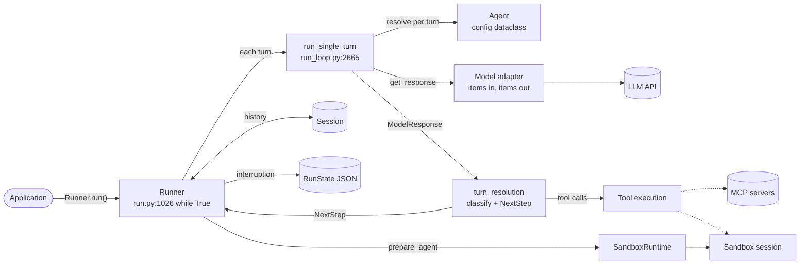
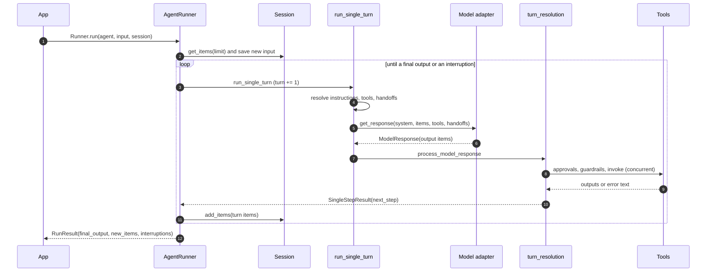
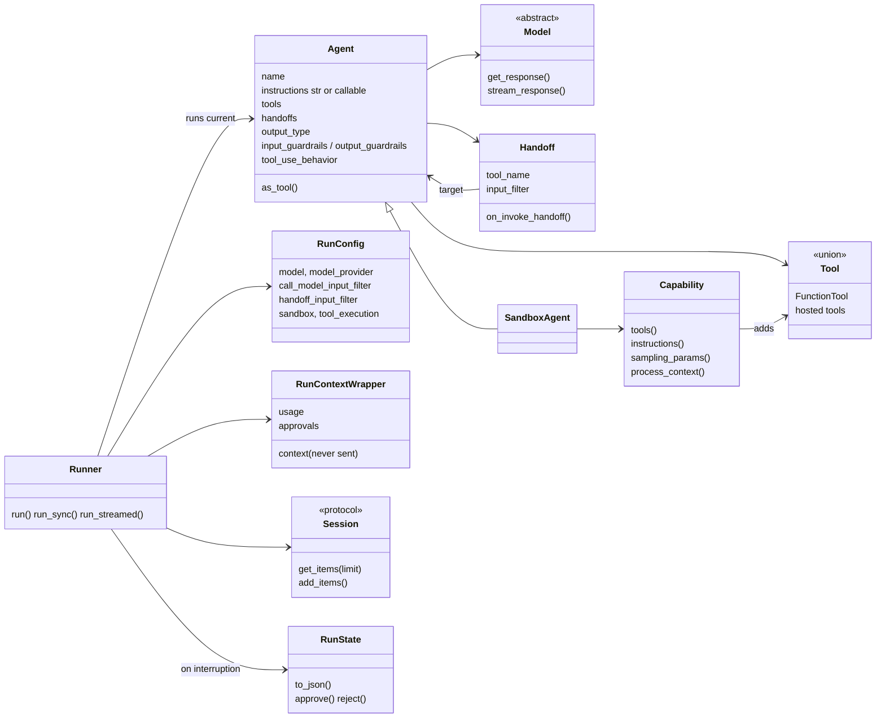
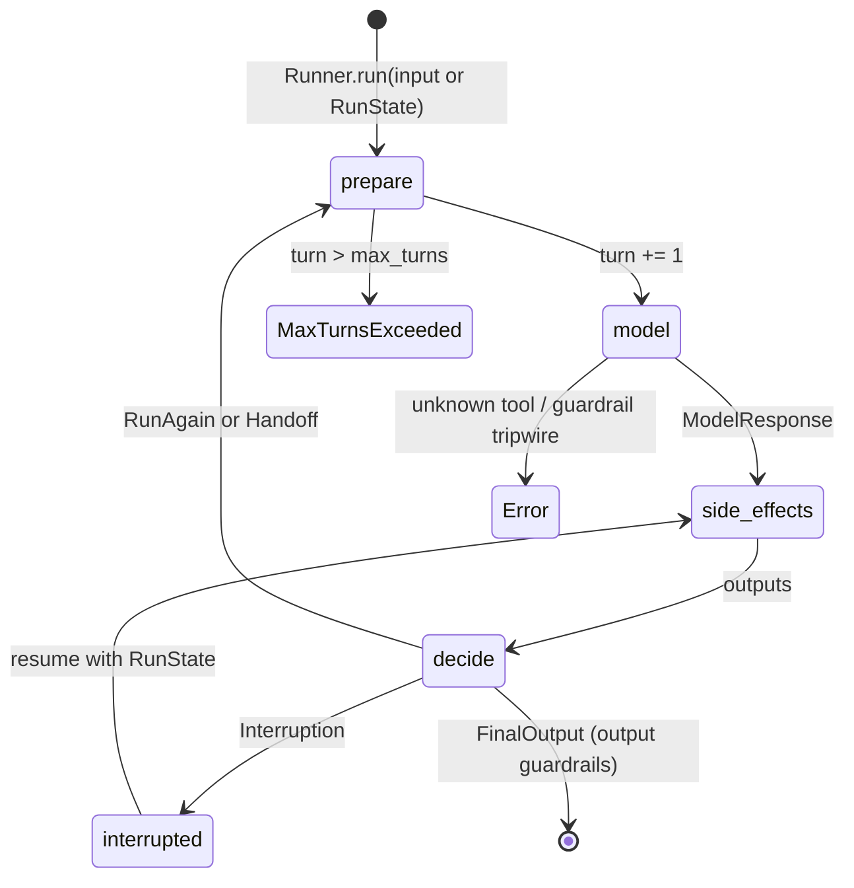
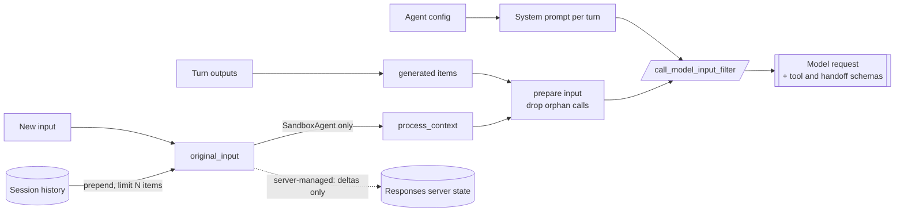
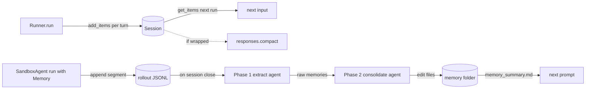
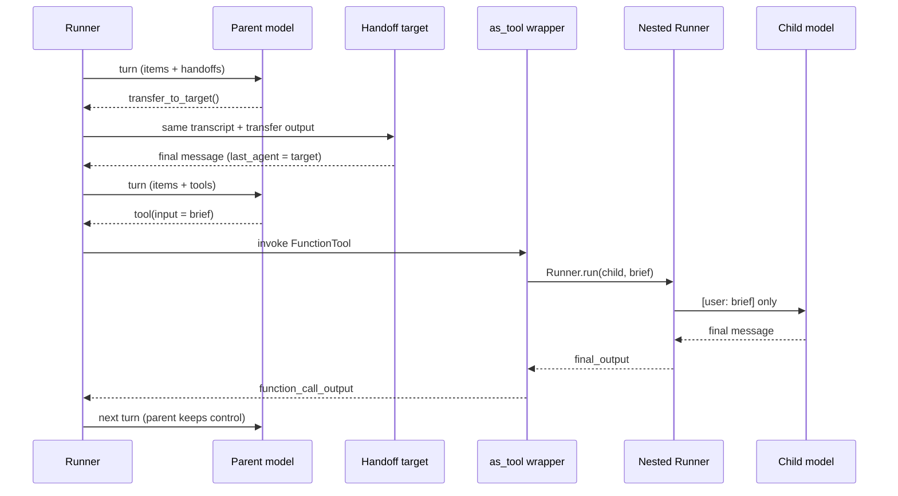

# OpenAI Agents SDK for Python (`openai/openai-agents-python`)

> Studied at commit [`71c2da4`](https://github.com/openai/openai-agents-python/tree/71c2da4de47159ccc37905b8fe781be805dbfa66)
> (2026-10-07, `v0.23.1` + 22 commits; `pyproject.toml` says `openai-agents==0.23.1`).
> Source paths are relative to the repository root, and line numbers refer to that commit.
> **Fact** means read in source, tested, or observed at runtime. **Interpretation** means my reading of intent.

**Interactive diagrams (Archify, every node links to source):**
[architecture](../diagrams/openai-agents-python/architecture.html) ·
[execution flow](../diagrams/openai-agents-python/execution-flow.html) ·
[core abstractions](../diagrams/openai-agents-python/core-abstractions.html) ·
[context flow](../diagrams/openai-agents-python/context-flow.html) ·
[memory flow](../diagrams/openai-agents-python/memory-flow.html) ·
[tool runtime](../diagrams/openai-agents-python/tool-runtime.html) ·
[agent loop](../diagrams/openai-agents-python/agent-loop.html) ·
[sub-agent flow](../diagrams/openai-agents-python/sub-agent-flow.html)

**Minimal reproduction:** [`experiments/openai-agents-python/`](https://github.com/woaitqs/repo-research/tree/main/experiments/openai-agents-python)

---

## TL;DR

- **The SDK *is* the runtime.** Unlike harnesses built on LangGraph, this repo owns its control flow: `AgentRunner._run_impl` is a `while True` loop (`src/agents/run.py:1026`) over a four-state machine, `NextStepRunAgain | NextStepHandoff | NextStepFinalOutput | NextStepInterruption` (`src/agents/run_internal/run_steps.py:164-191`). A *turn* is one logical model call plus its local side effects; `max_turns` (default 10, `src/agents/run_config.py:45`) bounds turns, not tokens.
- **An `Agent` owns no control flow.** It is a dataclass of instructions, tools, handoffs, guardrails and an output type (`src/agents/agent.py:319-418`). The Runner resolves dynamic instructions, enabled tools and handoffs *again on every turn* (`run_loop.py:2711-2723`; probe P12).
- **Everything the model can do is a tool call.** A handoff is a function tool named `transfer_to_<agent>` that switches the current agent (`turn_resolution.py:3583-3594`); `Agent.as_tool()` is a `FunctionTool` that runs a *nested* `Runner.run` (`agent.py:1044-1060`). The model sees one uniform contract; the runtime decides what a call means.
- **Responses-format items are the data model.** Runner, sessions, `RunState` and results all store `TResponseInputItem`s; provider adapters convert at the edge (`Converter.items_to_messages`, `src/agents/models/chatcmpl_converter.py:534`).
- **Context management is mostly opt-in or delegated to the server.** By default every tool output is replayed verbatim (probe P9). The SDK offers hooks (`call_model_input_filter`, `session_input_callback`, `SessionSettings.limit`), an opt-in `ToolOutputTrimmer`, and server compaction (`ModelSettings.context_management`, `OpenAIResponsesCompactionSession`). There is no built-in client-side summarizer in the core loop.
- **Human approval is a serializable pause, not a blocking call.** `needs_approval` returns a result with `interruptions`; `RunState.to_json()` (schema `1.20`, `src/agents/run_state.py:245`) can be stored and resumed later; resume finishes the paused turn *without* a new model call (probe P7, real-model R3).
- **The newest layer is `SandboxAgent`** (commit `2d665c9a`, 2026-04-15): capabilities (`Filesystem`, `Shell`, `Compaction`, `Skills`, `Memory`) prepare a per-run *execution clone* of the agent with extra tools, prompt fragments and sampling params (`src/agents/sandbox/runtime_agent_preparation.py:86-157`). Sandbox `Memory` is a two-phase, agent-written file memory.
- **Checked with real models** (deepseek-v4.1-flash and doubao-seed-2.1-pro, 3 runs each): handoffs carry the full transcript *including the previous agent's reasoning item*; `as_tool` children got exactly the one-line brief; and the default **redacted** tool-error text cut self-correction from 6/6 to 1/6 runs. See [Verification](#verification).

## Why This Repository Matters

- It is the reference implementation of OpenAI's agent runtime design: a small public surface (`Agent`, `Runner`, tools, handoffs, guardrails, sessions) over a large, defensively engineered core (`run_internal/` is about 20k lines).
- It is a **provider-neutral loop with a provider-specific data model**. The loop speaks OpenAI Responses items; Chat Completions, LiteLLM and any-llm adapters translate. This makes the portability trade-offs very visible (see probe P17).
- The code base is maintained *for* coding agents: `AGENTS.md` plus 16 maintainer references in `.agents/references/` (e.g. `runner-lifecycle.md`, `tool-execution-lifecycle.md`) state invariants that every change must preserve. I used them as a map and checked each claim I kept against code.
- The commit history shows hardening decisions that are worth copying, for example redacting tool failures by default (`40956e04`, #5112) and moving nested handoff history from default-on to opt-in (`a776d809` #1996 → `6ab83d43` #2272).

## Repository Snapshot

| Item | Value (fact) |
|---|---|
| Package | `src/agents/` — 320 Python files, about 135k lines. Largest: `run_state.py` (5.6k), `run_internal/turn_resolution.py` (3.9k), `tool.py` (3.0k), `run_internal/run_loop.py` (3.0k), `run.py` (2.8k) |
| Major subpackages (lines) | `run_internal/` 20k · `sandbox/` 28k · `extensions/` 29k (sandbox providers, LiteLLM/any-llm, session backends, experimental Codex tool) · `models/` 7.5k · `realtime/` 7.2k · `mcp/` 4.6k · `tracing/` 4.0k · `voice/` 2.8k |
| Runtime dependencies | `openai>=3.0.0,<4`, `pydantic>=2.12.2`, `griffelib`, `mcp>=1.19.0`, `websockets`, `requests` (`pyproject.toml:9-23`) |
| Optional extras | `litellm`, `any-llm`, `realtime`, `voice`, `sqlalchemy`, `redis`, `dapr`, `mongodb`, `encrypt`, and sandbox providers `docker`, `daytona`, `e2b`, `modal`, `blaxel`, `cloudflare`, `runloop`, `vercel` |
| Default model | `gpt-5.6-luna`, overridable by `OPENAI_DEFAULT_MODEL` (`src/agents/models/default_models.py:99-103`); OpenAI provider defaults to the Responses API (`models/_openai_shared.py:11`) |
| History | 2,482 commits; first commit 2025-03-11. Commit rate peaked at 360 in 2026-08 |
| Tests | 414 test files; 12,174 passed with the locked environment (see [Verification](#verification)) |
| Examples | 224 Python files under `examples/` |

## Architecture

**Fact:** there is no framework underneath. The layers are all in this repo:

```text
Public API       Agent · Runner · tools · handoffs · guardrails · Session · RunState     (agent.py, run.py, tool.py, ...)
Run loop         _run_impl / start_streaming -> run_single_turn -> turn_resolution        (run.py, run_internal/)
Model boundary   Model / ModelProvider; Responses, Chat Completions, LiteLLM adapters      (models/, extensions/models/)
Execution        function tools, MCP, hosted tools, SandboxRuntime + sandbox sessions    (tool.py, mcp/, sandbox/)
Cross-cutting    tracing spans + processors, usage, hooks                               (tracing/, usage.py, lifecycle.py)
```



Richer, source-linked version: [architecture.html](../diagrams/openai-agents-python/architecture.html).

**Module boundaries (fact):**

| Module | Owns | Depends on |
|---|---|---|
| `src/agents/run.py` | public `Runner`, the non-streaming loop, wiring of everything below | `run_internal/*`, `sandbox.runtime`, `run_state` |
| `src/agents/run_internal/` | turn execution, response processing, tool planning/execution, handoffs, session persistence, server-conversation tracking, retries, streaming loop | `items`, `tool`, `handoffs`, `models.interface` |
| `src/agents/agent.py`, `handoffs/`, `tool.py`, `guardrail.py` | declarative definitions | `run_context`, `function_schema`, `strict_schema` |
| `src/agents/models/` | `Model`/`ModelProvider` interfaces, OpenAI Responses (HTTP + WebSocket) and Chat Completions adapters, retry advice | `openai` SDK |
| `src/agents/memory/` | `Session` protocol, SQLite and OpenAI Conversations sessions, Responses compaction session | `run_internal.items` |
| `src/agents/sandbox/` | `SandboxAgent`, capabilities, manifests, session lifecycle, snapshots, sandbox memory | runner (`Runner.run` for memory agents) |
| `src/agents/mcp/` | MCP server connections, conversion of MCP tools to `FunctionTool` | `mcp` SDK |
| `src/agents/tracing/` | traces/spans, processors, OpenAI exporter (`https://api.openai.com/v1/traces/ingest`, `tracing/processors.py:46`) | none in the loop |
| `src/agents/realtime/`, `voice/` | separate runtimes for realtime sessions and STT→workflow→TTS pipelines | not on the `Runner` path studied here |

**Interpretation:** `AGENTS.md` asks maintainers to keep `run.py` "focused on orchestration" and put logic in `run_internal/`. In practice `_run_impl` is still about 1,800 lines (`run.py:623-2400`), because every exit path must also handle sessions, guardrails, tracing, sandbox cleanup and resume state.

## Main Execution Flow

Entry point traced: `await Runner.run(agent, "...", session=session)` with a function tool, non-streaming. `Runner.run_streamed` follows the same steps inside a background task and a second loop (`start_streaming`, `run_internal/run_loop.py:969`).



Step by step (each step is a fact read in source unless marked otherwise):

1. **Public entry.** `Runner.run` (`run.py:273`) forwards to the default `AgentRunner.run` (`run.py:344-357`), which normalizes `RunConfig`, masks tracing when disabled, and calls `_run_impl` (`run.py:568-605`). Errors marked as data-redacted are re-raised without their traceback (`run.py:358-378`).
2. **Input preparation.** For a fresh run, `prepare_input_with_session` reads the session history (honouring `SessionSettings.limit`) and returns `history + new input`, plus the items that still need persisting (`run_internal/session_persistence.py:414-488`). With `conversation_id` / `previous_response_id`, history is *not* prepended because the server owns it (`run.py:707-725`). A `RunState` input instead restores context, turn counter and pending approvals (`run.py:659-690`).
3. **Run-scoped helpers.** `SandboxRuntime`, `PromptCacheKeyResolver` and the `RunState` itself are created once per run (`run.py:855-868`).
4. **Loop head.** Every iteration (`run.py:1026`):
   - first-turn input guardrails: blocking ones run before sandbox preparation (`run.py:1040-1076`);
   - `sandbox_runtime.prepare_agent(...)` returns `AgentBindings(public_agent, execution_agent)` and possibly rewritten input (`run.py:1079-1085`);
   - new session input is saved *before* the first model call (`run.py:1111-1123`);
   - `current_turn += 1`; over `max_turns` raises `MaxTurnsExceeded` unless an error handler supplies a final output (`run.py:1591-1616`).
5. **One turn.** `run_single_turn` (`run_internal/run_loop.py:2665`) runs agent-start hooks, gets enabled tools (`get_all_tools`, which also lists MCP tools), resolves the system prompt and handoffs, and resolves tool-name collisions (`run_loop.py:2696-2723`). It builds the model input as *caller input + replayable generated items* with orphan calls pruned (`_prepare_turn_input_items`, `run_loop.py:347-354`), or delta-only input when the server manages the conversation.
6. **Model call.** `get_new_response` (`run_loop.py:2800`) applies `call_model_input_filter`, de-duplicates input, picks the model (`get_model`, `turn_preparation.py:134`), resets `tool_choice` if this agent already used a tool (`maybe_reset_tool_choice`, `tool_execution.py:561-569`), adds a stable `prompt_cache_key`, and calls `model.get_response(...)` through `get_response_with_retry` (`run_loop.py:2898-2915`; `run_internal/model_retry.py:574`). Usage is added once per accepted response (`run_loop.py:2939`).
7. **Classification.** `process_model_response` (`run_internal/turn_resolution.py:2926`) turns output items into public `RunItem`s and executable records: function calls, handoffs, computer/shell/apply-patch actions, MCP approval requests, hosted-tool items. A function call whose name is a handoff tool becomes a `ToolRunHandoff` (`turn_resolution.py:3583-3594`). An unknown tool raises `ModelBehaviorError` unless `tool_not_found_behavior="return_error_to_model"` (`turn_resolution.py:3615-3641`).
8. **Side effects.** `execute_tools_and_side_effects` (`turn_resolution.py:804`) builds a plan, runs approvals and tool guardrails, executes function tools concurrently through `_FunctionToolBatchExecutor` (`tool_execution.py:1547`), and appends output items in model order. Then, in this order:
   - pending approvals → `NextStepInterruption` (`turn_resolution.py:935-950`);
   - handoffs → `execute_handoffs` → `NextStepHandoff` (`:537`);
   - `tool_use_behavior` says stop → `NextStepFinalOutput` (`:769-801`);
   - no tools and a message → final output, validated against `output_type` (`:997-1124`);
   - otherwise → `NextStepRunAgain` (`:1129-1137`).
9. **Loop tail.** `run.py:1896-1918` replaces `original_input` (a handoff may have filtered it), sets `generated_items = pre_step_items + new_step_items`, appends session items, and persists the turn (`run.py:1932-2000`). It then branches on `next_step` (`run.py:2001`, `:2171`, `:2284`, `:2295`). A final output runs output guardrails and returns a `RunResult`.

Interactive versions: [execution-flow.html](../diagrams/openai-agents-python/execution-flow.html) and [agent-loop.html](../diagrams/openai-agents-python/agent-loop.html).

## Core Abstractions



Interactive version: [core-abstractions.html](../diagrams/openai-agents-python/core-abstractions.html).

### `Agent`
- **Responsibility:** declare *what* an agent is: instructions (string or `(ctx, agent)` callable), tools, MCP servers, handoffs, model and settings, guardrails, output type, `tool_use_behavior`, `reset_tool_choice` (`agent.py:187-418`).
- **Inputs / outputs:** none at runtime; the Runner reads it. `get_system_prompt` resolves callable instructions against the current context (`agent.py:1129-1158`); `get_all_tools` filters by `is_enabled` and appends MCP tools (`agent.py:286-316`).
- **Lifecycle:** constructed by the application; reused across runs. `clone()` is a shallow `dataclasses.replace`. A `SandboxAgent` instance must not run concurrently in two runs (`.agents/references/sandbox-runtime-boundary.md`).
- **Why it exists:** keeping the agent declarative lets the Runner own all control flow, which is what makes interruption/resume and streaming parity tractable.

### `Runner` / `AgentRunner`
- **Responsibility:** the loop, turn accounting, guardrail ordering, handoff switching, persistence, tracing, and result construction (`run.py:273-2827`; streaming in `run_loop.py:969-2306`).
- **Inputs:** starting agent, `input` (string, items, or `RunState`), `context`, `max_turns`, `hooks`, `run_config`, `error_handlers`, `session`, and server-conversation ids (`run.py:275-290`).
- **Outputs:** `RunResult` / `RunResultStreaming` with `final_output`, `new_items`, `raw_responses`, `last_agent`, guardrail results, `interruptions`, and `to_state()` / `to_input_list()`.
- **Why it exists:** a single owner for side-effect ordering. The maintainer reference states the invariants explicitly (one turn increment per logical model call; resume never charges a turn twice; streaming and non-streaming must produce equivalent items) (`.agents/references/runner-lifecycle.md`).

### `SingleStepResult` + `NextStep*`
- **Responsibility:** the control boundary between "one model response and its local side effects" and "what the loop does next" (`run_steps.py:164-248`).
- **Fields:** `original_input`, `model_response`, `pre_step_items`, `new_step_items`, `next_step`, plus `session_step_items` when a handoff filter hid items from the model but history must keep them.
- **Why it exists:** a closed set of four outcomes is what `RunState` can serialize. Adding a pausable behavior means adding a step variant with streaming, session, tracing and resume semantics, not a path-local `return`.

### Tools: `FunctionTool` and the `Tool` union
- **Responsibility:** `FunctionTool` = name, description, strict JSON schema and `on_invoke_tool(ctx, json) -> Any` plus policy fields: `is_enabled`, `needs_approval`, `tool_input_guardrails`, `tool_output_guardrails`, `timeout_seconds`, `failure_error_function`, `defer_loading`, `allowed_callers` (`tool.py:454-600`). `Tool` also includes hosted tools executed by OpenAI (web/file search, code interpreter, image generation, hosted MCP, tool search) and local action tools (computer, shell, apply_patch, custom) (`tool.py:1649-1664`).
- **Why it exists:** a single executable contract for local code, MCP tools and sub-agents, with hosted tools kept as data the server executes.

### `Handoff`
- **Responsibility:** a tool (`tool_name`, `input_json_schema`) whose invocation returns the next agent (`on_invoke_handoff`), plus `input_filter`, `nest_handoff_history` and `is_enabled` (`handoffs/__init__.py:126-227`). Default name: `transfer_to_<snake_case(agent.name)>`; the tool output is `{"assistant": "<name>"}` (`:210-219`).
- **Why it exists:** routing as a model decision, expressed in the model's native tool-calling vocabulary.

### `Model` / `ModelProvider` (model abstraction)
- **Responsibility:** `Model.get_response(system_instructions, input, model_settings, tools, output_schema, handoffs, tracing, previous_response_id, conversation_id, prompt) -> ModelResponse`, plus `stream_response` and optional `get_retry_advice` (`models/interface.py:37-135`). `ModelProvider.get_model(name)` resolves strings; `MultiProvider` routes by prefix (`openai/`, `litellm/`, `any-llm/`; `models/multi_provider.py:62-75`).
- **Contract worth noting:** models must assign a non-empty call id to each tool invocation, stable across resume (`interface.py:38-45`).
- **Why it exists:** the loop never sees a wire format. The cost is that the item vocabulary is OpenAI's, so non-Responses backends lose features (probe P17).

### `RunContextWrapper`
- **Responsibility:** carries the application's `context` object (never sent to the model), the run-wide `Usage`, `turn_input`, and the approval records (`run_context.py:176-200`). `ToolContext` extends it with call id, tool name and arguments.
- **Why it exists:** dependency injection for tools, hooks and guardrails without putting state into the prompt.

### `Session`
- **Responsibility:** four async methods, `get_items(limit)`, `add_items`, `pop_item`, `clear_session` (`memory/session.py:53-97`). Implementations: `SQLiteSession`, `OpenAIConversationsSession` (server-side), `OpenAIResponsesCompactionSession` (wrapper), and in `extensions/memory/` async SQLite, SQLAlchemy, Redis, Dapr, MongoDB, encrypted and "advanced" SQLite sessions.
- **Why it exists:** client-side conversation memory with no framework dependency; see [Memory](#memory).

### `RunState`
- **Responsibility:** everything needed to resume: current turn and agent, original input, generated and session items, model responses, guardrail results, pending step, tool-use tracker, trace state, sandbox resume state and the context's approvals (`run_state.py:835-945`). `approve()` / `reject()` record decisions (`:1366-1410`); `to_json()` / `from_json()` (`:1885`, `:2393`).
- **Schema policy:** every bump adds a one-line summary to `SCHEMA_VERSION_SUMMARIES`; released versions stay readable; newer versions are rejected by older SDKs (`run_state.py:237-310`).

### `SandboxAgent` + `Capability`
- **Responsibility:** `SandboxAgent` adds `default_manifest`, `base_instructions`, `capabilities` (default `[Filesystem(), Shell(), Compaction()]`) and `run_as` to `Agent` (`sandbox/sandbox_agent.py:31-64`; `capabilities/capabilities.py:7-10`). A `Capability` has five hooks: `tools()`, `instructions(manifest)`, `sampling_params(params)`, `process_context(items)`, `process_manifest(manifest)` (`capabilities/capability.py:16-70`).
- **Why it exists:** a sandboxed agent needs tools bound to a live session, prompt text that depends on the workspace, and model params, all prepared per run. Capabilities are the SDK's equivalent of middleware.

## Agent Loop



Interactive version: [agent-loop.html](../diagrams/openai-agents-python/agent-loop.html).

- **Exit rule (fact):** a response with no tool calls and a message is final; if any local tool ran, the loop runs the model again so it sees the outputs (`turn_resolution.py:997-1137`). `tool_use_behavior` can short-circuit: `"stop_on_first_tool"`, `StopAtTools`, or a callable (`turn_resolution.py:769-801`; probe P10).
- **Structured output:** with an `output_type`, the last message text is validated as JSON (`agent_output.py:61`); invalid JSON raises `ModelBehaviorError` unless an `error_handlers` entry supplies output (`turn_resolution.py:1044-1095`).
- **Bounding:** `max_turns` (default 10) counts model invocations across all agents of the run (probe P6). Retries inside `get_new_response` do not count as turns.
- **Loop guard:** after an agent uses a tool, `tool_choice` is reset to `None` so `"required"` cannot force an endless tool loop (`tool_execution.py:561-569`; probe P12).
- **Two loops:** the streaming loop (`start_streaming`, `run_loop.py:969`) duplicates the control flow of `_run_impl` with a queue and background task. Parity is a stated invariant enforced by paired test files (`tests/test_agent_runner.py`, `tests/test_agent_runner_streamed.py`).
- **Error handlers:** `error_handlers` keyed by `max_turns`, `model_refusal` and `invalid_final_output` can turn a terminal error into a final output (`run_error_handlers.py:50-55`; `run.py:1608-1616`).

## Context Engineering

Context engineering here is mostly about **assembly, replay hygiene and hooks**. The core loop does not shrink context by itself.



Interactive version: [context-flow.html](../diagrams/openai-agents-python/context-flow.html).

1. **How context is constructed.** Per turn, in `run_single_turn` / `get_new_response` (`run_loop.py:2665-2915`): resolved instructions (`get_system_prompt`), `original_input` (caller input, with session history prepended) + generated items converted back to input items (`run_item_to_input_item`, `run_internal/items.py:179-209`), tool and handoff schemas, output schema and settings. `call_model_input_filter` then sees `ModelInputData(input, instructions)` and may return a replacement (`turn_preparation.py:51-93`).
2. **What enters the model context.**
   - instructions; for a `SandboxAgent` they are assembled in a fixed order: SDK base prompt, agent instructions, capability fragments, remote-mount policy, filesystem tree (`runtime_agent_preparation.py:173-235`). **Measured:** this prompt was 23,254–23,291 characters, about 16.8k of which is the SDK base prompt (probe P14, R6);
   - the caller's input and the session history;
   - every generated item: messages, function calls and outputs, handoff outputs, **reasoning items**, hosted-tool items;
   - schemas of enabled tools (MCP tools listed on each turn unless cached, `mcp/server.py:1490`) and handoffs.
3. **What is excluded.**
   - `RunContextWrapper.context` (local state; "never added to model input automatically", `.agents/references/agent-definition-and-run-context.md`; the reproduction encodes it as `test_context_object_is_never_sent_to_the_model`);
   - approval placeholders and SDK-only metadata (`run_item_to_input_item` returns `None` for `tool_approval_item`; `strip_internal_input_item_metadata`);
   - orphan function calls in runner-generated history (`drop_orphan_function_calls`, `items.py:211`);
   - disabled tools and handoffs (`is_enabled`), and `defer_loading` tools until Responses tool search loads them;
   - skill bodies and `MEMORY.md` until the agent opens them (index and summary only, see [Memory](#memory));
   - with `conversation_id` / `previous_response_id`: everything the server already has (`OpenAIServerConversationTracker.prepare_input`, `run_internal/oai_conversation.py:518`).
4. **How tool results are handled.** The return value becomes a `function_call_output` via `ItemHelpers.tool_call_output_item`: strings as-is, structured `input_text` / `input_image` / `input_file` outputs as content lists, other values stringified or validated against `output_type` (`items.py:845-900`). Exceptions go through `failure_error_function`; the default returns the fixed string *"An error occurred while running the tool. Please try again."* (`tool.py:1980-1985`), including for unparsable arguments (probe P4). `custom_data_extractor` attaches SDK-only data that is never sent.
5. **Truncation and offload.** **Fact: no default truncation of function-tool outputs.** Probe P9 replayed a 5,000-character output verbatim. Bounded outputs exist only where a tool opts in: sandbox `exec_command` truncates only when the model passes `max_output_tokens` (default `None`, `capabilities/tools/shell_tool.py:144-149`; `util/token_truncation.py:57-61`), and `ShellTool` actions and executor results carry an optional `max_output_length` (`tool.py:1421-1436`). `ToolOutputTrimmer` (opt-in, commit `bc9dbd7d`) replaces old outputs with a preview in the model view only (`extensions/tool_output_trimmer.py:88-140`). There is no offload-to-file mechanism in the core loop.
6. **Summarization / compaction.** Three mechanisms, none on by default for a plain `Agent`:
   - **server compaction:** `ModelSettings.context_management=[{"type": "compaction", "compact_threshold": ...}]` is passed to the Responses API (`model_settings.py:191-197`; `models/openai_responses.py:1057`). The sandbox `Compaction` capability (in the default set) sets it to 90% of the model's context window, or 240k tokens for unknown models (`capabilities/compaction.py:162-208`), and drops every item before the newest `compaction` item (`:210-225`; probe P15);
   - **session compaction:** `OpenAIResponsesCompactionSession` wraps a session and calls `responses.compact` after a turn when ≥ 10 candidate items exist, replacing stored history (`memory/openai_responses_compaction_session.py:36-69, 91-186`; trigger in `session_persistence.py:678-740`). It defers compaction while local tool outputs are pending;
   - **handoff nesting:** `nest_handoff_history=True` collapses the transcript into one `<CONVERSATION HISTORY>` message. This is a textual dump, not an LLM summary (`handoffs/history.py:83-168`; probe P2).
7. **Repository context.** Not indexed. A `SandboxAgent` gets a depth-3 rendering of its manifest in the prompt (`_filesystem_instructions`, `runtime_agent_preparation.py:48-77`) and explores with `exec_command` ("Prefer `rg`", `capabilities/shell.py:16-26`).
8. **How sub-agents receive context.**
   - **Handoff (default):** the full raw transcript, including the handoff call and its `{"assistant": ...}` output (probe P1). With real models the next agent's input also contained the previous agent's **reasoning item** in 6/6 runs (R1). Whether that reasoning is replayed on the wire depends on the adapter: for Chat Completions it is replayed only to DeepSeek-family models (`models/reasoning_content_replay.py`, `default_should_replay_reasoning_content`).
   - **`input_filter`** may rewrite `input_history`, `pre_handoff_items`, `new_items`; `input_items` changes only the model view while `new_items` stay in session history (`handoffs/__init__.py:158-180`; `turn_resolution.py:640-720`).
   - **`Agent.as_tool`:** only the generated `input` string, or a structured input built by `input_builder` (`agent.py:721-790`; probe P3; R2: 12/12 child calls received exactly one user item).
9. **How context isolation works.** `as_tool` isolation is structural: a fresh `Runner.run` with a fresh `ToolContext` (so approvals do not leak), sharing the application context object and usage accumulator (`agent.py:758-790`). The parent receives `final_output`, or the last non-empty message / tool output when the final output is empty (`agent.py:1073-1100`). Handoffs have **no** isolation by default; isolation is the filter's job, and the docstring warns that nesting is "not a redaction mechanism" (`handoffs/__init__.py:158-176`). Server-managed conversations reject handoff input filters outright (`turn_resolution.py:505-534`).
10. **How context size is controlled over long runs.** By configuration, not by default: `max_turns` bounds steps; `SessionSettings.limit` bounds *items* (and sessions also store reasoning items: a real run stored `[user, reasoning, message]` for one exchange, so `limit=2` kept only the last reasoning and message — R4); `session_input_callback`; `call_model_input_filter` (e.g. `ToolOutputTrimmer`); server compaction; server-managed state that sends deltas. A stable per-run `prompt_cache_key` keeps the prefix cacheable across turns (`run_internal/prompt_cache_key.py:17-120`). **Interpretation:** the SDK treats context policy as an application decision and leans on the Responses API for automatic compaction; on other backends the application must supply the policy.

## Memory

| Concept | What it is here | Where it lives | Scope | Written by | Read by |
|---|---|---|---|---|---|
| **Conversation history** | stored input items: user messages, assistant messages, reasoning, tool calls and outputs | a `Session` backend (SQLite, Redis, SQLAlchemy, Dapr, MongoDB, encrypted wrapper) or the server (`OpenAIConversationsSession`, `conversation_id`, `previous_response_id`) | `session_id` / conversation | the Runner: new input before turn 1, each settled turn after it (`run.py:1111-1123`, `:1932-2000`) | `prepare_input_with_session`, prepended to the next run |
| **Context** | one `ModelInputData` plus schemas | memory only, rebuilt every turn | one model call | `run_single_turn` + filters | the model |
| **Persistent memory** | sandbox `Memory` files: `memory_summary.md`, `MEMORY.md`, `skills/`, `rollout_summaries/` | the sandbox workspace (`memories/` by default, `sandbox/config.py:27-33`) | one workspace; rollouts grouped by conversation/session/group id (`run.py:245-257`) | two background agents at session close; the main agent too if `live_update=True` | `Memory.instructions` injects the summary; the agent greps `MEMORY.md` on demand |
| **Local state** | `RunContextWrapper.context` | process memory | one run | application, tools | tools, hooks, guardrails — never the model |
| **External storage** | `RunState` JSON, sandbox snapshots, server conversations | wherever the app stores them | app-defined | `to_json()`, sandbox cleanup | `from_json()`, sandbox resume |



Interactive version: [memory-flow.html](../diagrams/openai-agents-python/memory-flow.html).

- **Session memory is implicit and complete.** Nothing is selected or summarized: whatever the runner generated is appended, and the next run prepends it. Only `limit`, `session_input_callback` and compaction wrappers change that.
- **Sandbox memory is explicit and agent-written** (`sandbox/memory/`):
  - during a sandbox session each run's result is appended to `sessions/<rollout_id>.jsonl` (`memory/manager.py:89-117`);
  - `flush()` is registered as a pre-stop hook of the sandbox session (`manager.py:64`). At close, a **phase-1** `SandboxAgent` with structured output extracts `{rollout_slug, rollout_summary, raw_memory}` per rollout (default `gpt-5.4-mini`; rollout truncated to 150k tokens) (`memory/phase_one.py:15-126`; `config.py:48`);
  - a **phase-2** `SandboxAgent` (default `gpt-5.5`, up to 500 turns) consolidates the selected raw memories (≤ 256) into the memory folder with its shell and file tools (`memory/phase_two.py:10-37`; `config.py:45-83`);
  - the read side injects `memory_summary.md` (truncated to 15k tokens) into the system prompt with a "quick memory pass" protocol: grep `MEMORY.md`, open at most 1–2 rollout summaries or skills (`capabilities/memory.py:50-90`; `memory/prompts/memory_read_prompt.md`).
- **Staleness** is handled by prompt policy: "memory is guidance, not truth: current evidence wins"; with `live_update=True` the agent *must* fix `MEMORY.md` in the same turn when it detects a conflict (`memory/prompts.py:36-50`). **Interpretation:** this is the Codex "memories" design moved into a reusable SDK, and it dogfoods the SDK: the memory writers are `Runner.run` calls on `SandboxAgent`s.
- **Skills are procedural memory with progressive disclosure:** `Skills` mounts `SKILL.md` folders into the workspace (`.agents/` by default), puts only `name: description (file: path)` into the prompt, and tells the model to open `SKILL.md` when a task matches (`capabilities/skills.py:621-984`). In lazy mode a `load_skill` tool materializes one skill on demand. Probe P14: the skill body was not in the prompt; R6: both models opened `SKILL.md` before the changelog in 6/6 runs and followed its marker instruction.

## Tools

- **Interface:** `FunctionTool` (`tool.py:454`); `@function_tool` derives a strict JSON schema from the signature and docstring (`tool.py:2574-2870`, `function_schema.py`). Sync functions run in `asyncio.to_thread` (`tool.py:2783-2785`); only async tools support timeouts.
- **Registration and discovery:** static `Agent.tools`, filtered per turn by `is_enabled` (bool or callable), plus MCP tools fetched from `Agent.mcp_servers` on every turn (cacheable with `cache_tools_list=True`, `mcp/server.py:1490`). Name collisions between tools and handoffs follow `tool_name_collision_policy` (`run_config.py:490`). Responses tool search can defer tool definitions (`defer_loading`).
- **Invocation:** planning precedes side effects (`tool_planning.py`); function calls in one response run concurrently with outputs kept in model order (probe P13: 0.41 s for 0.4 s + 0.1 s tools); `RunConfig.tool_execution.max_function_tool_concurrency` bounds local concurrency (`run_config.py:136-146`).
- **Result handling:** see [Context Engineering](#context-engineering) §4. `tool_use_behavior` can make a tool result the final output.
- **Error handling:**
  - tool exceptions → `failure_error_function` (default fixed text; `None` re-raises) (`tool.py:640-695`);
  - timeouts → `timeout_behavior="error_as_result"` (model-visible text) or `"raise_exception"`;
  - unknown tool → `ModelBehaviorError` by default (probe P5);
  - model refusal → `ModelRefusalError` unless handled (`turn_resolution.py:1003-1036`).
- **Retries:** none at tool level. Model calls retry through `get_response_with_retry` with `ModelRetrySettings` and provider retry advice; stateful requests (`previous_response_id`) and replay-unsafe requests (programmatic tool calling) restrict replays (`run_internal/model_retry.py:574-600`).
- **Permissions:** `needs_approval` (bool or per-call callable) → interruption; tool input guardrails run immediately before invocation (and, with `ToolExecutionConfig.pre_approval_tool_input_guardrails=True`, also before the approval pause, `run_config.py:146-150`); tool output guardrails run before the output is accepted (`tool_execution.py:2732-2805`). MCP servers have their own `require_approval` policies, and hosted MCP approvals surface as interruptions too.
- **MCP:** local servers (stdio, SSE, streamable HTTP) are converted to `FunctionTool`s (`mcp/util.py:266-560`); `HostedMCPTool` is executed by OpenAI (`tool.py:1141`). Lifecycle of local servers is the caller's (`agent.py:201-210`; `MCPServerManager`).
- **Browser / computer:** `ComputerTool` drives a caller-provided `Computer` implementation; there is no bundled browser.

## Runtime / Sandbox

**Where the reasoning/execution boundary sits (fact).** The model only emits output items; `process_model_response` turns them into execution records; `tool_planning` / `tool_execution` decide what runs; the code that runs is either application code (function tools), an MCP server, a sandbox session (capability tools), or OpenAI's servers (hosted tools). Policy gates (approval, tool guardrails, `is_enabled`, `allowed_callers`) sit between classification and invocation.

Interactive version: [tool-runtime.html](../diagrams/openai-agents-python/tool-runtime.html).

| Runtime | Isolation | Source |
|---|---|---|
| Function tools | none: the application's process | `tool.py` |
| Hosted tools | OpenAI's infrastructure; the SDK only records items | `turn_resolution.py:3290-3420` |
| `UnixLocalSandboxClient` | temp workspace on the host; Linux commands run "without OS confinement added by this backend", macOS uses `sandbox-exec` without network isolation (`examples/sandbox/unix_local_runner.py:1-8`) | `sandbox/sandboxes/unix_local.py:231` |
| `DockerSandboxClient` | container, with persisted network-isolation state | `sandbox/sandboxes/docker.py:220` |
| Remote providers | E2B, Modal, Daytona, Runloop, Vercel, Cloudflare, Blaxel | `extensions/sandbox/*` |

- **Session ownership:** a caller-provided live session is caller-owned; a session created through `SandboxRunConfig.client` is runner-owned and cleaned up (pre-stop hooks such as memory flush, snapshot persistence, provider deletion) at the end of the run (`sandbox/runtime.py:309-320`; `.agents/references/sandbox-runtime-boundary.md`).
- **Preparation per run:** `SandboxRuntime.prepare_agent` clones capabilities, ensures the session, validates the workspace scope, binds capabilities, runs `process_context` on the input and builds the execution clone (`sandbox/runtime.py:209-307`). Hooks and results keep the public agent (`AgentBindings`, `run_internal/agent_bindings.py:17-38`; probe P14 `last_agent is agent`).
- **Manifest trust:** host paths (`LocalDir`, `LocalFile`) need trusted, application-controlled grants; a dictionary manifest cannot authorize host access (`sandbox_agent.py:39-43`). The trust rules fill 84 lines of `.agents/references/sandbox-runtime-boundary.md` and about 2.3k lines of `sandbox/_mount_security.py`.
- **Portability gap (fact, probe P17):** the default capabilities only work with the Responses API. With `OpenAIChatCompletionsModel`, `Filesystem`'s `apply_patch` is a `CustomTool` that the Chat Completions converter rejects (`UserError: Hosted tools are not supported…`), and `Compaction`'s `context_management` goes into `extra_args` and is forwarded as a keyword argument (`openai_chatcompletions.py:740`), which the OpenAI client rejects (`TypeError`). Only `Shell` (+ `Skills`, `Memory` read) worked; the real-model R6 runs used that set. I found no mention of this constraint in `docs/sandbox/`.

## Sub-Agents / Workflow



Interactive version: [sub-agent-flow.html](../diagrams/openai-agents-python/sub-agent-flow.html).

- **Handoffs move control.** Only the first handoff in a response is executed; extra ones get the output "Multiple handoffs detected, ignoring this one." (`turn_resolution.py:574-588`). Input guardrails of the target do not run (they belong to the starting agent, first turn only). The `max_turns` budget is shared.
- **History policy changed twice (fact, commits):** nested history became the default in `a776d809` (#1996, 2025-11-17) and was moved back to opt-in in `6ab83d43` (#2272, 2026-01-20) "while we stabilize nested handoffs"; the field now reads `nest_handoff_history: bool = False` (`run_config.py:378`).
- **`Agent.as_tool` keeps control.** The nested run has its own loop, `max_turns`, approval scope and resumable state; nested interruptions bubble up through the parent's `RunState` (`run_state.py:1366-1382`: `_find_nested_approval_state`). `on_stream` can forward nested stream events, with a bounded queue (`agent.py:606-660`).
- **Orchestration is model-driven.** There is no DAG engine. Deterministic orchestration is plain Python around `Runner.run` (the docs' "orchestrating via code"); `examples/agent_patterns/` shows routing, parallelization and LLM-as-judge built that way.
- **Experimental extras (not traced in depth):** `extensions/experimental/codex/` exposes the Codex CLI as a tool; `extensions/experimental/hosted_multi_agent/` provides `OpenAIHostedMultiAgentModel`, a `Model` for "Responses hosted multi-agent" (beta Responses connection); I did not trace it.

## Important Source Files

| File | Why read it |
|---|---|
| `src/agents/run.py` | `Runner`; the whole non-streaming loop (`_run_impl`, `:623-2400`) |
| `src/agents/run_internal/run_loop.py` | `run_single_turn`, `get_new_response`, and the streaming loop |
| `src/agents/run_internal/turn_resolution.py` | output classification, handoffs, final-output rules, interrupted-turn resume |
| `src/agents/run_internal/tool_planning.py`, `tool_execution.py` | approval planning, concurrent function tools, guardrails, failure conversion |
| `src/agents/run_internal/run_steps.py` | `ProcessedResponse`, `NextStep*`, `SingleStepResult` |
| `src/agents/run_internal/session_persistence.py`, `oai_conversation.py` | client-side history vs server-managed deltas |
| `src/agents/agent.py` | `Agent`, `as_tool` |
| `src/agents/handoffs/__init__.py`, `handoffs/history.py` | handoff tools, filters, nested history |
| `src/agents/tool.py` | tool types, `@function_tool`, default failure handling |
| `src/agents/models/interface.py`, `chatcmpl_converter.py`, `openai_responses.py` | model boundary and adapters |
| `src/agents/run_state.py` | resumable state and schema policy |
| `src/agents/sandbox/runtime.py`, `runtime_agent_preparation.py`, `capabilities/` | sandbox preparation and capabilities |
| `src/agents/sandbox/memory/` | two-phase memory generation |
| `.agents/references/*.md` | maintainer invariants (runner lifecycle, run items, tool execution, sandbox boundary) |
| `src/agents/testing/model.py` | `ScriptedModel`, the deterministic model used by the probes |

## 5+ Implementation Decisions Worth Learning From

### 1. A closed `NextStep` state machine as the only control boundary
- **What they did:** each turn returns a `SingleStepResult` whose `next_step` is one of four variants (`run_steps.py:164-248`); the loop branches only on that (`run.py:2001-2300`). `RunState` serializes the current step, so an interruption is just a step the loop can return from and later re-enter (`resolve_interrupted_turn`, `turn_resolution.py:1173`).
- **Problem solved:** tool execution, handoffs, approvals, guardrails, streaming and persistence all need a single, ordered notion of "what happens next".
- **Why it is interesting:** pausability falls out of the design. The maintainer rule "do not bypass this state machine with path-local completion logic" (`runner-lifecycle.md`) keeps it that way.
- **Trade-offs:** the streaming loop duplicates the non-streaming one (parity by tests and review, not by construction); every new step type must define streaming, session, tracing and resume behaviour; `_run_impl` grew to ~1,800 lines.
- **Where in source:** `run.py`, `run_internal/run_steps.py`, `run_internal/turn_resolution.py`.
- **Reuse:** make "what next" a small sum type returned by the turn function, and keep the loop a dumb dispatcher over it. Serialize that value, not the call stack.

### 2. Everything the model can do is a tool call
- **What they did:** handoffs are function tools named `transfer_to_<agent>` (`handoffs/__init__.py:214-226`, converted like any function at the wire, `chatcmpl_converter.py:1040`); sub-agents are `FunctionTool`s running a nested `Runner` (`agent.py:606-1127`). The Runner gives meaning to a call by looking it up (`turn_resolution.py:3583-3640`).
- **Problem solved:** one model contract across providers, and no special prompt protocol for routing or delegation.
- **Why it is interesting:** "delegate and return" vs "transfer control" is a runtime choice, not a model capability. Real models used both correctly in 12/12 runs (R1, R2).
- **Trade-offs:** handoff and tool names share one namespace (collision policy needed); only one handoff per response wins; handoff arguments are metadata, not the next agent's input.
- **Reuse:** model control transfer as a tool whose *executor* mutates runner state, and keep delegation as an ordinary tool with a narrow input.

### 3. One item vocabulary from model to storage
- **What they did:** the Responses item format is used for model input, run items, session storage and `RunState`; adapters convert at the edge (`chatcmpl_converter.py:534`), and replay helpers repair it (`drop_orphan_function_calls`, reasoning-ID policy, de-duplication; `run_internal/items.py`).
- **Problem solved:** resume, sessions, server-managed conversations and provider switching all need the same representation.
- **Why it is interesting:** history repair becomes a pure function over items (orphan pruning, reasoning items dropped with their call). Reasoning replay policy is explicit per provider (`reasoning_content_replay.py`).
- **Trade-offs:** non-Responses backends are second-class: hosted tools, `apply_patch` and `context_management` do not translate (probe P17); sessions store provider-specific reasoning items (R4) that may not be portable across models.
- **Reuse:** pick one canonical transcript format early, store it everywhere, and put all provider translation in adapters with explicit capability errors.

### 4. Human approval as a serializable pause
- **What they did:** `needs_approval` produces `ToolApprovalItem`s and `NextStepInterruption`; the app calls `state.approve()` / `reject(rejection_message=...)` possibly in another process after `to_json()` / `from_json()`; resume executes approved calls and answers rejected ones without re-calling the model (`run_state.py:835-2420`; `tool_execution.py:1880-1925`). Schema changes are versioned with one-line summaries and a backward-read policy (`run_state.py:237-310`). Sibling tools that need no approval still run in the paused turn.
- **Problem solved:** approvals can take minutes or days; a blocking call would hold a process and a model context.
- **Why it is interesting:** the pause point is data. Probe P7 and real-model R3 (6/6 approve, 5/5 reject with the custom message relayed to the user) confirm no duplicate execution and no extra model call.
- **Trade-offs:** `run_state.py` is 5.6k lines, and the schema went from 1.0 to 1.20 since HITL landed in January 2026 (`3ce7c24d`); agents are code, so they must be re-bound by identity on load; held session writes and nested agent-tool state make the edge cases hard (see schema summaries 1.15–1.20).
- **Reuse:** return "interrupted + state" instead of awaiting a human; version the state format from day one and record what each version adds.

### 5. Tool failures are observations — redacted by default
- **What they did:** every function tool is wrapped so exceptions become a model-visible string from `failure_error_function`; since `40956e04` (#5112, 2026-09-21) the default is a fixed message that reveals nothing about the error, even for bad JSON (`tool.py:1980-1985`). `failure_error_function=None` re-raises; an unknown tool raises by default.
- **Problem solved:** exception text can leak secrets (connection strings, paths, customer data) into prompts, traces and logs.
- **Why it is interesting:** it is a security default with a measurable capability cost. **Measured (R5):** the tool raised "order_id must contain digits only, e.g. '1042'" for `A-1042`. With the default text, the model recovered in **1/6** runs; the other five retried the same id and told the user "the lookup service is returning an error, try again later". With a custom function that returned the message, it recovered in **6/6** runs on the second attempt.
- **Trade-offs:** safety vs self-correction; developers must write an allow-listed error formatter for validation errors.
- **Reuse:** convert failures into observations, but separate *user-correctable* errors (validation, not found) from *internal* errors, and only expose the former.

### 6. Context policy as hooks, compaction delegated to the server
- **What they did:** the core loop replays everything; shrinking is done by `call_model_input_filter` (`turn_preparation.py:51`), `session_input_callback`, `SessionSettings.limit`, the opt-in `ToolOutputTrimmer` (commit `bc9dbd7d`), Responses `context_management` compaction, and `OpenAIResponsesCompactionSession` (commit `09443fd0`).
- **Problem solved:** one SDK serves chat apps, short tool loops and long sandbox jobs; a single built-in policy would be wrong for most of them.
- **Why it is interesting:** the final hook sees exactly `ModelInputData(input, instructions)` before every call and changes only the per-call view, so stored history stays intact (probe P9; reproduction test `test_trimmer_shrinks_old_tool_outputs_only_in_the_model_view`).
- **Trade-offs:** no protection by default — a single large tool output stays in every later request; `limit` counts items (including reasoning), not tokens or turns (R4); automatic compaction effectively requires OpenAI's Responses API.
- **Reuse:** expose one "last look before the model" hook with the full request, and keep trimming in the view, not in storage.

### 7. Public agent vs execution agent, prepared by capabilities
- **What they did:** `SandboxRuntime.prepare_agent` clones capabilities per run, binds them to the live session, and builds an execution clone with capability tools, ordered prompt fragments and merged sampling params; `AgentBindings` keeps the public agent for hooks, results and handoffs (`sandbox/runtime.py:209-307`; `runtime_agent_preparation.py:86-157`; `agent_bindings.py:17-38`).
- **Problem solved:** tools bound to a live sandbox session cannot live on a reusable agent definition, and identity must not change because an internal clone did the work.
- **Why it is interesting:** it is middleware without a middleware stack: five hooks per capability, applied once per run (probe P14; reproduction `test_capabilities_are_cloned_per_run`).
- **Trade-offs:** capability order and dependencies matter (`required_capability_types`); the sandbox prompt is large (~23k characters before any task text); defaults assume the Responses API (P17); a `SandboxAgent` cannot run in two runs at once.
- **Reuse:** separate the agent you configure from the agent that executes, and derive the latter per run from pluggable capabilities.

### 8. Memory written by agents, read by progressive disclosure
- **What they did:** sandbox runs append rollouts; at session close a phase-1 agent extracts structured raw memories and a phase-2 agent consolidates them into `MEMORY.md`, `memory_summary.md`, skills and rollout summaries; only the summary is injected, everything else is searched on demand (`sandbox/memory/`; `capabilities/memory.py`).
- **Problem solved:** cross-session learning without a vector store, and without paying for all memory on every call.
- **Why it is interesting:** memory writing is offline and batch, so the main agent's latency is unaffected; the reading protocol is explicit about verification and staleness.
- **Trade-offs:** memory only appears after the sandbox session closes (unless `live_update`); quality depends on two extra model runs (cost); default models are OpenAI-specific; I did not run generation end to end with a real model.
- **Reuse:** split memory into a small always-loaded summary plus a grep-able handbook, and write it from transcripts in a background pass.

### 9. Guardrails trade latency against side-effect safety
- **What they did:** input guardrails default to `run_in_parallel=True` and race the first turn; `run_in_parallel=False` blocks before the model call (`guardrail.py:72-110`; `run.py:1040-1076`, `:1787-1850`).
- **Measured:** a blocking guardrail prevented any model call (P11); a slow parallel one let the model call *and the tool side effect* happen before the tripwire, in both streaming and non-streaming mode (P16). This matches `docs/guardrails.md:36`.
- **Reuse:** make the ordering explicit per guardrail, and put irreversible tools behind approvals or tool guardrails rather than relying on agent-level input guardrails.

## Minimal Reproduction

[`experiments/openai-agents-python/`](https://github.com/woaitqs/repo-research/tree/main/experiments/openai-agents-python) contains `miniagents`, about 1,700 lines of stdlib-only Python (plus a 170-line demo). It reproduces the **architecture**, not the product.

| miniagents | reproduces |
|---|---|
| `run.py::Runner.run` + `NextStep*` | the loop and its four exits; turn accounting; resume continues the paused turn |
| `run.py::process_model_response` / `execute_tools_and_side_effects` | classification by name, approval planning, concurrent tools in model order, handoff, `stop_on_first_tool`, final output |
| `run.py::execute_handoff` | first handoff wins; full transcript by default; `input_filter` and nested history change the model view only |
| `run.py::RunState` | JSON pause/resume with agents re-bound by name; held session write until the paused turn settles |
| `agent.py::as_tool` | nested `Runner.run` on the brief only, shared app context |
| `tool.py` | strict schema from signature, `to_thread`, fixed redacted error text |
| `session.py`, `trimmer.py` | append-only history with `limit`; view-only trimming |
| `capabilities.py` | public vs execution agent; `Shell`, `Skills`, `Memory`, `Compaction` as capability hooks over a temp-dir workspace |
| `model.py` | `ScriptedModel` and a stdlib Chat Completions adapter (items ↔ messages, handoffs as tools) |

The demo (`./run.sh demo`) runs a support desk: triage hands off to refunds; refunds calls a lookup tool and a policy sub-agent in one turn; the refund tool pauses for approval; the state goes through JSON, is approved and resumes; a second run on the same session sees the history; a blocking guardrail stops an injection attempt; a capability agent answers from its workspace. It asserts 11 invariants.

## Verification

All commands ran in this session's container (Python 3.13.16, uv 0.11.32, Node 22).

**1. Upstream test suite (pinned commit, locked dependencies).**

```bash
uv sync --all-extras --all-packages --group dev --frozen
uv run --frozen pytest -q -n 8 --dist worksteal -m "not serial"   # -> 12084 passed, 34 skipped in 157.8s
uv run --frozen python .github/scripts/run_serial_tests.py          # -> 90 passed, 4 skipped
```

The first attempt, from a checkout whose scratch path contained `-home-user-`, had 62 failures, all in `tests/mcp/test_server_errors.py`. Those tests assert that the URL credential `user:s3cr3t_pw` never appears in a rendered traceback; the substring `user` came from the file paths in the traceback, not from the credential. Re-running from a copy whose path contains no `user` gave 0 failures. **Environment artifact, not a defect.**

**2. Runtime probe of the real SDK** (`experiments/openai-agents-python/upstream_probe/probe_openai_agents.py`). It drives the real `Runner` with the SDK's own `agents.testing.ScriptedModel` (no network). Result: **17/17** predictions from source matched.

| Probe | Expected (from source) | Observed |
|---|---|---|
| P1 handoff | a tool; full raw transcript to the target | `handoffs=[transfer_to_billing]`, tools `[]`; Billing input `[user, function_call, function_call_output]`; output `{"assistant": "Billing"}` |
| P2 `nest_handoff_history` | one summary message | one assistant message with `<CONVERSATION HISTORY>` |
| P3 `as_tool` | child sees only the brief | child input `[user: "find the answer"]`; parent secret absent; parent got `"research result: 42"` |
| P4 tool error + bad JSON | fixed text, loop continues | both outputs = default message; `hunter2` absent |
| P5 unknown tool | raise; opt-in error text | `ModelBehaviorError`; opt-in output `Tool 'ghost' not found.` |
| P6 `max_turns=2` | 2 model calls | `MaxTurnsExceeded` after exactly 2 |
| P7 approval | pause, JSON round-trip, one execution | interrupted before execution; schema `1.20`; executed once; 2 model calls in total |
| P8 session + `limit=1` | history prepended; tail only | run 2 input `[user, message, user]`; `limit=1` kept one item |
| P9 default vs trimmer | verbatim vs preview | 5,002 vs 273 serialized chars |
| P10 `stop_on_first_tool` | tool output final | `"Paris: sunny"`, 1 model call |
| P11 guardrails | blocking: no model call | blocking 0 calls; parallel tripped after 1 call |
| P12 per-turn resolution | instructions re-resolved; `tool_choice` reset | `v1`, `v2`; `required` → `None` |
| P13 concurrent tools | ~max, model order | 0.406 s; `[done-a, done-b]` |
| P14 `SandboxAgent` | capability tools, ordered prompt, compaction param, public agent | tools `apply_patch, exec_command, view_image, write_stdin`; prompt 23,254 chars in order; skill body absent; memory summary present; `context_management` threshold 240000; `last_agent is agent` |
| P15 `Compaction.process_context` | cut before newest compaction | `[compaction, user]` |
| P16 slow parallel guardrail | side effect may happen first | `send_email` executed, then tripwire, in both modes |
| P17 sandbox on Chat Completions | (inferred) Responses-only defaults | default → `UserError` (apply_patch); `Compaction` → `TypeError` (`context_management`); `Shell` only → reached the network |

**3. Reproduction.**

```bash
cd experiments/openai-agents-python && ./run.sh
# [1/4] venv + pip install -e .[test]   [2/4] wheel built: miniagents-0.1.0-py3-none-any.whl
# [3/4] 40 passed                        [4/4] demo: 11/11 checks PASS, exit 0
```

**4. Mutation check** (`mutation_check.py`): 11 architectural regressions injected one at a time; **11/11 killed**: handoff nests by default (1 test failed), tool exceptions crash the run (1), approval skipped (4), resume re-runs the model (4), paused turn persisted immediately (1), session history not prepended (3), capabilities mutate the public agent (1), tools run sequentially (1), `tool_choice` never reset (1), guardrails on every turn and agent (1), sub-agent inherits the parent transcript (1). All 40 tests passed after restore.

**5. Real-model runs of the real SDK** (`real_model/run_ark.py`). The pinned SDK used `OpenAIChatCompletionsModel` against Volcano Engine Ark's OpenAI-compatible endpoint with two models, `deepseek-v4.1-flash` (`deepseek-v4-1-flash-260910`) and `doubao-seed-2.1-pro` (`doubao-seed-2-1-pro-260915`), 3 runs each. A recording `Model` wrapper captured every request. Raw results: `real_model/results_*.json`.

| Scenario | What it tests | Result |
|---|---|---|
| R1 handoff | routing; what the target receives | 6/6 routed to Billing; target input = `[user, reasoning, function_call, function_call_output]` in 6/6 |
| R2 `as_tool` fan-out | briefs and isolation | 6/6 called both translators in one turn (2 orchestrator calls); 12/12 child inputs were one user item with only the sentence; customer id leaked 0/12 |
| R3 approval | approve / reject after a JSON round-trip | approve: 6/6 paused, 0 executions before, exactly 1 after; reject: in 5/6 runs the model called the tool (once it asked the user instead); 5/5 relayed the "support ticket" rejection message; 0 executions |
| R4 session | recall; `limit=2` | 6/6 recalled "Rust" with full history (4 items); 6/6 answered `UNKNOWN` with `limit=2` (3 items). A separate run showed sessions store `[user, reasoning, message]` per exchange |
| R5 tool errors | redacted vs visible error | redacted: recovered 1/6; visible: 6/6 on the 2nd attempt |
| R6 sandbox (`Shell`, `Skills`, `Memory`) | skills and memory in a real run | 6/6 opened `SKILL.md`, then `CHANGELOG.md`; 6/6 ended with the skill's marker line; prompt 23,291 chars; in 1 run the model used absolute host paths (`/tmp/sandbox-local-…`) |

Each scenario took 4–27 s per run. **What this shows:** the design assumptions held for two current models on small, unambiguous tasks, and the redaction default has a measurable cost. It is n=3 per model, so it is evidence, not a benchmark.

**6. Reproduction with real models** (`real_model/run_mini_ark.py`): the same two models drove `miniagents` through its stdlib Chat Completions adapter: **6/6** runs routed, briefed the policy sub-agent, paused on the refund, resumed after a JSON round-trip with exactly one model call, and executed the refund once.

**7. Diagrams.** All 8 Archify diagrams passed `finalize --quality showcase --repo-root <clone>` (schema validation, verified delivery, strict provenance check, headless-Chromium browser check) and `visual-check`; the light 1440×900 captures were inspected by eye. See [`assets/openai-agents-python/archify/README.md`](https://github.com/woaitqs/repo-research/blob/main/assets/openai-agents-python/archify/README.md).

**Known limitations of the verification:**
- Real-model runs used Chat Completions on non-OpenAI models; the Responses API paths (server-managed conversations, hosted tools, server compaction, WebSocket transport) were verified only by reading source and the upstream tests.
- Sandbox memory *generation* (phase 1/2) was not run with a real model; its default models are OpenAI models. Only the read side was exercised.
- Streaming was exercised only in probe P16. Realtime, voice, tracing export and the provider sandboxes (Docker, E2B, Modal, …) were not run.
- `miniagents` has no streaming loop, no tracing, no MCP and no real sandbox isolation.

## What I Would Reuse

1. **A closed "next step" sum type** returned by the turn function, with the loop as a dispatcher, so pausing and resuming are data.
2. **Everything as a tool**, with the runtime deciding whether a call executes code, delegates (nested run) or transfers control.
3. **One canonical transcript format** in memory, storage and pause state, with providers behind adapters that fail loudly on missing capabilities.
4. **Approvals as serializable interruptions**, with a versioned state schema and a summary line per version.
5. **Errors as observations with an explicit exposure policy**: expose validation errors, redact internal ones. The R5 numbers argue against a single global default either way.
6. **A last-look input filter** that changes only the per-call view.
7. **Public vs execution agent**, with per-run capabilities contributing tools, prompt and params.
8. Things I would change:
   - make the default tool-error policy distinguish user-correctable errors;
   - give `SessionSettings.limit` a turn- or token-based mode (it counts reasoning items today);
   - fail fast, at agent preparation, when sandbox capabilities need the Responses API and the model is not a Responses model.

## Limitations / Open Questions

- **Responses-only sandbox defaults (P17):** is this intended? The error appears only at the first model call, and `docs/sandbox/` does not mention it. *Uncertain about intent; not filed.*
- **Redacted tool errors (R5):** the default trades self-correction for safety. The docstring points to `failure_error_function` as the escape hatch; I found no built-in way to mark an exception as safe to show. *Open question.*
- **Reasoning items across handoffs:** the target agent's input contains the source agent's reasoning items (R1). For Chat Completions the default replays them only to DeepSeek-family models; for Responses models it depends on server rules and `reasoning_item_id_policy`. Whether a different model family should ever see another agent's reasoning is not documented. *Partly verified.*
- **Size of the core:** `run_state.py` (5.6k lines) and `_run_impl` (~1.8k lines) carry many resume and session edge cases (held writes, nested history ownership, compaction acknowledgement). They are well tested (12k tests), but hard to reason about locally.
- **Not studied in depth:** realtime and voice runtimes, tracing processors beyond the exporter endpoint, the experimental Codex and hosted multi-agent extensions, provider sandboxes, programmatic tool calling, computer use.

## Further Reading

- Source: [openai/openai-agents-python @ 71c2da4](https://github.com/openai/openai-agents-python/tree/71c2da4de47159ccc37905b8fe781be805dbfa66), especially `AGENTS.md` and `.agents/references/` (maintainer invariants; claims I used were checked against code).
- Commits: `40956e04` (redact default tool failure details, #5112), `a776d809` / `6ab83d43` (nested handoff history on, then opt-in), `3ce7c24d` (HITL and `run_internal/`, #2230), `09443fd0` (Responses compaction session), `bc9dbd7d` (`ToolOutputTrimmer`), `2d665c9a` (Sandbox Agents), `05d6850d` (scripted model test utilities).
- Docs: <https://openai.github.io/openai-agents-python/> (agents, running agents, handoffs, sessions, sandbox agents, guardrails, human-in-the-loop).
- Companion study in this repo: [deepagents](deepagents.html), a middleware harness on LangGraph that owns no loop, for contrast with this SDK, which owns its loop.
