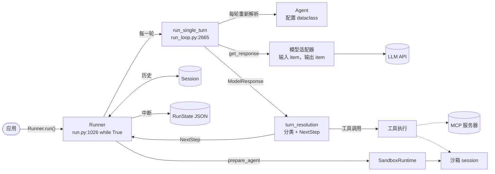
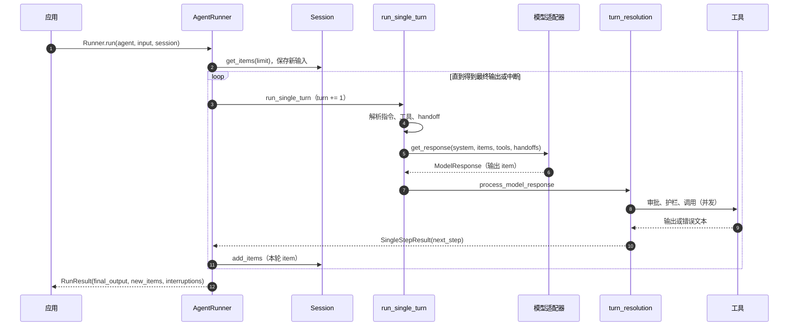
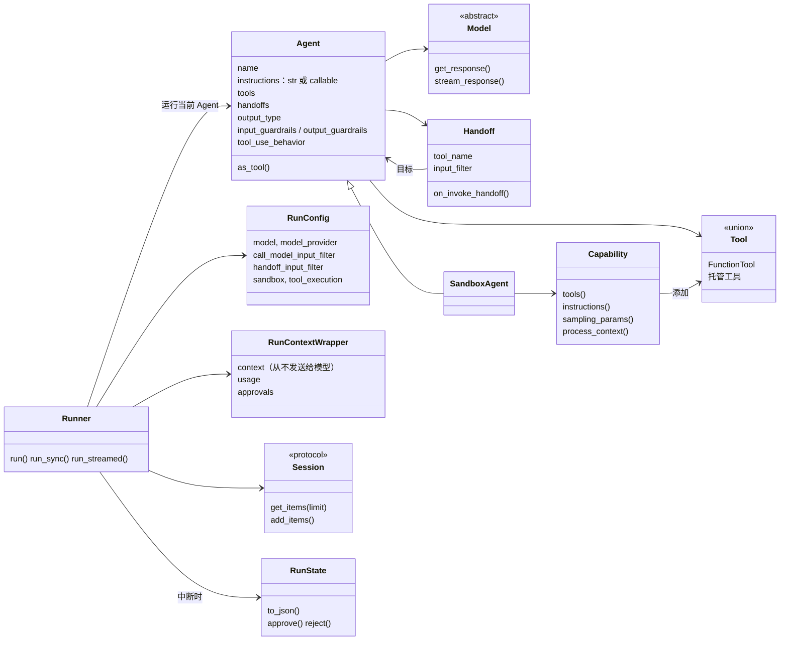
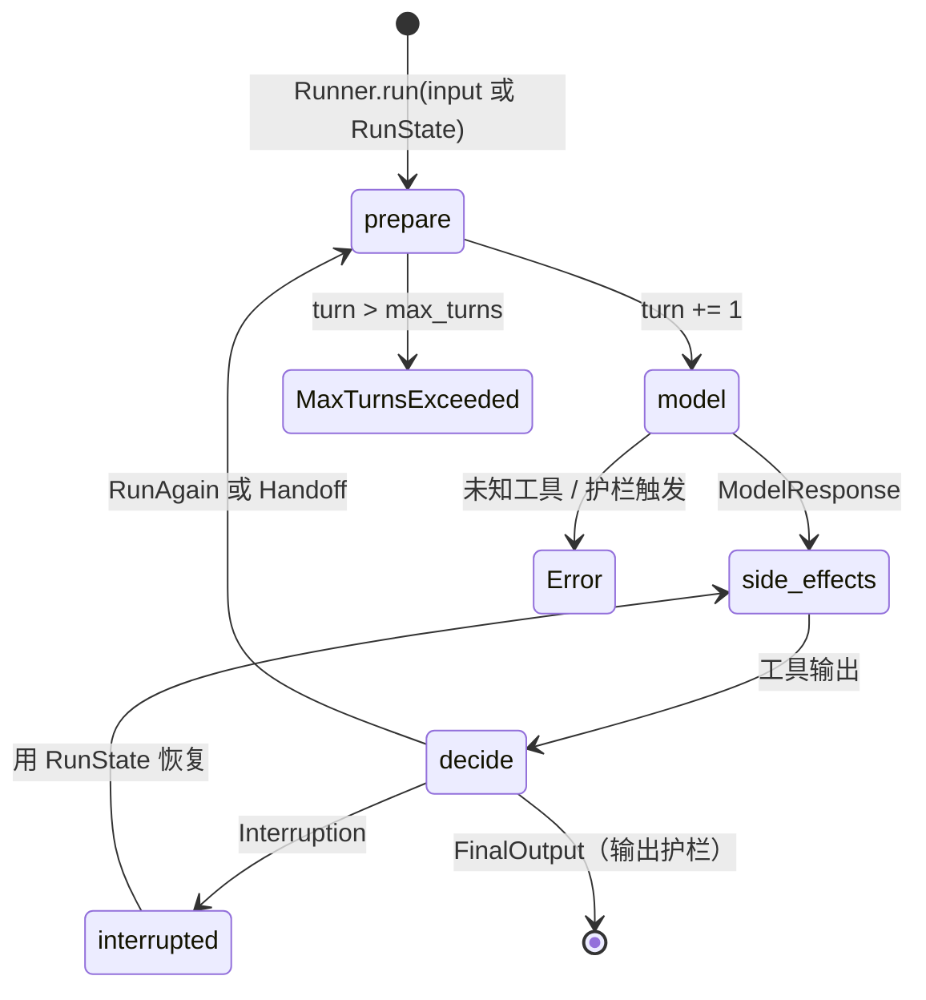
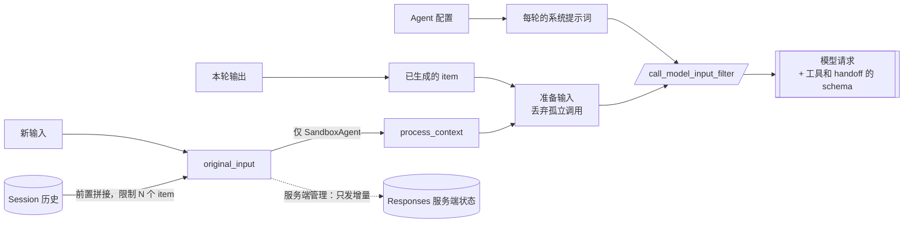
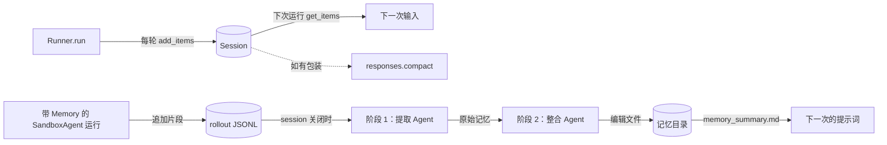
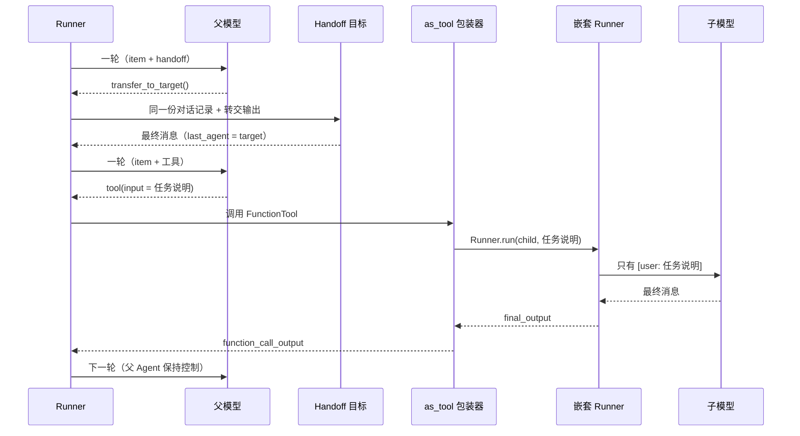

[English](openai-agents-python.md) · **中文**

# OpenAI Agents SDK for Python（`openai/openai-agents-python`）

> 研究基于提交 [`71c2da4`](https://github.com/openai/openai-agents-python/tree/71c2da4de47159ccc37905b8fe781be805dbfa66)
> （2026-10-07，`v0.23.1` 之后 22 个提交；`pyproject.toml` 中为 `openai-agents==0.23.1`）。
> 下文的源码路径都相对于仓库根目录，行号对应这个提交。
> **事实**指在源码中读到、经测试证实或在运行时观察到的内容；**解读**是我对作者意图的理解。

**交互式图表（Archify，每个节点都链接到源码）：**
[架构](../diagrams/openai-agents-python/architecture.html) ·
[执行流程](../diagrams/openai-agents-python/execution-flow.html) ·
[核心抽象](../diagrams/openai-agents-python/core-abstractions.html) ·
[上下文流](../diagrams/openai-agents-python/context-flow.html) ·
[记忆流](../diagrams/openai-agents-python/memory-flow.html) ·
[工具运行时](../diagrams/openai-agents-python/tool-runtime.html) ·
[Agent 循环](../diagrams/openai-agents-python/agent-loop.html) ·
[子 Agent 流程](../diagrams/openai-agents-python/sub-agent-flow.html)
（图表为英文，中英文版共用）

**最小复现：**[`experiments/openai-agents-python/`](https://github.com/woaitqs/repo-research/tree/main/experiments/openai-agents-python)（[中文说明](https://github.com/woaitqs/repo-research/blob/main/experiments/openai-agents-python/README.zh.md)）

---

## 摘要（TL;DR）

- **SDK 本身就是运行时。** 与构建在 LangGraph 之上的 harness 不同，这个仓库自己掌握控制流。
  `AgentRunner._run_impl` 是一个 `while True` 循环（`src/agents/run.py:1026`），运转在一个四状态机上：
  `NextStepRunAgain | NextStepHandoff | NextStepFinalOutput | NextStepInterruption`（`src/agents/run_internal/run_steps.py:164-191`）。
  一个*轮次*（turn）是一次逻辑上的模型调用，加上它在本地产生的副作用；`max_turns`（默认 10，`src/agents/run_config.py:45`）限制的是轮次，不是 token。
- **`Agent` 不掌握任何控制流。** 它是一个 dataclass，包含指令、工具、handoff、护栏（guardrail）和输出类型（`src/agents/agent.py:319-418`）。
  Runner 在*每一轮*都重新解析动态指令、已启用的工具和 handoff（`run_loop.py:2711-2723`；探针 P12）。
- **模型能做的一切都是工具调用。** handoff 是一个名为 `transfer_to_<agent>` 的函数工具，调用它会切换当前 Agent（`turn_resolution.py:3583-3594`）；
  `Agent.as_tool()` 是一个运行*嵌套* `Runner.run` 的 `FunctionTool`（`agent.py:1044-1060`）。模型看到的是同一种契约，由运行时决定一次调用意味着什么。
- **Responses 格式的 item 是数据模型。** Runner、session、`RunState` 和结果都存储 `TResponseInputItem`；
  各提供商的适配器在边界处转换（`Converter.items_to_messages`，`src/agents/models/chatcmpl_converter.py:534`）。
- **上下文管理大多需要显式开启，或者交给服务端。** 默认情况下，每个工具输出都原样重放（探针 P9）。SDK 提供的手段有：
  - 钩子：`call_model_input_filter`、`session_input_callback`、`SessionSettings.limit`；
  - 需要显式开启的 `ToolOutputTrimmer`；
  - 服务端压缩：`ModelSettings.context_management`、`OpenAIResponsesCompactionSession`。

  核心循环里没有内置的客户端摘要器。
- **人工审批是一个可序列化的暂停，而不是阻塞调用。** 设置了 `needs_approval` 的工具会让运行返回一个带 `interruptions` 的结果；
  `RunState.to_json()`（schema `1.20`，`src/agents/run_state.py:245`）可以保存下来，稍后再恢复；
  恢复时会把暂停的那一轮执行完，*不会*再调用一次模型（探针 P7，真实模型 R3）。
- **最新的一层是 `SandboxAgent`**（提交 `2d665c9a`，2026-04-15）。能力（capability）`Filesystem`、`Shell`、`Compaction`、`Skills`、`Memory`
  为每次运行准备一个 Agent 的*执行克隆*，附带额外的工具、提示词片段和采样参数（`src/agents/sandbox/runtime_agent_preparation.py:86-157`）。
  沙箱 `Memory` 是一种两阶段、由 Agent 自己写入的文件记忆。
- **用真实模型检查过**（deepseek-v4.1-flash 和 doubao-seed-2.1-pro，各 3 轮）：
  - handoff 会带上完整的对话记录，*包括上一个 Agent 的 reasoning item*；
  - `as_tool` 的子 Agent 恰好只收到那一行任务说明；
  - 默认的**脱敏**工具错误文本，让模型自我纠正的比例从 6/6 降到 1/6。

  见[验证](#验证verification)。

## 为什么值得研究（Why This Repository Matters）

- 它是 OpenAI Agent 运行时设计的参考实现：小的公共接口（`Agent`、`Runner`、工具、handoff、护栏、session）之下，
  是一个庞大且防御性很强的核心（`run_internal/` 约 2 万行）。
- 它是**提供商中立的循环，配上提供商专属的数据模型**。循环使用 OpenAI Responses 的 item，Chat Completions、LiteLLM 和 any-llm 适配器负责翻译。
  这让可移植性上的取舍非常清楚（见探针 P17）。
- 这个代码库是*为*编码 Agent 维护的：`AGENTS.md` 加上 `.agents/references/` 里的 16 份维护者参考文档
  （例如 `runner-lifecycle.md`、`tool-execution-lifecycle.md`）写明了每次修改都必须保持的不变式。
  我把它们当作地图使用，保留下来的每条说法都对照代码核实过。
- 提交历史里有值得照搬的加固决策，例如：
  - 默认对工具失败信息脱敏（`40956e04`，#5112）；
  - 把嵌套 handoff 历史从默认开启改回需要显式开启（`a776d809` #1996 → `6ab83d43` #2272）。

## 仓库概况（Repository Snapshot）

| 项目 | 值（事实） |
|---|---|
| 包 | `src/agents/`：320 个 Python 文件，约 13.5 万行。最大的几个：`run_state.py`（5.6k）、`run_internal/turn_resolution.py`（3.9k）、`tool.py`（3.0k）、`run_internal/run_loop.py`（3.0k）、`run.py`（2.8k） |
| 主要子包（行数） | `run_internal/` 20k · `sandbox/` 28k · `extensions/` 29k（沙箱提供方、LiteLLM/any-llm、session 后端、实验性的 Codex 工具）· `models/` 7.5k · `realtime/` 7.2k · `mcp/` 4.6k · `tracing/` 4.0k · `voice/` 2.8k |
| 运行时依赖 | `openai>=3.0.0,<4`、`pydantic>=2.12.2`、`griffelib`、`mcp>=1.19.0`、`websockets`、`requests`（`pyproject.toml:9-23`） |
| 可选 extras | `litellm`、`any-llm`、`realtime`、`voice`、`sqlalchemy`、`redis`、`dapr`、`mongodb`、`encrypt`，以及沙箱提供方 `docker`、`daytona`、`e2b`、`modal`、`blaxel`、`cloudflare`、`runloop`、`vercel` |
| 默认模型 | `gpt-5.6-luna`，可用 `OPENAI_DEFAULT_MODEL` 覆盖（`src/agents/models/default_models.py:99-103`）；OpenAI 提供方默认使用 Responses API（`models/_openai_shared.py:11`） |
| 历史 | 2,482 个提交；首个提交在 2025-03-11。提交数在 2026-08 达到峰值，当月 360 个 |
| 测试 | 414 个测试文件；在锁定环境下 12,174 个通过（见[验证](#验证verification)） |
| 示例 | `examples/` 下 224 个 Python 文件 |

## 架构（Architecture）

**事实：** 底下没有框架，各层都在这个仓库里：

```text
公共 API     Agent · Runner · tools · handoffs · guardrails · Session · RunState   (agent.py, run.py, tool.py, ...)
运行循环     _run_impl / start_streaming -> run_single_turn -> turn_resolution      (run.py, run_internal/)
模型边界     Model / ModelProvider；Responses、Chat Completions、LiteLLM 适配器      (models/, extensions/models/)
执行         函数工具、MCP、托管工具、SandboxRuntime + 沙箱 session                  (tool.py, mcp/, sandbox/)
横切关注点   tracing span + processor、用量、钩子                                    (tracing/, usage.py, lifecycle.py)
```



带源码链接的完整版：[architecture.html](../diagrams/openai-agents-python/architecture.html)。

**模块边界（事实）：**

| 模块 | 负责 | 依赖 |
|---|---|---|
| `src/agents/run.py` | 公共的 `Runner`、非流式循环，以及把下面各部分接起来 | `run_internal/*`、`sandbox.runtime`、`run_state` |
| `src/agents/run_internal/` | 轮次执行、响应处理、工具规划与执行、handoff、session 持久化、服务端对话追踪、重试、流式循环 | `items`、`tool`、`handoffs`、`models.interface` |
| `src/agents/agent.py`、`handoffs/`、`tool.py`、`guardrail.py` | 声明式定义 | `run_context`、`function_schema`、`strict_schema` |
| `src/agents/models/` | `Model`/`ModelProvider` 接口，OpenAI Responses（HTTP + WebSocket）和 Chat Completions 适配器，重试建议 | `openai` SDK |
| `src/agents/memory/` | `Session` 协议，SQLite 和 OpenAI Conversations session，Responses 压缩 session | `run_internal.items` |
| `src/agents/sandbox/` | `SandboxAgent`、capability、manifest、session 生命周期、快照、沙箱记忆 | Runner（记忆 Agent 通过 `Runner.run` 运行） |
| `src/agents/mcp/` | MCP 服务器连接，把 MCP 工具转换成 `FunctionTool` | `mcp` SDK |
| `src/agents/tracing/` | trace/span、processor、OpenAI 导出器（`https://api.openai.com/v1/traces/ingest`，`tracing/processors.py:46`） | 循环中没有依赖 |
| `src/agents/realtime/`、`voice/` | 独立的运行时，分别用于 realtime 会话和 STT→工作流→TTS 流水线 | 不在本文研究的 `Runner` 路径上 |

**解读：** `AGENTS.md` 要求维护者让 `run.py` "专注于编排"（"focused on orchestration"），把逻辑放进 `run_internal/`。
实际上 `_run_impl` 仍有约 1,800 行（`run.py:623-2400`），因为每条退出路径都还要处理 session、护栏、tracing、沙箱清理和恢复状态。

## 主要执行流程（Main Execution Flow）

追踪的入口：非流式的 `await Runner.run(agent, "...", session=session)`，带一个函数工具。
`Runner.run_streamed` 走同样的步骤，只是放在一个后台任务和第二个循环里（`start_streaming`，`run_internal/run_loop.py:969`）。



逐步说明（除非另有标注，每一步都是在源码中读到的事实）：

1. **公共入口。** `Runner.run`（`run.py:273`）转发给默认的 `AgentRunner.run`（`run.py:344-357`）。
   后者规范化 `RunConfig`，在关闭 tracing 时将其屏蔽，然后调用 `_run_impl`（`run.py:568-605`）。
   标记为"数据已脱敏"的错误在重新抛出时不带 traceback（`run.py:358-378`）。
2. **准备输入。**
   - 全新的运行中，`prepare_input_with_session` 读取 session 历史（遵守 `SessionSettings.limit`），返回 `历史 + 新输入`，
     以及仍需持久化的 item（`run_internal/session_persistence.py:414-488`）。
   - 使用 `conversation_id` / `previous_response_id` 时*不会*在前面拼接历史，因为历史归服务端所有（`run.py:707-725`）。
   - 如果输入是 `RunState`，则改为恢复上下文、轮次计数和待处理的审批（`run.py:659-690`）。
3. **运行级辅助对象。** `SandboxRuntime`、`PromptCacheKeyResolver` 和 `RunState` 本身在每次运行中只创建一次（`run.py:855-868`）。
4. **循环头部。** 每次迭代（`run.py:1026`）：
   - 第一轮的输入护栏：阻塞式护栏在沙箱准备之前运行（`run.py:1040-1076`）；
   - `sandbox_runtime.prepare_agent(...)` 返回 `AgentBindings(public_agent, execution_agent)`，也可能返回改写后的输入（`run.py:1079-1085`）；
   - 新的 session 输入在第一次模型调用*之前*保存（`run.py:1111-1123`）；
   - `current_turn += 1`；超过 `max_turns` 时抛出 `MaxTurnsExceeded`，除非某个错误处理器提供了最终输出（`run.py:1591-1616`）。
5. **一轮。** `run_single_turn`（`run_internal/run_loop.py:2665`）依次：
   - 运行 Agent 开始钩子；
   - 获取已启用的工具（`get_all_tools`，它也会列出 MCP 工具）；
   - 解析系统提示词和 handoff，并处理工具名冲突（`run_loop.py:2696-2723`）。

   它把模型输入构建为*调用方输入 + 可重放的已生成 item*，并剪掉孤立的调用（`_prepare_turn_input_items`，`run_loop.py:347-354`）；
   服务端管理对话时则只发送增量。
6. **模型调用。** `get_new_response`（`run_loop.py:2800`）依次：
   - 应用 `call_model_input_filter`，并对输入去重；
   - 选定模型（`get_model`，`turn_preparation.py:134`）；
   - 如果这个 Agent 已经用过工具，就重置 `tool_choice`（`maybe_reset_tool_choice`，`tool_execution.py:561-569`）；
   - 加上稳定的 `prompt_cache_key`；
   - 通过 `get_response_with_retry` 调用 `model.get_response(...)`（`run_loop.py:2898-2915`；`run_internal/model_retry.py:574`）。

   每个被接受的响应只累加一次用量（`run_loop.py:2939`）。
7. **分类。** `process_model_response`（`run_internal/turn_resolution.py:2926`）把输出 item 变成公开的 `RunItem` 和可执行记录：
   函数调用、handoff、computer/shell/apply-patch 动作、MCP 审批请求、托管工具 item。
   名字是 handoff 工具的函数调用会变成 `ToolRunHandoff`（`turn_resolution.py:3583-3594`）。
   未知工具会抛出 `ModelBehaviorError`，除非设置了 `tool_not_found_behavior="return_error_to_model"`（`turn_resolution.py:3615-3641`）。
8. **副作用。** `execute_tools_and_side_effects`（`turn_resolution.py:804`）先制定计划，运行审批和工具护栏，
   通过 `_FunctionToolBatchExecutor`（`tool_execution.py:1547`）并发执行函数工具，并按模型给出的顺序追加输出 item。然后依次判断：
   - 有待处理的审批 → `NextStepInterruption`（`turn_resolution.py:935-950`）；
   - 有 handoff → `execute_handoffs` → `NextStepHandoff`（`:537`）；
   - `tool_use_behavior` 要求停止 → `NextStepFinalOutput`（`:769-801`）；
   - 没有工具、只有一条消息 → 最终输出，按 `output_type` 校验（`:997-1124`）；
   - 其他情况 → `NextStepRunAgain`（`:1129-1137`）。
9. **循环尾部。** `run.py:1896-1918` 替换 `original_input`（handoff 可能过滤过它），设置 `generated_items = pre_step_items + new_step_items`，
   追加 session item，并持久化本轮（`run.py:1932-2000`）。然后按 `next_step` 分支（`run.py:2001`、`:2171`、`:2284`、`:2295`）。
   如果是最终输出，就运行输出护栏，再返回 `RunResult`。

交互式版本：[execution-flow.html](../diagrams/openai-agents-python/execution-flow.html) 和 [agent-loop.html](../diagrams/openai-agents-python/agent-loop.html)。

## 核心抽象（Core Abstractions）



交互式版本：[core-abstractions.html](../diagrams/openai-agents-python/core-abstractions.html)。

### `Agent`
- **职责：** 声明 Agent *是什么*：指令（字符串或 `(ctx, agent)` 可调用对象）、工具、MCP 服务器、handoff、模型与设置、护栏、输出类型、
  `tool_use_behavior`、`reset_tool_choice`（`agent.py:187-418`）。
- **输入 / 输出：** 运行时没有，由 Runner 读取它。`get_system_prompt` 针对当前上下文解析可调用的指令（`agent.py:1129-1158`）；
  `get_all_tools` 按 `is_enabled` 过滤，并追加 MCP 工具（`agent.py:286-316`）。
- **生命周期：** 由应用构造，跨运行复用。`clone()` 是浅拷贝的 `dataclasses.replace`。
  同一个 `SandboxAgent` 实例不能同时用于两次运行（`.agents/references/sandbox-runtime-boundary.md`）。
- **为什么存在：** Agent 保持声明式，Runner 就能掌握全部控制流；正是这一点让中断/恢复和流式一致性变得可控。

### `Runner` / `AgentRunner`
- **职责：** 循环、轮次计数、护栏顺序、handoff 切换、持久化、tracing 和结果构建（`run.py:273-2827`；流式部分在 `run_loop.py:969-2306`）。
- **输入：** 起始 Agent、`input`（字符串、item 列表或 `RunState`）、`context`、`max_turns`、`hooks`、`run_config`、`error_handlers`、`session`，
  以及服务端对话的 id（`run.py:275-290`）。
- **输出：** `RunResult` / `RunResultStreaming`，包含 `final_output`、`new_items`、`raw_responses`、`last_agent`、护栏结果、`interruptions`，
  以及 `to_state()` / `to_input_list()`。
- **为什么存在：** 让副作用的顺序只有一个负责者。维护者参考文档明确写出了不变式（`.agents/references/runner-lifecycle.md`）：
  - 每次逻辑模型调用只增加一次轮次；
  - 恢复时绝不重复计数；
  - 流式和非流式必须产生等价的 item。

### `SingleStepResult` + `NextStep*`
- **职责：** "一次模型响应及其本地副作用"与"循环下一步做什么"之间的控制边界（`run_steps.py:164-248`）。
- **字段：** `original_input`、`model_response`、`pre_step_items`、`new_step_items`、`next_step`；
  当 handoff 过滤器对模型隐藏了某些 item、但历史仍需保留它们时，还有 `session_step_items`。
- **为什么存在：** 由四种结果构成的封闭集合，正是 `RunState` 能够序列化的东西。
  要增加一种可暂停的行为，就得增加一个带有流式、session、tracing 和恢复语义的步骤变体，而不是在某条路径上局部 `return`。

### 工具：`FunctionTool` 与 `Tool` 联合类型
- **职责：** `FunctionTool` = 名称、描述、严格 JSON schema 和 `on_invoke_tool(ctx, json) -> Any`，再加上策略字段：
  `is_enabled`、`needs_approval`、`tool_input_guardrails`、`tool_output_guardrails`、`timeout_seconds`、`failure_error_function`、`defer_loading`、
  `allowed_callers`（`tool.py:454-600`）。
  `Tool` 还包括由 OpenAI 执行的托管工具（web/file search、code interpreter、图像生成、托管 MCP、tool search），
  以及本地动作工具（computer、shell、apply_patch、custom）（`tool.py:1649-1664`）。
- **为什么存在：** 本地代码、MCP 工具和子 Agent 共用一个可执行契约，托管工具则作为由服务端执行的数据保留。

### `Handoff`
- **职责：** 一个工具（`tool_name`、`input_json_schema`），调用它会返回下一个 Agent（`on_invoke_handoff`），
  另外还有 `input_filter`、`nest_handoff_history` 和 `is_enabled`（`handoffs/__init__.py:126-227`）。
  默认名称为 `transfer_to_<snake_case(agent.name)>`；工具输出为 `{"assistant": "<name>"}`（`:210-219`）。
- **为什么存在：** 把路由作为模型的决定，并用模型原生的工具调用词汇来表达。

### `Model` / `ModelProvider`（模型抽象）
- **职责：** `Model.get_response(system_instructions, input, model_settings, tools, output_schema, handoffs, tracing, previous_response_id, conversation_id, prompt) -> ModelResponse`，
  加上 `stream_response` 和可选的 `get_retry_advice`（`models/interface.py:37-135`）。
  `ModelProvider.get_model(name)` 把字符串解析成模型；`MultiProvider` 按前缀路由（`openai/`、`litellm/`、`any-llm/`；`models/multi_provider.py:62-75`）。
- **值得注意的契约：** 模型必须给每次工具调用分配一个非空的调用 id，并且在恢复前后保持稳定（`interface.py:38-45`）。
- **为什么存在：** 循环永远看不到线上格式（wire format）。代价是 item 词汇是 OpenAI 的，非 Responses 后端会丢失一些功能（探针 P17）。

### `RunContextWrapper`
- **职责：** 携带应用的 `context` 对象（从不发送给模型）、整个运行的 `Usage`、`turn_input`，以及审批记录（`run_context.py:176-200`）。
  `ToolContext` 在此基础上加入调用 id、工具名和参数。
- **为什么存在：** 给工具、钩子和护栏做依赖注入，而不必把状态放进提示词。

### `Session`
- **职责：** 四个异步方法：`get_items(limit)`、`add_items`、`pop_item`、`clear_session`（`memory/session.py:53-97`）。实现有：
  - `SQLiteSession`；
  - `OpenAIConversationsSession`（服务端）；
  - `OpenAIResponsesCompactionSession`（包装器）；
  - `extensions/memory/` 中的异步 SQLite、SQLAlchemy、Redis、Dapr、MongoDB、加密和 "advanced" SQLite session。
- **为什么存在：** 不依赖框架的客户端对话记忆；见[记忆](#记忆memory)。

### `RunState`
- **职责：** 恢复所需的一切：当前轮次和 Agent、原始输入、已生成的 item 和 session item、模型响应、护栏结果、待处理的步骤、
  工具使用追踪器、trace 状态、沙箱恢复状态，以及上下文中的审批（`run_state.py:835-945`）。
  `approve()` / `reject()` 记录决定（`:1366-1410`）；`to_json()` / `from_json()` 分别在 `:1885` 和 `:2393`。
- **Schema 策略：** 每次升级版本都要在 `SCHEMA_VERSION_SUMMARIES` 中加一行摘要；已发布的版本保持可读；
  旧版 SDK 会拒绝更新的版本（`run_state.py:237-310`）。

### `SandboxAgent` + `Capability`
- **职责：** `SandboxAgent` 在 `Agent` 之上增加了 `default_manifest`、`base_instructions`、`capabilities`（默认 `[Filesystem(), Shell(), Compaction()]`）
  和 `run_as`（`sandbox/sandbox_agent.py:31-64`；`capabilities/capabilities.py:7-10`）。
  一个 `Capability` 有五个钩子：`tools()`、`instructions(manifest)`、`sampling_params(params)`、`process_context(items)`、`process_manifest(manifest)`
  （`capabilities/capability.py:16-70`）。
- **为什么存在：** 沙箱中的 Agent 需要三样按运行准备的东西：绑定到活动 session 的工具、依赖工作区的提示词文本，以及模型参数。
  capability 就是这个 SDK 里的中间件。

## Agent 循环（Agent Loop）



交互式版本：[agent-loop.html](../diagrams/openai-agents-python/agent-loop.html)。

- **退出规则（事实）：** 没有工具调用、有一条消息的响应就是最终输出；只要有本地工具运行过，循环就会再次调用模型，让它看到输出
  （`turn_resolution.py:997-1137`）。`tool_use_behavior` 可以提前结束循环：`"stop_on_first_tool"`、`StopAtTools` 或一个可调用对象
  （`turn_resolution.py:769-801`；探针 P10）。
- **结构化输出：** 设置了 `output_type` 时，最后一条消息的文本会按 JSON 校验（`agent_output.py:61`）；
  无效 JSON 会抛出 `ModelBehaviorError`，除非 `error_handlers` 中有条目提供输出（`turn_resolution.py:1044-1095`）。
- **约束：** `max_turns`（默认 10）统计的是本次运行中所有 Agent 的模型调用次数（探针 P6）。`get_new_response` 内部的重试不算轮次。
- **循环保护：** Agent 用过工具之后，`tool_choice` 会被重置为 `None`，这样 `"required"` 就不会造成无限的工具循环（`tool_execution.py:561-569`；探针 P12）。
- **两个循环：** 流式循环（`start_streaming`，`run_loop.py:969`）用一个队列和后台任务复制了 `_run_impl` 的控制流。
  两者一致是一条明确的不变式，由成对的测试文件保证（`tests/test_agent_runner.py`、`tests/test_agent_runner_streamed.py`）。
- **错误处理器：** `error_handlers` 以 `max_turns`、`model_refusal` 和 `invalid_final_output` 为键，可以把终止性错误变成最终输出
  （`run_error_handlers.py:50-55`；`run.py:1608-1616`）。

## 上下文工程（Context Engineering）

这里的上下文工程主要关乎**组装、重放时的整洁和钩子**。核心循环自己不会缩减上下文。



交互式版本：[context-flow.html](../diagrams/openai-agents-python/context-flow.html)。

1. **上下文如何构建。** 每一轮在 `run_single_turn` / `get_new_response` 中组装（`run_loop.py:2665-2915`）：
   - 解析后的指令（`get_system_prompt`）；
   - `original_input`（调用方输入，前面拼接 session 历史），加上转换回输入 item 的已生成 item（`run_item_to_input_item`，`run_internal/items.py:179-209`）；
   - 工具和 handoff 的 schema、输出 schema 与设置。

   随后 `call_model_input_filter` 看到 `ModelInputData(input, instructions)`，并且可以返回一个替代品（`turn_preparation.py:51-93`）。
2. **哪些内容进入模型上下文。**
   - 指令。对 `SandboxAgent`，它们按固定顺序组装：SDK 基础提示词、Agent 指令、capability 片段、远程挂载策略、文件系统树
     （`runtime_agent_preparation.py:173-235`）。**实测：** 这个提示词有 23,254–23,291 个字符，其中约 16.8k 是 SDK 基础提示词（探针 P14、R6）；
   - 调用方的输入和 session 历史；
   - 每一个已生成的 item：消息、函数调用及其输出、handoff 输出、**reasoning item**、托管工具 item；
   - 已启用工具和 handoff 的 schema（MCP 工具每轮都会重新列出，除非开启了缓存，`mcp/server.py:1490`）。
3. **哪些内容被排除。**
   - `RunContextWrapper.context`。它是本地状态，"never added to model input automatically"（`.agents/references/agent-definition-and-run-context.md`）；
     复现中用 `test_context_object_is_never_sent_to_the_model` 固化了这一点；
   - 审批占位符和只属于 SDK 的元数据（对 `tool_approval_item`，`run_item_to_input_item` 返回 `None`；`strip_internal_input_item_metadata`）；
   - Runner 生成的历史中的孤立函数调用（`drop_orphan_function_calls`，`items.py:211`）；
   - 被禁用的工具和 handoff（`is_enabled`），以及 Responses tool search 加载之前的 `defer_loading` 工具；
   - Agent 打开之前的 skill 正文和 `MEMORY.md`（只放索引和摘要，见[记忆](#记忆memory)）；
   - 使用 `conversation_id` / `previous_response_id` 时，服务端已经有的一切（`OpenAIServerConversationTracker.prepare_input`，`run_internal/oai_conversation.py:518`）。
4. **工具结果如何处理。** 返回值经 `ItemHelpers.tool_call_output_item` 变成 `function_call_output`（`items.py:845-900`）：
   - 字符串原样保留；
   - 结构化的 `input_text` / `input_image` / `input_file` 输出变成内容列表；
   - 其他值转成字符串，或按 `output_type` 校验。

   异常交给 `failure_error_function` 处理。默认返回固定字符串 *"An error occurred while running the tool. Please try again."*（`tool.py:1980-1985`），
   参数无法解析时也一样（探针 P4）。`custom_data_extractor` 可以附加只属于 SDK、从不发送给模型的数据。
5. **截断与卸载。** **事实：函数工具的输出默认不截断。** 探针 P9 中一个 5,000 字符的输出被原样重放。只有工具自己选择时才有输出上限：
   - 沙箱 `exec_command` 只在模型传入 `max_output_tokens` 时截断（默认 `None`，`capabilities/tools/shell_tool.py:144-149`；`util/token_truncation.py:57-61`）；
   - `ShellTool` 的动作和执行器结果带有可选的 `max_output_length`（`tool.py:1421-1436`）；
   - `ToolOutputTrimmer`（需显式开启，提交 `bc9dbd7d`）只在模型视图里把旧输出替换为预览（`extensions/tool_output_trimmer.py:88-140`）。

   核心循环中没有卸载到文件的机制。
6. **摘要 / 压缩。** 有三种机制，普通 `Agent` 默认都不开启：
   - **服务端压缩：** `ModelSettings.context_management=[{"type": "compaction", "compact_threshold": ...}]` 被传给 Responses API
     （`model_settings.py:191-197`；`models/openai_responses.py:1057`）。沙箱 `Compaction` capability（在默认集合中）把阈值设为模型上下文窗口的 90%，
     未知模型则为 24 万 token（`capabilities/compaction.py:162-208`），并丢弃最新一个 `compaction` item 之前的所有 item（`:210-225`；探针 P15）；
   - **session 压缩：** `OpenAIResponsesCompactionSession` 包装一个 session。某一轮结束后，如果候选 item 达到 10 个或更多，它就调用 `responses.compact`，
     替换存储的历史（`memory/openai_responses_compaction_session.py:36-69, 91-186`；触发逻辑在 `session_persistence.py:678-740`）。
     还有本地工具输出待处理时，它会推迟压缩；
   - **handoff 嵌套：** `nest_handoff_history=True` 把对话记录折叠成一条 `<CONVERSATION HISTORY>` 消息。
     这是文本转储，不是 LLM 摘要（`handoffs/history.py:83-168`；探针 P2）。
7. **仓库上下文。** 不建索引。`SandboxAgent` 会在提示词里得到其 manifest 深度为 3 的渲染（`_filesystem_instructions`，`runtime_agent_preparation.py:48-77`），
   然后用 `exec_command` 自己探索（提示词写着 "Prefer `rg`"，`capabilities/shell.py:16-26`）。
8. **子 Agent 如何获得上下文。**
   - **Handoff（默认）：** 完整的原始对话记录，包括 handoff 调用及其 `{"assistant": ...}` 输出（探针 P1）。
     在真实模型上，下一个 Agent 的输入在 6/6 轮中还包含上一个 Agent 的 **reasoning item**（R1）。
     这段 reasoning 是否会在线上重放取决于适配器：对 Chat Completions，只对 DeepSeek 系列模型重放
     （`models/reasoning_content_replay.py`，`default_should_replay_reasoning_content`）。
   - **`input_filter`** 可以改写 `input_history`、`pre_handoff_items`、`new_items`；
     `input_items` 只改变模型视图，`new_items` 仍保留在 session 历史中（`handoffs/__init__.py:158-180`；`turn_resolution.py:640-720`）。
   - **`Agent.as_tool`：** 只有生成的 `input` 字符串，或由 `input_builder` 构建的结构化输入
     （`agent.py:721-790`；探针 P3；R2：12/12 次子 Agent 调用都恰好只收到一个 user item）。
9. **上下文隔离如何实现。**
   - `as_tool` 的隔离是结构性的：一次全新的 `Runner.run`，配一个全新的 `ToolContext`（因此审批不会泄漏），
     同时共享应用的 context 对象和用量累加器（`agent.py:758-790`）。
     父 Agent 收到 `final_output`；最终输出为空时，收到最后一条非空消息或工具输出（`agent.py:1073-1100`）。
   - Handoff 默认**没有**隔离，隔离是过滤器的工作。文档字符串还提醒，嵌套"不是一种脱敏机制"（"not a redaction mechanism"）
     （`handoffs/__init__.py:158-176`）。
   - 服务端管理的对话会直接拒绝 handoff 输入过滤器（`turn_resolution.py:505-534`）。
10. **长时间运行时如何控制上下文大小。** 靠配置，而不是默认行为：
    - `max_turns` 限制步数；
    - `SessionSettings.limit` 限制 *item* 数量。session 也会存储 reasoning item：一次真实运行为一轮对话存储了 `[user, reasoning, message]`，
      所以 `limit=2` 只保留了最后的 reasoning 和 message（R4）；
    - `session_input_callback`；
    - `call_model_input_filter`（例如 `ToolOutputTrimmer`）；
    - 服务端压缩；
    - 只发送增量的服务端管理状态。

    每次运行使用稳定的 `prompt_cache_key`，让前缀在各轮之间都能命中缓存（`run_internal/prompt_cache_key.py:17-120`）。
    **解读：** 这个 SDK 把上下文策略视为应用的决定，自动压缩则依赖 Responses API；在其他后端上，策略必须由应用自己提供。

## 记忆（Memory）

| 概念 | 在这里是什么 | 存在哪里 | 范围 | 谁写入 | 谁读取 |
|---|---|---|---|---|---|
| **对话历史** | 存储的输入 item：用户消息、助手消息、reasoning、工具调用及输出 | 一个 `Session` 后端（SQLite、Redis、SQLAlchemy、Dapr、MongoDB、加密包装器），或服务端（`OpenAIConversationsSession`、`conversation_id`、`previous_response_id`） | `session_id` / 对话 | Runner：第 1 轮之前写入新输入，之后每轮结束时写入（`run.py:1111-1123`、`:1932-2000`） | `prepare_input_with_session`，拼接到下一次运行之前 |
| **上下文** | 一个 `ModelInputData` 加上各种 schema | 仅在内存中，每轮重建 | 一次模型调用 | `run_single_turn` + 过滤器 | 模型 |
| **持久记忆** | 沙箱 `Memory` 文件：`memory_summary.md`、`MEMORY.md`、`skills/`、`rollout_summaries/` | 沙箱工作区（默认 `memories/`，`sandbox/config.py:27-33`） | 一个工作区；rollout 按 conversation/session/group id 分组（`run.py:245-257`） | session 关闭时的两个后台 Agent；`live_update=True` 时主 Agent 也会写 | `Memory.instructions` 注入摘要；Agent 按需 grep `MEMORY.md` |
| **本地状态** | `RunContextWrapper.context` | 进程内存 | 一次运行 | 应用、工具 | 工具、钩子、护栏——从不给模型 |
| **外部存储** | `RunState` JSON、沙箱快照、服务端对话 | 应用存放的任何地方 | 由应用定义 | `to_json()`、沙箱清理 | `from_json()`、沙箱恢复 |



交互式版本：[memory-flow.html](../diagrams/openai-agents-python/memory-flow.html)。

- **Session 记忆是隐式且完整的。** 不做任何筛选或摘要：Runner 生成的一切都被追加，下一次运行把它拼接在前面。
  只有 `limit`、`session_input_callback` 和压缩包装器会改变这一点。
- **沙箱记忆是显式的，由 Agent 写入**（`sandbox/memory/`）：
  - 在沙箱 session 期间，每次运行的结果都追加到 `sessions/<rollout_id>.jsonl`（`memory/manager.py:89-117`）；
  - `flush()` 注册为沙箱 session 的停止前钩子（`manager.py:64`）。关闭时，一个带结构化输出的**阶段 1** `SandboxAgent`
    为每个 rollout 提取 `{rollout_slug, rollout_summary, raw_memory}`（默认 `gpt-5.4-mini`；rollout 截断到 15 万 token）
    （`memory/phase_one.py:15-126`；`config.py:48`）；
  - 一个**阶段 2** `SandboxAgent`（默认 `gpt-5.5`，最多 500 轮）用它的 shell 和文件工具，把选中的原始记忆（≤ 256 条）整合进记忆目录
    （`memory/phase_two.py:10-37`；`config.py:45-83`）；
  - 读取侧把 `memory_summary.md`（截断到 1.5 万 token）注入系统提示词，并附带一个"快速记忆检查"（quick memory pass）流程：
    grep `MEMORY.md`，最多打开 1–2 份 rollout 摘要或 skill（`capabilities/memory.py:50-90`；`memory/prompts/memory_read_prompt.md`）。
- **过期问题**靠提示词策略处理："记忆是指引，不是事实：以当前证据为准"（"memory is guidance, not truth: current evidence wins"）。
  `live_update=True` 时，Agent 一旦发现冲突，*必须*在同一轮修正 `MEMORY.md`（`memory/prompts.py:36-50`）。
  **解读：** 这是把 Codex 的 "memories" 设计搬进了一个可复用的 SDK，而且 SDK 用的就是自己：记忆的写入者就是在 `SandboxAgent` 上调用的 `Runner.run`。
- **Skills 是程序性记忆，采用渐进式披露。** `Skills` 把 `SKILL.md` 目录挂载进工作区（默认 `.agents/`），
  只把 `name: description (file: path)` 放进提示词，并告诉模型在任务匹配时打开 `SKILL.md`（`capabilities/skills.py:621-984`）。
  懒加载模式下，由一个 `load_skill` 工具按需实体化单个 skill。
  探针 P14：skill 正文不在提示词中。R6：两个模型在 6/6 轮中都先打开 `SKILL.md` 再读 changelog，并遵守了其中的标记指令。

## 工具（Tools）

- **接口：** `FunctionTool`（`tool.py:454`）；`@function_tool` 从函数签名和 docstring 推导出严格 JSON schema（`tool.py:2574-2870`、`function_schema.py`）。
  同步函数在 `asyncio.to_thread` 中运行（`tool.py:2783-2785`）；只有异步工具支持超时。
- **注册与发现：**
  - 静态的 `Agent.tools`，每轮按 `is_enabled`（bool 或可调用对象）过滤；
  - 加上每轮从 `Agent.mcp_servers` 获取的 MCP 工具（可用 `cache_tools_list=True` 缓存，`mcp/server.py:1490`）；
  - 工具和 handoff 之间的名称冲突遵循 `tool_name_collision_policy`（`run_config.py:490`）；
  - Responses tool search 可以延迟加载工具定义（`defer_loading`）。
- **调用：** 规划先于副作用（`tool_planning.py`）；一次响应中的函数调用并发执行，输出保持模型给出的顺序
  （探针 P13：耗时 0.4 s 和 0.1 s 的两个工具一共用了 0.41 s）；`RunConfig.tool_execution.max_function_tool_concurrency` 限制本地并发（`run_config.py:136-146`）。
- **结果处理：** 见[上下文工程](#上下文工程context-engineering)第 4 条。`tool_use_behavior` 可以让某个工具结果成为最终输出。
- **错误处理：**
  - 工具异常 → `failure_error_function`（默认是固定文本；设为 `None` 则重新抛出）（`tool.py:640-695`）；
  - 超时 → `timeout_behavior="error_as_result"`（模型可见的文本）或 `"raise_exception"`；
  - 未知工具 → 默认抛出 `ModelBehaviorError`（探针 P5）；
  - 模型拒绝 → `ModelRefusalError`，除非被处理（`turn_resolution.py:1003-1036`）。
- **重试：** 工具层没有重试。模型调用通过 `get_response_with_retry` 重试，使用 `ModelRetrySettings` 和提供商给出的重试建议；
  有状态的请求（`previous_response_id`）和不能安全重放的请求（programmatic tool calling）会限制重放（`run_internal/model_retry.py:574-600`）。
- **权限：**
  - `needs_approval`（bool 或按调用判断的可调用对象）→ 中断；
  - 工具输入护栏紧接在调用之前运行；设置 `ToolExecutionConfig.pre_approval_tool_input_guardrails=True` 时，还会在审批暂停之前运行（`run_config.py:146-150`）；
  - 工具输出护栏在输出被接受之前运行（`tool_execution.py:2732-2805`）；
  - MCP 服务器有自己的 `require_approval` 策略，托管 MCP 的审批也以中断的形式出现。
- **MCP：** 本地服务器（stdio、SSE、streamable HTTP）被转换成 `FunctionTool`（`mcp/util.py:266-560`）；`HostedMCPTool` 由 OpenAI 执行（`tool.py:1141`）。
  本地服务器的生命周期由调用方管理（`agent.py:201-210`；`MCPServerManager`）。
- **浏览器 / computer：** `ComputerTool` 驱动调用方提供的 `Computer` 实现；没有内置浏览器。

## 运行时 / 沙箱（Runtime / Sandbox）

**推理与执行的边界在哪里（事实）。** 模型只输出 item；`process_model_response` 把它们变成执行记录；`tool_planning` / `tool_execution` 决定执行什么。
真正运行的代码有四种来源：应用代码（函数工具）、MCP 服务器、沙箱 session（capability 工具）、OpenAI 的服务器（托管工具）。
策略关卡（审批、工具护栏、`is_enabled`、`allowed_callers`）位于分类和调用之间。

交互式版本：[tool-runtime.html](../diagrams/openai-agents-python/tool-runtime.html)。

| 运行时 | 隔离 | 源码 |
|---|---|---|
| 函数工具 | 无：在应用进程内运行 | `tool.py` |
| 托管工具 | OpenAI 的基础设施；SDK 只记录 item | `turn_resolution.py:3290-3420` |
| `UnixLocalSandboxClient` | 主机上的临时工作区；在 Linux 上，命令运行时"没有这个后端额外加的操作系统限制"（"without OS confinement added by this backend"），macOS 使用 `sandbox-exec` 但不隔离网络（`examples/sandbox/unix_local_runner.py:1-8`） | `sandbox/sandboxes/unix_local.py:231` |
| `DockerSandboxClient` | 容器，网络隔离状态会被持久化 | `sandbox/sandboxes/docker.py:220` |
| 远程提供方 | E2B、Modal、Daytona、Runloop、Vercel、Cloudflare、Blaxel | `extensions/sandbox/*` |

- **Session 归属：** 调用方提供的活动 session 归调用方所有。通过 `SandboxRunConfig.client` 创建的 session 归 Runner 所有，在运行结束时清理：
  执行停止前钩子（如记忆 flush）、持久化快照、删除提供方资源（`sandbox/runtime.py:309-320`；`.agents/references/sandbox-runtime-boundary.md`）。
- **每次运行的准备：** `SandboxRuntime.prepare_agent` 克隆 capability，确保 session 存在，校验工作区范围，绑定 capability，
  对输入运行 `process_context`，并构建执行克隆（`sandbox/runtime.py:209-307`）。
  钩子和结果保留公开的 Agent（`AgentBindings`，`run_internal/agent_bindings.py:17-38`；探针 P14：`last_agent is agent`）。
- **Manifest 信任：** 主机路径（`LocalDir`、`LocalFile`）需要受信任、由应用控制的授权；字典形式的 manifest 不能授权访问主机（`sandbox_agent.py:39-43`）。
  信任规则在 `.agents/references/sandbox-runtime-boundary.md` 中占了 84 行，在 `sandbox/_mount_security.py` 中约有 2.3k 行。
- **可移植性缺口（事实，探针 P17）：** 默认 capability 只能配合 Responses API 使用。使用 `OpenAIChatCompletionsModel` 时：
  - `Filesystem` 的 `apply_patch` 是一个 `CustomTool`，Chat Completions 转换器会拒绝它（`UserError: Hosted tools are not supported…`）；
  - `Compaction` 的 `context_management` 进入 `extra_args`，被当作关键字参数转发（`openai_chatcompletions.py:740`），OpenAI 客户端会拒绝它（`TypeError`）。

  只有 `Shell`（加上 `Skills` 和 `Memory` 的读取侧）能工作，真实模型的 R6 运行用的就是这一组。我在 `docs/sandbox/` 中没有找到对这个限制的说明。

## 子 Agent / 工作流（Sub-Agents / Workflow）



交互式版本：[sub-agent-flow.html](../diagrams/openai-agents-python/sub-agent-flow.html)。

- **Handoff 转移控制权。**
  - 一次响应中只执行第一个 handoff；多出来的会得到输出 "Multiple handoffs detected, ignoring this one."（`turn_resolution.py:574-588`）。
  - 目标 Agent 的输入护栏不会运行（输入护栏属于起始 Agent，只在第一轮运行）。
  - `max_turns` 预算是共享的。
- **历史策略改过两次（事实，见提交）：** 嵌套历史在 `a776d809`（#1996，2025-11-17）中成为默认，
  又在 `6ab83d43`（#2272，2026-01-20）中改回需要显式开启，理由是 "while we stabilize nested handoffs"（在稳定嵌套 handoff 期间）；
  该字段现在是 `nest_handoff_history: bool = False`（`run_config.py:378`）。
- **`Agent.as_tool` 保持控制权。** 嵌套运行有自己的循环、`max_turns`、审批范围和可恢复状态；
  嵌套的中断会通过父 Agent 的 `RunState` 向上冒泡（`run_state.py:1366-1382`：`_find_nested_approval_state`）。
  `on_stream` 可以通过一个有界队列转发嵌套的流事件（`agent.py:606-660`）。
- **编排由模型驱动。** 没有 DAG 引擎。确定性的编排就是围绕 `Runner.run` 的普通 Python 代码（文档中的 "orchestrating via code"）；
  `examples/agent_patterns/` 展示了用这种方式构建的路由、并行和 LLM-as-judge。
- **实验性扩展（没有深入追踪）：** `extensions/experimental/codex/` 把 Codex CLI 作为工具暴露出来；
  `extensions/experimental/hosted_multi_agent/` 提供 `OpenAIHostedMultiAgentModel`，这是一个面向 "Responses hosted multi-agent"（beta 版 Responses 连接）的 `Model`。
  我没有追踪它。

## 重要源码文件（Important Source Files）

| 文件 | 为什么要读 |
|---|---|
| `src/agents/run.py` | `Runner`；整个非流式循环（`_run_impl`，`:623-2400`） |
| `src/agents/run_internal/run_loop.py` | `run_single_turn`、`get_new_response`，以及流式循环 |
| `src/agents/run_internal/turn_resolution.py` | 输出分类、handoff、最终输出规则、被中断轮次的恢复 |
| `src/agents/run_internal/tool_planning.py`、`tool_execution.py` | 审批规划、并发函数工具、护栏、失败转换 |
| `src/agents/run_internal/run_steps.py` | `ProcessedResponse`、`NextStep*`、`SingleStepResult` |
| `src/agents/run_internal/session_persistence.py`、`oai_conversation.py` | 客户端历史与服务端管理的增量 |
| `src/agents/agent.py` | `Agent`、`as_tool` |
| `src/agents/handoffs/__init__.py`、`handoffs/history.py` | handoff 工具、过滤器、嵌套历史 |
| `src/agents/tool.py` | 工具类型、`@function_tool`、默认失败处理 |
| `src/agents/models/interface.py`、`chatcmpl_converter.py`、`openai_responses.py` | 模型边界与适配器 |
| `src/agents/run_state.py` | 可恢复状态与 schema 策略 |
| `src/agents/sandbox/runtime.py`、`runtime_agent_preparation.py`、`capabilities/` | 沙箱准备与 capability |
| `src/agents/sandbox/memory/` | 两阶段记忆生成 |
| `.agents/references/*.md` | 维护者不变式（Runner 生命周期、run item、工具执行、沙箱边界） |
| `src/agents/testing/model.py` | `ScriptedModel`，探针使用的确定性模型 |

## 值得借鉴的 5+ 个实现决策（5+ Implementation Decisions Worth Learning From）

### 1. 封闭的 `NextStep` 状态机是唯一的控制边界
- **做法：** 每一轮返回一个 `SingleStepResult`，其 `next_step` 是四种变体之一（`run_steps.py:164-248`）；循环只根据它分支（`run.py:2001-2300`）。
  `RunState` 序列化当前步骤，所以中断只是循环可以从中返回、之后再重新进入的一个步骤（`resolve_interrupted_turn`，`turn_resolution.py:1173`）。
- **解决的问题：** 工具执行、handoff、审批、护栏、流式输出和持久化，都需要一个统一、有序的"下一步做什么"。
- **有意思的地方：** 可暂停性是这个设计自然带来的。维护者规则"不要用路径局部的完成逻辑绕过这个状态机"
  （"do not bypass this state machine with path-local completion logic"，`runner-lifecycle.md`）让它保持如此。
- **权衡：**
  - 流式循环复制了非流式循环，两者一致靠测试和评审，而不是靠结构保证；
  - 每种新的步骤类型都要定义流式、session、tracing 和恢复行为；
  - `_run_impl` 膨胀到约 1,800 行。
- **源码位置：** `run.py`、`run_internal/run_steps.py`、`run_internal/turn_resolution.py`。
- **可复用之处：** 让"下一步"成为轮次函数返回的一个小的和类型（sum type），循环只做简单的分发。要序列化的是这个值，而不是调用栈。

### 2. 模型能做的一切都是工具调用
- **做法：** handoff 是名为 `transfer_to_<agent>` 的函数工具（`handoffs/__init__.py:214-226`，在线上和其他函数一样转换，`chatcmpl_converter.py:1040`）；
  子 Agent 是运行嵌套 `Runner` 的 `FunctionTool`（`agent.py:606-1127`）。Runner 通过查表给一次调用赋予含义（`turn_resolution.py:3583-3640`）。
- **解决的问题：** 跨提供商只有一种模型契约，路由和委派也不需要特殊的提示词协议。
- **有意思的地方：** "委派后返回"还是"转移控制权"，是运行时的选择，而不是模型能力。真实模型在 12/12 轮中两种方式都用对了（R1、R2）。
- **权衡：**
  - handoff 和工具名共享一个命名空间，需要冲突策略；
  - 一次响应中只有一个 handoff 生效；
  - handoff 的参数是元数据，不是下一个 Agent 的输入。
- **可复用之处：** 把控制权转移建模为一个工具，由它的*执行器*修改 Runner 状态；把委派保留为一个输入范围很窄的普通工具。

### 3. 从模型到存储只用一套 item 词汇
- **做法：** 模型输入、run item、session 存储和 `RunState` 都使用 Responses 的 item 格式；适配器在边界处转换（`chatcmpl_converter.py:534`），
  重放辅助函数负责修复（`drop_orphan_function_calls`、reasoning ID 策略、去重；`run_internal/items.py`）。
- **解决的问题：** 恢复、session、服务端管理的对话和切换提供商，都需要同一种表示。
- **有意思的地方：** 历史修复变成了 item 上的纯函数（剪掉孤立调用，reasoning item 和它对应的调用一起丢弃）。
  reasoning 的重放策略按提供商显式定义（`reasoning_content_replay.py`）。
- **权衡：** 非 Responses 后端是二等公民：托管工具、`apply_patch` 和 `context_management` 都无法翻译（探针 P17）；
  session 存储提供商专属的 reasoning item（R4），这些 item 在不同模型之间未必可移植。
- **可复用之处：** 尽早选定一种规范的对话记录格式，到处都只存这一种；把所有提供商翻译放进适配器，缺少能力时显式报错。

### 4. 人工审批是一个可序列化的暂停
- **做法：**
  - `needs_approval` 产生 `ToolApprovalItem` 和 `NextStepInterruption`；
  - 应用调用 `state.approve()` / `reject(rejection_message=...)`，可能是在另一个进程里、经过 `to_json()` / `from_json()` 之后；
  - 恢复时执行已批准的调用，回复被拒绝的调用，不会重新调用模型（`run_state.py:835-2420`；`tool_execution.py:1880-1925`）；
  - schema 变更带版本号，每个版本一行摘要，并有向后读取策略（`run_state.py:237-310`）；
  - 同一轮中不需要审批的兄弟工具，仍会在暂停的那一轮中执行。
- **解决的问题：** 审批可能要几分钟甚至几天；阻塞调用会一直占着一个进程和一份模型上下文。
- **有意思的地方：** 暂停点是数据。探针 P7 和真实模型 R3（批准 6/6；拒绝 5/5，且自定义消息被转述给了用户）证实没有重复执行，也没有多余的模型调用。
- **权衡：**
  - `run_state.py` 有 5.6k 行；自 2026 年 1 月引入 HITL（`3ce7c24d`）以来，schema 从 1.0 涨到了 1.20；
  - Agent 是代码，加载时必须按身份重新绑定；
  - 暂缓的 session 写入和嵌套的 agent-tool 状态让边界情况很难处理（见 schema 摘要 1.15–1.20）。
- **可复用之处：** 返回"已中断 + 状态"，而不是等待人工；从第一天起就给状态格式加版本号，并记录每个版本增加了什么。

### 5. 工具失败是观察结果——默认脱敏
- **做法：** 每个函数工具都被包装起来，异常变成由 `failure_error_function` 生成、模型可见的字符串。
  自 `40956e04`（#5112，2026-09-21）起，默认是一条不透露任何错误信息的固定消息，JSON 解析失败也一样（`tool.py:1980-1985`）。
  `failure_error_function=None` 会重新抛出；未知工具默认抛出。
- **解决的问题：** 异常文本可能把机密（连接串、路径、客户数据）泄漏到提示词、trace 和日志中。
- **有意思的地方：** 这是一个安全默认值，并且有可测量的能力代价。**实测（R5）：** 对 `A-1042`，工具抛出 "order_id must contain digits only, e.g. '1042'"。
  - 使用默认文本时，模型只在 **1/6** 轮中恢复过来；另外五轮用同样的 id 重试，然后告诉用户"查询服务出错，请稍后再试"
    （"the lookup service is returning an error, try again later"）。
  - 换成返回原始消息的自定义函数后，**6/6** 轮都在第二次尝试时恢复。
- **权衡：** 安全与自我纠正之间的取舍；开发者必须为校验类错误写一个基于白名单的错误格式化函数。
- **可复用之处：** 把失败转换成观察结果，但要区分*用户可纠正*的错误（校验失败、未找到）和*内部*错误，只暴露前者。

### 6. 上下文策略交给钩子，压缩交给服务端
- **做法：** 核心循环重放一切。缩减上下文的手段有：`call_model_input_filter`（`turn_preparation.py:51`）、`session_input_callback`、`SessionSettings.limit`、
  需显式开启的 `ToolOutputTrimmer`（提交 `bc9dbd7d`）、Responses 的 `context_management` 压缩，以及 `OpenAIResponsesCompactionSession`（提交 `09443fd0`）。
- **解决的问题：** 一个 SDK 要同时服务聊天应用、短工具循环和长时间的沙箱任务；任何单一的内置策略对其中大多数场景都不合适。
- **有意思的地方：** 最后一个钩子在每次调用前看到的恰好是 `ModelInputData(input, instructions)`，而且只改变单次调用的视图，存储的历史保持完整
  （探针 P9；复现测试 `test_trimmer_shrinks_old_tool_outputs_only_in_the_model_view`）。
- **权衡：**
  - 默认没有保护：一个大的工具输出会留在之后的每一次请求中；
  - `limit` 统计的是 item（包括 reasoning），不是 token 或轮次（R4）；
  - 自动压缩实际上需要 OpenAI 的 Responses API。
- **可复用之处：** 暴露一个能看到完整请求的"模型调用前最后一眼"钩子，并且只在视图中裁剪，不动存储。

### 7. 公开 Agent 与执行 Agent，由 capability 准备
- **做法：** `SandboxRuntime.prepare_agent` 每次运行都克隆 capability，把它们绑定到活动 session，
  并构建一个带有 capability 工具、有序提示词片段和合并后采样参数的执行克隆；`AgentBindings` 为钩子、结果和 handoff 保留公开的 Agent
  （`sandbox/runtime.py:209-307`；`runtime_agent_preparation.py:86-157`；`agent_bindings.py:17-38`）。
- **解决的问题：** 绑定到活动沙箱 session 的工具不能放在可复用的 Agent 定义上；身份也不能因为是内部克隆干的活就改变。
- **有意思的地方：** 这是没有中间件栈的中间件：每个 capability 五个钩子，每次运行应用一次（探针 P14；复现测试 `test_capabilities_are_cloned_per_run`）。
- **权衡：**
  - capability 的顺序和依赖关系很重要（`required_capability_types`）；
  - 沙箱提示词很大，任务文本之前就有约 2.3 万字符；
  - 默认值假定使用 Responses API（P17）；
  - 一个 `SandboxAgent` 不能同时用于两次运行。
- **可复用之处：** 把你配置的 Agent 和实际执行的 Agent 分开，后者在每次运行时由可插拔的 capability 推导出来。

### 8. 记忆由 Agent 写入，以渐进式披露读取
- **做法：** 沙箱运行追加 rollout。session 关闭时，阶段 1 Agent 提取结构化的原始记忆，阶段 2 Agent 把它们整合进 `MEMORY.md`、`memory_summary.md`、
  skills 和 rollout 摘要。只注入摘要，其他内容按需搜索（`sandbox/memory/`；`capabilities/memory.py`）。
- **解决的问题：** 不用向量库也能跨 session 学习，而且不必在每次调用时都为全部记忆付费。
- **有意思的地方：** 记忆写入是离线、批量的，主 Agent 的延迟不受影响；读取流程对核实和过期都有明确规定。
- **权衡：**
  - 记忆要等沙箱 session 关闭后才出现（除非开启 `live_update`）；
  - 质量依赖两次额外的模型运行，有成本；
  - 默认模型是 OpenAI 专属的；
  - 我没有用真实模型端到端运行过记忆生成。
- **可复用之处：** 把记忆分成一份始终加载的小摘要和一本可以 grep 的手册，并在后台从对话记录中写入。

### 9. 护栏在延迟与副作用安全之间取舍
- **做法：** 输入护栏默认 `run_in_parallel=True`，与第一轮并行竞速；`run_in_parallel=False` 则在模型调用之前阻塞
  （`guardrail.py:72-110`；`run.py:1040-1076`、`:1787-1850`）。
- **实测：** 阻塞式护栏阻止了任何模型调用（P11）；一个慢的并行护栏触发之前，模型调用*和工具副作用*都已经发生，流式和非流式模式都如此（P16）。
  这与 `docs/guardrails.md:36` 的说明一致。
- **可复用之处：** 对每个护栏显式规定执行顺序；把不可逆的工具放在审批或工具护栏之后，而不是依赖 Agent 级别的输入护栏。

## 最小复现（Minimal Reproduction）

[`experiments/openai-agents-python/`](https://github.com/woaitqs/repo-research/tree/main/experiments/openai-agents-python) 包含 `miniagents`，
约 1,700 行只依赖标准库的 Python（另有一个 170 行的演示）。它复现的是**架构**，不是产品。

| miniagents | 复现的内容 |
|---|---|
| `run.py::Runner.run` + `NextStep*` | 循环及其四种出口；轮次计数；恢复时继续执行暂停的那一轮 |
| `run.py::process_model_response` / `execute_tools_and_side_effects` | 按名称分类、审批规划、按模型顺序并发执行工具、handoff、`stop_on_first_tool`、最终输出 |
| `run.py::execute_handoff` | 第一个 handoff 生效；默认传递完整对话记录；`input_filter` 和嵌套历史只改变模型视图 |
| `run.py::RunState` | 通过 JSON 暂停/恢复，Agent 按名称重新绑定；暂停的那一轮结束之前暂缓 session 写入 |
| `agent.py::as_tool` | 只用任务说明运行嵌套的 `Runner.run`，共享应用上下文 |
| `tool.py` | 从签名生成严格 schema、`to_thread`、固定的脱敏错误文本 |
| `session.py`、`trimmer.py` | 带 `limit` 的只追加历史；只在视图中裁剪 |
| `capabilities.py` | 公开 Agent 与执行 Agent；`Shell`、`Skills`、`Memory`、`Compaction` 作为 capability 钩子，作用于一个临时目录工作区 |
| `model.py` | `ScriptedModel`，以及一个只用标准库的 Chat Completions 适配器（item ↔ message，handoff 作为工具） |

演示（`./run.sh demo`）模拟一个客服台：
- 分诊 Agent 把对话 handoff 给退款 Agent；
- 退款 Agent 在同一轮中调用一个查询工具和一个政策子 Agent；
- 退款工具暂停，等待审批；
- 状态经过 JSON 序列化，被批准后恢复；
- 同一 session 上的第二次运行能看到之前的历史；
- 一个阻塞式护栏拦下一次注入尝试；
- 一个 capability Agent 根据工作区内容作答。

最后断言 11 条不变式。

## 验证（Verification）

所有命令都在本次会话的容器中运行（Python 3.13.16，uv 0.11.32，Node 22）。

**1. 上游测试套件（固定提交，锁定依赖）：**

```bash
uv sync --all-extras --all-packages --group dev --frozen
uv run --frozen pytest -q -n 8 --dist worksteal -m "not serial"   # -> 12084 passed, 34 skipped in 157.8s
uv run --frozen python .github/scripts/run_serial_tests.py          # -> 90 passed, 4 skipped
```

第一次运行时，检出目录的临时路径中含有 `-home-user-`，结果有 62 个失败，全部在 `tests/mcp/test_server_errors.py`。
这些测试断言 URL 凭据 `user:s3cr3t_pw` 绝不会出现在渲染出的 traceback 中；而子串 `user` 来自 traceback 中的文件路径，并不是来自凭据。
从一个路径中不含 `user` 的副本重新运行后，失败数为 0。**这是环境造成的，不是缺陷。**

**2. 真实 SDK 的运行时探针**（`experiments/openai-agents-python/upstream_probe/probe_openai_agents.py`）。
它用 SDK 自带的 `agents.testing.ScriptedModel` 驱动真实的 `Runner`，不需要网络。结果：根据源码做出的 **17/17** 个预测全部吻合。

| 探针 | 预期（来自源码） | 观察结果 |
|---|---|---|
| P1 handoff | 是一个工具；目标收到完整的原始对话记录 | `handoffs=[transfer_to_billing]`，tools `[]`；Billing 的输入为 `[user, function_call, function_call_output]`；输出 `{"assistant": "Billing"}` |
| P2 `nest_handoff_history` | 一条摘要消息 | 一条带 `<CONVERSATION HISTORY>` 的 assistant 消息 |
| P3 `as_tool` | 子 Agent 只看到任务说明 | 子 Agent 输入为 `[user: "find the answer"]`；父 Agent 的机密不在其中；父 Agent 收到 `"research result: 42"` |
| P4 工具错误 + 错误 JSON | 固定文本，循环继续 | 两个输出都是默认消息；没有出现 `hunter2` |
| P5 未知工具 | 抛出异常；可选的错误文本 | `ModelBehaviorError`；开启选项后输出 `Tool 'ghost' not found.` |
| P6 `max_turns=2` | 2 次模型调用 | 恰好 2 次后抛出 `MaxTurnsExceeded` |
| P7 审批 | 暂停、JSON 往返、只执行一次 | 执行前中断；schema `1.20`；执行一次；共 2 次模型调用 |
| P8 session + `limit=1` | 拼接历史；只保留末尾 | 第 2 次运行的输入为 `[user, message, user]`；`limit=1` 保留了一个 item |
| P9 默认 vs trimmer | 原样 vs 预览 | 序列化后 5,002 vs 273 字符 |
| P10 `stop_on_first_tool` | 工具输出即最终输出 | `"Paris: sunny"`，1 次模型调用 |
| P11 护栏 | 阻塞式：不调用模型 | 阻塞式 0 次调用；并行式在 1 次调用后触发 |
| P12 每轮重新解析 | 指令重新解析；`tool_choice` 被重置 | `v1`、`v2`；`required` → `None` |
| P13 并发工具 | 耗时约等于最慢者，保持模型顺序 | 0.406 s；`[done-a, done-b]` |
| P14 `SandboxAgent` | capability 工具、有序提示词、压缩参数、公开 Agent | 工具为 `apply_patch, exec_command, view_image, write_stdin`；提示词 23,254 字符且顺序正确；skill 正文不在其中；记忆摘要在其中；`context_management` 阈值 240000；`last_agent is agent` |
| P15 `Compaction.process_context` | 在最新的压缩 item 之前切断 | `[compaction, user]` |
| P16 慢的并行护栏 | 副作用可能先发生 | `send_email` 先执行，然后才触发护栏，两种模式都如此 |
| P17 Chat Completions 上的沙箱 | （推断）默认值只支持 Responses | 默认 → `UserError`（apply_patch）；`Compaction` → `TypeError`（`context_management`）；只用 `Shell` → 请求发到了网络 |

**3. 复现：**

```bash
cd experiments/openai-agents-python && ./run.sh
# [1/4] venv + pip install -e .[test]   [2/4] 构建 wheel：miniagents-0.1.0-py3-none-any.whl
# [3/4] 40 passed                        [4/4] 演示：11/11 项检查通过，exit 0
```

**4. 变异检查**（`mutation_check.py`）：逐个注入 11 个架构层面的回归，**11/11 全部被测试发现**。

| 变异 | 失败的测试数 |
|---|---|
| handoff 默认嵌套历史 | 1 |
| 工具异常导致运行崩溃 | 1 |
| 跳过审批 | 4 |
| 恢复时重新调用模型 | 4 |
| 暂停的那一轮立即持久化 | 1 |
| 不拼接 session 历史 | 3 |
| capability 修改公开 Agent | 1 |
| 工具顺序执行 | 1 |
| 从不重置 `tool_choice` | 1 |
| 每一轮、每个 Agent 都运行护栏 | 1 |
| 子 Agent 继承父 Agent 的对话记录 | 1 |

恢复代码后，40 个测试再次全部通过。

**5. 用真实模型运行真实 SDK**（`real_model/run_ark.py`）。固定提交的 SDK 使用 `OpenAIChatCompletionsModel`，对接火山引擎方舟的 OpenAI 兼容接口。
两个模型 `deepseek-v4.1-flash`（`deepseek-v4-1-flash-260910`）和 `doubao-seed-2.1-pro`（`doubao-seed-2-1-pro-260915`）各跑 3 轮。
一个记录型 `Model` 包装器捕获了每一次请求。原始结果：`real_model/results_*.json`。

| 场景 | 检验什么 | 结果 |
|---|---|---|
| R1 handoff | 路由；目标收到什么 | 6/6 路由到 Billing；6/6 中目标的输入都是 `[user, reasoning, function_call, function_call_output]` |
| R2 `as_tool` 扇出 | 任务说明与隔离 | 6/6 在一轮中调用了两个翻译 Agent（编排者共 2 次调用）；12/12 次子 Agent 输入都只有一个 user item，内容只有那句话；客户 id 泄漏 0/12 |
| R3 审批 | JSON 往返后批准 / 拒绝 | 批准：6/6 暂停，暂停前 0 次执行，恢复后恰好 1 次；拒绝：5/6 轮中模型调用了工具（另一轮改为询问用户），5/5 转述了 "support ticket" 拒绝消息，0 次执行 |
| R4 session | 回忆；`limit=2` | 完整历史（4 个 item）下 6/6 回忆出 "Rust"；`limit=2`（3 个 item）下 6/6 回答 `UNKNOWN`。另一次单独运行显示，session 每轮对话存储 `[user, reasoning, message]` |
| R5 工具错误 | 脱敏 vs 可见的错误 | 脱敏：恢复 1/6；可见：6/6 在第 2 次尝试时恢复 |
| R6 沙箱（`Shell`、`Skills`、`Memory`） | 真实运行中的 skills 和记忆 | 6/6 先打开 `SKILL.md`，再打开 `CHANGELOG.md`；6/6 以 skill 的标记行结尾；提示词 23,291 字符；有 1 轮模型使用了主机的绝对路径（`/tmp/sandbox-local-…`） |

每个场景每轮耗时 4–27 秒。**这说明了什么：** 在两个当前模型、小而明确的任务上，设计假设成立了；脱敏默认值有可测量的代价。
每个模型 n=3，这是佐证，不是基准测试。

**6. 用真实模型运行复现**（`real_model/run_mini_ark.py`）：同样两个模型通过 `miniagents` 的标准库 Chat Completions 适配器驱动它。
**6/6** 轮都完成了路由、给政策子 Agent 写了任务说明、在退款时暂停、经过 JSON 往返后用恰好一次模型调用恢复，并且退款只执行了一次。

**7. 图表。** 8 张 Archify 图都通过了 `finalize --quality showcase --repo-root <clone>`（schema 校验、带校验的交付、严格的来源检查、无头 Chromium 浏览器检查）
和 `visual-check`；浅色 1440×900 截图都人工看过。见 [`assets/openai-agents-python/archify/README.md`](https://github.com/woaitqs/repo-research/blob/main/assets/openai-agents-python/archify/README.md)。

**验证的已知局限：**
- 真实模型运行用的是非 OpenAI 模型上的 Chat Completions。Responses API 的路径（服务端管理的对话、托管工具、服务端压缩、WebSocket 传输）只通过阅读源码和上游测试验证。
- 沙箱记忆的*生成*（阶段 1/2）没有用真实模型运行，它的默认模型是 OpenAI 模型。只验证了读取侧。
- 流式只在探针 P16 中用到。Realtime、voice、tracing 导出和各提供方沙箱（Docker、E2B、Modal 等）都没有运行。
- `miniagents` 没有流式循环、没有 tracing、没有 MCP，也没有真正的沙箱隔离。

## 我会复用什么（What I Would Reuse）

1. **封闭的"下一步"和类型**：由轮次函数返回，循环只做分发，这样暂停和恢复都是数据。
2. **一切皆工具**：由运行时决定一次调用是执行代码、委派（嵌套运行）还是转移控制权。
3. **一种规范的对话记录格式**：内存、存储和暂停状态都用它，提供商放在适配器之后，缺少能力时明确报错。
4. **审批作为可序列化的中断**：状态 schema 带版本号，每个版本一行摘要。
5. **错误作为观察结果，并有明确的暴露策略**：暴露校验错误，内部错误脱敏。R5 的数据说明，无论偏向哪一边，单一的全局默认值都不理想。
6. **一个"最后一眼"的输入过滤器**，只改变单次调用的视图。
7. **公开 Agent 与执行 Agent 分离**，由每次运行的 capability 提供工具、提示词和参数。
8. 我会改的地方：
   - 让默认的工具错误策略区分用户可纠正的错误；
   - 给 `SessionSettings.limit` 增加按轮次或按 token 计算的模式（目前它把 reasoning item 也计算在内）；
   - 当沙箱 capability 需要 Responses API、而模型不是 Responses 模型时，在 Agent 准备阶段就快速失败。

## 局限与开放问题（Limitations / Open Questions）

- **沙箱默认值只支持 Responses（P17）：** 这是有意为之吗？错误要到第一次模型调用时才出现，`docs/sandbox/` 也没有提到。*作者意图不确定；未提交 issue。*
- **脱敏的工具错误（R5）：** 默认值用自我纠正能力换取了安全。文档字符串把 `failure_error_function` 作为出口；
  我没有找到内置的方法来把某个异常标记为可以展示。*开放问题。*
- **跨 handoff 的 reasoning item：** 目标 Agent 的输入包含源 Agent 的 reasoning item（R1）。对 Chat Completions，默认只对 DeepSeek 系列模型重放；
  对 Responses 模型，取决于服务端规则和 `reasoning_item_id_policy`。不同系列的模型是否应该看到另一个 Agent 的 reasoning，文档没有说明。*部分验证。*
- **核心的体量：** `run_state.py`（5.6k 行）和 `_run_impl`（约 1.8k 行）承载了许多恢复和 session 的边界情况（暂缓写入、嵌套历史的归属、压缩确认）。
  它们有充分的测试（1.2 万个），但很难局部推理。
- **没有深入研究的部分：** realtime 和 voice 运行时、导出端点之外的 tracing processor、实验性的 Codex 和托管多 Agent 扩展、各提供方沙箱、
  programmatic tool calling、computer use。

## 延伸阅读（Further Reading）

- 源码：[openai/openai-agents-python @ 71c2da4](https://github.com/openai/openai-agents-python/tree/71c2da4de47159ccc37905b8fe781be805dbfa66)，
  尤其是 `AGENTS.md` 和 `.agents/references/`（维护者不变式；我用到的说法都对照代码核实过）。
- 提交：
  - `40956e04`：默认对工具失败细节脱敏（#5112）；
  - `a776d809` / `6ab83d43`：嵌套 handoff 历史先默认开启，后改为显式开启；
  - `3ce7c24d`：HITL 与 `run_internal/`（#2230）；
  - `09443fd0`：Responses 压缩 session；
  - `bc9dbd7d`：`ToolOutputTrimmer`；
  - `2d665c9a`：Sandbox Agents；
  - `05d6850d`：脚本化模型测试工具。
- 文档：<https://openai.github.io/openai-agents-python/>（agents、running agents、handoffs、sessions、sandbox agents、guardrails、human-in-the-loop）。
- 本仓库中的对照研究：[deepagents](deepagents.zh.html)。它是一个基于 LangGraph、自己不掌握循环的中间件 harness，可以与这个自己掌握循环的 SDK 对照阅读。
